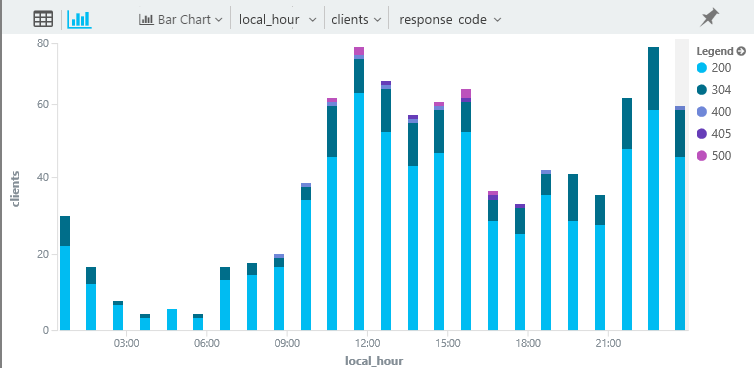
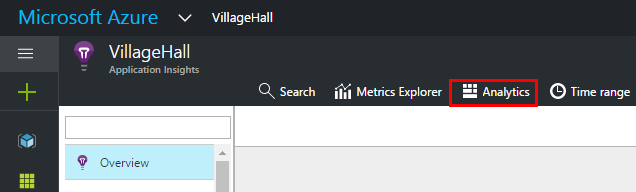

<properties 
    pageTitle="Analytics - die leistungsfähige Suchfunktion der Anwendung Einsichten | Microsoft Azure" 
    description="Übersicht über die Analytics, die leistungsfähige diagnostic Suchfunktion der Anwendung Einsichten. " 
    services="application-insights" 
    documentationCenter=""
    authors="alancameronwills" 
    manager="douge"/>

<tags 
    ms.service="application-insights" 
    ms.workload="tbd" 
    ms.tgt_pltfrm="ibiza" 
    ms.devlang="na" 
    ms.topic="article" 
    ms.date="07/26/2016" 
    ms.author="awills"/>


# <a name="analytics-in-application-insights"></a>In der Anwendung Einsichten Analytics


[Analytics](app-insights-analytics.md) ist die leistungsfähige Suchfunktion der [Anwendung Einsichten](app-insights-overview.md). Diese Seiten werden die Analytics Abfrage Lanquage beschrieben. 

* **[Die Einführungsvideo anzeigen](https://applicationanalytics-media.azureedge.net/home_page_video.mp4)**.
* **[Test Drive Analytics auf unsere simulierten Daten](https://analytics.applicationinsights.io/demo)** , wenn Ihre app Anwendung Einsichten noch Senden von Daten nicht zur Verfügung.

## <a name="queries-in-analytics"></a>Abfragen in Analytics
 
Eine typische Abfrage ist *eine Quelltabelle gefolgt von einer Reihe von *Operatoren* durch Trennzeichen getrennte* `|`. 

Angenommen, wir erfahren Sie, welcher Uhrzeit Bürger der Hyderabad unsere Web-app ausprobieren. Und wir vorhanden sind, sehen wir uns auf ihre HTTP-Anfragen welche Ergebniscodes zurückgegeben werden. 

```AIQL

    requests      // Table of events that log HTTP requests.
  	| where timestamp > ago(7d) and client_City == "Hyderabad"
  	| summarize clients = dcount(client_IP) 
      by tod_UTC=bin(timestamp % 1d, 1h), resultCode
  	| extend local_hour = (tod_UTC + 5h + 30min) % 24h + datetime("2001-01-01") 
```

Wir zählen distinct IP-Adressen, gruppieren sie durch die Stunde des Tages der letzten sieben Tage. 

Lassen Sie uns Anzeigen der Ergebnisse mit der Balkendiagramm Präsentation, um die Ergebnisse aus verschiedenen Antwortcodes Stapeln auswählen:



Wie unsere am häufigsten verwendeten Mittagspause und Blumenbeet-Time in Hyderabad arbeite sieht so aus. (Und wir empfiehlt sich, diese 500 Codes untersuchen.)


Es gibt auch leistungsstarke statistische Vorgänge:


Die Sprache wartet mit zahlreichen attraktive Funktionen:

* [Filtern](app-insights-analytics-reference.md#where-operator) der unformatierten app werden durch alle Felder, einschließlich der benutzerdefinierten Eigenschaften und Kriterien.
* [Teilnehmen an](app-insights-analytics-reference.md#join-operator) mehreren Tabellen – korrelieren Anfragen mit Seitenansichten, Abhängigkeit Anrufe, Ausnahmen und Log verfolgt.
* Leistungsfähige statistische [Aggregationen](app-insights-analytics-reference.md#aggregations).
* Nur als leistungsfähige als SQL, jedoch für komplexe Abfragen viel einfacheres: statt das Schachteln Anweisungen die, Sie die Daten aus einem einzigen Mitarbeit Vorgang zum nächsten leiten.
* Sofortige und leistungsstarke Visualisierungen.


## <a name="connect-to-your-application-insights-data"></a>Eine Verbindung mit Ihrer Anwendung Einsichten Daten


Analytics aus Ihrer app [Übersicht Blade](app-insights-dashboards.md) in Anwendung Einsichten zu öffnen: 




## <a name="limits"></a>Grenzwerte

Gegenwärtig sind Abfrageergebnisse auf über eine Woche vergangenen Datenseite nur eingeschränkt.


[AZURE.INCLUDE [app-insights-analytics-footer](../../includes/app-insights-analytics-footer.md)]


## <a name="next-steps"></a>Nächste Schritte


* Es empfiehlt sich, dass Sie mit der [Tour durch die Sprache](app-insights-analytics-tour.md)beginnen.