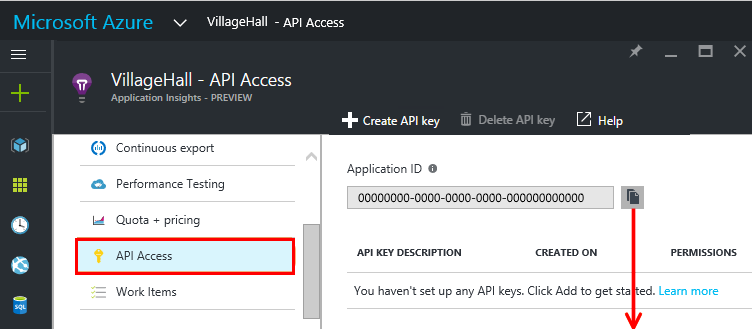
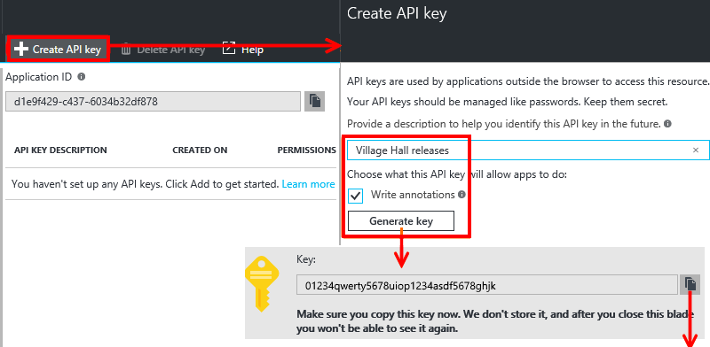

<properties
    pageTitle="Lassen Sie wieder los Anmerkungen für Anwendung Einsichten | Microsoft Azure"
    description="Fügen Sie der Bereitstellung hinzu oder erstellen Sie Markierungen, um Diagramme in Anwendung Einsichten Kennzahlen Explorer."
    services="application-insights"
    documentationCenter=".net"
    authors="alancameronwills"
    manager="douge"/>

<tags
    ms.service="application-insights"
    ms.workload="tbd"
    ms.tgt_pltfrm="ibiza"
    ms.devlang="na"
    ms.topic="article"
    ms.date="06/28/2016"
    ms.author="awills"/>

# Lassen Sie wieder los Anmerkungen in Anwendung Einsichten

Lassen Sie Anmerkungen [Kennzahlen Explorer](app-insights-metrics-explorer.md) Diagramme anzeigen, in dem Sie einen neuen Build bereitgestellt. Verteilergruppen erleichtern das feststellen, ob Ihre Änderungen Einfluss auf die Leistung der Anwendung hatte. Automatisch erstellt werden, indem Sie die [Visual Studio Team Services System erstellen](https://www.visualstudio.com/en-us/get-started/build/build-your-app-vs), und Sie können auch [dort von PowerShell zu erstellen](#create-annotations-from-powershell).

Release Anmerkungen sind ein Feature in der Cloud-basierte erstellen, und lassen Sie wieder los Dienst von Visual Studio Team Services. 

## Installieren Sie die Erweiterung Anmerkungen (einmal)

Um Release Anmerkungen erstellen können, müssen Sie eines der vielen Team-Dienst-Erweiterungen in Visual Studio Marketplace nicht installieren.

1. Melden Sie sich zum Projekt [Visual Studio Team Services](https://www.visualstudio.com/en-us/get-started/setup/sign-up-for-visual-studio-online) .
2. In Visual Studio Marketplace, [erhalten die Erweiterung Release Anmerkungen](https://marketplace.visualstudio.com/items/ms-appinsights.appinsightsreleaseannotations), und fügen Sie es mit Ihrem Team Services-Konto.

Sie müssen nur einmal für Ihr Konto Visual Studio Team Services Aktion. Release Anmerkungen können nun für jedes Projekt in Ihr Konto konfiguriert werden. 

## Rufen Sie einen Schlüssel API in Anwendung Einsichten

Sie müssen für jede Version Vorlage Aktion, die Sie Release Anmerkungen erstellen möchten.

1. Melden Sie sich mit dem [Microsoft Azure-Portal](https://portal.azure.com) , und öffnen Sie die Anwendung Einsichten Ressource, die eine Anwendung überwacht. (Oder [Erstellen Sie eine](app-insights-overview.md), wenn Sie es noch nicht getan haben).
2. Öffnen Sie **API Access**, und nehmen Sie eine Kopie der **Anwendung Einsichten Id**.

    

2. In einem eigenen Browserfenster öffnen (oder erstellen) die Release-Vorlage, die die Bereitstellung von Visual Studio Team Services verwaltet werden. 

    Hinzufügen eines Vorgangs, und wählen Sie die Anwendung Einsichten Release Anmerkungen Aufgabe im Menü aus.

    Fügen Sie die **Id der Anwendung** , die Sie aus dem Access-API Blade kopiert haben.

    

3. Legen Sie das Feld **APIKey** auf eine Variable `$(ApiKey)`.

4. Zurück in das Blade-API Access erstellen Sie einen neuen API Product Key und machen Sie eine Kopie davon zu.

    

4. Öffnen Sie die Registerkarte Konfiguration der Vorlage Release.

    Erstellen Sie eine Variable Definition für `ApiKey`.

    Fügen Sie Ihre API-Taste, um die ApiKey Variable Definition.

    

5. Schließlich das **Speichern** der Definition Version aus.

## Erstellen von Anmerkungen aus PowerShell

Sie können auch Anmerkungen aus jedem Prozess erstellen, die Ihnen gefällt (ohne im Vergleich mit einer Team System). 

Abrufen der [Powershell-Skript aus GitHub](https://github.com/Microsoft/ApplicationInsights-Home/blob/master/API/CreateReleaseAnnotation.ps1).

Verwenden Sie ihn wie folgt aus:

    .\CreateReleaseAnnotation.ps1 `
      -applicationId "<applicationId>" `
      -apiKey "<apiKey>" `
      -releaseName "<myReleaseName>" `
      -releaseProperties @{
          "ReleaseDescription"="a description";
          "TriggerBy"="My Name" }

Abrufen der `applicationId` und eine `apiKey` aus Ihrer Anwendung Einsichten Ressource: Öffnen Einstellungen, Access-API und kopieren Sie die Anwendung-ID. Klicken Sie dann auf API-Schlüssel erstellen, und kopieren Sie die Taste. 

## Lassen Sie wieder los Anmerkungen

Nun immer, wenn Sie die Release-Vorlage zum Bereitstellen einer neuen Version verwenden, wird eine Anmerkung Anwendung Einsichten gesendet werden. Die Anmerkungen werden für Diagramme in Kennzahlen Explorer angezeigt.

Klicken Sie auf eine beliebige Marke Anmerkungen So öffnen Sie die Details der Version, einschließlich Requestor, Quelle Steuerelement Verzweigung, lassen Sie wieder los Definition, Umgebung und mehr.

