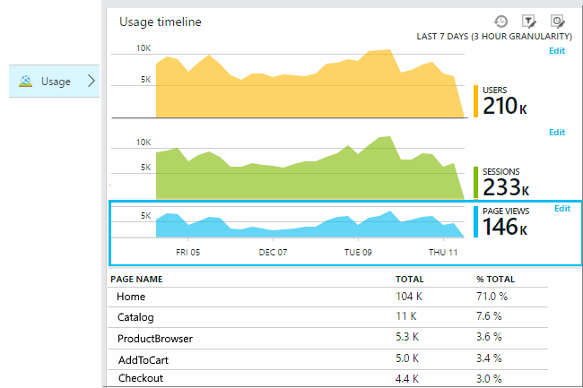
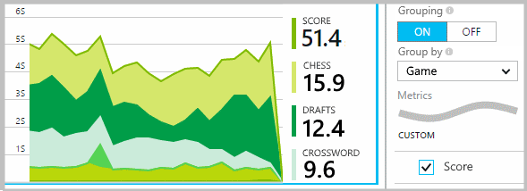

<properties 
    pageTitle="Anwendung Einsichten API für eine benutzerdefinierte Ereignisse und Kriterien | Microsoft Azure" 
    description="Fügen Sie ein paar Codezeilen in Ihrem Gerät oder Desktop-app, Webseite oder Dienst Nutzung verfolgen und Probleme diagnostizieren aus." 
    services="application-insights"
    documentationCenter="" 
    authors="alancameronwills" 
    manager="douge"/>
 
<tags 
    ms.service="application-insights" 
    ms.workload="tbd" 
    ms.tgt_pltfrm="ibiza" 
    ms.devlang="multiple" 
    ms.topic="article" 
    ms.date="10/19/2016" 
    ms.author="awills"/>

# <a name="application-insights-api-for-custom-events-and-metrics"></a>Anwendung Einsichten API für eine benutzerdefinierte Ereignisse und Kriterien 

*Anwendung Einsichten ist in der Vorschau.*

Fügen Sie ein paar Codezeilen in Ihrer Anwendung, um herauszufinden, was Benutzer mit ihr tun oder Probleme beim Diagnostizieren aus. Sie können werden von Gerät und Desktop-apps, im Webclient und Webserver senden. Der [Visual Studio-Anwendung Einsichten](app-insights-overview.md) Core werden API können Sie benutzerdefinierte Ereignisse und Kennzahlen und Ihre eigenen Versionen von standard werden senden. Diese API ist derselben API, die von der standard-Anwendung Einsichten Sammlungen verwendet wird.

## <a name="api-summary"></a>Zusammenfassung der API

Die API ist für alle Plattformen, bis auf einige kleine Variationen uniform.

Methode | Für verwendet
---|---
[`TrackPageView`](#page-views) | Seiten, Bildschirme, Blades oder Formulare
[`TrackEvent`](#track-event) | Benutzeraktionen und andere Ereignisse. Verwendet, um Benutzerverhalten zu verfolgen oder Leistung überwachen.
[`TrackMetric`](#track-metric) | Leistung Maße wie Warteschlange-Länge nicht im Zusammenhang mit bestimmten Ereignissen
[`TrackException`](#track-exception)|Melden Sie sich für die Diagnose Ausnahmen. Verfolgen Sie, wo diese in Bezug auf andere Ereignisse auftreten und Untersuchen von Stapel auf.
[`TrackRequest`](#track-request)| Melden Sie sich die Häufigkeit und die Dauer der Serveranfragen für Leistungsanalyse.
[`TrackTrace`](#track-trace)|Diagnoseprotokoll Nachrichten. Sie können auch 3rd Drittanbietern Protokolle erfassen.
[`TrackDependency`](#track-dependency)|Melden Sie sich die Dauer und Häufigkeit von Anrufe an externe Komponenten, von denen Ihre app abhängt.

Sie können [Eigenschaften und Kennzahlen anfügen](#properties) , an die meisten dieser Anrufe werden. 


## <a name="a-nameprepabefore-you-start"></a><a name="prep"></a>Bevor Sie beginnen

Wenn Sie dies noch nicht getan haben:

* Fügen Sie die Anwendung Einsichten SDK zum Projekt hinzu:
 * [ASP.NET-Projekt][greenbrown]
 * [Java-Projekt][java] 
 * [JavaScript in jeder Webseite][client]   

* In Ihrem Gerät oder Web Servercode einbeziehen:

    *C#:*`using Microsoft.ApplicationInsights;`

    *VB:*`Imports Microsoft.ApplicationInsights`

    *Java:*`import com.microsoft.applicationinsights.TelemetryClient;`

## <a name="construct-a-telemetryclient"></a>Erstellen einer TelemetryClient

Erstellt eine Instanz von TelemetryClient (außer in JavaScript in Webseiten):

*C#:* 

    private TelemetryClient telemetry = new TelemetryClient();

*VB:* 

    Private Dim telemetry As New TelemetryClient

*Java*

    private TelemetryClient telemetry = new TelemetryClient();

TelemetryClient ist Thread-sicher.

Es wird empfohlen, verwenden Sie eine Instanz von `TelemetryClient` für jedes Modul der app. Angenommen, Sie müssen möglicherweise einen `TelemetryClient` in Ihrem Webdienst, eingehenden HTTP-Anfragen und anderen in einer Klasse Middleware Bericht geschäftliche Logik Ereignisse zu melden. Sie können Eigenschaften wie festlegen `TelemetryClient.Context.User.Id` zum Nachverfolgen von Benutzern und Sitzungen, oder `TelemetryClient.Context.Device.Id` zur Identifizierung des Computers. Diese Informationen werden auf alle Ereignisse, durch die Instanz gesendet angefügt sind.


## <a name="track-event"></a>Ereignis nachverfolgen

In der Anwendung Einblicken, ein *benutzerdefiniertes Ereignis* ist einen Datenpunkt, dass Sie beide in [Kennzahlen Explorer] anzeigen können[ metrics] als eine aggregierte Anzahl und als einzelne Vorkommen [Diagnostic]Suche[diagnostic]. (Es ist nicht mit MVC oder andere Framework "Ereignisse". Verbindung) 

Einfügen von TrackEvent Anrufe im Code zu zählen, wie oft Benutzer auswählen ein bestimmtes Features, wie oft sie bestimmte, Ziele oder vielleicht stellen bestimmte Typen von Fehler. 

Senden Sie beispielsweise in einer app Spiel ein Ereignis aus, sobald ein Benutzer das Spiel gewinnt: 

*JavaScript*

    appInsights.trackEvent("WinGame");

*C#*
    
    telemetry.TrackEvent("WinGame");

*VB*


    telemetry.TrackEvent("WinGame")

*Java*

    telemetry.trackEvent("WinGame");


### <a name="view-your-events-in-the-azure-portal"></a>Anzeigen der Ereignisse in der Azure-portal

Anzahl der eigenen Ereignisse finden Sie eine Blade [Metrisch Explorer](app-insights-metrics-explorer.md) öffnen, Hinzufügen eines neuen Diagramms, und wählen Sie Ereignisse aus.  


Um die Anzahl der verschiedenen Ereignisse verglichen werden, legen Sie den Diagrammtyp auf Raster und Gruppe anhand des Namens des Ereignisses:


Klicken Sie im Raster durch den Namen eines Ereignisses in einzelne Vorkommen dieses Ereignisses finden Sie unter.


Klicken Sie auf alle Vorkommen, um mehr Details anzuzeigen.

Legen Sie das Blade der Filters auf die Namen von Ereignissen, denen Sie interessiert, um auf bestimmte Ereignisse suchen oder Metrisch Explorer konzentrieren:


## <a name="track-metric"></a>Nachverfolgen von Metrisch

Verwenden Sie TrackMetric Kennzahlen zu senden, die auf bestimmte Ereignisse zugeordnet sind. Beispielsweise könnten Sie eine Warteschlangenlänge in regelmäßigen Abständen überwachen. 

Kennzahlen werden als statistische Diagramme in metrischen Explorer angezeigt, aber im Gegensatz zu den Ereignissen, Sie suchen können nicht für einzelne Vorkommen diagnostic suchen.

Metrische Werte sollten > = 0 ordnungsgemäß angezeigt werden.


*JavaScript*

    appInsights.trackMetric("Queue", queue.Length);

*C#*

    telemetry.TrackMetric("Queue", queue.Length);

*VB*

    telemetry.TrackMetric("Queue", queue.Length)

*Java*

    telemetry.trackMetric("Queue", queue.Length);

Tatsächlich können Sie in einem Hintergrund-Thread so vorgehen:

*C#*

    private void Run() {
     var appInsights = new TelemetryClient();
     while (true) {
      Thread.Sleep(60000);
      appInsights.TrackMetric("Queue", queue.Length);
     }
    }


Zum Anzeigen der Ergebnisse öffnen Sie Kennzahlen Explorer, und fügen Sie ein neues Diagramm hinzu. Legen Sie darauf, um Ihre Metrisch anzuzeigen.


Es gibt einige [der Anzahl von Kennzahlen beschränkt](#limits) , die Sie verwenden können.

## <a name="page-views"></a>Seitenansichten

In einem Gerät oder Webseite app wird standardmäßig Seite Ansicht werden gesendet, wenn jede Bildschirm oder die Seite geladen wird. Sie können jedoch ändern, die zum Nachverfolgen von Seitenansichten zusätzliche oder anderen vorkommen. Möglicherweise möchten Sie beispielsweise in einer app, die Registerkarten oder Blades angezeigt werden, "Seite" nachverfolgen, wann auf der Benutzer kein neuen Blade wird geöffnet. 



Benutzer-und die Sitzung ist als Eigenschaften zusammen mit der Seitenansichten, gesendet, damit die Benutzer und Sitzung Diagramme aktiv stammen, wenn Seite Ansicht werden vorhanden ist.

#### <a name="custom-page-views"></a>Benutzerdefinierte Ansichten

*JavaScript*

    appInsights.trackPageView("tab1");

*C#*

    telemetry.TrackPageView("GameReviewPage");

*VB*

    telemetry.TrackPageView("GameReviewPage")


Wenn Sie mehrere Registerkarten in verschiedenen HTML-verfügen, können Sie auch die URL angeben:

    appInsights.trackPageView("tab1", "http://fabrikam.com/page1.htm");

#### <a name="timing-page-views"></a>Anzeigedauer Seitenansichten

Standardmäßig gemeldet die Zeiten von "Seite Ansicht laden Time" gemessen werden, wenn der Browser die Anforderung sendet, bis im Browser auf die Seite Laden Ereignis aufgerufen wird.

Stattdessen können Sie entweder ein:

* Legen Sie eine explizite Dauer im Anruf [TrackPageView](https://github.com/Microsoft/ApplicationInsights-JS/blob/master/API-reference.md#trackpageview) ein.
 * `appInsights.trackPageView("tab1", null, null, null, durationInMilliseconds);`
* Verwenden Sie die Anzeigedauer Anrufe Seitenansicht `startTrackPage` und `stopTrackPage`.

*JavaScript*

    // To start timing a page:
    appInsights.startTrackPage("Page1");

... 

    // To stop timing and log the page:
    appInsights.stopTrackPage("Page1", url, properties, measurements);

Den Namen verwenden Sie als erste Parameter der Start- und Anrufe ordnet. Wird automatisch der Name der aktuellen Seite. 

Die resultierende Seite laden Dauer Metrisch Explorer angezeigt werden von der Zeitraum zwischen Start- und Anrufe abgeleitet. Es liegt Sie welche Intervall Sie tatsächlich Zeit.

## <a name="track-request"></a>Anforderung nachverfolgen

Vom Server SDK HTTP-Anfragen Anmeldung verwendet. 

Sie können auch sie selbst aufrufen, wenn Sie Besprechungsanfragen in einem Kontext simulieren möchten, verfügen Sie möglicherweise nicht das Web-Service-Modul ausgeführt.

*C#*

    // At start of processing this request:

    // Operation Id and Name are attached to all telemetry and help you identify
    // telemetry associated with one request:
    telemetry.Context.Operation.Id = Guid.NewGuid().ToString();
    telemetry.Context.Operation.Name = requestName;
    
    var stopwatch = System.Diagnostics.Stopwatch.StartNew();

    // ... process the request ...

    stopwatch.Stop();
    telemetry.TrackRequest(requestName, DateTime.Now,
       stopwatch.Elapsed, 
       "200", true);  // Response code, success


## <a name="operation-context"></a>Vorgangskontext

Werden Elemente können einander zugeordnet werden durch das Anfügen können eine allgemeine Vorgang ID ein. Die standard-Anforderung nachverfolgen Modul macht's für Ausnahmen und andere Ereignisse während der Bearbeitung einer HTTP-Anfrage gesendet. Die ID können Sie in der [Suche](app-insights-diagnostic-search.md) und [Analytics](app-insights-analytics.md)alle Ereignisse im Zusammenhang mit der Anfrage problemlos finden. 

Die einfachste Möglichkeit zum Festlegen der-ID wird zu einen Vorgangskontext mithilfe dieses Muster festlegen:

    // Establish an operation context and associated telemetry item:
    using (var operation = telemetry.StartOperation<RequestTelemetry>("operationName"))
    {
        // Telemetry sent in here will use the same operation ID.
        ...
        telemetry.TrackEvent(...); // or other Track* calls
        ...
        // Set properties of containing telemetry item - for example:
        operation.Telemetry.ResponseCode = "200";
        
        // Optional: explicitly send telemetry item:
        telemetry.StopOperation(operation);

    } // When operation is disposed, telemetry item is sent.

Neben der Einstellung eines Vorgang Kontexts `StartOperation` erstellt ein Element werden vom Typ Sie angeben, und wird gesendet, wenn Sie den Vorgang verkaufen, oder wenn Sie explizit aufrufen `StopOperation`. Wenn Sie verwenden `RequestTelemetry` als den Typ werden dann seiner Dauer auf die festgelegten Intervallen zwischen Start- und festgelegt ist.

Vorgang Kontexten können nicht geschachtelt werden. Wenn bereits ein Vorgangskontext vorhanden ist, ist seine ID zugeordnet alle darin enthaltenen Elemente, einschließlich des Elements, das mit StartOperation erstellt.

Suchen wird im Vorgangskontext verwendet, um der Liste der zugehörigen Elemente zu erstellen:


## <a name="track-exception"></a>Nachverfolgen von Ausnahme

Senden von Ausnahmen an Anwendung Einsichten: zu [zählen,][metrics], anzugeben, dass die Häufigkeit eines Problems; [Untersuchen der einzelne Vorkommen]und[diagnostic]. Die Berichte enthalten den Stapel auf.

*C#*

    try
    {
        ...
    }
    catch (Exception ex)
    {
       telemetry.TrackException(ex);
    }

*JavaScript*

    try
    {
       ...
    }
    catch (ex)
    {
       appInsights.trackException(ex);
    }

Die SDKs fangen Sie viele Ausnahme automatisch, sodass Sie immer besitzen TrackException explizit aufzurufen.

* ASP.NET: [Schreiben von Code Ausnahmen abgefangen](app-insights-asp-net-exceptions.md)
* J2EE: [Ausnahmen werden automatisch abgefangen](app-insights-java-get-started.md#exceptions-and-request-failures)
* JavaScript: Abgefangen automatisch aus. Wenn Sie die automatische Websitesammlung deaktivieren möchten, fügen Sie eine Zeile in der Codeausschnitt, den in Webseiten eingefügt:

    ```
    ({
      instrumentationKey: "your key"
      , disableExceptionTracking: true
    })
    ```


## <a name="track-trace"></a>Spur verfolgen 

Verwenden Sie diese Option, um Probleme nach einem Gruppenmitglieder an eine andere Anwendung Einsichten senden diagnostizieren. Datenblöcke diagnostic senden können, und prüfen sie im [Feld Diagnostic Suche][diagnostic]. 

 

[Melden Sie sich Netzwerkadapter] [ trace] verwenden Sie diese API zum Senden von Drittanbietern Protokolle-Portal an.


*C#*

    telemetry.TrackTrace(message, SeverityLevel.Warning, properties);


Sie können auf den Inhalt der Nachricht suchen, aber (im Gegensatz zu Immobilienwerte) kann nicht gefiltert werden daran.

Die maximale Größe auf `message` ist sehr viel höher als Beschränkung auf Eigenschaften.
Ein Vorteil der TrackTrace ist, dass Sie relativ lange Daten in der Nachricht hinzufügen können. Beispielsweise könnten Sie es POST-Daten codieren.  


Darüber hinaus können Sie eine Ebene schwere zu Ihrer Nachricht hinzufügen. Und wie andere werden, können Sie Immobilienwerte, die Sie verwenden können, um Filter oder Ihrer Suche für unterschiedliche Optionssätze auf Hilfe hinzufügen. Beispiel:


    var telemetry = new Microsoft.ApplicationInsights.TelemetryClient();
    telemetry.TrackTrace("Slow database response",
                   SeverityLevel.Warning,
                   new Dictionary<string,string> { {"database", db.ID} });

Auf diese Weise können Sie im [Feld Suche][diagnostic], um alle Nachrichten von einer bestimmten Sicherheitsebene für eine bestimmte Datenbank einfach herausfiltern.

## <a name="track-dependency"></a>Nachverfolgen von Abhängigkeit

Verwenden Sie diesen Anruf zum Nachverfolgen der Reaktionszeiten und Erfolg Sätzen der Anrufe an eine externe Codeabschnitt aus. Die Ergebnisse werden in den Diagrammen Abhängigkeit im Portal angezeigt. 

```C#

            var success = false;
            var startTime = DateTime.UtcNow;
            var timer = System.Diagnostics.Stopwatch.StartNew();
            try
            {
                success = dependency.Call();
            }
            finally
            {
                timer.Stop();
                telemetry.TrackDependency("myDependency", "myCall", startTime, timer.Elapsed, success);
            }
```

Denken Sie daran, dass der Server-SDKs ein [Abhängigkeit Modul](app-insights-dependencies.md) enthalten, die erkennt und bestimmte Abhängigkeit verfolgt beispielsweise automatisch - Datenbanken und die restlichen APIs Anrufe. Sie müssen auf Ihrem Server, um das Modul arbeiten, einen Agent zu installieren. Verwenden Sie diesen Anruf Anrufe zu verfolgen, die durch die automatisierte Verlauf abgefangen werden nicht angezeigt werden soll, oder wenn Sie nicht den Agent installieren möchten.

Zum Deaktivieren des Moduls Verlauf standard Abhängigkeit, [ApplicationInsights.config](app-insights-configuration-with-applicationinsights-config.md) bearbeiten und löschen Sie den Bezug auf `DependencyCollector.DependencyTrackingTelemetryModule`.


## <a name="flushing-data"></a>Die Daten werden

Normalerweise sendet das SDK Daten zu Zeiten Einfluss auf die Benutzer minimieren möchten. Jedoch in einigen Fällen sollten Sie zum Leeren des Puffers – beispielsweise, wenn Sie das SDK in einer Anwendung, die verwenden beendet wird.

*C#*

    telemetry.Flush();

    // Allow some time for flushing before shutdown.
    System.Threading.Thread.Sleep(1000);

Beachten Sie, dass die Funktion steht für den [Server werden Channel](https://www.nuget.org/packages/Microsoft.ApplicationInsights.WindowsServer.TelemetryChannel/)asynchrone, aber synchron, wenn Sie die in-Memory-Kanal oder [beständigen Kanal](app-insights-api-filtering-sampling.md#persistence-channel)verwenden.


## <a name="authenticated-users"></a>Authentifizierte Benutzer

In einer Web app können Benutzer standardmäßig durch Cookie bezeichnet wird. Ein Benutzer möglicherweise mehrmals gezählt werden, wenn sie Zugriff auf Ihre app aus einem anderen Computer oder Browser oder Cookies löschen. 

Wenn Sie Benutzer zu Ihrer Anwendung anmelden, Sie können aber genauere Anzahl durch Festlegen der authentifizierten Benutzer-Id im Browser-Code:

*JavaScript*

```JS
    // Called when my app has identified the user.
    function Authenticated(signInId) {
      var validatedId = signInId.replace(/[,;=| ]+/g, "_");
      appInsights.setAuthenticatedUserContext(validatedId);
      ...
    }
```

In einer ASP.NET-Webseite MVC-Anwendung, beispielsweise:

*Razor*

        @if (Request.IsAuthenticated)
        {
            <script>
                appInsights.setAuthenticatedUserContext("@User.Identity.Name
                   .Replace("\\", "\\\\")"
                   .replace(/[,;=| ]+/g, "_"));
            </script>
        }

Es ist nicht erforderlich, verwenden den Namen des Benutzers ist-Anmeldung. Er muss nur eine Id sein, die für diesen Benutzer eindeutig ist. Es darf keine Leerzeichen oder die Zeichen enthalten `,;=|`. 

Die Benutzer-Id wird auch in einem Sitzungscookie einrichten und an den Server gesendet. Wenn der Server SDK installiert ist, die authentifizierten Benutzer-Id gesendet als Teil der Kontexteigenschaften Client- und werden, damit Sie filtern und durchsuchen können darauf.

Wenn Ihre app Benutzer in Konten gruppiert, können Sie auch einen Bezeichner für das Konto (mit den gleichen Zeichen Einschränkungen) übergeben.


      appInsights.setAuthenticatedUserContext(validatedId, accountId);

Im [Explorer Kennzahlen](app-insights-metrics-explorer.md)können Sie ein Diagramm erstellen, mit der **Benutzer, authentifizierter** und **Benutzerkonten**gezählt. 

Sie können auch folgende [Suche] [ diagnostic] für Client Datenpunkte mit bestimmten Benutzernamen und Konten.

## <a name="a-namepropertiesafilter-search-and-segment-your-data-with-properties"></a><a name="properties"></a>Filtern, suchen und Segmentieren von Daten mit Eigenschaften

Sie können Eigenschaften und Maße an Ihre Ereignisse anfügen (und auch Metrisch, Seite Ansichten, Ausnahmen und anderen Daten werden).

**Eigenschaften** sind Zeichenfolgenwerte, die Sie zum Filtern der werden in den Verwendungsberichten verwenden können. Beispielsweise wenn Ihre app mehrere Spiele bereitstellt, Sie werden der Name des Spiels auf jedes Ereignis, anfügen möchten, damit Sie sehen können, welche Spiele beliebter werden. 

Es gibt maximal etwa 1 KB auf die Länge der Zeichenfolge an. (Wenn Sie große Datenblöcke senden möchten, verwenden Sie den Nachricht-Parameter der [TrackTrace](#track-trace).)

**Kennzahlen** sind numerische Werte, die grafisch dargestellt werden können. Sie möchten beispielsweise festzustellen, ob eine schrittweise Erhöhung der Ergebnisse, die Ihre Spieler erreichen wird. Die Diagramme können, damit Sie separate erhalten konnte durch den Eigenschaften, die mit dem Ereignis verknüpfte unterteilt oder Diagramme für verschiedene spielen gestapelt.

Metrische Werte sollten > = 0 ordnungsgemäß angezeigt werden.


Es gibt einige [der Anzahl von Eigenschaften, Immobilienwerte, und Kennzahlen beschränkt](#limits) , die Sie verwenden können.


*JavaScript*

    appInsights.trackEvent
      ("WinGame",
         // String properties:
         {Game: currentGame.name, Difficulty: currentGame.difficulty},
         // Numeric metrics:
         {Score: currentGame.score, Opponents: currentGame.opponentCount}
         );

    appInsights.trackPageView
        ("page name", "http://fabrikam.com/pageurl.html",
          // String properties:
         {Game: currentGame.name, Difficulty: currentGame.difficulty},
         // Numeric metrics:
         {Score: currentGame.score, Opponents: currentGame.opponentCount}
         );
          

*C#*

    // Set up some properties and metrics:
    var properties = new Dictionary <string, string> 
       {{"game", currentGame.Name}, {"difficulty", currentGame.Difficulty}};
    var metrics = new Dictionary <string, double>
       {{"Score", currentGame.Score}, {"Opponents", currentGame.OpponentCount}};

    // Send the event:
    telemetry.TrackEvent("WinGame", properties, metrics);


*VB*

    ' Set up some properties:
    Dim properties = New Dictionary (Of String, String)
    properties.Add("game", currentGame.Name)
    properties.Add("difficulty", currentGame.Difficulty)

    Dim metrics = New Dictionary (Of String, Double)
    metrics.Add("Score", currentGame.Score)
    metrics.Add("Opponents", currentGame.OpponentCount)

    ' Send the event:
    telemetry.TrackEvent("WinGame", properties, metrics)


*Java*
    
    Map<String, String> properties = new HashMap<String, String>();
    properties.put("game", currentGame.getName());
    properties.put("difficulty", currentGame.getDifficulty());
    
    Map<String, Double> metrics = new HashMap<String, Double>();
    metrics.put("Score", currentGame.getScore());
    metrics.put("Opponents", currentGame.getOpponentCount());
    
    telemetry.trackEvent("WinGame", properties, metrics);


> [AZURE.NOTE] Achten Sie nicht um personenbezogene Informationen in den Eigenschaften zu melden.

**Wenn Sie die Kriterien verwendet**, Metrisch Explorer öffnen, und wählen Sie die Metrik aus der benutzerdefinierten Gruppe:


*Wenn Ihre Metrisch nicht angezeigt wird, oder die benutzerdefinierte Überschrift nicht vorhanden ist, schließen Sie das Blade Auswahl, und versuchen Sie es später. Manchmal kann es eine Stunde für Kennzahlen zu aggregierenden durch die Verkaufspipeline dauern.*

**Wenn Sie die Eigenschaften und Kriterien verwendet**, Segment die Metrik, indem Sie die Eigenschaft:





**Diagnose suchen**, können Sie die Eigenschaften und Metrik der einzelnen Vorkommen des ein Ereignis anzeigen.


Verwenden Sie das Suchfeld ein, um Ereignis Vorkommen mit einem bestimmten Eigenschaftswert anzuzeigen.


[Weitere Informationen zu Suchausdrücke][diagnostic].

#### <a name="alternative-way-to-set-properties-and-metrics"></a>Festlegen von Eigenschaften und Kennzahlen auf andere Weise

Wenn es einfacher ist, können Sie die Parameter eines Ereignisses in einem separaten Objekt sammeln:

    var event = new EventTelemetry();

    event.Name = "WinGame";
    event.Metrics["processingTime"] = stopwatch.Elapsed.TotalMilliseconds;
    event.Properties["game"] = currentGame.Name;
    event.Properties["difficulty"] = currentGame.Difficulty;
    event.Metrics["Score"] = currentGame.Score;
    event.Metrics["Opponents"] = currentGame.Opponents.Length;

    telemetry.TrackEvent(event);

> [AZURE.WARNING] Die gleichen Instanz von telemetrieprotokoll Element nicht wiederverwenden (`event` in diesem Beispiel) Track*()-Zuordnung mehrfach aufrufen. Dadurch kann werden mit fehlerhafte Konfiguration gesendet werden.


## <a name="a-nametimeda-timing-events"></a><a name="timed"></a>Anzeigedauer Ereignisse

Manchmal möchten Sie Diagramm wie lange dauert eine Aktion auszuführen. Angenommen, Sie möchten möglicherweise wissen, wie lange Benutzer eigene Auswahlmöglichkeiten in einem Spiel zu berücksichtigen. Dies ist ein nützliches Beispiel für die Verwendung des Parameters Maße aus.


*C#*

    var stopwatch = System.Diagnostics.Stopwatch.StartNew();

    // ... perform the timed action ...

    stopwatch.Stop();

    var metrics = new Dictionary <string, double>
       {{"processingTime", stopwatch.Elapsed.TotalMilliseconds}};

    // Set up some properties:
    var properties = new Dictionary <string, string> 
       {{"signalSource", currentSignalSource.Name}};

    // Send the event:
    telemetry.TrackEvent("SignalProcessed", properties, metrics);


## <a name="a-namedefaultsadefault-properties-for-custom-telemetry"></a><a name="defaults"></a>Standardeigenschaften für benutzerdefinierte werden

Wenn Sie den Standardwert Immobilienwerte für einige der benutzerdefinierte Ereignisse festgelegt, die Sie schreiben möchten, können Sie diese in einer TelemetryClient festlegen. Sie sind an jeder dieser Desktopclient gesendet werden-Elements angefügt. 

*C#*

    using Microsoft.ApplicationInsights.DataContracts;

    var gameTelemetry = new TelemetryClient();
    gameTelemetry.Context.Properties["Game"] = currentGame.Name;
    // Now all telemetry will automatically be sent with the context property:
    gameTelemetry.TrackEvent("WinGame");
    
*VB*

    Dim gameTelemetry = New TelemetryClient()
    gameTelemetry.Context.Properties("Game") = currentGame.Name
    ' Now all telemetry will automatically be sent with the context property:
    gameTelemetry.TrackEvent("WinGame")

*Java*

    import com.microsoft.applicationinsights.TelemetryClient;
    import com.microsoft.applicationinsights.TelemetryContext;
    ...


    TelemetryClient gameTelemetry = new TelemetryClient();
    TelemetryContext context = gameTelemetry.getContext();
    context.getProperties().put("Game", currentGame.Name);
    
    gameTelemetry.TrackEvent("WinGame");


    
Einzelne werden Anrufe können die Standardwerte in die Eigenschaft Wörterbücher außer Kraft setzen.

**Für JavaScript im Webclient**, [JavaScript werden Initialisierung verwenden](#js-initializer).

**Zum Hinzufügen von Eigenschaften, um alle werden** die Daten aus standard-Websitesammlung Module, einschließlich [implementieren `ITelemetryInitializer` ](app-insights-api-filtering-sampling.md#add-properties).


## <a name="sampling-filtering-and-processing-telemetry"></a>Stichproben, Filtern und verarbeitet werden 

Sie können Schreiben von Code zum Verarbeiten Ihrer werden, bevor sie aus dem SDK gesendet wird. Die Verarbeitung enthält Daten aus den Modulen standard werden, wie etwa HTTP-Anforderung Websitesammlung und Abhängigkeit Websitesammlung gesendet.

* [Eigenschaften](app-insights-api-filtering-sampling.md#add-properties) werden durch die Implementierung `ITelemetryInitializer` – beispielsweise Zahlen Version hinzufügen oder von anderen Eigenschaften die Werte berechnet. 
* [Filterung](app-insights-api-filtering-sampling.md#filtering) ändern oder verwerfen werden, bevor sie aus dem SDK, indem Sie implementieren gesendet werden können `ITelemetryProcesor`. Der Effekt auf metrischen tragen müssen, jedoch Sie steuern, welche gesendet oder verworfen werden. Je nachdem, wie Sie Elemente zu verwerfen können die Möglichkeit zum Navigieren zwischen verwandte Elemente verloren gehen.
* [Stichproben](app-insights-api-filtering-sampling.md#sampling) ist eine kompakten Lösung zum Verringern der Lautstärke von Daten aus der app-Portal gesendet. Dies geschieht ohne Auswirkung auf die angezeigten Metrik und nicht die Möglichkeit, Probleme diagnostizieren durch Navigieren zwischen verknüpfte Objekte wie Ausnahmen, Besprechungsanfragen und Seitenansichten.

[Weitere Informationen](app-insights-api-filtering-sampling.md)


## <a name="disabling-telemetry"></a>Deaktivieren von telemetrieprotokoll

**Dynamisch beenden, und starten Sie** die Sammlung und Übertragung werden:

*C#*

```C#

    using  Microsoft.ApplicationInsights.Extensibility;

    TelemetryConfiguration.Active.DisableTelemetry = true;
```

**Deaktivieren der ausgewählte standard Kollektoren** – beispielsweise Leistungsindikatoren, HTTP-Anfragen oder Abhängigkeiten - löschen oder kommentieren der entsprechenden Zeilen in [ApplicationInsights.config][config]. Sie können beispielsweise so vorgehen, wenn Sie Ihre eigenen Daten TrackRequest senden möchten.

## <a name="a-namedebugadeveloper-mode"></a><a name="debug"></a>Entwicklermodus

Während der für das Debuggen, ist es sinnvoll, dass Ihre werden durch die Verkaufspipeline geliefert, so, dass Sie die Ergebnisse sofort sehen können. Sie auch auf Weitere Nachrichten abrufen, die Ihnen helfen Probleme mit der telemetrieprotokoll zu verfolgen. Schalten Sie ihn aus der Herstellung, wie sie Ihre app verlangsamen möglicherweise.


*C#*
    
    TelemetryConfiguration.Active.TelemetryChannel.DeveloperMode = true;

*VB*

    TelemetryConfiguration.Active.TelemetryChannel.DeveloperMode = True


## <a name="a-nameikeya-set-the-instrumentation-key-for-selected-custom-telemetry"></a><a name="ikey"></a>Setzen Sie den Instrumentation Schlüssel für ausgewählte benutzerdefinierte werden

*C#*
    
    var telemetry = new TelemetryClient();
    telemetry.InstrumentationKey = "---my key---";
    // ...


## <a name="a-namedynamic-ikeya-dynamic-instrumentation-key"></a><a name="dynamic-ikey"></a>Dynamische Instrumentierung Schlüssel

Zur Vermeidung von telemetrieprotokoll aus Entwicklung, testen und Herstellung Umgebungen mischen, können Sie [separate Anwendung Einsichten Ressourcen erstellen] [ create] und ihre Schlüssel abhängig von der Umgebung ändern.

Statt die erste der Taste Instrumentation aus der Konfigurationsdatei, können Sie es im Code festlegen. Setzen Sie den Schlüssel in einer Initialisierungsmethode, z. B. global.aspx.cs in einer ASP.NET-Dienst an:

*C#*

    protected void Application_Start()
    {
      Microsoft.ApplicationInsights.Extensibility.
        TelemetryConfiguration.Active.InstrumentationKey = 
          // - for example -
          WebConfigurationManager.Settings["ikey"];
      ...

*JavaScript*

    appInsights.config.instrumentationKey = myKey; 


In Webseiten können Sie es aus des Webservers Zustand, anstatt die Codierung es Literal in das Skript festlegen möchten. Angenommen, in einer Webseite in einer app ASP.NET generiert:

*JavaScript in Razor*

    <script type="text/javascript">
    // Standard Application Insights web page script:
    var appInsights = window.appInsights || function(config){ ...
    // Modify this part:
    }({instrumentationKey:  
      // Generate from server property:
      @Microsoft.ApplicationInsights.Extensibility.
         TelemetryConfiguration.Active.InstrumentationKey"
    }) // ...


## <a name="telemetrycontext"></a>TelemetryContext

TelemetryClient verfügt über eine Kontexteigenschaft, die eine Reihe von Werten enthält, die zusammen mit allen werden Daten gesendet werden. Sie normalerweise durch die Module standard werden festgelegt sind, aber Sie können auch festlegen, selbst. Beispiel:

    telemetry.Context.Operation.Name = "MyOperationName";

Wenn Sie eine der folgenden Werte selbst festlegen, sollten Sie die entsprechende Zeile [ApplicationInsights.config]entfernen[config], sodass die Werte und standard-Werte nicht verwechselt abrufen.

* **Komponente** Gibt die app und die zugehörigen version
* **Gerät** Daten über das Gerät, auf dem die app ausgeführt wird (Dies ist im Web apps, das Server- oder Client-Gerät, von dem die werden gesendet)
* **InstrumentationKey** Die Anwendung Einsichten Ressource in Azure, wo die telemetrieprotokoll erscheint, identifiziert. In der Regel übernommen aus ApplicationInsights.config
* **Speicherort** Gibt die geografische Position des Geräts an.
* **Vorgang** Web Apps, die aktuelle HTTP-Anforderung. In anderen Typen von app können Sie diese so gruppieren Sie Ereignisse zusammen festlegen.
 * **ID**: ein generierter Wert, der verschiedene Ereignisse verknüpft, sodass, wenn Sie ein beliebiges Ereignis Diagnostic Suche prüfen, Sie finden können "Verwandte Elemente"
 * **Name**: ein Bezeichner, in der Regel die URL der HTTP-Anforderung. 
 * **SyntheticSource**: Wenn nicht null oder leer, gibt diese Zeichenfolge an, dass die Quelle der Anfrage als einen Robot oder Web Test angegeben wurde. Standardmäßig wird es von Berechnungen in Kennzahlen Explorer ausgeschlossen werden.
* **Eigenschaften** Eigenschaften, die mit allen werden Daten gesendet werden. Kann in einzelne nachverfolgen * Anrufe überschrieben werden.
* **Sitzung** Gibt die Sitzung des Benutzers an. Auf einen generierten Wert, der geändert wird, wenn der Benutzer nicht aktiv für eine Weile festgelegt wurde, wird die Id festgelegt.
* **Benutzer** Benutzerinformationen. 

## <a name="limits"></a>Grenzwerte


[AZURE.INCLUDE [application-insights-limits](../../includes/application-insights-limits.md)]

*Wie kann ich verhindern, drücken die Daten Zins Beschränkung?*

* Verwendet [werden](app-insights-sampling.md).

*Wie lange aufbewahrt Daten?*

* Finden Sie unter [Beibehaltung der Daten und Ihre Privatsphäre][data].


## <a name="reference-docs"></a>Verweis-Dokumente

* [ASP.NET Bezug](https://msdn.microsoft.com/library/dn817570.aspx)
* [Java-Referenz](http://dl.windowsazure.com/applicationinsights/javadoc/)
* [JavaScript-Referenz](https://github.com/Microsoft/ApplicationInsights-JS/blob/master/API-reference.md)
* [Android SDK](https://github.com/Microsoft/ApplicationInsights-Android)
* [iOS SDK](https://github.com/Microsoft/ApplicationInsights-iOS)


## <a name="sdk-code"></a>SDK-Code

* [ASP.NET Core SDK](https://github.com/Microsoft/ApplicationInsights-dotnet)
* [ASP.NET 5](https://github.com/Microsoft/ApplicationInsights-aspnet5)
* [Windows Server-Paketen](https://github.com/Microsoft/applicationInsights-dotnet-server)
* [Java SDK](https://github.com/Microsoft/ApplicationInsights-Java)
* [JavaScript-SDK](https://github.com/Microsoft/ApplicationInsights-JS)
* [Alle Plattformen](https://github.com/Microsoft?utf8=%E2%9C%93&query=applicationInsights)

## <a name="questions"></a>Fragen

* *Welche Ausnahmen möglicherweise Track_() Anrufe auslösen?*
    
    Keine. Sie brauchen sie in Try-Catch-Klauseln umbrechen. Wenn das SDK Probleme auftreten, wird es Nachrichten, die angezeigt wird, melden Sie sich die Ausgabe Debuggen Console, und – wenn die Nachrichten, bis – diagnostic suchen erhalten.


* *Gibt es eine REST-API abzurufenden Daten aus dem Portal?*

    Ja, in Kürze verfügbar. Verwenden Sie in der Zwischenzeit [fortlaufender exportieren](app-insights-export-telemetry.md).

## <a name="a-namenextanext-steps"></a><a name="next"></a>Nächste Schritte


[Suchen von Ereignissen und Protokollen][diagnostic]

[Beispiele und exemplarische Vorgehensweisen](app-insights-code-samples.md)

[Behandlung von Problemen][qna]


<!--Link references-->

[client]: app-insights-javascript.md
[config]: app-insights-configuration-with-applicationinsights-config.md
[create]: app-insights-create-new-resource.md
[data]: app-insights-data-retention-privacy.md
[diagnostic]: app-insights-diagnostic-search.md
[exceptions]: app-insights-asp-net-exceptions.md
[greenbrown]: app-insights-asp-net.md
[java]: app-insights-java-get-started.md
[metrics]: app-insights-metrics-explorer.md
[qna]: app-insights-troubleshoot-faq.md
[trace]: app-insights-search-diagnostic-logs.md

 
