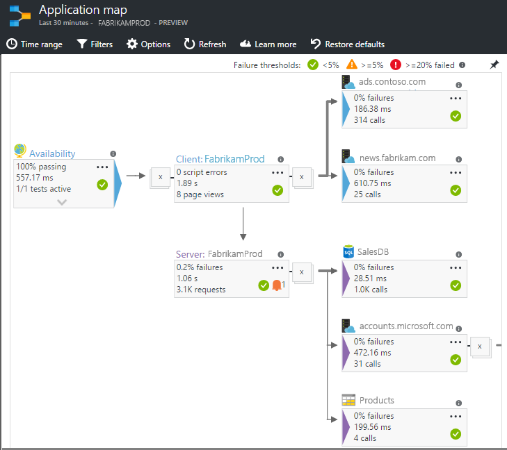
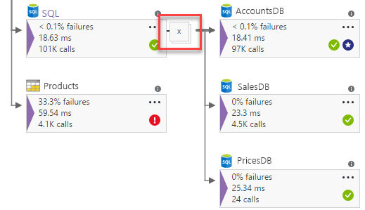
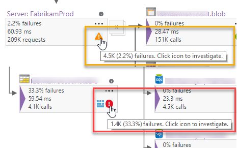
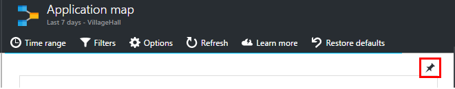

<properties 
    pageTitle="Anwendung Karte in der Anwendung Einsichten | Microsoft Azure" 
    description="Eine visuelle Darstellung der die Abhängigkeiten zwischen app-Komponenten mit der Bezeichnung mit KPIs und Benachrichtigungen." 
    services="application-insights" 
    documentationCenter=""
    authors="SoubhagyaDash" 
    manager="douge"/>

<tags 
    ms.service="application-insights" 
    ms.workload="tbd" 
    ms.tgt_pltfrm="ibiza" 
    ms.devlang="na" 
    ms.topic="article" 
    ms.date="06/15/2016" 
    ms.author="awills"/>
 
# Anwendung Karte in der Anwendung Einsichten

In [Visual Studio Anwendung Einblicken](app-insights-overview.md)ist die Anwendung Karte einem visuellen Layout der Abhängigkeit Beziehungstypen Ihrer Anwendung Komponenten. Jede Komponente werden KPIs angezeigt, wie laden, Leistung, Fehlern und Benachrichtigungen, damit Sie eine beliebige Komponente, die bewirken, dass ein Leistungsproblem oder Fehler ermitteln können. Sie können klicken Sie auf die von jeder Komponente ausführlichere Diagnose, aus der Tabelle Einsichten Anwendung, und – wenn Ihre app Azure Services - verwendet Azure Diagnose, wie etwa die SQL-Datenbank Advisor Empfehlungen.

Wie andere Diagramme können Sie eine Anwendung Zuordnung der Azure Dashboard anheften, wo es voll funktionsfähig ist. 

## Öffnen Sie die Anwendung Karte

Öffnen Sie die Karte aus dem Blade Übersicht für eine Anwendung:

Der Karte dargestellt:

* Verfügbarkeit von tests
* Komponente auf dem Client (mit dem JavaScript-SDK überwacht)
* Serverbasierten Komponente
* Abhängigkeiten Client- und Server-Komponenten

Sie können Gruppen erweitern und reduzieren Abhängigkeit Link:

 
Wenn Sie eine große Anzahl von Abhängigkeiten eines bestimmten Typs (SQL, HTTP usw.) haben, können sie gruppierten angezeigt werden. 

 
 
## Stelle Probleme

Jeder Knoten verfügt über relevante Leistungsindikatoren, wie etwa das Laden und Leistung bei der Kostensätze für die betreffende Komponente. 

Warnung Symbole markieren Sie mögliche Probleme. Eine Warnung "Orange" bedeutet, dass es Fehlern in Besprechungsanfragen, Seitenansichten oder Abhängigkeit Anrufe. Rot bedeutet, einen Fehler bei der Satz über 5 %.

 
Aktiv benachrichtigt Sie auch anzeigen von: 

 
Wenn Sie SQL Azure verwenden, ist es ein Symbol, das zeigt, wann es gibt Empfehlungen, wie Sie die Leistung verbessern können. 

Klicken Sie auf das Symbol eines beliebigen um weitere Details zu erhalten:

 
 
## Diagnose auf durchlaufen

Jeder der Knoten auf der Karte bietet gezielte Klicken durch auf Diagnose. Die Optionen variieren je nach Typ des Knotens.

 
Für Komponenten, die in Azure gehostet werden, enthalten die Optionen Links direkt zu.

## Filter und Zeitraums

Standardmäßig werden die Karte alle Daten für den ausgewählten Zeitraum zusammengefasst. Aber Sie können filtern, um nur bestimmte Vorgang Namen oder Abhängigkeiten aufgenommen werden.

* Name des Vorgangs: sowohl Seitenansichten und Servertypen Seite-Anforderung umfasst. Mit dieser Option wird die Karte KPIS auf dem Server-Client auf Knoten für nur die ausgewählten Vorgänge an. Es zeigt die Abhängigkeiten im Zusammenhang mit bestimmten Vorgängen bezeichnet.
* Name der Abhängigkeit Basis: Dies umfasst die AJAX-Browser Seite Abhängigkeiten und Server Seite Abhängigkeiten. Wenn Sie benutzerdefinierte Abhängigkeit werden mit der TrackDependency-API melden, werden diese auch hier angezeigt. Sie können die Abhängigkeiten auf der Karte auswählen. Bitte beachten Sie, dass die zu diesem Zeitpunkt dies nicht den Anfragen der Server-Seite oder den Client Seite Seitenansichten gefiltert wird.

 
 
## Speichern von Filtern

Zum Speichern der Filter Sie angewendet haben, der gefilterten Datenansicht auf ein [Dashboard](app-insights-dashboards.md)anheften.

 

## Feedback

Bitte [ebenfalls Feedback über die Option Portal Feedback](app-insights-get-dev-support.md).

