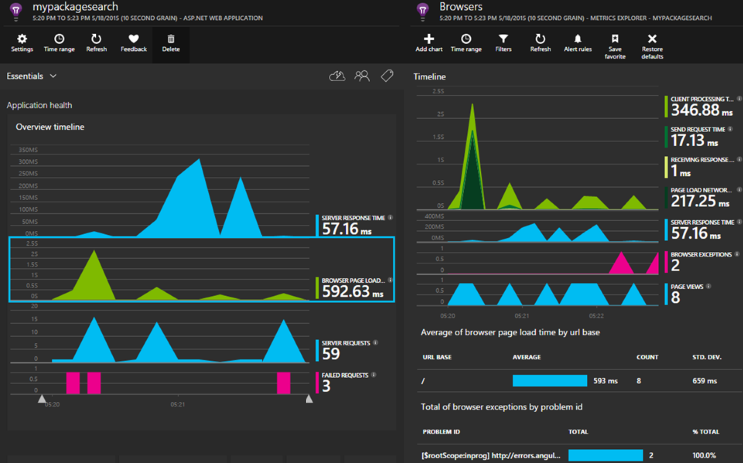

<properties 
    pageTitle="Anwendung Einsichten für ASP.NET Core" 
    description="Überwachen von Webanwendungen für Verfügbarkeit und Leistung Verwendung." 
    services="application-insights" 
    documentationCenter=".net"
    authors="alancameronwills" 
    manager="douge"/>

<tags 
    ms.service="application-insights" 
    ms.workload="tbd" 
    ms.tgt_pltfrm="ibiza" 
    ms.devlang="na" 
    ms.topic="article" 
    ms.date="08/30/2016" 
    ms.author="awills"/>

# Anwendung Einsichten für ASP.NET Core

[Visual Studio-Anwendung Einsichten](app-insights-overview.md) können Sie Ihre Webanwendung, für die Verfügbarkeit, Leistung und die Verwendung zu überwachen. Mit der Feedback, denen, das Sie über die Leistung und die Effizienz Ihrer App in der Natur kommunizieren, können Sie überlegen, die Richtung des Entwurfs in jeder Entwicklungszyklus machen.

Benötigen Sie ein Abonnement mit [Microsoft Azure](http://azure.com)ein. Melden Sie sich mit einem Microsoft-Konto für Windows, XBox Live oder anderen Microsoft-Cloud-Diensten gegebenenfalls haben. Möglicherweise müssen Sie Ihr Team einer Organisation Azure-Abonnement: Bitten Sie den Besitzer, die Sie mit Ihrem Microsoft-Konto hinzufügen.

## Erste Schritte

Folgen Sie den [Leitfaden für erste Schritte](https://github.com/Microsoft/ApplicationInsights-aspnetcore/wiki/Getting-Started).

## Verwenden die Anwendung Einsichten

Melden Sie sich bei der [Microsoft Azure-Portal](https://portal.azure.com) und Durchsuchen, die der Ressource erstellt, um Ihre app zu überwachen.

Verwenden Sie in einem separaten Browserfenster die app für eine Weile aus. Sehen Sie in der Anwendung Einsichten Diagramme angezeigte Daten ein. (Möglicherweise müssen auf Aktualisieren klicken.) Es werden nur eine kleine Datenmenge gedrückt, während Sie einen entwickeln, aber diese Diagramme wirklich aktiv stammen, wenn Sie Ihre app veröffentlichen und viele Benutzer haben. 

Die Übersichtsseite zeigt die Leistungsdiagramme an Sie wahrscheinlich am häufigsten von Interesse sein: Server Antwortzeit, Seite laden Zeit und Anzahl der fehlgeschlagene Anfragen. Klicken Sie auf jedes Diagramm, um weitere Diagramme und Daten anzuzeigen.

Ansichten im Portal gibt zwei Hauptfenster Kategorien:

* [Kennzahlen Explorer](app-insights-metrics-explorer.md) zeigt Diagramme und Tabellen Kennzahlen und zählt, wie Reaktionszeiten, Fehler Sätzen oder Kennzahlen, selbst mit der [API](app-insights-api-custom-events-metrics.md)zu erstellen. Filtern und die Daten durch Immobilienwerte zu erfahren Sie mehr über Ihre app und deren Benutzer segmentieren.
* [Suche Explorer](app-insights-diagnostic-search.md) Listen einzelner Ereignisse, wie etwa spezielle Anfragen, Ausnahmen, Log Spuren oder Ereignisse, die Sie selbst mit der [API](app-insights-api-custom-events-metrics.md)erstellt. Filtern Sie in den Ereignissen suchen Sie und navigieren Sie zwischen verwandte Ereignisse, um die Probleme zu ermitteln.
* [Analytics](app-insights-analytics.md) können Sie die SQL-ähnliche Abfragen über Ihre telemetrieprotokoll ausführen und ist ein leistungsfähiges analytical und diagnostic Tool.

## Benachrichtigungen

* Sie erhalten automatisch [proaktive Diagnose Benachrichtigungen](app-insights-proactive-diagnostics.md) , mit denen Sie über abweichenden Änderungen in Sätzen Fehler und andere Kennzahlen mitteilen.
* Richten Sie [Verfügbarkeit Tests ein](app-insights-monitor-web-app-availability.md) , testen Sie Ihre Website kontinuierlich von Orten weltweit und rufen Sie e-Mails ab, sobald alle Test fehlschlägt.
* Einrichten von [Benachrichtigungen metrischen](app-insights-monitor-web-app-availability.md) feststellen, ob die Metrik wie Reaktionszeiten oder Sätzen Ausnahme zulässige Grenzwerten wechseln.

## Erhalten Sie weitere werden

* [Hinzufügen von werden an Ihren Webseiten](app-insights-javascript.md) Monitor Seite Verwendung und Leistung.
* [Monitor Abhängigkeiten](app-insights-dependencies.md) , um festzustellen, ob die restlichen, SQL oder andere externen Ressourcen Sie verlangsamt werden.
* [Verwenden der API](app-insights-api-custom-events-metrics.md) eigene Ereignisse und die Kriterien für eine detailliertere Ansicht der Leistung und die Verwendung Ihrer app zu senden.
* [Verfügbarkeit Tests](app-insights-monitor-web-app-availability.md) überprüfen Sie Ihre app ständig aus der ganzen Welt. 

## Öffnen der Quelle

[Lesen Sie und eigene Notizen hinzufügen Sie können den code](https://github.com/Microsoft/ApplicationInsights-aspnetcore#recent-updates)

