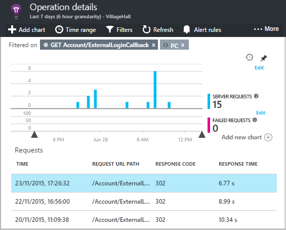

<properties 
    pageTitle="Überwachen in Anwendung Einsichten Abhängigkeit" 
    description="Verwendung, Verfügbarkeit und Leistung von Ihrem lokalen oder Microsoft Azure-Webanwendung mit Anwendung Einsichten zu analysieren." 
    services="application-insights" 
    documentationCenter=".net"
    authors="alancameronwills" 
    manager="douge"/>

<tags 
    ms.service="application-insights" 
    ms.workload="tbd" 
    ms.tgt_pltfrm="ibiza" 
    ms.devlang="na" 
    ms.topic="article" 
    ms.date="10/24/2016" 
    ms.author="awills"/>


# <a name="set-up-application-insights-dependency-tracking"></a>Einrichten von Anwendung Einsichten: Abhängigkeit Verlauf


[AZURE.INCLUDE [app-insights-selector-get-started-dotnet](../../includes/app-insights-selector-get-started-dotnet.md)]


Eine *Abhängigkeit* ist eine externe Komponente, die von der app aufgerufen wird. Es ist in der Regel ein Dienst namens mithilfe des HTTP, einer Datenbank oder einem Dateisystem. In Visual Studio-Anwendung Einblicken können Sie leicht erkennen, wie lange eine Anwendung auf Abhängigkeiten wartet und wie oft ein Anruf Abhängigkeit schlägt fehl.


Der Monitor Abhängigkeit von Out-of-Box-Berichte aktuell Anrufe an folgenden Typen von Abhängigkeiten:

* ASP.NET
 * SQL-Datenbanken
 * ASP.NET-Web und WCF-Dienste, die HTTP-basierte Bindungen verwenden
 * Lokale oder remote HTTP-Aufrufe
 * Azure DocumentDb, Tabelle, Blob-Speicher und Warteschlange
* Java
 * Anrufe in einer Datenbank über [-](http://docs.oracle.com/javase/7/docs/technotes/guides/jdbc/) Treiber, z. B. MySQL, SQL Server, PostgreSQL oder SQLite.
* JavaScript in Webseiten - meldet der [Webseite SDK](app-insights-javascript.md) automatisch Ajax-Aufrufe als Abhängigkeiten.

Sie können eigene SDK-Anrufe an andere Abhängigkeiten mithilfe der [TrackDependency-API](app-insights-api-custom-events-metrics.md#track-dependency)überwachen schreiben.


## <a name="to-set-up-dependency-monitoring"></a>Einrichten der Überwachung Abhängigkeit

Sie benötigen eine [Microsoft Azure](http://azure.com) -Abonnement.

### <a name="if-your-app-runs-on-your-iis-server"></a>Wenn Ihre app auf Ihrem IIS-Server ausgeführt wird

Wenn die Web-app für .NET 4.6 oder höher ausgeführt wird, können Sie entweder [die Anwendung Einsichten SDK installieren](app-insights-asp-net.md) in Ihrer app oder Anwendung Einsichten Status Monitor installieren. Sie Sie benötigen nicht.

Installieren Sie andernfalls Anwendung Einsichten Status Monitor auf dem Server ein:

1. Klicken Sie auf der IIS-Webserver, melden Sie sich mit Administratorberechtigungen.
2. Herunterladen Sie, und führen Sie das [Installationsprogramm Status überwachen](http://go.microsoft.com/fwlink/?LinkId=506648).
4. Melden Sie sich im Assistenten Installation in Microsoft Azure an.

    

    *Fehler bei der Verbindung? Lesen Sie [Problembehandlung](#troubleshooting).*

5. Wählen Sie aus der installierten Web-Anwendung oder eine Website, die Sie überwachen möchten, und dann konfigurieren Sie die Ressource aus, in der Sie die Ergebnisse der Anwendung Einsichten Portal anzeigen möchten.

    

    In der Regel wählen Sie so konfigurieren Sie eine neue Ressource und der [Ressourcengruppe][roles].

    Andernfalls eine vorhandene Ressource verwenden, wenn Sie bereits [überprüft Web] eingerichtet[ availability] für Ihre Website oder [WebClient Überwachung][client].

6. Starten Sie IIS neu.

    

    Der Webdienst wird für einen kurzen unterbrochen.

6. Beachten Sie, dass ApplicationInsights.config in den Web apps eingefügt wurde, die Sie überwachen möchten.

    

   Es gibt auch einigen Änderungen web.config.

#### <a name="want-to-reconfigure-later"></a>Möchten Sie später (erneut) konfigurieren?

Nach Abschluss des Assistenten können Sie den Agent immer, wenn Sie erneut konfigurieren. Sie können dies auch verwenden, wenn Sie den Agent installiert, aber es einige Probleme mit der ersten Einrichtung wurde.


### <a name="if-your-app-runs-as-an-azure-web-app"></a>Wenn Ihre app als ein Azure Web App ausgeführt wird

Fügen Sie in der Systemsteuerung der Azure Web App die Anwendung Einsichten Erweiterung hinzu.


### <a name="if-its-an-azure-cloud-services-project"></a>Ist ein Azure Cloud Services-Projekt

[Hinzufügen von Skripts Web- und Worker Rollen](app-insights-cloudservices.md#dependencies). Oder [.NET Framework 4.6 oder höher installieren](../cloud-services/cloud-services-dotnet-install-dotnet.md).

## <a name="a-namediagnosisa-diagnosing-dependency-performance-issues"></a><a name="diagnosis"></a>Analyse von Leistungsproblemen Abhängigkeit

Um die Leistung der auf dem Server Anfragen zu bewerten, öffnen Sie das Leistung Blade, und führen Sie einen Bildlauf nach unten bis zum wollen das Raster der Anfragen:


Der oberste Eintrag ist sehr lange dauert. Sehen Sie, ob wir die Stelle, an der das investierte Zeit ist herausfinden können.

Klicken Sie auf die Zeile, um einzelne Anforderung Ereignisse finden Sie unter:




Klicken Sie auf eine beliebige langer-Instanz, um weitere zu prüfen.

Führen Sie einen Bildlauf nach unten bis zum remote Abhängigkeit Anrufe im Zusammenhang mit dieser Anforderung:


Es sieht so aus, wie die meisten der Zeit zu bedienen, die diese Anforderung einen Anruf bei einem lokalen Dienst aufgewendet wurde. 


Wählen Sie die Zeile, um weitere Informationen zu erhalten:


Die Details enthält genügend Informationen, um das Problem zu diagnostizieren.


In einem anderen Fall keine Abhängigkeit Anruf ist lang, aber indem Sie in der Zeitachsenansicht wechseln, können wir sehen, wo die Verzögerung in unseren interner aufgetreten ist:


## <a name="failures"></a>Fehler

Treten Fehler beim Besprechungsanfragen, klicken Sie auf das Diagramm.


Klicken Sie auf, bis eine Anforderungstyp und Anforderungsinstanz, einen Fehler beim Anruf an eine remote Abhängigkeit finden.


## <a name="custom-dependency-tracking"></a>Benutzerdefinierte Abhängigkeit nachverfolgen

Das Nachverfolgen von Abhängigkeit Standardmodul erkennt automatisch externe Abhängigkeiten z. B. Datenbanken und REST-APIs. Jedoch sollten Sie einige zusätzlichen Komponenten auf die gleiche Weise behandelt werden sollen. 

Sie können Code schreiben, die Informationen zur Abhängigkeit, sendet mithilfe derselben [TrackDependency-API](app-insights-api-custom-events-metrics.md#track-dependency) , die von der standard-Module verwendet wird.

Beispielsweise, wenn Sie den Code mit Baugruppen, die Sie sich geschrieben haben erstellen selbst, können Sie Zeit alle Anrufe an, um herauszufinden, welche Beitrag, den sie Ihre Reaktionszeiten ist. Um diese Daten in Diagrammen Abhängigkeit der Anwendung Einsichten angezeigt haben, senden sie unter Verwendung `TrackDependency`.

```C#

            var startTime = DateTime.UtcNow;
            var timer = System.Diagnostics.Stopwatch.StartNew();
            try
            {
                success = dependency.Call();
            }
            finally
            {
                timer.Stop();
                telemetry.TrackDependency("myDependency", "myCall", startTime, timer.Elapsed, success);
            }
```

Wenn Sie das standardmäßige Abhängigkeit Verlauf Modul zu wechseln möchten, entfernen Sie den Bezug auf DependencyTrackingTelemetryModule in [ApplicationInsights.config](app-insights-configuration-with-applicationinsights-config.md).

## <a name="troubleshooting"></a>Behandlung von Problemen

*Abhängigkeit Erfolg kennzeichnen immer zeigt true oder false.*

* Aktualisieren Sie auf die neueste Version des SDK. Wenn Ihre .NET kleiner als 4.6 ist, installieren Sie [Statusmonitor](app-insights-monitor-performance-live-website-now.md)aus.

## <a name="next-steps"></a>Nächste Schritte

- [Ausnahmen](app-insights-asp-net-exceptions.md)
- [Seite "und" Benutzer-Daten][client]
- [Verfügbarkeit](app-insights-monitor-web-app-availability.md)


<!--Link references-->

[api]: app-insights-api-custom-events-metrics.md
[apikey]: app-insights-api-custom-events-metrics.md#ikey
[availability]: app-insights-monitor-web-app-availability.md
[azure]: ../insights-perf-analytics.md
[client]: app-insights-javascript.md
[diagnostic]: app-insights-diagnostic-search.md
[metrics]: app-insights-metrics-explorer.md
[netlogs]: app-insights-asp-net-trace-logs.md
[portal]: http://portal.azure.com/
[qna]: app-insights-troubleshoot-faq.md
[redfield]: app-insights-asp-net-dependencies.md
[roles]: app-insights-resources-roles-access-control.md

 
