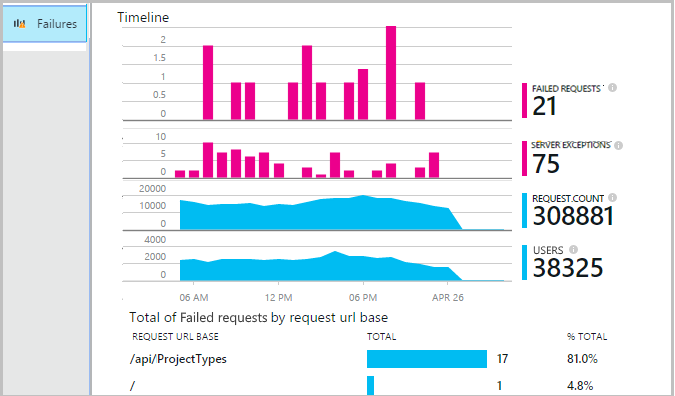
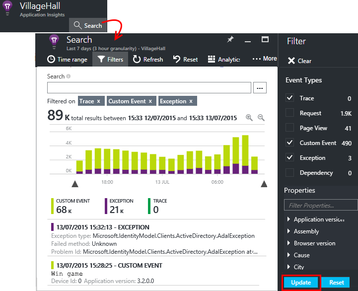

<properties 
    pageTitle="Diagnostizieren von Fehlern und Ausnahmen in ASP.NET apps mit Anwendung Einsichten" 
    description="Erfassen von ASP.NET apps zusammen mit der Anforderung werden Ausnahmen." 
    services="application-insights" 
    documentationCenter=".net"
    authors="alancameronwills" 
    manager="douge"/>

<tags 
    ms.service="application-insights" 
    ms.workload="tbd" 
    ms.tgt_pltfrm="ibiza" 
    ms.devlang="na" 
    ms.topic="article" 
    ms.date="10/27/2016" 
    ms.author="awills"/>


# <a name="set-up-application-insights-diagnose-exceptions"></a>Einrichten von Anwendung Einsichten: Ausnahmen diagnostizieren

[AZURE.INCLUDE [app-insights-selector-get-started-dotnet](../../includes/app-insights-selector-get-started-dotnet.md)]


Durch die Überwachung Ihrer Anwendungs mit [Visual Studio-Anwendung Einsichten][start], Sie können fehlgeschlagene Anfragen mit Ausnahmen und andere Ereignisse am Client und Server, entsprechen, damit Sie schnell die Ursachen diagnostizieren können.

Um eine ASP.NET app zu überwachen, müssen Sie die [Anwendung Einsichten SDK hinzufügen] [ greenbrown] zur Anwendung oder [Status Monitor auf dem Server IIS installieren][redfield], oder ist Ihre app ein Azure Web App, fügen Sie die [Anwendung Einsichten Erweiterung](app-insights-azure-web-apps.md)hinzu.

## <a name="diagnosing-exceptions-using-visual-studio"></a>Diagnostizieren von Ausnahmen mit Visual Studio

Öffnen Sie die app-Lösung in Visual Studio mit Debuggen helfen.

Führen Sie die app aus, auf dem Server oder auf Ihrem Entwicklungscomputer mithilfe von F5.

Öffnen Sie das Fenster Anwendung Einsichten Suchen in Visual Studio, und legen sie die Ereignisse aus der app angezeigt werden. Während Sie testen, können Sie dies, indem Sie einfach auf die Schaltfläche Anwendung Einsichten ausführen.


Beachten Sie, dass Sie den Bericht zum Anzeigen nur Ausnahmen filtern können. 

*Keine Ausnahmen mit? Finden Sie unter [Ausnahmen erfassen](#exceptions).*

Klicken Sie auf einen Ausnahmebericht, deren Stapel Spur angezeigt.


Klicken Sie auf eine Zeile über in der Spur Stapel, um die relevanten Datei öffnen.  

## <a name="diagnosing-failures-using-the-azure-portal"></a>Diagnose von Fehlern, die über das Azure-portal

Die Anwendung Einsichten Übersicht der app, die Kachel Fehlern werden Diagramme von Ausnahmen und Fehler bei der HTTP-Anfragen, zusammen mit einer Liste der Anfrage URLs, die die am häufigsten Fehlern führen.



Klicken Sie auf bis zu den Typen fehlgeschlagene Abfrage in der Liste, um einzelne Vorkommen des Fehlers zu gelangen. Klicken Sie hier durch die Ausnahmen oder Spur Daten zugeordnet:


**Alternativ** Sie aus der Liste der Ausnahmen, die Sie starten können finden weiter unten in der Blade Fehlern. Lassen Sie auf, bis Sie schließlich einzelne Ausnahmen gefunden haben.


*Keine Ausnahmen mit? Finden Sie unter [Ausnahmen erfassen](#exceptions).*

Von dort aus können Sie sehen Sie sich die Stapel Spur und detaillierte Eigenschaften der einzelnen Ausnahme und verwandte Log Spur oder andere Ereignisse zu suchen.


[Weitere Informationen zu Diagnose Suche][diagnostic].


## <a name="dependency-failures"></a>Abhängigkeit von Fehlern

Eine *Abhängigkeit* ist ein Dienst, den eine Anwendung, in der Regel über eine Verbindung REST-API oder Datenbank Anrufe an. [Anwendung Einsichten Status Monitor] [ redfield] überwacht automatisch auf verschiedene Arten von Abhängigkeit Anruf messen Anrufdauer und erfolgreichen oder nicht. 

Wenn Abhängigkeit Daten erhalten möchten, müssen Sie [Installieren Status Monitor] [ redfield] auf dem IIS-Server, oder wenn Ihre app ein Azure Web App ist, verwenden Sie die [Anwendung Einsichten Erweiterung](app-insights-azure-web-apps.md). 

Fehler beim Aufrufen von Abhängigkeiten auf das Blade Fehlern aufgeführt sind, und finden Sie auch diese unter Verwandte Elemente in die Anforderungsdetails sowie Ausnahme.

*Keine Fehler Abhängigkeit? Das ist gut. Aber zum Überprüfen, ob Sie Daten Abhängigkeit wiedergegeben werden, öffnen Sie das Blade Leistung, und schauen Sie sich das Diagramm Abhängigkeit Dauer.*

 

## <a name="custom-tracing-and-log-data"></a>Benutzerdefinierte Tracing und Log-Daten

Um diagnostic Daten speziell für Ihre app zu erhalten, können Sie Code, um Ihre eigenen Daten werden senden einfügen. Diese Diagnose Suche entlang der Anfrage, Seitenansicht und andere automatisch erfassten Daten angezeigt. 

Sie haben mehrere Optionen aus:

* [TrackEvent()](app-insights-api-custom-events-metrics.md#track-event) wird in der Regel zum Überwachen der von Verwendungsmustern verwendet, aber die Daten, die sie auch sendet werden unter benutzerdefinierte Ereignisse in diagnostic suchen. Ereignisse sind benannte und Zeichenfolgeneigenschaften und numerische Kriterien, die auf dem können Sie [Ihre diagnostic Suchvorgänge Filtern]ausführen können[diagnostic].
* [TrackTrace()](app-insights-api-custom-events-metrics.md#track-trace) können Sie mehr Daten wie Beitrag Informationen zu senden.
* [TrackException()](#exceptions) sendet Stapel auf. [Weitere Informationen zu Ausnahmen](#exceptions).
* Wenn Sie bereits eine Protokollierung Framework wie Log4Net oder NLog verwenden, können Sie [diese Protokolle erfassen] [ netlogs] und sie in diagnostic Suche entlang der Anfrage und Ausnahme Daten angezeigt.

Öffnen Sie zum Anzeigen dieser Ereignisse [Suche][diagnostic]Filter öffnen, und wählen Sie dann auf benutzerdefinierte Ereignis, Spur oder Ausnahme.





> [AZURE.NOTE] Wenn Ihre app werden viele generiert wird, wird das Modul adaptive werden automatisch die Lautstärke verringern, die mit dem Portal per nur einen Vertreter Bruch von Ereignissen gesendet wird. Ereignisse, die die gleiche Operation gehören werden aktivieren oder deaktivieren als Gruppe, damit Sie zwischen verwandten Ereignisse navigieren können. [Informationen Sie zu werden.](app-insights-sampling.md)

### <a name="how-to-see-request-post-data"></a>So Anforderung Beitrag Daten finden Sie unter

Details der Anforderung enthalten nicht an Ihre app in einen Beitrag Anruf gesendeten Daten. Diese Daten gemeldet haben:

* [Installieren Sie das SDK] [ greenbrown] im Anwendungsprojekt.
* Einfügen von Code in Ihrer Anwendung [Microsoft.ApplicationInsights.TrackTrace()]Nummer[api]. Senden der POST-Daten in der Nachricht Parameter. Es gibt begrenzt, die größer als zugelassen, sollten Sie versuchen, um nur die wichtigen Daten zu senden.
* Wenn Sie eine fehlgeschlagene Anforderung untersuchen, finden Sie die zugeordneten Spuren.  


## <a name="a-nameexceptionsa-capturing-exceptions-and-related-diagnostic-data"></a><a name="exceptions"></a>Erfassen von Ausnahmen und zugehörigen diagnostic Daten

Zuerst wird im Portal alle Ausnahmen nicht angezeigt, die in Ihrer app zu Fehlern führen. Sehen Sie alle Ausnahmen Browser (Wenn Sie die [JavaScript-SDK] verwenden[ client] in Ihren Webseiten). Jedoch die meisten Serverausnahmen von IIS abgefangen werden und Sie schreiben ein bisschen Code, um ihn anzuzeigen müssen.

Sie können:

* **Protokollieren von Ausnahmen explizit** durch Einfügen von Code in Ereignishandler mit Ausnahme die Ausnahmen melden.
* **Ausnahmen automatisch erfassen** , indem Sie Ihre ASP.NET-Framework konfigurieren. Die notwendigen Ergänzungen sind für verschiedene Typen von Framework.

## <a name="reporting-exceptions-explicitly"></a>Anzeigen von Ausnahmen explizit

Die einfachste Methode ist zum Einfügen eines Anrufs zu TrackException() in einem Ereignishandler Ausnahme.

JavaScript

    try 
    { ...
    }
    catch (ex)
    {
      appInsights.trackException(ex, "handler loc",
        {Game: currentGame.Name, 
         State: currentGame.State.ToString()});
    }

C#

    var telemetry = new TelemetryClient();
    ...
    try 
    { ...
    }
    catch (Exception ex)
    {
       // Set up some properties:
       var properties = new Dictionary <string, string> 
         {{"Game", currentGame.Name}};

       var measurements = new Dictionary <string, double>
         {{"Users", currentGame.Users.Count}};

       // Send the exception telemetry:
       telemetry.TrackException(ex, properties, measurements);
    }

VB

    Dim telemetry = New TelemetryClient
    ...
    Try
      ...
    Catch ex as Exception
      ' Set up some properties:
      Dim properties = New Dictionary (Of String, String)
      properties.Add("Game", currentGame.Name)

      Dim measurements = New Dictionary (Of String, Double)
      measurements.Add("Users", currentGame.Users.Count)
  
      ' Send the exception telemetry:
      telemetry.TrackException(ex, properties, measurements)
    End Try

Die Eigenschaften und Maße Parameter optional sind, aber eignen sich zum [Filtern und Hinzufügen von] [ diagnostic] zusätzliche Informationen. Wenn Sie eine app, die mehrere Spiele ausgeführt werden kann verfügen, wurde beispielsweise alle Ausnahme-Berichte, die im Zusammenhang mit einem bestimmten Spiel gefunden. Sie können beliebig viele Elemente wie jedes Wörterbuch hinzufügen.

## <a name="browser-exceptions"></a>Browser Ausnahmen

Die meisten Browser Ausnahmen gemeldet werden.

Wenn Ihre Webseite des Typs Skriptdateien aus der Bereitstellung von Inhalten Netzwerke oder anderen Domänen enthält, müssen Sie sicherstellen Ihrer Skript Kategorie verfügt über das Attribut ```crossorigin="anonymous"```, und dass der Server [CORS Kopfzeilen](http://enable-cors.org/)sendet. Damit können Sie einen Stapel Spur und Details für JavaScript-Ausnahmefehler von diesen Ressourcen abrufen.

## <a name="web-forms"></a>Webformulare

Web-Formularen werden das HTTP-Modul die Ausnahmen zu erfassen, wenn es keine Umleitung mit CustomErrors konfiguriert werden können.

Fügen die folgenden Zeilen für die Funktion Application_Error in Global.asax.cs, aber wenn Sie aktiven leitet, haben. (Fügen Sie eine Global.asax-Datei aus, wenn Sie eine bereits besitzen.)

*C#*

    void Application_Error(object sender, EventArgs e)
    {
      if (HttpContext.Current.IsCustomErrorEnabled && Server.GetLastError  () != null)
      {
         var ai = new TelemetryClient(); // or re-use an existing instance

         ai.TrackException(Server.GetLastError());
      }
    }


## <a name="mvc"></a>MVC

Ist die Konfiguration [CustomErrors](https://msdn.microsoft.com/library/h0hfz6fc.aspx) `Off`, und klicken Sie dann Ausnahmen für das [HTTP-Modul](https://msdn.microsoft.com/library/ms178468.aspx) zum Erfassen von zur Verfügung steht. Jedoch ist es `RemoteOnly` (Standard), oder `On`, und klicken Sie dann die Ausnahme gelöscht, und es für die Anwendung Einsichten automatisch sammeln nicht verfügbar sein wird. Sie können die beheben, indem der [System.Web.Mvc.HandleErrorAttribute Klasse](http://msdn.microsoft.com/library/system.web.mvc.handleerrorattribute.aspx)überschreiben und die Klasse überschriebene anwenden, wie für die verschiedenen Versionen von MVC unter ([Github Quelle](https://github.com/AppInsightsSamples/Mvc2UnhandledExceptions/blob/master/MVC2App/Controllers/AiHandleErrorAttribute.cs)) dargestellt:

    using System;
    using System.Web.Mvc;
    using Microsoft.ApplicationInsights;

    namespace MVC2App.Controllers
    {
      [AttributeUsage(AttributeTargets.Class | AttributeTargets.Method, Inherited = true, AllowMultiple = true)] 
      public class AiHandleErrorAttribute : HandleErrorAttribute
      {
        public override void OnException(ExceptionContext filterContext)
        {
            if (filterContext != null && filterContext.HttpContext != null && filterContext.Exception != null)
            {
                //If customError is Off, then AI HTTPModule will report the exception
                if (filterContext.HttpContext.IsCustomErrorEnabled)
                {   //or reuse instance (recommended!). see note above  
                    var ai = new TelemetryClient();
                    ai.TrackException(filterContext.Exception);
                } 
            }
            base.OnException(filterContext);
        }
      }
    }

#### <a name="mvc-2"></a>MVC 2

Ersetzen Sie das Attribut HandleError mit Ihrer neuen Attribut in Ihrem Controller aus.

    namespace MVC2App.Controllers
    {
       [AiHandleError]
       public class HomeController : Controller
       {
    ...

[Beispiel](https://github.com/AppInsightsSamples/Mvc2UnhandledExceptions)

#### <a name="mvc-3"></a>MVC 3

Registrieren Sie sich `AiHandleErrorAttribute` als globaler Filter in Global.asax.cs:

    public class MyMvcApplication : System.Web.HttpApplication
    {
      public static void RegisterGlobalFilters(GlobalFilterCollection filters)
      {
         filters.Add(new AiHandleErrorAttribute());
      }
     ...

[Beispiel](https://github.com/AppInsightsSamples/Mvc3UnhandledExceptionTelemetry)


#### <a name="mvc-4-mvc5"></a>MVC 4, MVC5

Registrieren Sie AiHandleErrorAttribute als globaler Filter in FilterConfig.cs aus:

    public class FilterConfig
    {
      public static void RegisterGlobalFilters(GlobalFilterCollection filters)
      {
        // Default replaced with the override to track unhandled exceptions
        filters.Add(new AiHandleErrorAttribute());
      }
    }

[Beispiel](https://github.com/AppInsightsSamples/Mvc5UnhandledExceptionTelemetry)

## <a name="web-api-1x"></a>Web-API 1.x


Überschreiben Sie System.Web.Http.Filters.ExceptionFilterAttribute an:

    using System.Web.Http.Filters;
    using Microsoft.ApplicationInsights;

    namespace WebAPI.App_Start
    {
      public class AiExceptionFilterAttribute : ExceptionFilterAttribute
      {
        public override void OnException(HttpActionExecutedContext actionExecutedContext)
        {
            if (actionExecutedContext != null && actionExecutedContext.Exception != null)
            {  //or reuse instance (recommended!). see note above 
                var ai = new TelemetryClient();
                ai.TrackException(actionExecutedContext.Exception);    
            }
            base.OnException(actionExecutedContext);
        }
      }
    }

Sie können dieses Attribut überschrieben zu bestimmten Controller hinzufügen oder an der Konfiguration globaler Filter in der Klasse WebApiConfig Lizenz: 

    using System.Web.Http;
    using WebApi1.x.App_Start;

    namespace WebApi1.x
    {
      public static class WebApiConfig
      {
        public static void Register(HttpConfiguration config)
        {
            config.Routes.MapHttpRoute(name: "DefaultApi", routeTemplate: "api/{controller}/{id}",
                defaults: new { id = RouteParameter.Optional });
            ...
            config.EnableSystemDiagnosticsTracing();

            // Capture exceptions for Application Insights:
            config.Filters.Add(new AiExceptionFilterAttribute());
        }
      }
    }

[Beispiel](https://github.com/AppInsightsSamples/WebApi_1.x_UnhandledExceptions)

Es gibt eine Reihe von Fälle, in denen die Ausnahmefilter verarbeitet werden können. Beispiel:

* Von Controller Konstruktoren ausgelösten Ausnahmen. 
* Aus der Nachricht Ereignishandler ausgelöste Ausnahmen. 
* Während routing ausgelösten Ausnahmen. 
* Während der Antwort Inhaltsserialisierung ausgelöste Ausnahmen. 

## <a name="web-api-2x"></a>Web-API 2.x

Fügen Sie eine Implementierung von IExceptionLogger hinzu:

    using System.Web.Http.ExceptionHandling;
    using Microsoft.ApplicationInsights;

    namespace ProductsAppPureWebAPI.App_Start
    {
      public class AiExceptionLogger : ExceptionLogger
      {
        public override void Log(ExceptionLoggerContext context)
        {
            if (context !=null && context.Exception != null)
            {//or reuse instance (recommended!). see note above 
                var ai = new TelemetryClient();
                ai.TrackException(context.Exception);
            }
            base.Log(context);
        }
      }
    }

Die Dienste WebApiConfig Folgendes hinzu:

    using System.Web.Http;
    using System.Web.Http.ExceptionHandling;
    using ProductsAppPureWebAPI.App_Start;

    namespace WebApi2WithMVC
    {
      public static class WebApiConfig
      {
        public static void Register(HttpConfiguration config)
        {
            // Web API configuration and services

            // Web API routes
            config.MapHttpAttributeRoutes();

            config.Routes.MapHttpRoute(
                name: "DefaultApi",
                routeTemplate: "api/{controller}/{id}",
                defaults: new { id = RouteParameter.Optional }
            );
            config.Services.Add(typeof(IExceptionLogger), new AiExceptionLogger()); 
        }
      }
  }

[Beispiel](https://github.com/AppInsightsSamples/WebApi_2.x_UnhandledExceptions)

Als alternativen können Sie folgende Aktionen ausführen:

2. Ersetzen Sie die einzige ExceptionHandler mit einer benutzerdefinierten Implementierung von IExceptionHandler. Nur wird aufgerufen, wenn das Framework weiterhin ist um auszuwählen, welche Antwortnachricht senden (nicht wann die Verbindung zur Websiteverwendung abgebrochen wird) 
3. Der Ausnahmefilter (wie im Abschnitt Web-API 1.x Controller oben beschrieben) – nicht in allen Fällen aufgerufen.


## <a name="wcf"></a>WCF

Fügen Sie eine Klasse, die erweitert Attribut und IErrorHandler und IServiceBehavior implementiert.

    using System;
    using System.Collections.Generic;
    using System.Linq;
    using System.ServiceModel.Description;
    using System.ServiceModel.Dispatcher;
    using System.Web;
    using Microsoft.ApplicationInsights;

    namespace WcfService4.ErrorHandling
    {
      public class AiLogExceptionAttribute : Attribute, IErrorHandler, IServiceBehavior
      {
        public void AddBindingParameters(ServiceDescription serviceDescription,
            System.ServiceModel.ServiceHostBase serviceHostBase,
            System.Collections.ObjectModel.Collection<ServiceEndpoint> endpoints,
            System.ServiceModel.Channels.BindingParameterCollection bindingParameters)
        {
        }

        public void ApplyDispatchBehavior(ServiceDescription serviceDescription, 
            System.ServiceModel.ServiceHostBase serviceHostBase)
        {
            foreach (ChannelDispatcher disp in serviceHostBase.ChannelDispatchers)
            {
                disp.ErrorHandlers.Add(this);
            }
        }

        public void Validate(ServiceDescription serviceDescription, 
            System.ServiceModel.ServiceHostBase serviceHostBase)
        {
        }

        bool IErrorHandler.HandleError(Exception error)
        {//or reuse instance (recommended!). see note above 
            var ai = new TelemetryClient();

            ai.TrackException(error);
            return false;
        }

        void IErrorHandler.ProvideFault(Exception error, 
            System.ServiceModel.Channels.MessageVersion version, 
            ref System.ServiceModel.Channels.Message fault)
        {
        }
      }
    }

Fügen Sie das Attribut für den Dienst Implementierungen hinzu:

    namespace WcfService4
    {
        [AiLogException]
        public class Service1 : IService1 
        { 
         ...

[Beispiel](https://github.com/AppInsightsSamples/WCFUnhandledExceptions)

## <a name="exception-performance-counters"></a>Ausnahme-Datenquellen

Wenn Sie [Status Monitor installiert] haben[ redfield] auf dem Server, Sie können ein Diagramm der Ausnahmen Rate gemessen von .NET abrufen. Dies umfasst Ausnahmen und nicht verwaltete .NET Ausnahmen.

Öffnen Sie eine Metrik Explorer Blade, Hinzufügen eines neuen Diagramms, und wählen Sie **Ausnahme Zins**, klicken Sie unter Leistungsindikatoren aufgeführt. 

.NET Framework wird berechnet, indem Sie die Anzahl der Ausnahmen in einem Intervall gezählt und Division durch die Länge des Intervalls. 

Beachten Sie, dass sie die Anzahl der 'Ausnahmen' berechnet, indem Sie die Anwendung Einsichten Portal durch zählen TrackException Berichte abweicht. Unterscheiden sich die Intervalle werden, und das SDK nicht TrackException Berichte für alle gehandhabt und nicht behandelt Ausnahmen senden.

<!--Link references-->

[api]: app-insights-api-custom-events-metrics.md
[client]: app-insights-javascript.md
[diagnostic]: app-insights-diagnostic-search.md
[greenbrown]: app-insights-asp-net.md
[netlogs]: app-insights-asp-net-trace-logs.md
[redfield]: app-insights-monitor-performance-live-website-now.md
[start]: app-insights-overview.md

 
