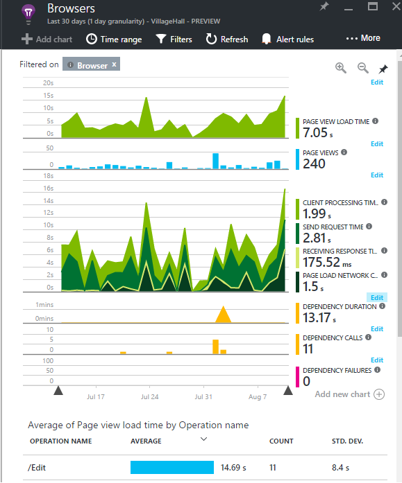
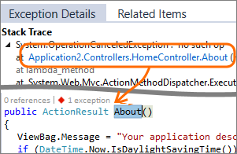

<properties 
    pageTitle="Nutzen Sie Anwendung Einsichten optimal | Microsoft Azure" 
    description="Nachdem erste Schritte mit der Anwendung Einblicken, müssen Sie hier eine Zusammenfassung der Features, die Sie durchsuchen können." 
    services="application-insights" 
    documentationCenter=".net"
    authors="alancameronwills" 
    manager="douge"/>

<tags 
    ms.service="application-insights" 
    ms.workload="tbd" 
    ms.tgt_pltfrm="ibiza" 
    ms.devlang="na" 
    ms.topic="article" 
    ms.date="10/27/2016" 
    ms.author="awills"/>

# <a name="more-telemetry-from-application-insights"></a>Weitere werden aus der Anwendung Einsichten

Nachdem Sie die [Anwendung Einsichten zu ASP.NET-Code hinzugefügt](app-insights-asp-net.md)haben, gibt es ein paar Punkte, die Sie ergreifen können um noch mehr werden. 

## <a name="if-your-app-runs-on-your-iis-server-"></a>Wenn Ihre app auf Ihrem IIS-Server ausgeführt wird...

Wenn Ihre app auf IIS-Servern im Steuerelement gehostet wird, installieren Sie die Anwendung Einsichten Status Monitor auf den Servern. Wenn sie bereits installiert ist, müssen Sie nicht zu können.

1. Melden Sie sich mit Administratorberechtigungen, auf jedem IIS-Webserver.
2. Herunterladen Sie, und führen Sie das [Installationsprogramm Status überwachen](http://go.microsoft.com/fwlink/?LinkId=506648).
3. Melden Sie sich im Assistenten Installation in Microsoft Azure an.

Sie brauchen nichts weiter tun, aber Sie können bestätigen, dass die Überwachung für Ihre app aktiviert ist.


(Auch Status Monitor [zur Laufzeit Überwachung aktivieren](app-insights-monitor-performance-live-website-now.md), können auch, wenn Sie Ihre apps in Visual Studio Instrumentieren haben.)

### <a name="what-do-you-get"></a>Was erhalten Sie?

Wenn der Status Monitor auf den Servercomputern installiert ist, erhalten Sie einige zusätzliche werden:

* Abhängigkeit werden (SQL-Aufrufe und REST von der app-Aufrufe) für .NET 4.5-apps. (Für spätere Versionen von .NET ist Status Monitor nicht für Abhängigkeit werden erforderlich.) 
* Ausnahme Stapel auf anzuzeigen mehr Details.
* Datenquellen. Anwendung Einblicken diese Indikatoren in das Blade Servern angezeigt. 


Um mehr oder weniger Indikatoren, [Bearbeiten Sie die Diagramme](app-insights-metrics-explorer.md)anzuzeigen. Wenn Sie nicht der gewünschten Performance-Zähler in der verfügbaren Menge ist, können Sie [darauf, um die vom Modul Zähler Leistung gesammelte Gruppe hinzufügen](app-insights-performance-counters.md).

## <a name="if-its-an-azure-web-app-"></a>Ist eine Azure Web app...

Wenn Ihre app als einer Azure Web app ausgeführt wird, wechseln Sie zu der Azure Systemsteuerung für die app oder virtuellen Computer, und öffnen Sie das Anwendung Einsichten Blade. 

### <a name="what-do-you-get"></a>Was erhalten Sie?

* Ausnahme Stapel auf anzuzeigen mehr Details.
* Abhängigkeit werden (SQL-Aufrufe und REST von der app-Aufrufe) für .NET 4.5-apps. (Für spätere Versionen von .NET ist die Erweiterung nicht für Abhängigkeit werden erforderlich.) 


(Sie können auch diese Methode [zur Laufzeit zum Überwachen der Leistung aktivieren](app-insights-monitor-performance-live-website-now.md), verwenden, auch wenn Sie Ihre app in Visual Studio Instrumentieren haben.)

## <a name="client-side-monitoring"></a>Clientseitige Überwachung

Sie haben das SDK installiert haben, die Daten werden vom Server (Back-End) der Anwendung sendet. Jetzt können Sie clientseitige Überwachung hinzufügen. Hiermit erhalten Sie Daten auf Benutzer, Sitzungen, Seitenansichten, und alle Ausnahmen oder stürzt ab, die im Browser auftreten. Sie können zwar auch Schreiben von eigenem Code zum Nachverfolgen, wie Ihre Benutzer-App, bis hin zu Detailebene Mausklicks und Tastatureingaben funktionieren.

Fügen Sie den Anwendung Einsichten JavaScript-Codeausschnitt an jede einzelne Webseite, Sie werden in Clientbrowser abrufen.

1. Öffnen Sie in Azure die Anwendung Einsichten Ressource für Ihre app ein.
2. Erste Schritte, clientseitige Monitor, öffnen Sie, und kopieren Sie den Codeausschnitt.
3. Fügen Sie ihn, sodass sie am Anfang jeder Webseite - normalerweise angezeigt wird, dass Sie dies tun können, indem Sie in der Seite Masterlayout.


Beachten Sie, dass der Code den Instrumentation Schlüssel enthält, der Ihrer Anwendungsressource identifiziert.

### <a name="what-do-you-get"></a>Was erhalten Sie?

* Sie können JavaScript zum Senden von [benutzerdefinierten werden von Ihren Webseiten](app-insights-api-custom-events-metrics.md), beispielsweise auf eine Schaltfläche Nachverfolgen schreiben.
* In [Analytics](app-insights-analytics.md), Daten in `pageViews` und AJAX-Daten in `dependencies`. 
* [Clientleistung und von Verwendungsdaten](app-insights-javascript.md) in den Browsern Blade.




[Weitere Informationen zu der Webseite nachverfolgen.](app-insights-web-track-usage.md)


## <a name="track-application-version"></a>Version der Anwendung nachverfolgen

Vergewissern Sie sich `buildinfo.config` wird vom MSBuild Prozesses generiert. Fügen Sie in der Datei csproj hinzu:  

```XML

    <PropertyGroup>
      <GenerateBuildInfoConfigFile>true</GenerateBuildInfoConfigFile>    <IncludeServerNameInBuildInfo>true</IncludeServerNameInBuildInfo>
    </PropertyGroup> 
```

Wenn sie eigene Informationen enthält, fügt das Anwendung Einsichten Web-Modul **Version der Anwendung** als eine Eigenschaft für jedes Element der werden. Mit der Sie zum Filtern nach Version Wenn [diagnostic Suchvorgänge](app-insights-diagnostic-search.md) durch oder [Kennzahlen untersuchen](app-insights-metrics-explorer.md). 

Allerdings feststellen Sie, dass die Buildversionsnummer nur von MS-Build nicht vom Entwickler Build in Visual Studio generiert wird.


## <a name="availability-web-tests"></a>Verfügbarkeit von Webtests

Senden Sie Ihre Web app HTTP-Anfragen in regelmäßigen Abständen aus der ganzen Welt. Wir werden Sie benachrichtigt, wenn die Antwort langsam oder nicht zuverlässig ist.

Klicken Sie in der Anwendung Einsichten Ressource für Ihre app auf die Kachel Verfügbarkeit zum Hinzufügen, bearbeiten und Anzeigen von Webtests.

Sie können mehrere Tests ausführen an mehreren Speicherorten hinzufügen.


[Weitere Informationen](app-insights-monitor-web-app-availability.md)

## <a name="custom-telemetry-and-logging"></a>Benutzerdefinierte werden und Protokollierung

Die Anwendung Einsichten Pakete, die Sie dem Code hinzugefügt bieten eine API, die Sie aus Ihrer Anwendung aufrufen können.

* [Eigene Ereignisse und Kriterien zu generieren](app-insights-api-custom-events-metrics.md), beispielsweise zum zählen geschäftliche Ereignisse oder Monitor Leistung.
* [Erfassen Log Spuren](app-insights-asp-net-trace-logs.md) von Log4Net, NLog oder System.Diagnostics.Trace.
* [Filter, ändern oder erweitern](app-insights-api-filtering-sampling.md) der standard werden aus der app handschriftlich Prozessoren werden gesendet. 


## <a name="powerful-analysis-and-presentation"></a>Leistungsstarke Datenanalyse und Präsentation

Es gibt zahlreiche Methoden zum Durchsuchen von Daten aus. Zuletzt mit Anwendung Einsichten begonnen haben, überprüfen Sie, die folgenden Artikel:

||
|---|---
|[**Diagnose suchen, z. B. Daten**](app-insights-visual-studio.md)<br/>Suchen und Filtern Ereignisse wie Besprechungsanfragen, Ausnahmen, Abhängigkeit Anrufe, melden Sie sich auf und Seite Ansichten. Wechseln Sie in Visual Studio Code aus Stapel auf.|
|[**Kennzahlen Explorer für aggregierte Daten**](app-insights-metrics-explorer.md)<br/>Durchsuchen Sie, Filtern Sie und segmentieren Sie aggregierte Daten wie z. B. Sätze von Besprechungsanfragen, Fehlern und Ausnahmen; Reaktionszeiten, Seitenladezeiten.|
|[**Dashboards**](app-insights-dashboards.md#dashboards)<br/>Kombinieren von Daten aus mehreren Ressourcen und für andere Personen freigeben. Ideal für mehrere Komponente Applikationen und für die kontinuierliche Anzeige im Team Raum.  |
|[**Kennzahlen Stream Live**](app-insights-metrics-explorer.md#live-metrics-stream)<br/>Wenn Sie einen neuen Build bereitstellen, schauen Sie sich diese in der Nähe Echtzeit Performance Indicators um sicherzustellen, dass alles wie erwartet funktioniert.|
|[**Analytics**](app-insights-analytics.md)<br/>Fragen Sie nicht einfach zu Leistung und die Verwendung Ihrer app mithilfe dieser leistungsfähige Abfragesprache.|
|[**Automatischen und manuellen Benachrichtigungen**](app-insights-alerts.md)<br/>Automatische Benachrichtigungen anpassen an Ihrer app normalen Muster werden und Trigger auf, wenn etwas außerhalb der üblichen Muster vorhanden ist. Sie können auch auf bestimmten Ebenen von benutzerdefinierten oder standard Kennzahlen Benachrichtigungen festlegen.|

## <a name="data-management"></a>Datenverwaltung

|||
|---|---|
|[**Fortlaufender exportieren**](app-insights-export-telemetry.md)<br/>Kopieren Sie alle Ihre werden in Speicher, damit Sie es eigene Weise analysieren können.|
|**Zugreifen auf Daten API**<br/>Demnächst.|
|[**Werden**](app-insights-sampling.md)<br/>Verringert die Datenrate und hilft Ihnen, Ihre Preisgestaltung Ebene innerhalb der bleiben.|