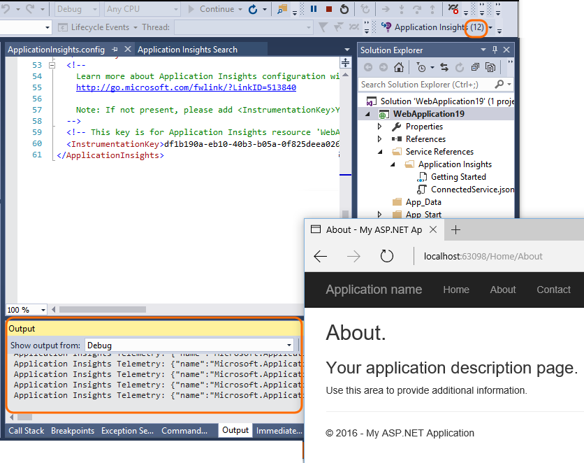

<properties 
    pageTitle="Problembehandlung bei keine Daten - Anwendung Einsichten für .NET" 
    description="Sehen Sie Daten in Visual Studio-Anwendung Einsichten nicht? Versuchen Sie hier." 
    services="application-insights" 
    documentationCenter=".net"
    authors="alancameronwills" 
    manager="douge"/>

<tags 
    ms.service="application-insights" 
    ms.workload="mobile" 
    ms.tgt_pltfrm="ibiza" 
    ms.devlang="na" 
    ms.topic="article" 
    ms.date="10/24/2016" 
    ms.author="awills"/>
 
# Problembehandlung bei keine Daten - Anwendung Einsichten für .NET

## Einige meiner telemetrieprotokoll fehlt

*In der Anwendung Einblicken sehe ich nur einen Bruch der Ereignisse, die von meinem app generiert werden.*

* Wenn Sie den gleichen Bruch ständig angezeigt werden, ist es wahrscheinlich aufgrund adaptive [werden](app-insights-sampling.md). Um dies zu überprüfen, öffnen Sie Suche (aus dem Übersicht-Blade) zu, und schauen Sie sich eine Instanz von einer Besprechungsanfrage oder eines anderen Ereignisses. Klicken Sie unten im Eigenschaftenabschnitt auf "...", um die Details zu vollständigen Eigenschaften zu erhalten. Wenn Count > 1 anfordern, und klicken Sie dann werden in der Vorgang ist. 
* Andernfalls ist es möglich, dass Sie eine [Daten Zins beschränken](app-insights-pricing.md#limits-summary) für Ihr Plan Preisgestaltung handelt. Diese Grenzwerte gelten pro Minute.

## Keine Daten von meinem server

*Ich habe meine app auf meinem Webserver installiert, und jetzt wird keine werden daraus angezeigt. Es funktioniert OK auf meinem Computer Entwickler.*

* Wahrscheinlich ein Problem Firewall. [Festlegen der Firewallausnahmen für Anwendung Einblicken, Daten zu senden](app-insights-ip-addresses.md).

*Kann ich auf meinem Webserver zum Überwachen der vorhandenen apps in [Status Monitor installiert](app-insights-monitor-performance-live-website-now.md) . Ergebnisse wird nicht angezeigt.*

* Lesen Sie [Problembehandlung Status überwachen](app-insights-monitor-performance-live-website-now.md#troubleshooting). 

## Keine Option 'Anwendung Einsichten hinzufügen' in Visual Studio

*Wenn ich ein neues Projekt in Visual Studio erstellen, oder ich ein vorhandenes Projekt in der Lösung Explorer mit der rechten Maustaste, keine Optionen für die Anwendung Einsichten angezeigt.*

+ Mit den Tools werden nicht alle Arten von .NET Project unterstützt. Web- und WCF Projekte werden unterstützt. Für andere Projekttypen wie desktop oder Service Applications können Sie weiterhin [eine Anwendung Einsichten SDK zum Projekt manuell hinzufügen](app-insights-windows-desktop.md).
+ Stellen Sie sicher, dass Sie [Visual Studio 2013 Update 3 oder höher](http://go.microsoft.com/fwlink/?LinkId=397827)verfügen. Es geht mit Tools für die Einsichten vorinstalliert.
+ Wählen Sie **Tools**und **Extensions und Updates** und überprüfen Sie, dass die **Anwendung Einsichten Tools** installiert und aktiviert ist. Wenn dies der Fall ist, klicken Sie auf **Updates** , um festzustellen, ob ein Update vorhanden ist.
+ Öffnen Sie im Dialogfeld Neues Projekt aus, und wählen Sie ASP.NET Web-Anwendung. Wenn Sie die Anwendung Einsichten Option es angezeigt wird, werden die Tools installiert. Wenn dies nicht der Fall ist, versuchen Sie es deinstallieren, und klicken Sie dann die Anwendung Einsichten Tools erneut zu installieren.

## Fehler beim Hinzufügen der Anwendung Einsichten

*Wenn ich ein neues Webprojekt erstellen oder beim Versuch, mich Anwendung Einsichten zu einem vorhandenen Projekt hinzufügen, finden Sie unter ich eine Fehlermeldung angezeigt.*

Mögliche Ursachen:

* Fehler bei der Kommunikation mit dem Portal Anwendung Einsichten; oder
* Es gibt einige Probleme mit Ihrem Azure-Konto an.
* Sie müssen nur [Lesezugriff auf das Abonnement oder die Gruppe, in dem Sie die neue Ressource erstellen wollten](app-insights-resources-roles-access-control.md).

Fix:

+ Überprüfen Sie, dass Sie die Anmeldeinformationen für das Konto rechts Azure bereitgestellt. 
+ Aktivieren Sie in Ihrem Browser, dass Sie auf das [Azure-Portal](https://portal.azure.com)zugreifen. Öffnen Sie die Einstellungen, und festzustellen Sie, ob eine Einschränkung.
+ [Hinzufügen von Anwendung Einsichten zu einem vorhandenen Projekt](app-insights-asp-net.md): In Lösung Explorer, klicken Sie mit der rechten Maustaste auf Ihr Projekt, und wählen Sie "Hinzufügen" Anwendung Einsichten.
+ Wenn es immer noch nicht funktioniert, führen Sie die [manuelle Verfahren](app-insights-windows-services.md) zum Hinzufügen einer Ressource im Portal aus, und klicken Sie dann das SDK zum Projekt hinzufügen. 

## Ich erhalte die Fehlermeldung "Instrumentation Schlüssel darf nicht leer sein"

Sieht ein Fehler aufgetreten ist, während Sie die Anwendung Einblicken oder vielleicht eine Protokollierung Netzwerkadapter installieren wurden.

Explorer-Lösung, mit der Maustaste `ApplicationInsights.config` , und wählen Sie die **Anwendung Einsichten konfigurieren**. Erhalten Sie ein Dialogfeld, mit der Sie die Anmeldung bei Azure eingeladen, und erstellen Sie entweder eine Anwendung Einsichten Ressource, oder verwenden Sie eine vorhandene erneut.

##"NuGet Pakete fehlen" auf meinem Server erstellen

*Alles erstellt OK, wenn ich auf meinem Entwicklungscomputer Debuggen Versuche, aber ich einen NuGet-Fehler auf dem Server erstellen erhalte.*

Bitte finden Sie unter [NuGet Paket wiederherstellen](http://docs.nuget.org/Consume/Package-Restore) und [Automatische Paket wiederherstellen](http://docs.nuget.org/Consume/package-restore/migrating-to-automatic-package-restore).

## Öffnen Sie die Anwendung Einsichten über Visual Studio fehlende Menübefehl

*Wenn ich meine Projekt-Explorer-Lösung mit der rechten Maustaste, alle Befehle Anwendung Einsichten wird nicht angezeigt, oder einen Befehl Öffnen Anwendung Einsichten wird nicht angezeigt.*

Mögliche Ursachen:

* Wenn Sie die Anwendung Einsichten Ressource manuell erstellt oder ein anderes Projekt ist, die durch die Anwendung Einsichten-Tools nicht unterstützt wird.
* Die Anwendung Einsichten Tools werden in der Visual Studio deaktiviert.
* Ihre Visual Studio ist älter als 2013 Update 3.

Fix:

* Stellen Sie sicher, dass Ihre Version von Visual Studio 2013 Update 3 oder höher ist.
* Wählen Sie **Tools**und **Extensions und Updates** und überprüfen Sie, dass die **Anwendung Einsichten Tools** installiert und aktiviert ist. Wenn dies der Fall ist, klicken Sie auf **Updates** , um festzustellen, ob ein Update vorhanden ist.
* Mit der rechten Maustaste in Ihr Projekts im Explorer-Lösung. Wenn Sie den Befehl **Konfigurieren Anwendung Einsichten**sehen, verwenden Sie diese Verbindung Ihres Projekts, die der Ressource in der Anwendung Einsichten Dienst.

Andernfalls wird der Projekttyp direkt durch die Anwendung Einsichten Tools nicht unterstützt. Anzeigen Ihrer werden, melden Sie sich bei der [Azure-Portal](https://portal.azure.com), wählen Sie Anwendung Einsichten auf der linken Navigationsleiste und Ihrer Anwendung.

## "Zugriff verweigert" nach dem Öffnen der Anwendung Einsichten von Visual Studio

*Der Menübefehl 'Öffnen Anwendung Einsichten' dauert für mich Azure-Portal an, aber ich erhalte die Fehlermeldung "Zugriff verweigert".*

Die Microsoft-Anmeldung, die Sie zuletzt verwendet haben, klicken Sie auf als Standardbrowser keinen Zugriff auf [die Ressource, die erstellt wurde, wenn diese app Anwendung Einsichten hinzugefügt wurde](app-insights-asp-net.md). Es gibt zwei möglichen Ursachen: 

* Sie haben mehr als ein Microsoft-Konto - vielleicht einer geschäftlichen und einer persönlichen Microsoft-Konto? Die Anmeldung, die Sie zuletzt verwendet haben, klicken Sie auf als Standardbrowser wurde für ein anderes Konto als die [Anwendung Einsichten zum Projekt](app-insights-asp-net.md)hinzufügen zugreifen können. 

 * Fix: Klicken Sie auf Ihren Namen oben rechts im Browserfenster, und melden Sie sich ab. Melden Sie sich mit dem Konto mit Zugriff auf. Klicken Sie dann auf der linken Navigationsleiste Anwendung Einsichten klicken Sie auf, und wählen Sie die app aus.

* Person, die Anwendung Einsichten zum Projekt hinzugefügt, und diese vergessen Sie [Zugriff auf die Ressourcengruppe](app-insights-resources-roles-access-control.md) erteilen, in dem es erstellt wurde. 

 * Fix: Wenn sie ein Organisations-Konto verwendet haben, können sie Sie an das Team hinzufügen. oder können Sie der Ressourcengruppe individuellen Zugriff gewähren.

## 'Objekt nicht gefunden' nach dem Öffnen der Anwendung Einsichten von Visual Studio

*Der Menübefehl 'Öffnen Anwendung Einsichten' dauert für mich Azure-Portal an, aber ich erhalte die Fehlermeldung "Objekt nicht gefunden".*

Mögliche Ursachen:

* Die Anwendung Einsichten Ressource für eine Anwendung wurde gelöscht; oder
* Die Taste Instrumentation wurde festlegen oder in ApplicationInsights.config geändert werden, indem Sie direkt, ohne die Aktualisierung der Projektdatei bearbeiten. 

Der Instrumentation Schlüssel in ApplicationInsights.config Steuerelemente, wo die werden gesendet wird. Eine Zeile in der Projektdatei steuert, welche Ressource geöffnet wird, wenn Sie den Befehl in Visual Studio verwenden. 

Fix:

* Lösung-Explorer mit der rechten Maustaste in des Projekts und wählen Sie die Anwendung Einblicken, Anwendung Einsichten konfigurieren. Klicken Sie im Dialogfeld können Sie entweder auswählen, werden auf eine vorhandene Ressource senden oder einen neuen erstellen. Oder:
* Öffnen Sie die Ressource direkt an. Melden Sie sich bei [der Azure-Portal](https://portal.azure.com), klicken Sie auf der linken Navigationsleiste auf Einsichten Anwendung, und wählen Sie dann Ihre app.

## Wo finde ich meine werden?

*Kann ich mit dem [Microsoft Azure-Portal](https://portal.azure.com)angemeldet Suche, und ich bei dem Azure Start Dashboard. Also, wo finde ich meine Anwendung Einsichten Daten?*

* Klicken Sie auf der linken Navigationsleiste auf Einsichten Anwendung, und klicken Sie dann auf den Namen der Anwendung. Wenn Sie noch keine Projekte besitzen, müssen Sie [Hinzufügen oder Anwendung Einsichten in Ihrem Webprojekt konfigurieren](app-insights-asp-net.md).

    Es werden einige Zusammenfassungsdiagramme angezeigt. Sie können erfolgt, um mehr Details anzeigen klicken.

* Klicken Sie in Visual Studio während Sie Ihre app testen, Anwendung Einsichten Schaltfläche.

## Keine Server-Daten (oder keine Daten überhaupt)

*Ich habe meine app ausgeführt und dann den Anwendung Einsichten-Dienst in Microsoft Azure geöffnet, aber alle Diagramme anzeigen 'Informationen zum Sammeln...' oder "Nicht konfiguriert."* Oder, *nur Seitenansicht und Benutzerdaten, jedoch keine Serverdaten.*

+ Führen Sie die Anwendung im Modus Debuggen von Visual Studio (F5). Verwenden Sie die Anwendung weitere einige werden generieren. Aktivieren Sie im Ausgabefenster Visual Studio protokollierten Ereignisse sehen können. 

    

+ Öffnen Sie im Portal Anwendung Einsichten [Diagnostic suchen](app-insights-diagnostic-search.md)aus. Daten in der Regel wird hier angezeigt zuerst.
+ Klicken Sie auf die Schaltfläche Aktualisieren. Das Blade selbst regelmäßig aktualisiert, aber Sie können auch erledigen manuell. Das Aktualisierungsintervall umfasst mehr für größere Zeiträume.
+ Überprüfen Sie, dass die Tasten Instrumentation entsprechen. Prüfen Sie auf das Hauptfenster Blade für Ihre app im Portal Anwendung Einsichten in der Dropdownliste **Essentials** **Instrumentation Schlüssel**aus. Klicken Sie dann im Projekt in Visual Studio öffnen ApplicationInsights.config, und Suchen nach dem `<instrumentationkey>`. Überprüfen Sie, dass zwei Schlüssel gleich sind. Wenn dies nicht der Fall:
 + Im Portal Anwendung Einsichten klicken Sie auf, und suchen Sie nach der app-Ressource mit der rechten Taste; oder
 + Klicken Sie in Visual Studio Solution Explorer mit der rechten Maustaste in des Projekts, und wählen Sie Anwendung Einblicken, konfigurieren. Zurücksetzen der app zum Senden von werden an die richtige Ressource an.
 + Wenn Sie die passenden Tasten finden können, überprüfen Sie, dass Sie die gleichen Anmeldeinformationen in Visual Studio als in-Portal verwenden.

    
    
+ Prüfen Sie im [Microsoft Azure private Dashboard](https://portal.azure.com)der Dienststatus Karte aus. Wenn es einige Angaben benachrichtigen gibt, warten Sie, bis er, klicken Sie auf OK zurückgegeben haben, und klicken Sie dann schließen und erneut Ihrer Anwendung Einsichten Anwendung Blade öffnen.
+ Aktivieren Sie auch [unserem Blog Status](http://blogs.msdn.com/b/applicationinsights-status/).
+ Hat keinen Code für die [serverseitige SDK](app-insights-api-custom-events-metrics.md) , die die Taste Instrumentation in ändern möglicherweise schreiben `TelemetryClient` Instanzen oder in `TelemetryContext`? Oder haben Sie einen [Filter oder Stichproben Konfiguration](app-insights-api-filtering-sampling.md) , die Filterung werden möglicherweise schreiben Sie viel?
+ Wenn Sie ApplicationInsights.config bearbeitet haben, überprüfen Sie die Konfiguration von [TelemetryInitializers und TelemetryProcessors](app-insights-api-filtering-sampling.md)sorgfältig. Einen falsch benannten Typ oder einen Parameter kann dazu führen, dass das SDK, ohne Daten zu senden.

## Keine Daten auf der Seitenansichten, Browser, Verwendung

*Ich finden Sie unter Daten in Server Antwortzeit und Serveranfragen Diagramme, aber keine Daten Zeitpunkt Laden der Seite Ansicht oder im Browser oder Einsatz Blades.*

Die Daten stammen von Skripts in Webseiten. 

+ Wenn Sie ein vorhandenes Webprojekt, [müssen Sie die Skripts von hand hinzufügen](app-insights-javascript.md)Anwendung Einsichten hinzugefügt.
+ Stellen Sie sicher, dass Internet Explorer nicht Ihrer Website im Kompatibilitätsmodus anzeigt.
+ Mithilfe des Browsers Debuggen Feature (F12 in einigen Browsern, wählen Sie dann Netzwerk) sicher, dass die Daten zu gesendet werden `dc.services.visualstudio.com`.

## Keine Abhängigkeit oder Ausnahme Daten

Finden Sie unter [Abhängigkeit werden](app-insights-asp-net-dependencies.md) und [Ausnahme werden](app-insights-asp-net-exceptions.md).

## Keine Performance-Daten

Performance-Daten (CPU, EA Zins usw.) steht für [Java-Webdiensten](app-insights-java-collectd.md), [Windows-desktop-apps](app-insights-windows-desktop.md), [IIS web apps und Diensten, wenn Sie den Statusmonitor installieren](app-insights-monitor-performance-live-website-now.md)und [Azure-Cloud-Dienste](app-insights-azure.md). Sie finden sie unter Einstellungen Servers.

Es ist nicht verfügbar für Azure Websites.

## Keine Daten (Server), da ich die app auf meinem Server veröffentlicht

+ Überprüfen Sie, dass Sie tatsächlich alle Microsoft kopiert haben. ApplicationInsights DLL-Dateien auf dem Server, zusammen mit Microsoft.Diagnostics.Instrumentation.Extensions.Intercept.dll
+ Klicken Sie in Ihrer Firewall müssen Sie [einige TCP-](app-insights-ip-addresses.md#data-access-api)öffnen.
+ Wenn Sie zur Verwendung eines Proxy senden aus dem Unternehmensnetzwerk haben, legen Sie [DefaultProxy](https://msdn.microsoft.com/library/aa903360.aspx) Datei Web.config
+ WindowsServer 2008: Stellen Sie sicher, dass Sie die folgenden Updates installiert haben: [KB2468871](https://support.microsoft.com/kb/2468871), [KB2533523](https://support.microsoft.com/kb/2533523), [KB2600217](https://support.microsoft.com/kb/2600217).

## Ich verwendet, um die Daten anzuzeigen, aber es wurde beendet

* Überprüfen Sie den [Status Blog](http://blogs.msdn.com/b/applicationinsights-status/).
* Haben Sie Ihre monatliche Kontingent von Datenpunkten erreicht? Öffnen Sie die Einstellungen/Kontingent und Preise, um herauszufinden. Ist dies der Fall ist, können Sie Ihr Plan aktualisieren oder zusätzliche Kapazität bezahlen. Finden Sie die [Preise Farbschema](https://azure.microsoft.com/pricing/details/application-insights/)aus.

## Kann ich sehen nicht alle Daten, die ich erhalte erwartet

Wenn eine Anwendung eine große Datenmenge sendet, und Sie die Anwendung Einsichten SDK für ASP.NET Version 2.0.0-beta3 oder höher verwenden, möglicherweise das Feature [adaptive werden](app-insights-sampling.md) die Steuerung und senden nur Prozentwert der werden. 

Sie können es deaktivieren, aber dies wird nicht empfohlen. Stichproben dient, sodass die zugehörigen werden ordnungsgemäß zu Diagnosezwecken übertragen wird. 

## Falsche geografische Daten in Benutzer werden

Der Ort, Region und Land Dimensionen IP-Adressen abgeleitet werden und nicht immer genau.

## Ausnahme "Methode wurde nicht gefunden" zum Ausführen von Azure-Cloud-Dienste

Erstellen Sie für .NET 4.6? 4.6 wird nicht automatisch in Azure Cloud Services-Rollen unterstützt. [Installieren 4.6 auf jede Rolle](../cloud-services/cloud-services-dotnet-install-dotnet.md) , bevor Sie Ihre app ausführen.

## Funktioniert immer noch nicht...

* [Anwendung Einsichten-forum](https://social.msdn.microsoft.com/Forums/vstudio/en-US/home?forum=ApplicationInsights)

