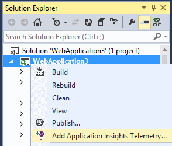
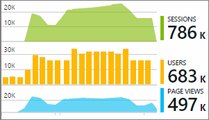

<properties 
    pageTitle="Einrichten von Web app Analytics für ASP.NET mit Anwendung Einsichten | Microsoft Azure" 
    description="Konfigurieren der Leistung, Verfügbarkeit und Nutzungsanalysen für Ihre Website ASP.NET lokal gehostet oder in Azure." 
    services="application-insights" 
    documentationCenter=".net"
    authors="NumberByColors" 
    manager="douge"/>

<tags 
    ms.service="application-insights" 
    ms.workload="tbd" 
    ms.tgt_pltfrm="ibiza" 
    ms.devlang="na" 
    ms.topic="get-started-article" 
    ms.date="10/13/2016" 
    ms.author="awills"/>


# <a name="set-up-application-insights-for-aspnet"></a>Einrichten von Anwendung Einsichten für ASP.NET

[Visual Studio-Anwendung Einsichten](app-insights-overview.md) überwacht Ihrer Anwendung live, damit Sie [erkennen und zu diagnostizieren Leistungsprobleme und Ausnahmen](app-insights-detect-triage-diagnose.md), und [erfahren Sie, wie Ihre app genutzt werden](app-insights-overview-usage.md)können.  Funktionsweise von apps, die gehostet werden auf Ihrer eigenen lokalen IIS-Servern oder in der Cloud virtuellen Computern sowie Azure Web apps.


## <a name="before-you-start"></a>Bevor Sie beginnen

Du brauchst:

* Visual Studio-2013-Update 3 oder höher. Höher ist besser.
* Ein [Microsoft Azure](http://azure.com)-Abonnement. Wenn Ihr Team oder der Organisation ein Azure-Abonnement verfügt, kann der Besitzer Sie hinzufügen, mit Ihrem [Microsoft-Konto](http://live.com). 

Es gibt alternative Artikeln zu betrachten, wenn Sie interessiert sind:

* [Instrumentieren einer Web app zur Laufzeit](app-insights-monitor-performance-live-website-now.md)
* [Azure Cloud services](app-insights-cloudservices.md)

## <a name="a-nameidea-1-add-application-insights-sdk"></a><a name="ide"></a>1. Anwendung Einsichten SDK hinzufügen


### <a name="if-its-a-new-project"></a>Ist ein neues Projekt...

Stellen Sie sicher, dass die Anwendung Einsichten ausgewählt ist, wenn Sie ein neues Projekt in Visual Studio erstellen. 


### <a name="-or-if-its-an-existing-project"></a>... oder einem vorhandenen Projekt ist

Mit der rechten Maustaste im Projekts im Solution Explorer, und wählen Sie **Hinzufügen Anwendung Einsichten werden** oder **Anwendung Einsichten konfigurieren**.



* ASP.NET Core Project? - [Anweisungen, ein paar Codezeilen zu beheben](https://github.com/Microsoft/ApplicationInsights-aspnetcore/wiki/Getting-Started#add-application-insights-instrumentation-code-to-startupcs). 


## <a name="a-nameruna-2-run-your-app"></a><a name="run"></a>2. Führen Sie die app

Führen Sie die Anwendung mit F5, und probieren Sie es aus: Öffnen von anderen Seiten, um einige werden generieren.

In Visual Studio finden Sie unter Anzahl der Ereignisse, die protokolliert wurden. 


## <a name="3-see-your-telemetry"></a>3 finden Sie 3 Ihre werden...

### <a name="-in-visual-studio"></a>in Visual Studio...

Öffnen Sie das Fenster Anwendung Einsichten in Visual Studio: Klicken Sie auf die Schaltfläche Anwendung Einblicken oder, mit der rechten Maustaste in Ihr Projekts im Explorer-Lösung:


In dieser Ansicht werden in der Server-Seite der app generiert werden. Probieren Sie die Filter, und klicken Sie auf ein beliebiges Ereignis, um mehr Details anzuzeigen.

[Erfahren Sie mehr über die Anwendung Einsichten Tools in Visual Studio](app-insights-visual-studio.md).

<a name="monitor"></a> 
### <a name="-in-the-portal"></a>im Portal...

Es sei denn, Sie *Nur SDK installieren* ausgewählt haben, können Sie auch die werden bei der Anwendung Einsichten Web-Portal anzeigen. 

Das Portal verfügt über weitere Diagramme, analytisches Tools und Dashboards als Visual Studio. 


Öffnen Sie Ihrer Anwendung Einsichten Ressource im [Azure-Portal](https://portal.azure.com/)an.


Im Portal wird auf eine Ansicht der werden aus der app:

* Der erste werden [Live Kennzahlen Stream](app-insights-metrics-explorer.md#live-metrics-stream)wird angezeigt.
* Einzelne Ereignisse werden im **Suchfeld** (1) angezeigt. Daten dauert ein paar Minuten angezeigt werden. Klicken Sie auf ein beliebiges Ereignis, um die Eigenschaften anzuzeigen. 
* Zusammengefasste Kennzahlen werden in den Diagrammen (2). Es kann eine oder zwei Minuten Daten hier angezeigt dauern. Klicken Sie auf jedes Diagramm, um ein Blade mit mehr Details zu öffnen.

[Weitere Informationen zum Verwenden der Anwendung Einsichten Azure-Portal](app-insights-dashboards.md).

## <a name="4-publish-your-app"></a>4 veröffentlichen Sie 4 Ihre app

Veröffentlichen Sie Ihre app auf Ihren IIS-Server oder in Azure. Schauen Sie sich [Live Kennzahlen Stream](app-insights-metrics-explorer.md#live-metrics-stream) , um sicherzustellen, dass alles reibungslos ausgeführt wird.

Sehen Sie Ihre werden oben im Portal Anwendung Einblicken, wo Sie Kennzahlen überwachen, suchen Ihre telemetrieprotokoll und Einrichten von [Dashboards](app-insights-dashboards.md)erstellen. Können Sie auch die leistungsstarken [Analytics-Abfragesprache](app-insights-analytics.md) Verwendung und Leistung analysieren oder bestimmte Ereignisse zu finden. 

Sie können auch weiterhin Ihre werden in [Visual Studio](app-insights-visual-studio.md) mit Tools wie diagnostic suchen und [Trends](app-insights-visual-studio-trends.md)zu analysieren.

> [AZURE.NOTE] Wenn Ihre app genügend werden fast [begrenzungsebene Grenzwerte](app-insights-pricing.md#limits-summary)sendet, wechselt Automatisches [werden](app-insights-sampling.md) auf. Stichproben verringert die Menge der aus der app, gleichzeitiger korrelierte Daten um zu Diagnosezwecken gesendet werden.


##<a name="a-namelanda-what-did-add-application-insights-do"></a><a name="land"></a>Welche Funktion 'Anwendung Einsichten hinzufügen'?

Anwendung Einsichten sendet werden aus der app-Anwendung Einsichten-Portal an (die in Microsoft Azure gehostet wird):


Der Befehl hat daher drei Möglichkeiten:

1. Hinzufügen des Anwendung Einsichten Web SDK NuGet-Pakets zu einem Projekt. Klicken Sie zum Anzeigen in Visual Studio mit der rechten Maustaste in Ihrem Projekts, und wählen Sie NuGet-Pakete verwalten.
2. Erstellen Sie eine Ressource Anwendung Einsichten [Azure](https://portal.azure.com/)-Portal an. Dies ist die Stelle, an der Sie die Daten sehen. Die *Instrumentation Schlüssel,* die die Ressource identifiziert abgerufen.
3. Fügt die Taste Instrumentation in `ApplicationInsights.config`, sodass das SDK werden mit dem Portal senden kann.

Wenn Sie möchten, können Sie folgendermaßen manuell für [ASP.NET 4](app-insights-windows-services.md) oder [ASP.NET Core](https://github.com/Microsoft/ApplicationInsights-aspnetcore/wiki/Getting-Started)ausführen.

### <a name="to-upgrade-to-future-sdk-versions"></a>Upgrade auf zukünftige SDK-Versionen

Zum Aktualisieren auf eine [neue Version des SDK](https://github.com/Microsoft/ApplicationInsights-dotnet-server/releases)NuGet-Paket-Manager erneut öffnen, und Filtern auf installierten Pakete. Wählen Sie Microsoft.ApplicationInsights.Web, und wählen Sie die Aktualisierung.

Wenn Sie alle Anpassungen ApplicationInsights.config haben, speichern Sie eine Kopie der vor dem upgrade, und anschließend die Änderungen in die neue Version zusammenführen.

## <a name="add-more-telemetry"></a>Fügen Sie weitere werden

### <a name="web-pages-and-single-page-apps"></a>Webseiten und einseitige apps

1. [Hinzufügen der JavaScript-Codeausschnitt](app-insights-javascript.md) Ihren Webseiten zu oben im Browser und die Verwendung Blades mit Daten zu Seitenansichten, wie schnell geladen wird, Browser Ausnahmen, AJAX-Anruf Systemleistung Benutzer- und Sitzung zählt Hellblau.
2. [Benutzerdefinierte Ereignisse Code](app-insights-api-custom-events-metrics.md) zu zählen, Uhrzeit oder Measure Benutzeraktionen.

### <a name="dependencies-exceptions-and-performance-counters"></a>Abhängigkeiten, Ausnahmen und Leistungsindikatoren

[Status Monitor installieren](app-insights-monitor-performance-live-website-now.md) auf jedem Computer Ihre Server, um zusätzliche werden über Ihre app zu erhalten. Dies ist das Ergebnis:

* [Leistungsindikatoren](app-insights-performance-counters.md) - 
CPU, Speicher, Datenträger und anderen Leistungsindikatoren für Ihre app. 
* [Ausnahmen](app-insights-asp-net-exceptions.md) - ausführlichere werden für einige Ausnahmen.
* [Abhängigkeiten](app-insights-asp-net-dependencies.md) - Anrufe an REST-API oder SQL-Dienste. Finden Sie heraus, ob langsame Antworten von externen Komponenten Leistungsprobleme auf Ihre app verursacht. (Wenn die app für .NET 4.6 ausgeführt wird, nicht Status Monitor abzurufenden dieser werden erforderlich.)

### <a name="diagnostic-code"></a>Fehlercode

Sie haben ein Problem? Wenn Sie den Code in Ihrer app diagnostizieren sie einfügen möchten, haben Sie mehrere Optionen aus:

* [Erfassen Log Spuren](app-insights-asp-net-trace-logs.md): Wenn Sie bereits Log4N, NLog oder System.Diagnostics.Trace bei der Anmeldung beim Verfolgen von Ereignissen, verwenden und klicken Sie dann die Ausgabe die Anwendung Einsichten gesendet werden kann, so, dass Sie mit Anfragen koordinieren zu können, durchsuchen und zu analysieren. 
* [Benutzerdefinierte Ereignisse und Kennzahlen](app-insights-api-custom-events-metrics.md): Verwenden Sie TrackEvent() und TrackMetric() entweder in Server- oder Webseitencode.
* [Tag werden mit zusätzlichen Eigenschaften](app-insights-api-filtering-sampling.md#add-properties)

Verwenden der [Suche](app-insights-diagnostic-search.md) zum Suchen und zu koordinieren bestimmte Ereignisse und [Analytics](app-insights-analytics.md) leistungsfähigere Abfragen ausführen.

## <a name="alerts"></a>Benachrichtigungen

Werden Sie feststellen, ob Ihre app Probleme weist das erste. (Warten Sie nicht, bis die Benutzer Sie informieren!) 

* [Erstellen Webtests](app-insights-monitor-web-app-availability.md) , um sicherzustellen, dass Ihre Website im Internet sichtbar ist.
* [Proaktive](app-insights-proactive-diagnostics.md) Diagnose durch automatisch (Wenn Ihre app eine bestimmte minimale Menge an Datenverkehr verfügt). Sie brauchen nichts Unternehmen, um diese einrichten. Sie feststellen, dass Sie Ihre app ein ungewöhnliche Zinsfuß fehlgeschlagene Anfragen ist.
* [Festlegen von Benachrichtigungen metrischen](app-insights-alerts.md) auf eine Warnung aus, wenn eine Metrik einen Schwellenwert überschreitet. Sie können diese benutzerdefinierten Metrik Sie Code in Ihre app festlegen.

Standardmäßig werden-Benachrichtigung an den Besitzer des Abonnements Azure gesendet. 


## <a name="version-and-release-tracking"></a>Und die aktuelle Version nachverfolgen

### <a name="track-application-version"></a>Version der Anwendung nachverfolgen

Vergewissern Sie sich `buildinfo.config` wird vom MSBuild Prozesses generiert. Fügen Sie in der Datei csproj hinzu:  

```XML

    <PropertyGroup>
      <GenerateBuildInfoConfigFile>true</GenerateBuildInfoConfigFile>    <IncludeServerNameInBuildInfo>true</IncludeServerNameInBuildInfo>
    </PropertyGroup> 
```

Wenn sie eigene Informationen enthält, fügt das Anwendung Einsichten Web-Modul **Version der Anwendung** als eine Eigenschaft für jedes Element der werden. Mit der Sie zum Filtern nach Version Wenn [diagnostic Suchvorgänge](app-insights-diagnostic-search.md) durch oder [Kennzahlen untersuchen](app-insights-metrics-explorer.md). 

Allerdings feststellen Sie, dass die Buildversionsnummer nur von MS-Build nicht vom Entwickler Build in Visual Studio generiert wird.

### <a name="release-annotations"></a>Lassen Sie wieder los Anmerkungen

Wenn Sie Visual Studio Team Services verwenden, können Sie [eine Markierung für Anmerkungen erhalten](app-insights-annotations.md) immer, wenn Sie eine neue Version Freigeben Ihrer Diagramme hinzugefügt.


## <a name="next-steps"></a>Nächste Schritte

| | 
|---|---
|**[Arbeiten mit der Anwendung Einsichten in Visual Studio](app-insights-visual-studio.md)**<br/>Für das Debuggen mit werden, diagnostic gesucht, Drillthrough zu Code.|
|**[Arbeiten mit der Anwendung Einsichten-portal](app-insights-dashboards.md)**<br/>Exportieren von Dashboards, leistungsfähige Tools für Diagnose und analytischen, Benachrichtigungen, einer Karte live Abhängigkeit von Anwendung und werden. |
|**[Fügen Sie weiterer Daten hinzu](app-insights-asp-net-more.md)**<br/>Überwachen der Verwendung, Verfügbarkeit, Abhängigkeiten, Ausnahmen. Spuren von Protokollierung Framework integriert werden soll. Schreiben Sie benutzerdefinierte werden. | 


