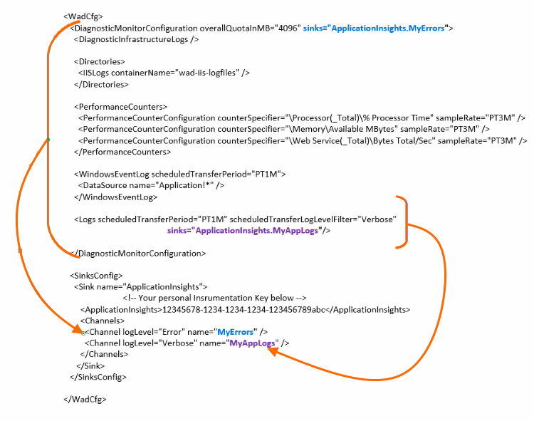

<properties
    pageTitle="Senden von Azure Diagnoseprotokolle an Anwendung Einsichten"
    description="Konfigurieren Sie die Details zu den Diagnoseprotokollen Azure-Cloud-Diensten, die mit dem Portal Anwendung Einsichten gesendet werden."
    services="application-insights"
    documentationCenter=".net"
    authors="sbtron"
    manager="douge"/>

<tags
    ms.service="application-insights"
    ms.workload="tbd"
    ms.tgt_pltfrm="ibiza"
    ms.devlang="na"
    ms.topic="article"
    ms.date="11/17/2015"
    ms.author="awills"/>

# <a name="configure-azure-diagnostic-logging-to-application-insights"></a>Konfigurieren der Anwendung Einsichten Azure-Diagnose-Protokollierung

Beim Einrichten einer Cloud Services-Projekt oder eines virtuellen Computers in Microsoft Azure [Azure ein Diagnoseprotokoll generieren kann](../vs-azure-tools-diagnostics-for-cloud-services-and-virtual-machines.md). Sie können veranlassen, dies zu Anwendung Einsichten auf gesendet, damit Sie es zusammen mit Diagnostic und die Verwendung der vom SDK Einsichten Anwendung von innerhalb der app gesendet werden analysieren können. Das Azure-Protokoll enthält Ereignisse bei der Verwaltung von der app, z. B. starten, beenden, stürzt ab, sowie-Datenquellen. Das Protokoll umfasst auch die app System.Diagnostics.Trace Anrufe.

In diesem Artikel werden die Konfiguration des Sammelvorgangs diagnostic im Detail.

Sie benötigen Azure SDK 2,8 in Visual Studio installiert.

## <a name="get-an-application-insights-resource"></a>Abrufen einer Anwendung Einsichten Ressource

Für die beste Erfahrung, [die Anwendung Einsichten SDK für jede Rolle der Cloud Services app hinzufügen](app-insights-cloudservices.md)oder [auf jeden app werden Sie Ihre virtuellen Computer ausgeführt](app-insights-overview.md). Sie können die Diagnose zu analysierenden Daten senden und dieselbe Anwendung Einsichten Ressource angezeigt.

Alternativ, wenn Sie nicht, verwenden Sie das SDK möchten - können ist die app bereits live - beispielsweise Sie nur [eine neue Anwendung Einsichten Ressource erstellen](app-insights-create-new-resource.md) Azure-Portal. Wählen Sie als den Anwendungstyp **Azure-Diagnose** aus.


## <a name="send-azure-diagnostics-to-application-insights"></a>Senden von Azure Diagnose an Anwendung Einsichten

Wenn Sie Ihre app-Projekt aktualisieren können, klicken Sie dann in Visual Studio wählen Sie jede Rolle aus, wählen Sie dessen Eigenschaften aus, und klicken Sie auf der Registerkarte Konfiguration wählen Sie **Diagnose aus, um die Anwendung Einsichten zu senden**.

Wenn Ihre app noch live ist, verwenden Sie Visual Studio Server-Explorer oder Cloud Services-Explorer öffnen Sie die Eigenschaften der app. Wählen Sie die **Diagnose zum Anwendung Einsichten zu senden**.

In jedem Fall werden Sie für die Details der Anwendung Einsichten Ressource aufgefordert werden, die Sie erstellt haben.

[Erfahren Sie mehr über das Einrichten der Anwendung Einsichten zu einer Cloud Services-app](app-insights-cloudservices.md).

## <a name="configuring-the-azure-diagnostics-adapter"></a>Konfigurieren der Netzwerkadapter Azure-Diagnose

Lesen Sie auf nur, wenn Sie die Teile der Log auswählen, die Sie Anwendung Einsichten senden möchten. Standardmäßig alles wird gesendet, einschließlich: Microsoft Azure Ereignisse; Leistungsindikatoren; Nachverfolgen von Aufrufen aus der app zu System.Diagnostics.Trace.

Azure Diagnose werden Daten in Tabellen Azure Storage gespeichert. Allerdings können Sie auch alle Pipe oder eine Teilmenge der Daten Anwendung Einsichten durch "senken" und "Kanäle" in der Konfiguration konfigurieren, wenn Azure-Diagnose Erweiterung 1.5 oder höher verwenden.

### <a name="configure-application-insights-as-a-sink"></a>Konfigurieren von Anwendung Einsichten als ein Empfänger

Wenn Sie die Rolleneigenschaften festlegen "Senden von Daten an die Anwendung Einsichten" verwenden, addiert die Azure SDK (2,8 oder höher) eine `<SinksConfig>` Element in den öffentlichen [Azure-Diagnose Konfigurationsdatei](https://msdn.microsoft.com/library/azure/dn782207.aspx) der Rolle.

`<SinksConfig>`definiert den zusätzlichen Empfänger, in dem die Diagnosedaten Azure gesendet werden kann.  Beispiel für `SinksConfig` sieht wie folgt:

```xml

    <SinksConfig>
     <Sink name="ApplicationInsights">
      <ApplicationInsights>{Insert InstrumentationKey}</ApplicationInsights>
      <Channels>
        <Channel logLevel="Error" name="MyTopDiagData"  />
        <Channel logLevel="Verbose" name="MyLogData"  />
      </Channels>
     </Sink>
    </SinksConfig>

```

Die `ApplicationInsights` Element gibt die Instrumentation-Taste die Anwendung Einsichten Ressource identifiziert, an die die Diagnosedaten Azure gesendet werden. Wenn Sie die Ressource auswählen, es wird automatisch ausgefüllt basierend auf den `APPINSIGHTS_INSTRUMENTATIONKEY` Dienstkonfiguration. (Wenn Sie manuell festlegen möchten, erhalten Sie die Taste aus der Dropdownliste Essentials Ressource.)

`Channels`Definieren Sie die Daten, die an den Empfänger gesendet wird. Der Kanal verhält sich wie ein Filter. Die `loglevel` Attribut können Sie die Ebene angeben, die der Kanal gesendet werden soll. Die verfügbaren Werte sind: `{Verbose, Information, Warning, Error, Critical}`.

### <a name="send-data-to-the-sink"></a>Senden von Daten an den Empfänger

Senden Sie, dass die Daten in der Anwendung Einsichten ignorieren durch das Attribut senken unter dem DiagnosticMonitorConfiguration Knoten hinzufügen. Hinzufügen des Elements senken an jeden Knoten gibt an, die Daten aus, und alle Knoten darunter an den angegebenen Empfänger gesendet werden soll.

Beispielsweise ist der Standardwert von Azure SDK erstellte zum Senden der Azure diagnostic-Daten:

```xml

    <DiagnosticMonitorConfiguration overallQuotaInMB="4096" sinks="ApplicationInsights">
```

Aber wenn Sie nur die Fehlerprotokolle senden möchten, kennzeichnen Sie den Empfänger-Namen mit einem Channelnamen:

```xml

    <DiagnosticMonitorConfiguration overallQuotaInMB="4096" sinks="ApplicationInsights.MyTopDiagdata">
```

Beachten Sie, dass wir den Namen der Empfänger, die wir verwenden, zusammen mit den Namen der einen Kanal, denen wir definiert über definiert.

Wenn Sie ausführliche Anwendungsprotokolle an Anwendung Einsichten senden wollten, und klicken Sie dann das Attribut senken zum Hinzufügen der `Logs` Knoten.

```xml

    <Logs scheduledTransferPeriod="PT1M" scheduledTransferLogLevelFilter="Verbose" sinks="ApplicationInsights.MyLogData"/>
```

Sie können auch mehrere senken in der Konfiguration auf verschiedenen Ebenen in der Hierarchie einbeziehen. In diesem Fall fungiert der Empfänger auf der obersten Ebene der Hierarchie angegebenen als eine globale Einstellung und eine bei der einzelnen Element Element verhält sich wie eine überschreibt die globale Einstellung angegeben.

Hier ist ein vollständiges Beispiel der öffentlichen Konfigurationsdatei, die alle Fehler in der Anwendung Einsichten sendet (am angegebenen der `DiagnosticMonitorConfiguration` Knoten) und darüber hinaus ausführliche Ebene für die Protokolle der Anwendung protokolliert (angegebenen bei der `Logs` Knoten).

```xml

    <WadCfg>
     <DiagnosticMonitorConfiguration overallQuotaInMB="4096"
       sinks="ApplicationInsights.MyTopDiagData"> <!-- All info below sent to this channel -->
      <DiagnosticInfrastructureLogs />
      <PerformanceCounters>
        <PerformanceCounterConfiguration counterSpecifier="\Processor(_Total)\% Processor Time" sampleRate="PT3M" sinks="ApplicationInsights.MyLogData/>
        <PerformanceCounterConfiguration counterSpecifier="\Memory\Available MBytes" sampleRate="PT3M" />
        <PerformanceCounterConfiguration counterSpecifier="\Web Service(_Total)\Bytes Total/Sec" sampleRate="PT3M" />
      </PerformanceCounters>
      <WindowsEventLog scheduledTransferPeriod="PT1M">
        <DataSource name="Application!*" />
      </WindowsEventLog>
      <Logs scheduledTransferPeriod="PT1M" scheduledTransferLogLevelFilter="Verbose"
            sinks="ApplicationInsights.MyLogData"/>
       <!-- This specific info sent to this channel -->
     </DiagnosticMonitorConfiguration>

     <SinksConfig>
      <Sink name="ApplicationInsights">
        <ApplicationInsights>{Insert InstrumentationKey}</ApplicationInsights>
        <Channels>
          <Channel logLevel="Error" name="MyTopDiagData"  />
          <Channel logLevel="Verbose" name="MyLogData"  />
        </Channels>
      </Sink>
     </SinksConfig>
    </WadCfg>
```



Es bestehen einige Einschränkungen mithilfe dieser Funktion berücksichtigt werden:

* Kanäle sind nur für die Arbeit mit Log Typ und nicht-Datenquellen auffällt. Wenn Sie einen Kanal mit einem Element der Leistung Zähler angeben wird es ignoriert.
* Die Ebene für einen Kanal kann die Ebene für die von der Azure-Diagnose gesammelt wird nicht überschreiten. Beispielsweise: nicht möglich Anwendung protokollieren Fehler in das Element Protokolle sammeln und versuchen Sie, ausführlich Senden von Protokollen in der Anwendung einen Einblick synchronisieren. Das Attribut ScheduledTransferLogLevelFilter muss immer gleich erfassen oder weitere Protokolle als die Protokolle Sie versuchen, zu einem Empfänger zu senden.
* Sie können keine Anwendung Einsichten BLOB-Daten von Azure Diagnose Erweiterung zusammengestellten senden. Zum Beispiel nichts angegeben, unter dem Knoten Verzeichnisse durchsuchen. Für Absturz sichert wird die tatsächliche Absturzabbild weiterhin an BLOB-Speicher gesendet werden, und nur eine Benachrichtigung, dass das Absturzspeicherabbild generiert wurde an Anwendung Einsichten gesendet.

## <a name="related-topics"></a>Verwandte Themen

* [Überwachen von Azure-Cloud-Diensten mit Anwendung Einsichten](app-insights-cloudservices.md)
* [Mithilfe der PowerShell, um Azure Diagnose an Anwendung Einsichten zu senden.](app-insights-powershell-azure-diagnostics.md)
* [Konfigurationsdatei Azure-Diagnose](https://msdn.microsoft.com/library/azure/dn782207.aspx)
