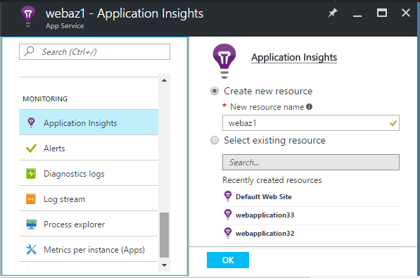
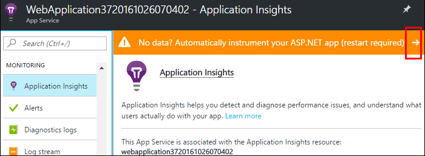
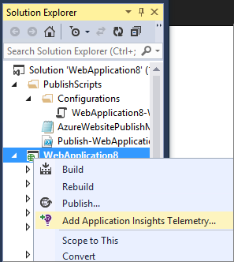
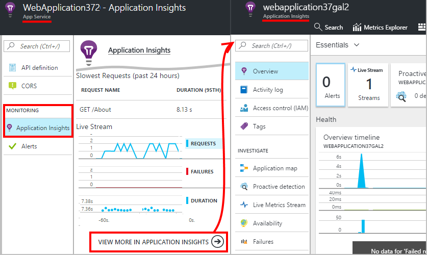
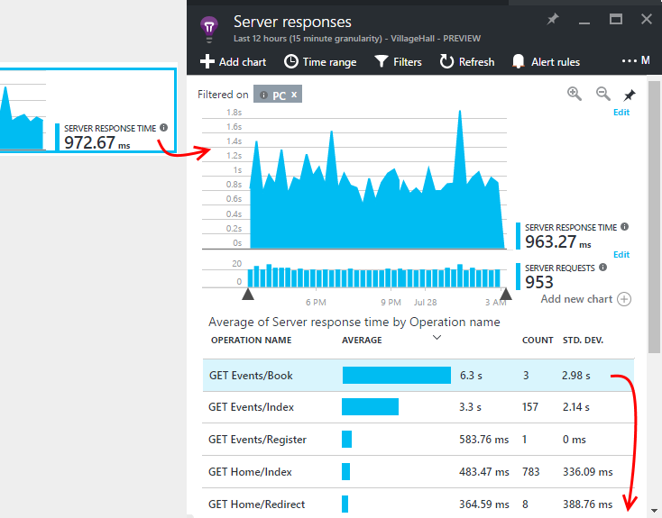
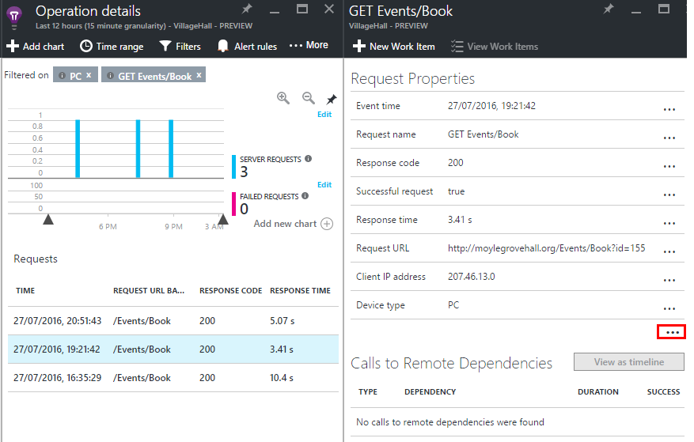

<properties
    pageTitle="Überwachen der Leistung von Azure Web app | Microsoft Azure"
    description="Leistung der Anwendung für die Überwachung von Azure Web apps. Erstellen eines Diagramms laden und die Antwort, Abhängigkeitsinformationen und Festlegen von Benachrichtigungen auf die Leistung aus."
    services="application-insights"
    documentationCenter=".net"
    authors="alancameronwills"
    manager="douge"/>

<tags
    ms.service="azure-portal"
    ms.workload="na"
    ms.tgt_pltfrm="na"
    ms.devlang="na"
    ms.topic="article"
    ms.date="10/24/2016"
    ms.author="awills"/>

# Überwachen der Leistung von Azure Web app

Im [Portal Azure](https://portal.azure.com) können Sie Performance-Überwachung für Ihre [Azure Web apps](../app-service-web/app-service-web-overview.md)-Anwendung einrichten. [Visual Studio-Anwendung Einsichten](app-insights-overview.md) instrumentiert Ihre app, um über deren Aktivitäten werden mit dem Dienst Anwendung Einsichten senden, wo es gespeichert und analysiert werden. Es, können metrischen Diagramme und Suchtools besser diagnostizieren Probleme, Verbessern der Leistung und Verwendung bewerten verwendet werden.

## Laufzeit oder Zeit erstellen

Sie können die Überwachung durch die app in zwei verschiedene Arten Instrumentieren konfigurieren:

* **Laufzeitfehler** : Sie können eine Erweiterung Wenn Web app bereits live ist zum Überwachen der Leistung auswählen. Es ist nicht erforderlich, neu erstellen oder die app erneut zu installieren. Sie erhalten einen Standardsatz von Paketen, die Reaktionszeiten, Erfolg Sätzen, Ausnahmen, Abhängigkeiten, usw. überwachen. 
 
* **Zeit erstellen** – Sie können ein Paket in Ihrer app in der Entwicklung installieren. Diese Option ist wesentlich flexibler. Zusätzlich zu den gleichen standard-Paketen können Sie den Code zum Anpassen der werden oder zum Senden Ihrer eigenen werden schreiben. Sie können bestimmte Aktivitäten oder Ereignisse aufzuzeichnen gemäß der Semantik Ihrer Domäne app abmelden. 

## Instrumentation Zeit mit der Anwendung Einsichten ausführen

Wenn Sie bereits über eine Web app in Azure ausführen, noch werden einige Überwachung: Anfrage und Fehler Sätzen. Anwendung Einsichten optimale, wie z. B. Reaktionszeiten hinzugefügt werden soll, für die Überwachung Anrufe an Abhängigkeiten, intelligente Erkennung und der leistungsfähige Analytics Abfragesprache. 

1. **Wählen Sie Anwendung Einsichten** in der Azure Systemsteuerung für Ihre Web app.

    

 * Wählen Sie zum Erstellen einer neuen Ressource, es sei denn, Sie bereits eine Anwendung Einsichten Ressource für diese app von einer anderen Routing eingerichtet.

2. **Urkunde Web app** nachdem Einsichten Anwendung installiert wurde. 

    

3. **Überwachen Ihrer app**.  [Expore die Daten](#explore-the-data).

Sie können später erstellen und die app mit Einsichten Anwendung erneut bereitstellen, wenn Sie möchten.

*Wie kann ich entfernen Anwendung Einsichten zu, oder wechseln Sie zu einer anderen Ressource senden?*

* Öffnen Sie in Azure die Web app Bibliothekssteuerungsblade und klicken Sie unter Tools Entwicklung **Erweiterungen**. Löschen Sie die Anwendung Einsichten Erweiterung ein. Klicken Sie dann unter Überwachung, wählen Sie die Anwendung Einsichten und erstellen Sie oder wählen Sie die gewünschte Ressource aus.

## Erstellen Sie die Anwendung Einsichten-app

Anwendung Einsichten können ausführlichere werden bereitstellen, indem Sie ein SDK in Ihre app installieren zu können. Insbesondere können Protokoll Spur speichern, [Schreiben von benutzerdefinierten werden](../application-insights/app-insights-api-custom-events-metrics.md), und erhalten ausführlichere Ausnahme Berichte.

1. **In Visual Studio** (2013 Update 2 oder höher), die Anwendung Einsichten SDK zum Projekt hinzufügen.

    

    Wenn Sie aufgefordert werden, melden Sie sich, verwenden Sie die Anmeldeinformationen für Ihr Konto Azure.

    Der Vorgang besteht aus zwei Effekte:

 1. Erstellt eine Anwendung Einsichten Ressource in Azure, wo werden gespeichert, analysiert und angezeigt wird.
 2. Fügt dem Code der Anwendung Einsichten NuGet-Paket hinzu, und konfiguriert, um werden, die der Ressource Azure senden.

2. **Testen der werden** , indem Sie die app in Ihrem Entwicklungscomputer (F5) ausführen.

3. **Veröffentlichen Sie die app** in Azure wie gewohnt. 

*Wie wechsle ich zu einer anderen Anwendung Einsichten Ressource senden?*

* In Visual Studio Maustaste auf das Projekt, und wählen Sie **Anwendung Einsichten > Konfigurieren** , und wählen Sie die Ressource. Sie erhalten die Option zum Erstellen einer neuen Ressource. Neu zu erstellen, und stellen Sie erneut bereit.

## Untersuchen der Daten

1. Finden Sie in der Anwendung Einsichten Blade von Ihrem Web app Control Panel, Live Kennzahlen, die in eine Sekunde oder zwei von ihnen Besprechungsanfragen und Fehlern anzeigt, auftreten. Es ist äußerst anzeigen, wenn Sie Ihre app veröffentlichen haben – Sie können Probleme sofort sehen.

2. Klicken Sie auf die vollständige Anwendung Einsichten Ressource durch.

    
    

    Sie können auch wechseln es entweder direkt aus Azure Ressource Navigation.

2. Klicken Sie auf, bis alle Diagramm, um weitere Details zu sehen:

    

    Sie können [Kennzahlen Blades anpassen](../application-insights/app-insights-metrics-explorer.md).

3. Klicken Sie auf durch, um einzelne Ereignisse finden Sie unter und ihre Eigenschaften:

    

    Beachten Sie die "..." verknüpfen, um alle Eigenschaften zu öffnen.

    Sie können [Suchbegriffe anpassen](../application-insights/app-insights-diagnostic-search.md).

Verwenden Sie für leistungsfähigeren Suchvorgänge über Ihre werden die [Analytics-Abfragesprache](../application-insights/app-insights-analytics-tour.md)aus.

## Nächste Schritte

* [Aktivieren von Azure-Diagnose](app-insights-azure-diagnostics.md) Anwendung Einsichten gesendet werden.
* [Kriterien für Monitor Service Systemzustand](../monitoring-and-diagnostics/insights-how-to-customize-monitoring.md) , um sicherzustellen, dass Ihr Dienst reagiert und verfügbar ist.
* [Empfangen-Benachrichtigung](../monitoring-and-diagnostics/insights-receive-alert-notifications.md) bei jedem Betrieb eintreten oder Kennzahlen cross einen Schwellenwert.
* Verwenden Sie [Anwendung Einsichten für JavaScript-apps und Webseiten](app-insights-web-track-usage.md) abzurufenden Client werden vom Browser aus, die eine Webseite besuchen.
* [Einrichten von Verfügbarkeit Webtests](app-insights-monitor-web-app-availability.md) auf gewarnt werden, wenn Ihre Website nach unten ist.
