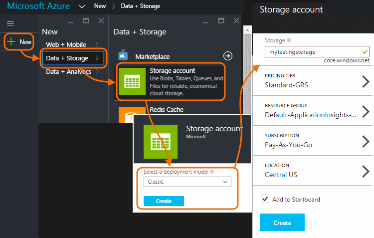

<properties 
    pageTitle="Exemplarische Vorgehensweise: Exportieren von werden in SQL-Datenbank aus Einblicken Anwendung" 
    description="Exportieren von kontinuierlich Anwendung Einsichten Daten zu SQL mithilfe von Stream Analytics." 
    services="application-insights" 
    documentationCenter=""
    authors="noamben" 
    manager="douge"/>

<tags 
    ms.service="application-insights" 
    ms.workload="tbd" 
    ms.tgt_pltfrm="ibiza" 
    ms.devlang="na" 
    ms.topic="article" 
    ms.date="03/06/2015" 
    ms.author="awills"/>
 
# <a name="walkthrough-export-to-sql-from-application-insights-using-stream-analytics"></a>Exemplarische Vorgehensweise: Exportieren von Anwendung Einsichten mit Stream Analytics nach SQL

In diesem Artikel zeigt, wie Sie Ihre Daten werden von [Visual Studio-Anwendung Einsichten] verschieben[ start] in eine SQL Azure-Datenbank mit [Fortlaufender exportieren] [ export] und [Azure Stream Analytics](https://azure.microsoft.com/services/stream-analytics/). 

Fortlaufender exportieren verschiebt die Daten werden in Azure-Speicher im JSON-Format. Wir analysieren der JSON-Objekte mit Azure Stream Analytics und Zeilen in einer Datenbanktabelle erstellen.

(Im Allgemeinen Weise fortlaufender Exportieren Ihrer eigenen Analysen der werden Ausführen Ihrer apps zu Anwendung Einsichten zu senden. Sie können in diesem Codebeispiel andere Dinge mit der exportierten werden, wie z. B. Aggregation von Daten anpassen.)

Wir beginnen mit der Annahme, dass die app bereits zu überwachen.


In diesem Beispiel wir mithilfe der Seite Ansichtsdaten, aber das gleiche Muster einfach in andere Datentypen wie benutzerdefinierte Ereignisse und Ausnahmen erweitert werden kann. 


## <a name="add-application-insights-to-your-application"></a>Hinzufügen der Anwendung Einsichten an Ihrer Anwendung


Erste Schritte:

1. [Einrichten von Anwendung Einsichten für Ihre Webseiten](app-insights-javascript.md). 

    (In diesem Beispiel befasse Verarbeitung Seite Ansichtsdaten aus den Clientbrowsern, jedoch könnten Sie auch einrichten Anwendung Einsichten für das serverseitige Ihre app [Java](app-insights-java-get-started.md) oder [ASP.NET](app-insights-asp-net.md) Prozess Anforderung, Abhängigkeit und andere Server werden.)


5. Veröffentlichen Sie Ihre app, und schauen Sie sich werden Daten in Ihrer Anwendung Einsichten Ressource angezeigt werden.


## <a name="create-storage-in-azure"></a>Erstellen von Speicher in Azure

Fortlaufender exportieren gibt Daten mit einer Firma Azure-Speicher immer aus, sodass Sie zuerst die Speicherung erstellen müssen.

1. Erstellen Sie ein Speicherkonto in Ihr Abonnement im [Portal Azure][portal].

    

2. Erstellen eines Containers

    

3. Kopieren Sie die Zugriffstaste Speicher

    Sie benötigen es bald So richten Sie die Eingabe für den Stream Analytics-Dienst ein.

    

## <a name="start-continuous-export-to-azure-storage"></a>Fortlaufender in Azure-Speicher exportieren starten

1. Navigieren Sie zu der Anwendung Einsichten Ressource, die Sie für eine Anwendung erstellt haben, im Azure-Portal.

    

2. Erstellen Sie eine fortlaufende exportieren.

    


    Wählen Sie das Speicherkonto, die, das Sie zuvor erstellt haben:

    
    
    Legen Sie die Ereignis Dateitypen, die angezeigt werden sollen:

    


3. Zulassen, dass einige Daten zu sammeln. Befinden sich wieder aus, und lassen Sie Personen, die Anwendung für eine Weile verwendet werden. Nützlich sein werden sollen, und sehen Sie statistische Diagramme in [metrischen Explorer](app-insights-metrics-explorer.md) und einzelne Ereignisse in [diagnostic suchen](app-insights-diagnostic-search.md). 

    Und außerdem die Daten zu Ihrem Storage exportiert. 

4. Prüfen Sie die exportierten Daten, entweder im Portal - wählen Sie **Durchsuchen**, wählen Sie Ihr Speicherkonto, und klicken Sie dann **Container** - oder in Visual Studio. Wählen Sie in Visual Studio **Anzeigen / Cloud Explorer**, und öffnen Sie Azure / Speicher. (Wenn Sie diese Menüoption besitzen, müssen Sie das Azure SDK installieren: Öffnen Sie im Dialogfeld Neues Projekt und C#- / Cloud / Microsoft Azure SDK für .NET erhalten.)

    

    Notieren Sie den allgemeinen Teil der Pfadnamen, die von Namen und Instrumentation Anwendungstaste abgeleitet wird. 

Der Ereignisse in Dateien im JSON-Format BLOB-geschrieben. Jede Datei kann ein oder mehrere Ereignisse enthalten. Daher möchten wir die Ereignisdaten lesen und die Felder, die später herausfiltern. Es werden alle Arten von Dinge, die wir die Daten gebotenen konnte, aber unsere Plan heute besteht darin, Stream Analytics verwenden, um die Daten in einer SQL-Datenbank verschieben. Die werden zahlreiche interessante Abfragen ausführen erleichtern.

## <a name="create-an-azure-sql-database"></a>Erstellen einer SQL Azure-Datenbank

Aus Ihrem Abonnement [Azure]-Portal erneut starten[portal], erstellen Sie die Datenbank (und einen neuen Server, es sei denn, Sie bereits eingerichtet habe) die die Daten geschrieben werden.


Stellen Sie sicher, dass der Datenbankserver Zugriff auf Dienste Azure zulässt:


## <a name="create-a-table-in-azure-sql-db"></a>Erstellen einer Tabelle in der Azure SQL-Datenbank

Verbinden Sie mit der Datenbank, die im vorherigen Abschnitt mit Ihrem bevorzugten Verwaltungstool erstellt. In dieser Anleitung werden [SQL Server-Verwaltungstools](https://msdn.microsoft.com/ms174173.aspx) (SSMS) verwenden.


Erstellt eine neue Abfrage, und führen Sie folgende T-SQL-Anweisung:

```SQL

CREATE TABLE [dbo].[PageViewsTable](
    [pageName] [nvarchar](max) NOT NULL,
    [viewCount] [int] NOT NULL,
    [url] [nvarchar](max) NULL,
    [urlDataPort] [int] NULL,
    [urlDataprotocol] [nvarchar](50) NULL,
    [urlDataHost] [nvarchar](50) NULL,
    [urlDataBase] [nvarchar](50) NULL,
    [urlDataHashTag] [nvarchar](max) NULL,
    [eventTime] [datetime] NOT NULL,
    [isSynthetic] [nvarchar](50) NULL,
    [deviceId] [nvarchar](50) NULL,
    [deviceType] [nvarchar](50) NULL,
    [os] [nvarchar](50) NULL,
    [osVersion] [nvarchar](50) NULL,
    [locale] [nvarchar](50) NULL,
    [userAgent] [nvarchar](max) NULL,
    [browser] [nvarchar](50) NULL,
    [browserVersion] [nvarchar](50) NULL,
    [screenResolution] [nvarchar](50) NULL,
    [sessionId] [nvarchar](max) NULL,
    [sessionIsFirst] [nvarchar](50) NULL,
    [clientIp] [nvarchar](50) NULL,
    [continent] [nvarchar](50) NULL,
    [country] [nvarchar](50) NULL,
    [province] [nvarchar](50) NULL,
    [city] [nvarchar](50) NULL
)

CREATE CLUSTERED INDEX [pvTblIdx] ON [dbo].[PageViewsTable]
(
    [eventTime] ASC
)WITH (PAD_INDEX = OFF, STATISTICS_NORECOMPUTE = OFF, SORT_IN_TEMPDB = OFF, DROP_EXISTING = OFF, ONLINE = OFF, ALLOW_ROW_LOCKS = ON, ALLOW_PAGE_LOCKS = ON)

```


In diesem Beispiel verwenden wir die Daten aus der Seitenansichten. Um die anderen verfügbaren Daten anzuzeigen, prüfen Sie die JSON-Ausgabe, und finden Sie unter dem [Datenmodell exportieren](app-insights-export-data-model.md).

## <a name="create-an-azure-stream-analytics-instance"></a>Erstellen Sie eine Instanz Azure Stream Analytics

Wählen Sie aus dem [Klassischen Azure-Portal](https://manage.windowsazure.com/)den Dienst Azure Stream Analytics, und erstellen Sie einen neuen Stream Analytics Auftrag:


Wenn das neue Projekt erstellt wird, erweitern Sie seine Details:


#### <a name="set-blob-location"></a>Blob-Standort festlegen

Legen Sie es aus Ihrer fortlaufender exportieren Blob Eingabewerte durchführen:


Jetzt benötigen die Access-Primärschlüssel aus Ihrem Konto Speicherplatz Sie, den Sie zuvor notiert haben. Setzen Sie diese als Speicherschlüssel-Konto ein.


#### <a name="set-path-prefix-pattern"></a>Set Pfad Präfixmuster 


Achten Sie darauf, um das Datumsformat auf **JJJJ / MM / TT** (mit **Striche**) festzulegen.

Der Pfad Präfix Muster gibt an, wie Stream Analytics die Eingabewerte Dateien im Speicher findet. Sie müssen auf entsprechen wie die Daten fortlaufender Exportieren speichert festlegen. Legen Sie ihn wie folgt aus:

    webapplication27_12345678123412341234123456789abcdef0/PageViews/{date}/{time}

In diesem Beispiel:

* `webapplication27`ist der Name der Anwendung Einsichten Ressource, **Alle Kleinbuchstaben**. 
* `1234...`ist der Schlüssel Instrumentation von der Anwendung Einsichten Ressource **mit Striche entfernt**. 
* `PageViews`ist der Typ der Daten, die wir analysieren möchten. Die verfügbaren Typen abhängig von der Filter, die, den Sie in fortlaufender exportieren festlegen. Prüfen Sie die exportierten Daten aus, um die anderen verfügbaren Typen anzuzeigen, und finden Sie unter dem [Datenmodell exportieren](app-insights-export-data-model.md).
* `/{date}/{time}`ein Muster wird Literal geschrieben werden.

Um den Namen und die iKey der Ressource Anwendung Einsichten zu gelangen, öffnen Sie auf der Übersichtsseite Essentials oder öffnen Sie Einstellungen zu.

#### <a name="finish-initial-setup"></a>Ende der ersten Einrichtung

Bestätigen Sie das Format ein:


Schließen Sie den Assistenten, und warten Sie, bis das Setup abgeschlossen.

>[AZURE.TIP] Verwenden Sie die Sample-Funktion zu um überprüfen, ob Sie den Eingabewerte Pfad ordnungsgemäß festgelegt haben. Wenn sie fehlschlägt: Überprüfen Sie, dass Daten im Speicher für die Stichprobe Zeitraums, die Sie ausgewählt haben. Bearbeiten der Definition für der Eingaben, und überprüfen Sie im Speicher-Konto, Pfadpräfix festlegen und Datumsformat ordnungsgemäß.

## <a name="set-query"></a>Abfrage festlegen

Abschnitt ' Abfrage ' zu öffnen:


Ersetzen Sie die Standardabfrage mit:

```SQL

    SELECT flat.ArrayValue.name as pageName
    , flat.ArrayValue.count as viewCount
    , flat.ArrayValue.url as url
    , flat.ArrayValue.urlData.port as urlDataPort
    , flat.ArrayValue.urlData.protocol as urlDataprotocol
    , flat.ArrayValue.urlData.host as urlDataHost
    , flat.ArrayValue.urlData.base as urlDataBase
    , flat.ArrayValue.urlData.hashTag as urlDataHashTag
      ,A.context.data.eventTime as eventTime
      ,A.context.data.isSynthetic as isSynthetic
      ,A.context.device.id as deviceId
      ,A.context.device.type as deviceType
      ,A.context.device.os as os
      ,A.context.device.osVersion as osVersion
      ,A.context.device.locale as locale
      ,A.context.device.userAgent as userAgent
      ,A.context.device.browser as browser
      ,A.context.device.browserVersion as browserVersion
      ,A.context.device.screenResolution.value as screenResolution
      ,A.context.session.id as sessionId
      ,A.context.session.isFirst as sessionIsFirst
      ,A.context.location.clientip as clientIp
      ,A.context.location.continent as continent
      ,A.context.location.country as country
      ,A.context.location.province as province
      ,A.context.location.city as city
    INTO
      AIOutput
    FROM AIinput A
    CROSS APPLY GetElements(A.[view]) as flat


```

Beachten Sie, dass die ersten einige Eigenschaften für Seite Ansicht Data spezifisch sind. Exporte anderer werden Typen haben andere Eigenschaften. Finden Sie unter der [detaillierte Datenmodell Referenz für die Eigenschaftentypen und Werte.](app-insights-export-data-model.md)

## <a name="set-up-output-to-database"></a>Einrichten von Ausgabe in der Datenbank

Wählen Sie SQL als die Ausgabe an.


Geben Sie die SQL-Datenbank.


Schließen Sie den Assistenten, und Warten auf eine Benachrichtigung, die die Ausgabe eingerichtet wurde.

## <a name="start-processing"></a>Verarbeitung starten

Starten Sie den Auftrag auf der Aktionsleiste


Sie können auswählen, ob Verarbeitung der Daten, beginnend von jetzt oder zunächst früheren Daten beginnen. Letztere ist sinnvoll, wenn Sie fortlaufender exportieren bereits eine Weile ausgeführt haben.


Kehren Sie nach ein paar Minuten zum SQL Server-Verwaltungstools, und schauen Sie sich die Daten in parallelen. Verwenden Sie beispielsweise eine Abfrage wie folgt aus:

    SELECT TOP 100 *
    FROM [dbo].[PageViewsTable]


## <a name="related-articles"></a>Verwandte Artikel

* [Exportieren Sie in eine Worker-Rolle mit SQL](app-insights-code-sample-export-telemetry-sql-database.md)
* [Exportieren Sie nach PowerBI Stream Analytics verwenden](app-insights-export-power-bi.md)
* [Ausführliche Datenmodell Referenz für die Eigenschaftentypen und Werte.](app-insights-export-data-model.md)
* [Fortlaufender exportieren in Anwendung Einsichten](app-insights-export-telemetry.md)
* [Anwendung Einsichten](https://azure.microsoft.com/services/application-insights/)

<!--Link references-->

[diagnostic]: app-insights-diagnostic-search.md
[export]: app-insights-export-telemetry.md
[metrics]: app-insights-metrics-explorer.md
[portal]: http://portal.azure.com/
[start]: app-insights-overview.md

 