<properties
    pageTitle="Dashboards und Navigation im Portal Anwendung Einsichten | Microsoft Azure"
    description="Erstellen von Ansichten Key APM Diagramme und Abfragen."
    services="application-insights"
    documentationCenter=""
    authors="alancameronwills"
    manager="douge"/>

<tags
    ms.service="application-insights"
    ms.workload="tbd"
    ms.tgt_pltfrm="ibiza"
    ms.devlang="multiple"
    ms.topic="article" 
    ms.date="10/18/2016"
    ms.author="awills"/>

# Navigation und Dashboards im Portal Anwendung Einsichten

Nachdem Sie die [Anwendung Einsichten an Ihrem Projekt eingerichtet](app-insights-overview.md)haben, erscheinen werden Daten über die Leistung und die Verwendung Ihrer app auf Ihres Projekts Anwendung Einsichten Ressource im [Azure-Portal](https://portal.azure.com)aus.

## Suchen nach Ihrer werden

Melden Sie sich bei der [Azure-Portal](https://portal.azure.com) an, und navigieren Sie zu der Anwendung Einsichten Ressource, die Sie für Ihre app erstellt haben.

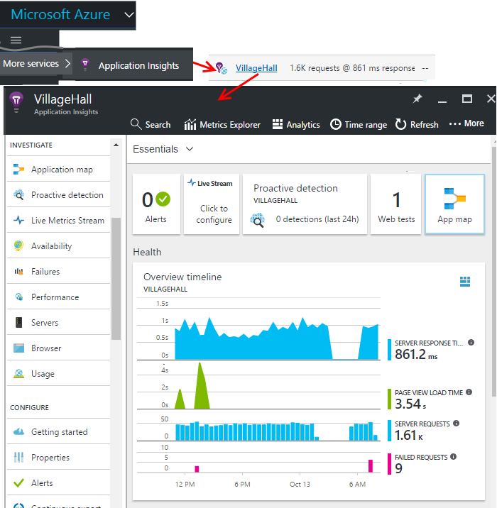

Übersicht über Blades (Seite) für Ihre app enthält eine Übersicht über die wichtigen diagnostic Kriterien der app, und ist ein Gateway an den anderen Features des Portals.

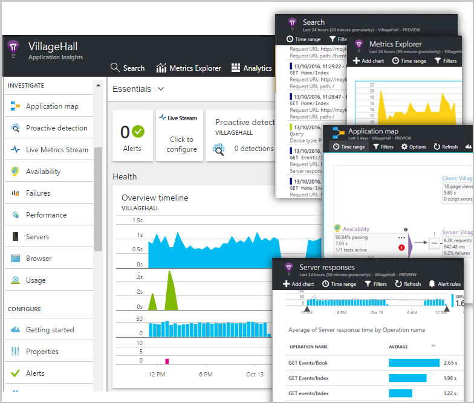

Können Sie eine der anderen Diagrammen anpassen und einem Dashboard zu fixieren. Auf diese Weise können Sie die Taste Diagramme aus anderen apps zusammenführen.

## Dashboards

Erstes, die angezeigt werden, nachdem Sie sich mit dem [Microsoft Azure-Portal](https://portal.azure.com) angemeldet, ist ein Dashboard. Hier können Sie die Diagramme zusammenführen, die Sie über alle Ihre Azure Ressourcen, einschließlich werden von [Visual Studio-Anwendung Einsichten](app-insights-overview.md)besonders wichtig sind.
 

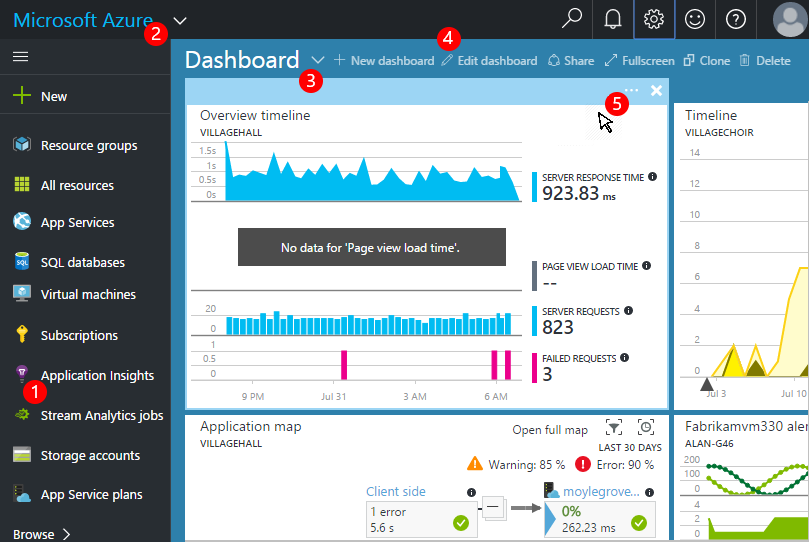

1. **Navigieren zu bestimmten Ressourcen** wie Ihre app in der Anwendung Einsichten: Verwenden Sie die linke Balken.
2. **Zurück zum aktuellen Dashboards**, oder wechseln zu anderen zuletzt verwendete Ansichten: Verwenden Sie oben links im Dropdown-Menü.
3. **Switch-Dashboards**: Verwenden Sie im Dropdown-Menü auf den Titel des Dashboards
4. **Erstellen, bearbeiten, und Teilen Dashboards** in Dashboardsymbolleiste.
5. **Bearbeiten das Dashboard**: Zeigen Sie auf einer Kachel und dann mithilfe den oberen Leiste verschieben, anpassen oder entfernen es.

## Fügen zu einem Dashboard hinzu

Wenn Sie bei einer Blade oder einen Satz von Diagrammen, besonders interessant ist, gefunden haben, können Sie eine Kopie der auf dem Dashboard anheften. Sie sehen es beim nächsten Sie es erneut.

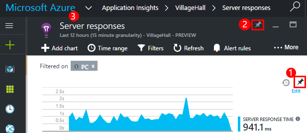

1. PIN-Diagramm auf Dashboard. Auf dem Dashboard wird eine Kopie des Diagramms angezeigt.
2. Das gesamte Blade mit dem Dashboard anheften – es wird auf dem Dashboard als Kachel, der durch Klicken können.
3. Klicken Sie auf der oberen linken Ecke, um dem aktuellen Dashboard zurückzukehren. Klicken Sie im Dropdown-Menü können Sie dann zur aktuellen Ansicht zurückzukehren.

Beachten Sie, dass Diagramme in Kacheln gruppiert sind: eine Kachel kann mehr als ein Diagramm enthalten. Die gesamte Kachel zum Dashboard angeheftet werden.

### Anheften von Abfragen in Analytics

Sie können auch die [Pin Analytics](app-insights-analytics-using.md#pin-to-dashboard) Diagramme zu einem [freigegebenen](#share-dashboards-with-your-team) Dashboard. So können Sie Diagramme von beliebigen Abfragen entlang der standard Kennzahlen hinzufügen. (Es eine Gebühr für dieses Feature ist.)

## Anpassen einer Kachel auf dem dashboard

Sobald eine Kachel auf dem Dashboard ist, können Sie ihn anpassen.

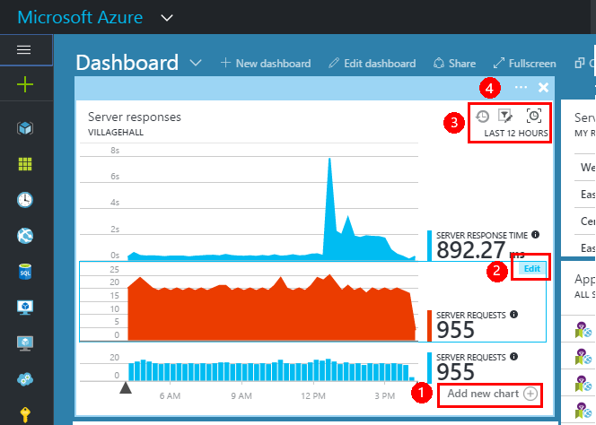

1. Hinzufügen eines Diagramms zu der Kachel. 
2. Festlegen von Metrisch, Gruppieren nach Dimension und Formatvorlage eines Diagramms (Table, Graph).
3. Ziehen Sie über das Diagramm zu vergrößern. Klicken Sie auf die Schaltfläche Rückgängig, um die Zeitspanne zurückzusetzen. Festlegen von Eigenschaften für die Diagramme auf die Kachel filtern.
4. Legen Sie die Kachel Titel.

Kacheln von metrischen Explorer Blades angeheftet haben mehr Bearbeitungsoptionen als Kacheln angehefteten aus einer Übersicht Blade.

Die Bearbeitung wirkt sich nicht auf die ursprüngliche Kachel aus, der Sie angeheftet aus.

## Wechseln zwischen dashboards

Sie können mehr als ein Dashboard speichern und zwischen ihnen wechseln. Wenn Sie ein Diagramm oder eine Blade anheften, sind die aktuellen Dashboard hinzugefügt werden.

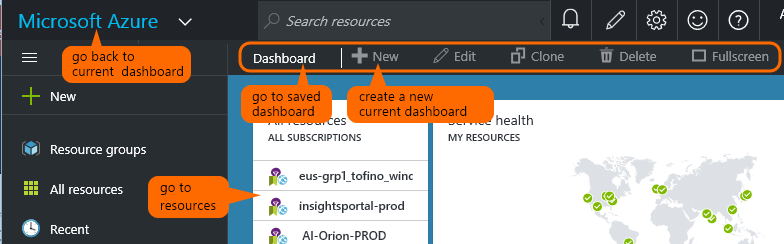

Angenommen, haben Sie ein Dashboard für die Anzeige im Vollbildmodus in den Raum Team und eine andere zur allgemeinen Entwicklung.

Auf dem Dashboard, wird eine Blade als Kachel: Klicken Sie darauf, um das Blade zu gelangen. Ein Diagramm repliziert das Diagramm an seiner ursprünglichen Position.

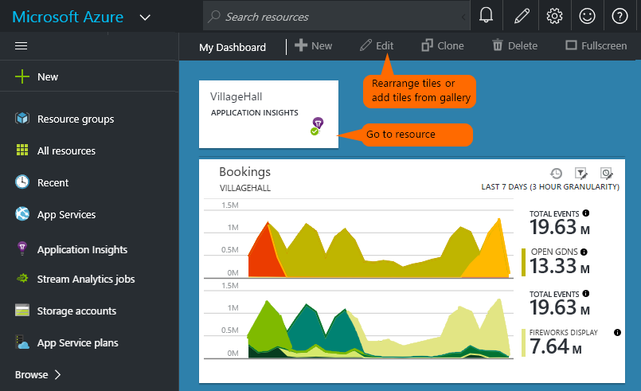

## Freigeben des dashboards

Wenn Sie ein Dashboard erstellt haben, können Sie es für andere Benutzer freigeben.

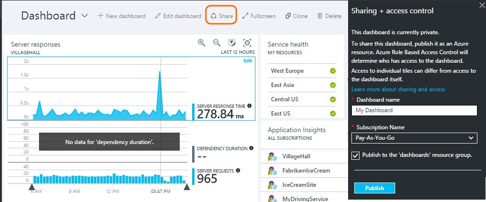

Informationen Sie zu [Rollen und Access-Steuerelement](app-insights-resources-roles-access-control.md).

## App-navigation

Das Blade Übersicht ist das Gateway zu weiteren Informationen über Ihre app.

* **Alle Diagramm oder die Kachel** – klicken Sie auf eine Kachel oder Diagramm, um weitere Details zu was es anzeigt anzuzeigen.

### Übersicht über Blade-Schaltflächen

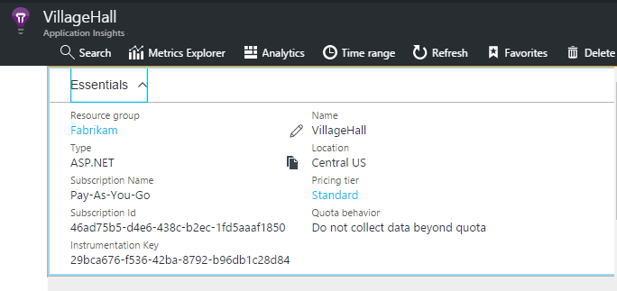

* [**Kennzahlen Explorer**](app-insights-metrics-explorer.md) - Erstellen eigener der Leistung und die Verwendung von Diagrammen.
* [**Search**](app-insights-diagnostic-search.md) - Untersuchen von bestimmter Instanzen von Ereignisse wie Besprechungsanfragen, Ausnahmen, oder melden Sie sich auf.
* [**Analytics**](app-insights-analytics.md) - leistungsfähige Abfragen über Ihre werden.
* **Zeitraums** - Bereich angezeigt, indem Sie alle Diagramme auf das Blade anpassen.
* **Löschen** : Löschen der Anwendung Einsichten Ressource für diese app. Sie sollten auch entweder entfernen die Anwendung Einsichten Pakete aus dem app-Code oder die [Taste Instrumentation](app-insights-create-new-resource.md#copy-the-instrumentation-key) in Ihre app zu einer anderen Anwendung Einsichten Ressource werden direkte Bearbeiten.

### Registerkarte Grundlagen

* [Instrumentation Key](app-insights-create-new-resource.md#copy-the-instrumentation-key) - kennzeichnet diese app-Ressource. 
* Preisgestaltung - stellen Features zur Verfügung und festlegen Lautstärke Feststelltaste.

### App-Navigationsleiste

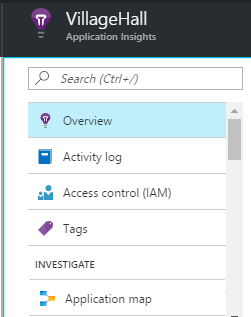

* **Übersicht über** - zurück zur Blade app-Übersicht.
* **Aktivität Log** - Benachrichtigungen und Azure administrative Ereignisse.
* [**Access Control**](app-insights-resources-roles-access-control.md) - Access für Teammitglieder und andere bereitstellen.
* [**Kategorien**](../resource-group-using-tags.md) – Verwenden von Kategorien, um Ihre app mit anderen Personen zu gruppieren.

ERMITTELN

* [**Anwendung Karte**](app-insights-app-map.md) - aktiven Karte mit den Komponenten der Anwendung, abgeleitet von der Abhängigkeitsinformationen.
* [**Proaktive Diagnose**](app-insights-proactive-diagnostics.md) - überprüfen zuletzt verwendete Leistung Benachrichtigungen.
* [**Live-Streams**](app-insights-metrics-explorer.md#live-stream) - eine feste Satz von nahezu sofortige Kennzahlen, nützlich, wenn Sie einen neuen Build bereitstellen oder Debuggen.
* [**Verfügbarkeit / Web Tests**](app-insights-monitor-web-app-availability.md) -senden reguläre Anfragen an Ihre Web-app aus, um die entwickelt 
* [**Fehler, Performance**](app-insights-web-monitor-performance.md) - Ausnahmen, Fehler Sätzen und Reaktionszeiten für Anfragen zu Ihrer Anwendung und Anfragen Ihre app zu [Abhängigkeiten](app-insights-asp-net-dependencies.md).
* [**Leistung**](app-insights-web-monitor-performance.md) - Antwortzeit, Abhängigkeit Reaktionszeiten. 
* [Server](app-insights-web-monitor-performance.md) - Datenquellen. Verfügbar, wenn Sie [Status Monitor installieren](app-insights-monitor-performance-live-website-now.md).

* **Browser** - Seitenansicht und AJAX Leistung. Verfügbar, wenn Sie [Ihren Webseiten Instrumentieren](app-insights-javascript.md).
* **Verwendung** - Ansicht, Benutzer- und Sitzung Seite ermittelt. Verfügbar, wenn Sie [Ihren Webseiten Instrumentieren](app-insights-javascript.md).

KONFIGURIEREN

* **Erste Schritte** - Inline-Lernprogramm.
* **Eigenschaften** - Taste Instrumentation, Abonnement und Ressourcen-Id.
* [Benachrichtigungen](app-insights-alerts.md) - metrischen alert Konfiguration.
* [Exportieren von fortlaufend](app-insights-export-telemetry.md) - Konfigurieren des Exports von werden in Azure-Speicher.
* [Testen der Leistung](app-insights-monitor-web-app-availability.md#performance-tests) - richten Sie eine synthetische Last auf Ihrer Website.
* [Speicherkontingent und Preise](app-insights-pricing.md) und [Aufnahme werden](app-insights-sampling.md).
* **API Access** - [lassen Sie wieder los Anmerkungen](app-insights-annotations.md) erstellen und für die Daten-Access-API.
* [**Work Items**](app-insights-diagnostic-search.md#create-work-item) - Verbinden mit einer geschäftlichen Nachverfolgen von System, damit Sie Fehler beim verborgenen werden erstellen können.

Einstellungen

* [**Sperrt**](..\resource-group-lock-resources.md) - Azure Ressourcen Sperren
* [**Automatisierungsskript**](app-insights-powershell.md) - Definition der Azure Ressource exportiert werden, dass Sie es als Vorlage verwenden können, um neue Ressourcen zu erstellen.

SUPPORT

* **Supportanfrage** - erfordert ein kostenpflichtiges Abonnement. Siehe auch: [Anzeigen der Hilfe](app-insights-get-dev-support.md).

## Wie geht's weiter?

||
|---|---
|[Kennzahlen explorer](app-insights-metrics-explorer.md) Filtern und Segment Kennzahlen|
|[Diagnose suchen](app-insights-diagnostic-search.md) Suchen nach und Ereignisse, verwandten Ereignisse prüfen und Erstellen von Fehlern |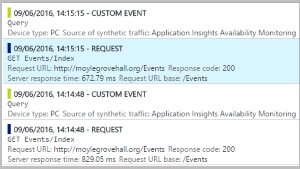
|[Analytics](app-insights-analytics.md) Leistungsfähige Abfragesprache| 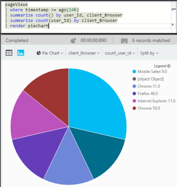

