<properties
    pageTitle="Erkennen, Sichten, diagnostizieren"
    description="Analyse stürzt ab und zu erkennen und zu diagnostizieren Leistungsprobleme in Ihrer Anwendung"
    authors="alancameronwills"
    services="application-insights"
    documentationCenter=""
    manager="douge"/>

<tags
    ms.service="application-insights"
    ms.workload="tbd"
    ms.tgt_pltfrm="ibiza"
    ms.devlang="na"
    ms.topic="article" 
    ms.date="11/06/2015"
    ms.author="awills"/>

# Erkennen, zu Sichten und mit der Anwendung Einsichten diagnostizieren

*Anwendung Einsichten ist in der Vorschau.*

Anwendung Einsichten können Sie herausfinden, wie Ihre app ausführt, und verwendet wird, wenn diese aktiv ist. Und wenn ein Problem vorliegt, können Sie kennen, können Sie die Auswirkung beurteilen und können Sie ermitteln, dass die Ursache.

So sieht ein Konto aus einem Team, die entwickelt Webanwendungen aus:

* *"Ein paar Tage zurück, bereitgestellt wir ein Update 'Nebenversion'. Wir haben eine umfassende Testlaufs ausführen, aber leider einige unerwartete Änderung in der gefährliche Fracht, die bewirken, dass Inkompatibilität zwischen der Vorder- und Back-End eingefügt haben. Sofort, Serverausnahmen surged, unsere Warnung ausgelöst, und wir wurden die Situation aufmerksam gemacht. Wenigen Klicks abwesend auf das Portal Anwendung Einsichten erhielten wir genügend Informationen aus Ausnahme Aufruflisten, um das Problem zu beschränken. Wir sofort rückgängig gemacht und den Schaden eingeschränkt. Anwendung Einsichten hat dieses Teil der Devops durchlaufen sehr einfach und einige."*

Sehen wir uns an, wie ein Webdienst Entwicklungsteam Anwendung Einsichten wird verwendet, um Leistung zu überwachen. Wir werden das Team in Fabrikam Bank folgen, die die hervorragende (OBS) entwickelt.

Das Team arbeitet auf einem Kreis wie folgt:

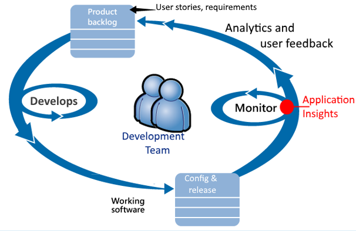

Anforderungen-feed in deren Entwicklung Rückstand (Aufgabenliste). Kurz gesagt funktionieren sie Sprints, die häufig arbeiten Software – normalerweise in Form von Verbesserungen und Erweiterungen mit der vorhandenen Anwendung bieten. Die live-app wird regelmäßig mit neuen Features aktualisiert. Es zwar live, von der Teamwebsite für die Leistung und die Verwendung mit Hilfe der Anwendung Einsichten überwacht. Diese Analyse feeds wieder in die Entwicklung Rückstand.

Das Team verwendet Anwendung Einsichten um zu eng für die live-Web-Anwendung zu überwachen:
* Optimale Leistung. Benutzer möchten zu verstehen, wie Reaktionszeiten mit Anforderung zählen variieren; wie viel CPU, Netzwerk, Datenträger und anderen Ressourcen verwendet werden. und wo die Engpässe sind.
* Fehler beim Überprüfen. Wenn es gibt einige Ausnahmen oder Fehler bei Besprechungsanfragen, oder wenn ein Performance-Zähler außerhalb des Bereichs bequeme geht, muss das Team schnell wissen, dass diese Aktion ausführen können.
* Verwendung. Immer, wenn ein neues Feature freigegeben ist, möchten das Team wissen, in welchem Umfang es verwendet wird und ob Benutzer Probleme mit haben.

Lassen Sie uns Fokussierung auf das Webpart Feedback des Zyklus:

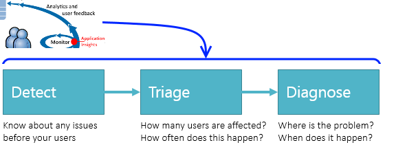

## Erkennen von beeinträchtigt Verfügbarkeit

Marcela Markova ist ein erfahrener Entwickler im Team OBS und Leads auf Überwachung online Leistung akzeptiert. Anna richtet verschiedene [Webtests][availability]:

* Ein einzelnes-URL-Test für die Hauptseite für die app http://fabrikambank.com/onlinebanking/. Anna festgelegt Kriterien von HTTP-Code 200 und Text "Willkommen!". Wenn dieser Test fehlschlägt, ist fehlerhaft sehr ernst mit dem Netzwerk oder den Servern oder vielleicht eines Problems bei der Bereitstellung. (Oder eine andere Person hat sich geändert, das Willkommen! Nachricht auf der Seite, ohne dass ihr wissen sollten).

* Ein tieferen mit mehreren Schritten Test, die Anmeldung und einem laufenden Konto auflisten, aktivieren einige wichtige Details auf jeder Seite erhält. Dieser Test überprüft, ob die Verknüpfung mit der Kontendatenbank arbeitet. Anna verwendet eine fiktiven Kunden-Id: einige davon Testzwecken verwaltet werden.

Mit dieser Tests einrichten ist ein Marcela sicher, dass das Team alle Ausfall schnell kennen werden.  

Fehler als rote Punkte im Web Test-Diagramm angezeigt:

Aber wichtiger ist, eine Benachrichtigung über einen beliebigen Fehler wird als e-Mail an das Entwicklungsteam. Auf diese Weise wissen sie dagegen vor fast alle Kunden.

## Monitor Leistungswerte

Auf der Übersichtsseite in Anwendung Einsichten vorhanden ist ein Diagramm, eine Vielzahl von [wichtigen Kriterien]angezeigt[perf].

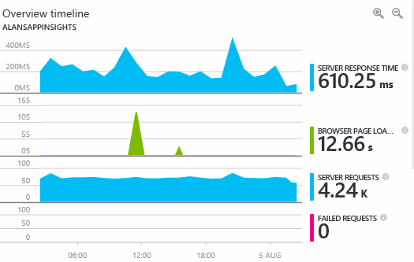

Browser Seite laden Zeit wird abgeleitet wird direkt von Webseiten gesendet werden. Server Antwortzeit, Server Anforderung zählen und fehlgeschlagene Anforderung zählen werden alle gemessen in dem Webserver gesendet und Einblicken Anwendung von dort aus.

Marcela ist etwas betreffenden mit auf dem Server Antwort Graph an, die die durchschnittliche Zeit zwischen anzeigt, wenn der Server eine HTTP-Anforderung erhält aus dem Browser eines Benutzers, oder wenn sie die Antwort zurückgegeben wird. Wird nicht ungewöhnliche eine Variation in diesem Diagramm sehen, wie dies variierende Auslastung des Systems. Aber in diesem Fall scheint es, dass eine Beziehung zwischen small an, in die Anzahl von Anforderungen, und Groß in der Antwortzeit überschreitet. Mit konnte darauf hinzuweisen, dass das System einfach auf die Grenzwerte betrieben wird. 

Sie öffnet die Diagramme Servern:

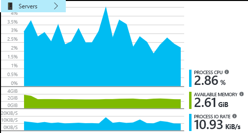

Es scheint ohne Vorzeichen Ressource Einschränkung vorhanden, werden möglicherweise die Systeme die Server Antwort Diagramme nur eine zufällig sind.

## Benachrichtigungen

Dennoch, möchte sie die Reaktionszeiten im Blick. Wenn sie wechseln Sie zu hoch, möchte sie sie sofort kennen.

Damit Anna eine [Benachrichtigungen]legt[metrics], für einen überschreitet typische Reaktionszeiten. Dadurch werden ihre KONFIDENZ, die Anna dagegen wissen, ob Reaktionszeiten langsam ausgeführt werden.

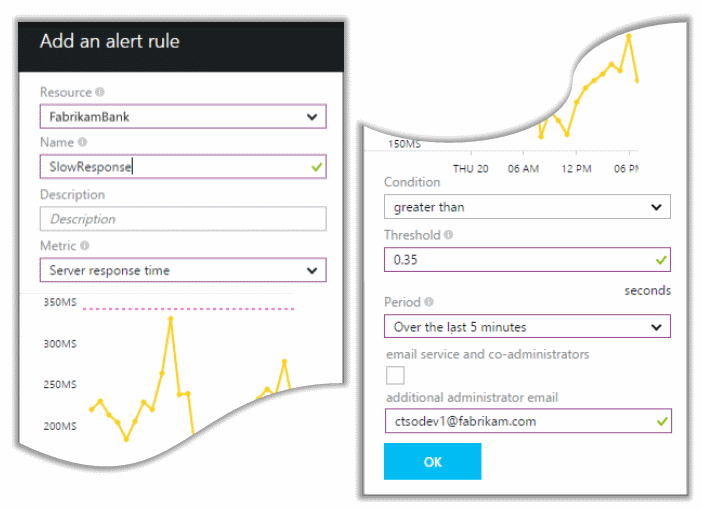

Benachrichtigungen können auf eine Vielzahl von anderen Kennzahlen festgelegt werden. Beispielsweise können Sie e-Mails erhalten, wenn die Anzahl der Ausnahme nicht mehr hoch, oder der verfügbare Arbeitsspeicher wechselt niedrig, oder ist es eine Höchstwert im Client-Anfragen.

## Proaktive Diagnose Benachrichtigungen

Nächsten Tag, eine e-Mail-Warnung von Anwendung Einsichten eingehen. Aber wenn Anna die geöffnet wird, nicht Anna findet die Antwort Zeit Benachrichtigung, die Anna festgelegt ist. Stattdessen wird es sich, dass eine fehlgeschlagene Anfragen - d. h., Besprechungsanfragen, die von mindestens 500 Fehlercodes zurückversetzt sind plötzlich zunehmenden wurde.

Fehler beim Anfragen sind, in dem Benutzer einen Fehler - folgen in der Regel eine Ausnahme im Code gesehen haben. Vielleicht eine Nachricht angezeigt sagen Sie "Leider konnten nicht wir Ihre Daten jetzt aktualisieren" oder bei Absolute Weise Anstoß erregende schlechtesten, ein Stapelabbild auf den Bildschirm des Benutzers, mit freundlicher Genehmigung der Webserver.

Diese Warnung ist Sicht plötzlich, da es sich bei dem letzten Mal, das Anna besprochen, die Anzahl der fehlgeschlagene Anforderung encouragingly niedrig wurde. Eine kleine Anzahl von Fehlern ist zu rechnen in Server überlastet ist. 

Es wurde auch ein bisschen Sicht plötzlich für sich da Anna installiert hatten, um diese Warnung zu konfigurieren. Tatsächlich im Lieferumfang proaktive Diagnose automatisch Anwendung Einsichten. Automatisch angepasst wird, um Ihre app Deutsch Fehler Muster und Fehlern "wird verwendet" auf eine bestimmte Seite oder hoher Auslastung oder andere Metrisch verknüpft. Es können nur dann, wenn ein Anlass über was es geht zu erwarten löst die Erinnerung aus.

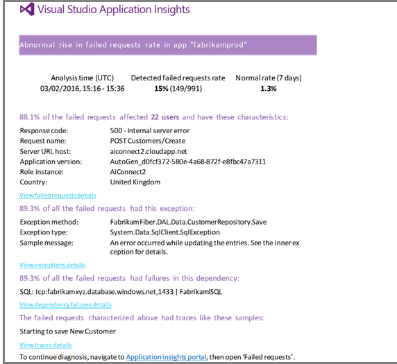

Hierbei handelt es sich um eine äußerst e-Mail. Es wird nicht nur eine Erinnerung auslösen. Es werden viele der Auswahl beschränkt und diagnostic Arbeit.

Es wird aufgezeigt, wie viele Kunden betroffen sind, und welche Webseiten oder Vorgänge. Marcela kann entscheiden, ob Anna das ganze Team arbeiten an diese als eine Fire Drillup abrufen muss oder gibt an, ob es bis zur nächsten Woche ignoriert werden kann.

Die e-Mail zeigt auch, dass eine bestimmte Ausnahme aufgetreten ist, und – sogar interessanter gestalten können-, dass der Fehler fehlgeschlagene Anrufe an eine bestimmte Datenbank zugeordnet ist. Dies wird erläutert, warum der Fehler plötzlich angezeigt wurden, obwohl Marcelas Team zuletzt keine Updates bereitgestellt hat. 

Anna fragt die Datenbank Gruppenleiter. Ja, diese ein wichtiges Update in der letzten halben Stunde veröffentlicht; und huch, vielleicht es möglicherweise wurden eine kleinere Schema Änderung...

Somit ist das Problem auf die Möglichkeit zum feste, sogar vor Untersuchung läuft Protokolle, und klicken Sie innerhalb von 15 Minuten, die sich ergeben. Auf den Link zum Öffnen der Anwendung Einsichten klickt Marcela jedoch. Es direkt auf eine fehlgeschlagene Anforderung wird geöffnet, und Anna rufen Sie in der zugeordneten Abhängigkeit Anrufe fehlerhafte Datenbank angezeigt werden. 

## Erkennen von Ausnahmen

Mit ein wenig des Installationsprogramms werden [Ausnahmen](app-insights-asp-net-exceptions.md) berichtet Anwendung Einsichten automatisch. Sie können auch explizit aufgezeichnet werden, indem Sie Anrufe an [TrackException()](app-insights-api-custom-events-metrics.md#track-exception) in den Code einfügen:  

    var telemetry = new TelemetryClient();
    ...
    try
    { ...
    }
    catch (Exception ex)
    {
       // Set up some properties:
       var properties = new Dictionary <string, string>
         {{"Game", currentGame.Name}};

       var measurements = new Dictionary <string, double>
         {{"Users", currentGame.Users.Count}};

       // Send the exception telemetry:
       telemetry.TrackException(ex, properties, measurements);
    }

Das Team Fabrikam Bank hat sich die Methode werden immer zu senden, klicken Sie auf eine Ausnahme, es sei denn, es ist eine offensichtliche Wiederherstellung weiterentwickelt.  

Tatsächlich ist ihre Strategie als auch breitere: sie werden in jedem Fall, wo finde ich der Kunden frustrierte in was sie tun wollten, ob sie eine Ausnahme im Code oder nicht entspricht, senden. Beispielsweise das externe zwischen Überweisung System eine Meldung "diese Transaktion kann nicht abgeschlossen werden" Gründen Betrieb (keine Fehlerstrukturanalyse des Kunden) zurück nachverfolgen, dann diese dieses Ereignisses zu öffnen.

    var successCode = AttemptTransfer(transferAmount, ...);
    if (successCode < 0)
    {
       var properties = new Dictionary <string, string>
            {{ "Code", returnCode, ... }};
       var measurements = new Dictionary <string, double>
         {{"Value", transferAmount}};
       telemetry.TrackEvent("transfer failed", properties, measurements);
    }

TrackException wird verwendet, um die Ausnahmen gemeldet werden, da es sich um eine Kopie des Stapels sendet; TrackEvent wird verwendet, um andere Ereignisse zu melden. Sie können alle Eigenschaften anfügen, die in der Diagnose hilfreich sein können.

Ausnahmen und Ereignisse in den [Diagnoseprotokollen suchen] angezeigt[ diagnostic] Blade. Sie können ein Drillinto finden Sie unter zusätzlichen Eigenschaften und Spur Stapeln.

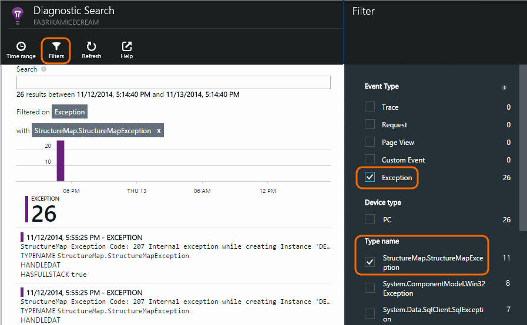

## Überwachen von Benutzeraktivitäten

Wenn die Antwort durchgängig gute ist, und es gibt einige Ausnahmen, kann das Entwicklungsteam über das des Benutzers zu verbessern und so weitere Benutzer die gewünschten Ziele zu erreichen können vorstellen.

Angenommen, eine Reise normaler Benutzer über die Website hat einen löschen 'Trichter': viele Kunden schauen Sie sich die Sätze von verschiedenen Arten von Anleihe; Einige Felder füllen Sie des Formulars Angebot; und der Personen, die ein Angebot erhalten, wenige fortfahren und nehmen Sie sich bitte Darlehens.

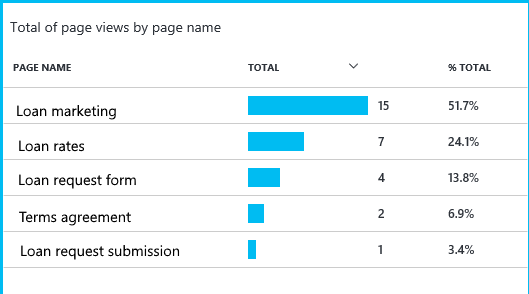

In Betracht ziehen, in dem die größten Zahlen Kunden auslassen, kann, wie mehrere Benutzer an das Ende der Trichter erhalten, bis die Business arbeiten. In einigen Fällen möglicherweise ein Fehler des Benutzers Experience (UX) – beispielsweise die Schaltfläche 'Weiter' ist schwer zu finden, oder die Anweisungen nicht offensichtlich sind. Weitere Wahrscheinlichkeit, es gibt mehr signifikante Business Gründe Signalausfälle: die Zinssätze sind möglicherweise zu hoch.

Versetzt die Gründe, können Sie die Daten das Team ausarbeiten, was Benutzer tun. Weiterer Verlauf Anrufe können eingefügt werden, um weitere Details zu arbeiten. TrackEvent() können zum Zählen von Details des auf eine einzelne Schaltfläche in erheblichen Erfolge, wie z. B. Bezahlung ein Kredit Benutzeraktionen verwendet werden.

Das Team wird, wenn Informationen zu den Benutzeraktivitäten verwendet abrufen. Heute, arbeiten sie immer, wenn sie ein neues Feature entwerfen, wie Ihr Feedback zu dessen Verwendung ausgegeben wird. Sie entwerfen Verlauf Anrufe in das Feature aus starten. Sie verwenden die Feedback, um das Feature in jeder Entwicklungszyklus zu verbessern.

## Proaktive Überwachung  

Marcela nicht nur angezeigt, um Benachrichtigungen warten. Bald nach jeder erneute, nimmt Anna wollen [Reaktionszeiten] [ perf] - sowohl den Gesamtwert in der Tabelle der langsamste Anfragen sowie Ausnahme zählt.  

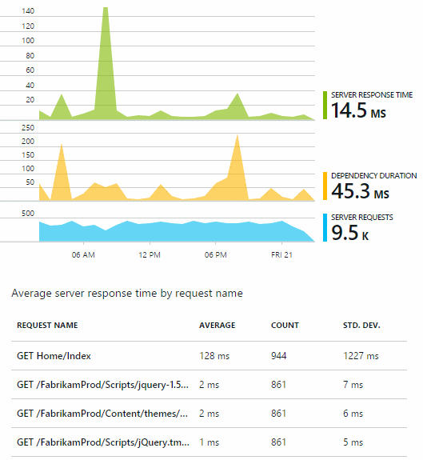

Anna kann die Auswirkung auf die Leistung von jeder Bereitstellung, bewerten Sie normalerweise Vergleich der Unterschiede bei jeder der letzten Woche. Ist es eine plötzlich sachdienliche, löst Anna, die mit den entsprechenden Entwicklern aus.

## Auswahl beschränkt

Auswahl - Beurteilung des schwere und der Umfang eines Problems - beschränkt ist der erste Schritt nach Erkennung an. Sollten wir, das Team Mitternacht aufrufen? Oder kann es werden nach links, bis die nächste geeignete Lücke im Rückstand? Es gibt einige wichtigen Fragen in Auswahl beschränkt.

Wie viel geschieht? Die Diagramme in der Übersicht Blade Teilen einige Perspektive ein Problem aufgetreten. Beispielsweise die Anwendung Fabrikam vier Web Test-Benachrichtigungen einer Nacht generiert. Ansehen im Diagramm morgens, konnte das Team feststellen, dass es tatsächlich um einige roten Punkte wurden, jedoch weiterhin die meisten der Tests grünen wurden. Ausführen von Drilldowns in das Verfügbarkeitsdiagramm, war klar, all diese Probleme bei unterbrochener von einem Test Speicherort wurden. Dies wurde offensichtlich ein Problem mit der Auswirkungen nur eine Routing und würde wahrscheinlich selbst deaktivieren.  

Dagegen ist ein wesentlich und unveränderliche Anlass im Diagramm Ausnahme Zählungen oder Antwort oft offensichtlich etwas über nicht normal funktioniert.

Eine Vorgehensweise hilfreiche Auswahl beschränkt ist Probieren Sie es selbst. Wenn Sie das gleiche Problem auftreten, wissen Sie, dass es real ist.

Welche Bruch Benutzer sind betroffen? Um eine ungefähre Antwort zu erhalten, teilen Sie den Fehler (Disagio) durch die Anzahl der Sitzung ein.

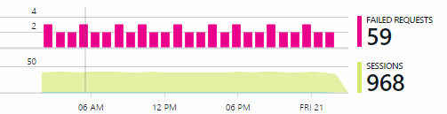

Vergleichen Sie bei langsam Antwort das langsamste reagiert Anfragen mit der Verwendung Häufigkeit jeder Seite im Inhaltsverzeichnis aus.

Wie wichtig das gesperrte Szenario ist? Dies ist ein funktionsübergreifendes Problem Blockieren eines bestimmten Benutzergeschichte ist es viel wichtig? Wenn Kunden ihre Rechnung bezahlen nicht möglich, handelt es sich schwerwiegende; Wenn sie ihre Bildschirm Farbe Voreinstellungen können nicht geändert werden, kann möglicherweise er warten. Die Details der Veranstaltung oder Ausnahme oder von der Identität Seitenrand langsam, erfahren Sie, wo Kunden Probleme auftreten.

## Diagnose

Diagnose nicht ganz identisch mit Debuggen zur Verfügung. Vorbereitung des Codes verfolgen sollten Sie haben eine ungefähre Vorstellung davon, warum, wann und wo das Problem auftritt.

**Wann passieren es?** Die zurückliegende Ansicht in der Diagramme Ereignis und Metrisch erleichtert die Effekte mit möglichen Ursachen zu koordinieren. Wenn in der Antwort Zeit oder Ausnahme Sätzen wiederkehrender Spitzen vorhanden sind, sehen Sie sich die Anzahl der Anfrage: es gleichzeitig verbindet, und es sieht so aus, wie ein Ressourcenproblem. Benötigen Sie weitere CPU oder Arbeitsspeicher zuweisen? Oder ist es eine Abhängigkeit, die die laden verwalten kann?

**Es ist uns?**  Wenn Sie ein plötzlich ablegen Leistungsabfall eines bestimmten Typs der Anforderung – beispielsweise an der Kunden einen Kontoauszug möchte - haben, und klicken Sie dann besteht die Möglichkeit, kann es einem externen Subsystem statt der Webanwendung sein. Wählen Sie im Kennzahlen-Explorer die Abhängigkeit Fehler Rate und die Dauer der Abhängigkeit Sätze und den Vergleich deren Verläufe über die vergangenen paar Stunden oder Tage mit das Problem, das Sie erkannt. Wenn es Änderungen abgleichen sind, möglicherweise einem externen Subsystem Schuld sein.  

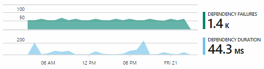

Einige Abhängigkeitsprobleme langsam sind geografischen Standort Probleme. Fabrikam Bank Azure-virtuellen Computern verwendet und festgestellt, dass diese ihre Webserver und Konto Server in verschiedenen Ländern versehentlich ansässig hatte. Erheblich verbessert wurde durch Migration von gebracht einer von ihnen.

**Welche wir?** Wenn das Problem in Form einer Beziehung werden nicht angezeigt wird und Sie es immer noch nicht, ist es wahrscheinlich durch eine aktuelle Änderung verursacht. Die von der Diagramme metrische und Ereignis bereitgestellt zurückliegende Perspektive erleichtert das plötzlichen Änderungen mit Bereitstellungen zu koordinieren. Das Feld Suchen nach das Problem das beschränkt.

**Was ist los?** Einige Probleme treten nur selten und können schwierig sein, Ausfindigmachen, indem Sie offline testen. Wir tun können lediglich versuchen, den Fehler zu erfassen, wenn er live auftritt. Sie können den Stapel speichert in Berichten Ausnahme prüfen. Darüber hinaus können Sie mit der Favorit Protokollierung Framework oder mit TrackTrace() oder TrackEvent() Tracing Anrufe, schreiben.  

Fabrikam ist ein wiederkehrender Problem mit zwischen Konto übertragen, sondern nur mit bestimmten Kontotypen aufgetreten. Zum besseren Verständnis was passiert wurde eingefügt diese TrackTrace() Anrufe bei der wichtigsten Punkte in den Code, den Kontotyp als eine Eigenschaft für die einzelnen Aufrufe Anfügen an. Die sie leicht gemacht herausgefiltert werden nur die Spuren Diagnostic suchen. Sie angefügt auch Parameterwerte als Eigenschaften und Measures der Spur Anrufe an.

## Umgang mit

Nachdem Sie das Problem gefunden haben, können Sie einen Plan aus, um das Problem zu lösen vornehmen. Möglicherweise müssen Sie eine aktuelle Änderung zurücksetzen oder vielleicht Sie einfach fortfahren und beheben. Nach Abschluss der Fix erfahren Anwendung Einsichten Sie, ob Sie erfolgreich verlaufen ist.  

Fabrikam Bank Entwicklungsteam dauern eine strukturierte Bewertung von Leistung Maße als früher, bevor sie die Anwendung Einsichten verwendet.

* Diese festlegen Leistungsziele im Hinblick auf bestimmte Measures in der Anwendung Einsichten Prozessübersicht.

* Entwerfen sie Leistung Measures, in die Anwendung von Anfang an, wie die Metrik, die Benutzer Fortschritt über 'Rührstab.' messen  

## Verwendung

Anwendung Einsichten können auch verwendet werden, um zu erfahren, wie Benutzer mit einer app Verfahren. Nachdem es problemlos ausgeführt wird, möchte das Team wissen, welche Features, die am häufigsten verwendeten sind, was Benutzer zufrieden sind, oder haben Probleme mit, und wie oft wieder stammen. Die hilft ihnen Priorisieren von ihre anstehenden Aufgaben. Und diese Erfolgs für jede Funktion als Teil des Entwicklungszyklus planen können. [Weitere Informationen][usage].

## Die Anwendung

Das ist wie eine Teamwebsite verwenden Anwendung Einsichten nicht nur für einzelne Probleme beheben, sondern nur deren Entwicklungslebenszyklus zu verbessern. Hoffentlich es Ihnen gegeben hat einige Ideen dazu, wie Einsichten Anwendung Sie verbessern die Leistung der eigenen Anwendung finden können.

## Video

[AZURE.VIDEO performance-monitoring-application-insights]

<!--Link references-->

[api]: app-insights-api-custom-events-metrics.md
[availability]: app-insights-monitor-web-app-availability.md
[diagnostic]: app-insights-diagnostic-search.md
[metrics]: app-insights-metrics-explorer.md
[perf]: app-insights-web-monitor-performance.md
[usage]: app-insights-web-track-usage.md
 
