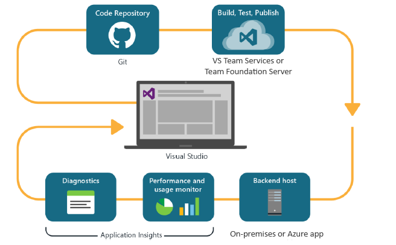
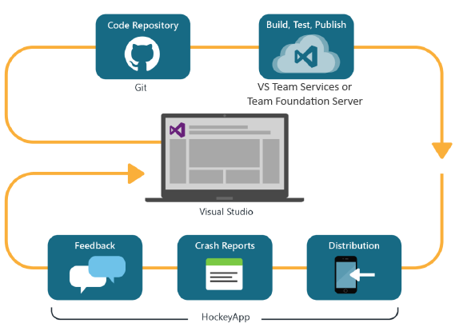

<properties
    pageTitle="Entwicklertools Analytics"
    description="DevOps mit Visual Studio, Anwendung Einsichten und HockeyApp"
    authors="alancameronwills"
    services="application-insights"
    documentationCenter=""
    manager="douge"/>

<tags
    ms.service="application-insights"
    ms.workload="tbd"
    ms.tgt_pltfrm="ibiza"
    ms.devlang="na"
    ms.topic="article" 
    ms.date="05/18/2016"
    ms.author="awills"/>

# Entwicklertools Analytics mit Anwendung Einsichten und HockeyApp

*Anwendung Einsichten ist in der Vorschau.*

Viele Projekte ausgeführt werden, eine schnelle [DevOps](https://en.wikipedia.org/wiki/DevOps) Kreis. Sie erstellen und deren Applikationen verteilen, erhalten von Feedback über Art der Ausführung und mögliche Benutzer mit und verwenden Sie dann dieses wissen, um weitere Entwicklungszyklen planen. 

Zum Überwachen der Verwendung und Leistung, ist es wichtig, werden aus der Anwendung live und Feedback von den Benutzern selbst haben. 

Viele Systeme basieren auf aus mehreren Komponenten: einem Webdienst, Back-End-Prozessoren oder Datenspeicher und Clientsoftware, die im Browser des Benutzers oder als eine app in einem Mobiltelefon oder ein anderes Gerät ausführen. Die werden von dieser unterschiedlichen Komponenten weist zusammen absolviert werden.

Einige Versionen haben Häufigkeiten vorgesehenen Tester beschränkt; Wir haben auch Aufbau des Programms (Tests der neuen Features mit eingeschränkter Zielgruppen) flighting und A | B (parallele Tests alternativen Benutzeroberfläche) testen.

Verwalten von Verteilung und Integration überwachen über mehrere Client- und Server-Komponenten nicht einfache Aufgabe. Dieser Vorgang ist ein wesentlicher Bestandteil der Architektur der Anwendung: wir ein System dieser Art, ohne eine iterative Entwicklungszyklus und gute Überwachungstools kann nicht erstellt werden.

In diesem Artikel betrachten wir, wie die Überwachung Aspekte des Zyklus DevOps mit anderen Teilen des Prozesses passt. 

Wenn Sie ein bestimmtes Beispiel eigenständig möchten, besteht [eine interessante Fallstudie](http://aka.ms/mydrivingdocs) , die mehrere Client- und Server-Komponenten enthält.

## Ein DevOps-Zyklus

Tools für Visual Studio und Entwicklertools Analytics anbieten eine gut integrierten DevOps zur Verfügung steht. So sieht beispielsweise eine typische Kreis für eine Webanwendung (das Java, Node.js oder ASP.NET werden kann) aus:

* Ein Entwickler checkt zum Repository Code oder werden in die main-Verzweigung zusammengeführt. Das Repository ist Git in dieser Abbildung, aber dies möglicherweise gleichmäßig [Team Foundation Version Control](https://www.visualstudio.com/docs/tfvc/overview).
* Die Änderungen auslösen ein Tests erstellen und Einheit. Der Dienst erstellen kann in [Visual Studio Team Services oder Gegenstück lokalen Team Foundation Server](https://www.visualstudio.com/docs/vsts-tfs-overview)befinden. 
* Können einen erfolgreichen Erstellen und Testen der Maßeinheit [Auslösen einer automatischen Bereitstellung](https://www.visualstudio.com/docs/release/author-release-definition/more-release-definition). Der Web app-Host kann entweder eine eigene Webserver oder Microsoft Azure sein. 
* Werden von der live-app wird an [Anwendung Einblicken](app-insights-overview.md), sowohl vom Server und [von Clientbrowser](app-insights-javascript.md)gesendet. Es ist, können Sie sowohl die Leistung der app und die Verwendung Muster analysieren. Diagnostizieren Sie Probleme bei leistungsfähige [Suchtools](app-insights-analytics.md) -Hilfe. [Benachrichtigungen](app-insights-alerts.md) , stellen Sie sicher, dass Sie ein Problem kennen, sobald es entsteht. 
* Ihre nächste Entwicklungszyklus wird durch Ihre Analyse der live werden informiert.

### Gerät und Desktop-apps

Für Gerät und desktop-apps ist der Verteilung Teil der Zyklus etwas anders, da wir gerade auf einem oder zwei Servern hochgeladen werden nicht. Stattdessen können einen erfolgreichen Erstellen und Testen der Maßeinheit [Trigger hochladen zu HockeyApp](https://support.hockeyapp.net/kb/third-party-bug-trackers-services-and-webhooks/how-to-use-hockeyapp-with-visual-studio-team-services-vsts-or-team-foundation-server-tfs)ist. HockeyApp die interne Verteilung mit Ihrem Team Test-Benutzer (oder in der Öffentlichkeit, falls gewünscht). 

HockeyApp sammelt auch Leistung und Nutzungsdaten, in den Formularen:

* Wörtliche Benutzerfeedback mit screenshots
* Absturz-Berichte
* Benutzerdefinierte werden von Ihnen codierte.

Erneut ist der DevOps Zyklus abgeschlossen, wie Sie Ihre Pläne zukünftige Entwicklung unter Berücksichtigung der gewonnenen Feedback vornehmen.

## Einrichten von Entwicklertools Analytics

Für jede Komponente Ihrer Anwendung – mobile oder Web oder Desktop - sind die Schritte im Wesentlichen identisch. Für eine Vielzahl von app führt Visual Studio automatisch einige der folgenden Schritte aus.

1. Fügen Sie das entsprechende SDK zu Ihrer Anwendung. Gerät apps es ist HockeyApp, und für eine Web Services sind Einblicken Anwendung. Jede gibt es mehrere Varianten für verschiedene Plattformen. (Es ist auch möglich, verwenden Sie entweder SDK für desktop-apps, obwohl es HockeyApp empfiehlt sich.)
2. Registrieren Sie Ihre app mit dem Portal Anwendung Einblicken oder HockeyApp, je nach dem verwendeten SDK. Dies ist die Stelle, an der Sie Analytics aus der live-app sehen. Sie erhalten eine Instrumentation Schlüssel oder -ID, die Sie in Ihre app zu konfigurieren, damit das SDK weiß, wohin die werden gesendet.
3. Hinzufügen von benutzerdefiniertem Code (falls gewünscht) zum Melden Ereignisse oder Kennzahlen, zur Unterstützung bei der Diagnose oder um die Leistung oder Verwendung zu analysieren. Es gibt zahlreiche Überwachung, erstellt, sodass Sie diese nicht auf der ersten Zyklus benötigen.
3. Für Gerät apps:
 * Hochladen einer Debuggen erstellen zu HockeyApp. Von dort aus können Sie es auf einer Teamwebsite Test Benutzer verteilen. Wenn Sie hochladen nachfolgende erstellt, das Team werden benachrichtigt.
 * Beim Einrichten von Ihrer fortlaufender Dienst erstellen, Erstellen einer Version, die den Plug-in-Schritt Hochladen in HockeyApp.

### Analytics und Export für HockeyApp werden

Sie können HockeyApp benutzerdefinierte ermitteln und melden Sie sich mit den Funktionen Analytics und fortlaufender Exportieren der Anwendung Einsichten durch die [Einrichtung von eine Verbindung](app-insights-hockeyapp-bridge-app.md)werden.

## Nächste Schritte
 
Hier sind die detaillierte Anleitung für unterschiedliche Arten von app aus:

* [ASP.NET Web app](app-insights-asp-net.md) 
* [Java Web app](app-insights-java-get-started.md)
* [Node.js Web app](https://github.com/Microsoft/ApplicationInsights-node.js)
* [iOS-app](https://support.hockeyapp.net/kb/client-integration-ios-mac-os-x-tvos/hockeyapp-for-ios)
* [Mac OS X-app](https://support.hockeyapp.net/kb/client-integration-ios-mac-os-x-tvos/hockeyapp-for-mac-os-x)
* [Android-app](https://support.hockeyapp.net/kb/client-integration-android/hockeyapp-for-android-sdk)
* [Universal Windows-app](https://support.hockeyapp.net/kb/client-integration-windows-and-windows-phone/how-to-create-an-app-for-uwp)
* [App für Windows Phone 8 und Windows 8.1](https://support.hockeyapp.net/kb/client-integration-windows-and-windows-phone/hockeyapp-for-windows-phone-silverlight-apps-80-and-81)
* [Windows Presentation Foundation-app](https://support.hockeyapp.net/kb/client-integration-windows-and-windows-phone/hockeyapp-for-windows-wpf-apps)

