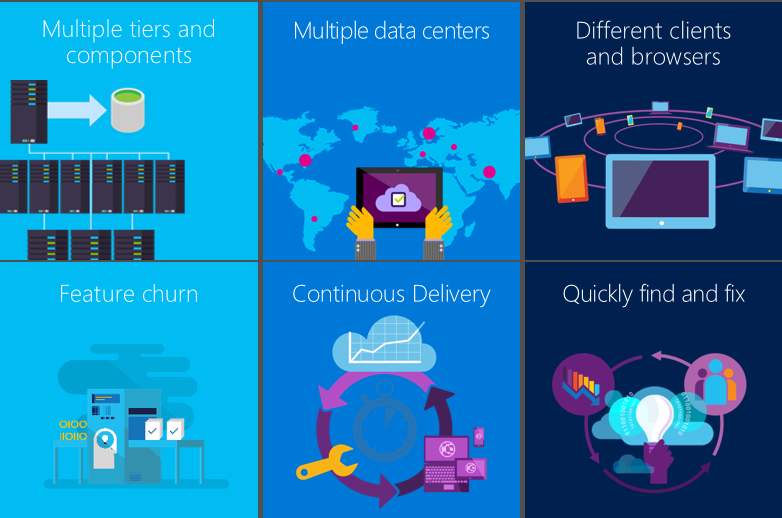
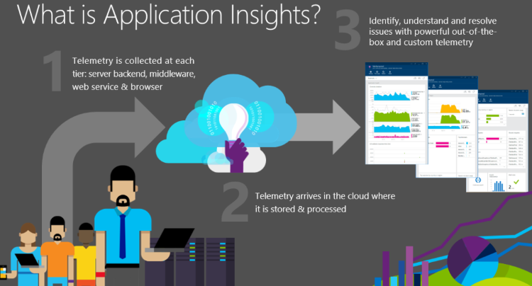
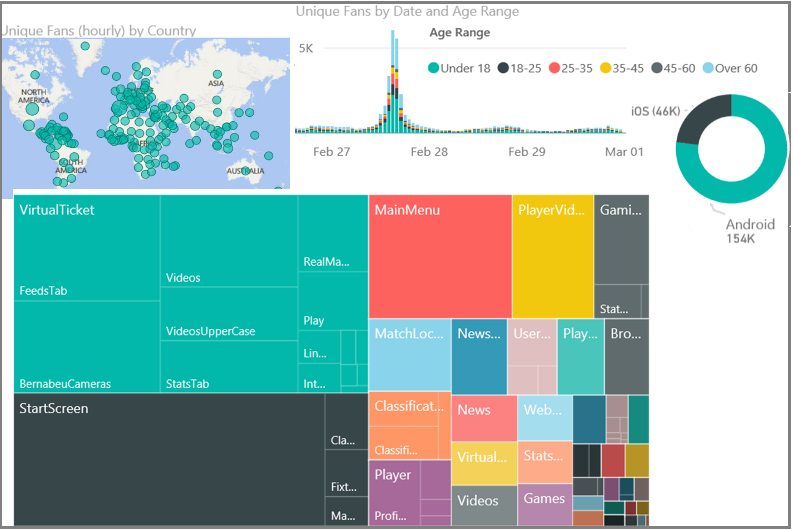
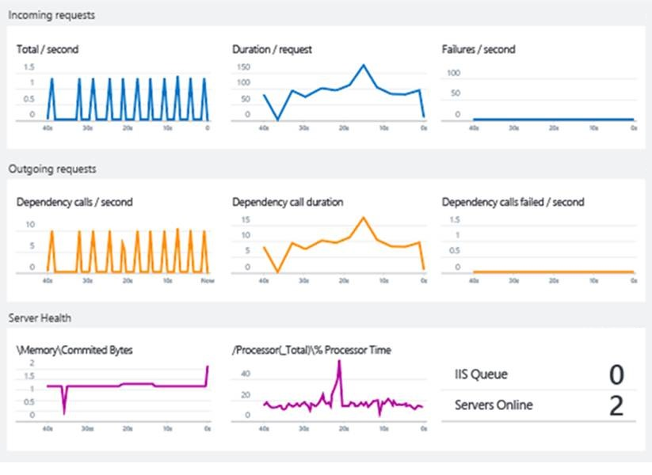
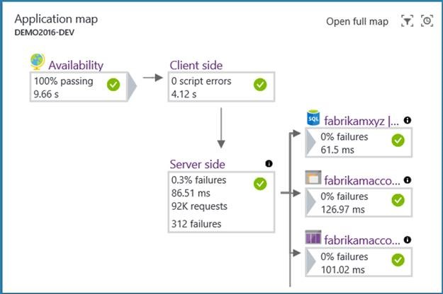
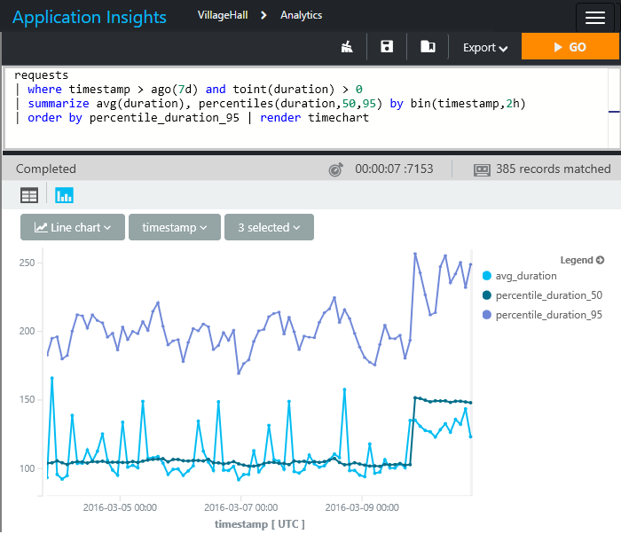
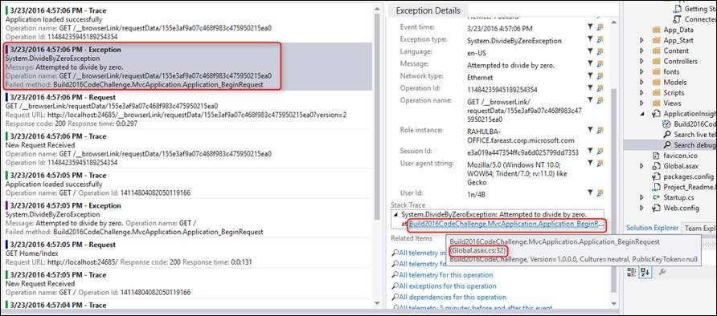
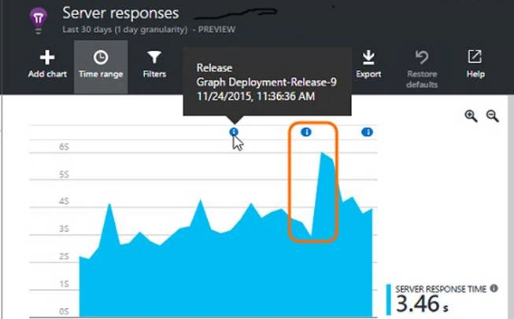

<properties
    pageTitle="Diagnose für Web apps und Dienste mit Anwendung Einsichten | Microsoft Azure"
    description="Integrieren von Anwendung Einsichten in der DevOps-Zyklus"
    services="application-insights"
    documentationCenter=""
    authors="alancameronwills"
    manager="douge"/>

<tags
    ms.service="application-insights"
    ms.workload="tbd"
    ms.tgt_pltfrm="ibiza"
    ms.devlang="multiple"
    ms.topic="article" 
    ms.date="08/26/2016"
    ms.author="awills"/>

# Diagnose für Web apps und Dienste mit Anwendung Einsichten

## Warum sind Einblicken Anwendung erforderlich?

Anwendung Einsichten überwacht laufenden Web app an. Es wird erläutert, zu Fehlern und Leistungsprobleme, und hilft Ihnen, wie Kunden Ihre app verwenden zu analysieren. Es funktioniert für apps auf vielen Plattformen (ASP.NET, J2EE, Node.js,...) ausgeführt und in der Cloud oder lokal gehostet wird. 

Es ist wichtig, um während der Ausführung eine moderne Anwendung zu überwachen. Sie möchten, vor allem Fehlern erkennen, bevor die meisten Kunden ausführen. Sie erkennen und beheben Leistungsprobleme, die, während nicht schwerwiegenden sinnvoll, vielleicht Dinge verlangsamen oder dazu führen, dass einige Ihr Verständnis für Ihre Benutzer. Und wenn das System Ihren Wünschen entsprechend durchführt, möchten Sie wissen, was die Benutzer mit tun: Verwenden sie die neuesten Features? Sind sie mit erfolgreich?

Modernes Webanwendungen werden in einem Zyklus der kontinuierlichen Bereitstellung entwickelt: lassen Sie ein neues Feature oder Verbesserung; Achten sie Kompatibilität für die Benutzer zur Verfügung. Planen Sie das nächste Inkrement der Entwicklung basierend auf den Informationen ein. Ein wesentlicher Teil des diesen Zyklus ist die Beobachtung-Phase. Anwendung Einsichten stellt Tools, um eine Webanwendung, für die Leistung und die Verwendung zu überwachen.

Der wichtigste Aspekt dieses Prozesses ist für Diagnose und Diagnose. Wenn die Anwendung fehlschlägt, ist dann Business gehen verloren. Die Rolle Prime eines Rahmens Überwachung ist deshalb defekte zuverlässig erkennen, die Sie sofort zu benachrichtigen, und Sie das Problem diagnostizieren erforderlichen Informationen zur Verfügung stellen. Dies ist genau die Funktionsweise der Anwendung Einsichten.

### Wo kommen Fehlern aus?

Fehler im Websysteme entstehen in der Regel durch Konfigurationsproblemen oder Interaktionen zwischen deren viele Komponenten. Die erste Aufgabe, wenn einen Vorfall live Website Bekämpfung besteht daher zum Identifizieren der Locus des Problems: welche Komponente oder Beziehung ist die Ursache?

Einige von uns, die mit grauen Haar, kann ein einfacher indische erinnern, in dem ein Computerprogramm in einem Computer ausgeführt haben. Der Entwickler würden sie sorgfältig testen, bevor sie Liefer-; und selten finden Sie unter oder Denken Sie es erneut würde Probleme, geliefert. Die Benutzer müssen sich mit den Restwert Fehlern vielen Jahren setzen von. 

Jetzt sind Merkmale so sehr unterschiedlich. Ihre app enthält eine Vielzahl von anderen Geräten für ausgeführt, und es kann schwierig sein, das genaue derselben Verhalten auf jeweils sichergestellt ist. Apps in der Cloud Hostinganbieter bedeutet Fehler schnell behoben werden können, aber dies bedeutet auch fortlaufender induzierten Risikos und der Annahme der neuen Features in regelmäßigen Abständen. 

In diesen Umständen ist die einzige Möglichkeit zum Beibehalten eines Steuerelements fest, auf die Fehleranzahl automatisierte Testen von Einheiten. Alles, was auf jeder Übermittlung erneut testen Sie manuell unmöglich wäre. Testen der Maßeinheit ist jetzt eine erfolgreiche Teil des Prozesses erstellen. Tools wie etwa der Xamarin Test Cloud helfen können, indem Sie automatisierten UI auf mehrere Browserversionen testen. Diese testen Behandlung können wir hoffen, dass der Kostensatz innerhalb einer app gefundene Fehler auf ein Minimum reduziert werden kann.

Typische Webanwendungen müssen viele live-Komponenten. Zusätzlich zu den Client (in einem Browser oder das Gerät app) und dem Webserver ist es wahrscheinlich wesentlichen Back-End-Verarbeitung. Vielleicht ist die Back-End-eine Verkaufspipeline Komponenten oder eine lockereres Zusammenstellung von Zusammenarbeit Textstellen. Und viele davon können nicht in Ihrem Steuerelement: sie haben externe Dienste, von denen Sie abhängig sind.

In Konfigurationen wie diese kann es schwierig und uneconomical zu prüfen oder erwarten, jeder Modus möglicherweise Fehler andere als im live-System selbst sein. 

### Fragen...

Wenn wir ein Web-System entwickeln, bitten wir einige Fragen:

* Stürzt Meine app? 
* Was genau ist? – Wenn er eine Anforderung fehlschlägt, möchten wissen, wie es eingerichtet werden. Wir benötigen eine Spur von Ereignissen...
* Ist meine app schnell genug? Wie lange dauert es Standard Besprechungsanfragen beantworten?
* Geeignet der Server für die Last? Wenn die Rate der Anfragen überschreitet, halten die Antwortzeit konstanter?
* Wie reagiert sind meine Abhängigkeiten - Datenbanken und anderen Komponenten, die meine app Ruft die REST-APIs. Insbesondere wenn das System langsam ist, ist es Meine Komponente, oder erhalte ich langsame Antworten aus einer anderen Person?
* Ist meine app aus, nach oben oder unten? Können sie aus der ganzen Welt werden angezeigt? Mich darüber informiert, wenn es nicht mehr...
* Was ist die Ursache? Fehler der in meinem Komponente oder eine Abhängigkeit? Handelt es sich um ein Kommunikationsproblem?
* Wie viele Benutzer sind betroffen? Wenn ich mehr als ein Problem zu lösen haben, ist die besonders wichtig?

## Was ist eine Anwendung Einsichten?

1. Anwendung Einsichten Ihre app instrumentiert und sendet dagegen werden, während die app ausgeführt wird. Entweder können Sie die Anwendung Einsichten SDK in der app erstellen, oder Sie können Instrumentation zur Laufzeit anwenden. Die erste Methode ist flexibler, wie Sie Ihre eigenen werden an die reguläre Module hinzufügen können.
2. Die telemetrieprotokoll wird Anwendung Einsichten-Portal an, gesendet, wo es gespeichert und verarbeitet wird. (Zwar Anwendung Einsichten in Microsoft Azure gehostet wird, können alle Web apps - apps nicht nur Azure überwachen.)
3. Die telemetrieprotokoll ist Ihnen in Form von Diagramme und Tabellen von Ereignissen angezeigt.

Es gibt zwei Hauptarten von werden: aggregierte und unformatierte Instanzen. 

* Instanzdaten enthält, beispielsweise einen Bericht über eine Anforderung, die von Web app empfangen wurde. Sie können für Suchen und prüfen die Details der Anforderung einer mithilfe des Tools für die Suche im Portal Anwendung Einsichten. Die Instanz würde Daten wie Ihre app Dauer bis zum Antworten auf die Anfrage als auch die angeforderten URL, die ungefähre Position des Clients und anderen Daten enthalten.
* Aggregierte Daten enthält Anzahl von Ereignissen pro Zeiteinheit, damit Sie die Rate der Anfragen mit der Reaktionszeiten vergleichen können. Darüber hinaus Durchschnitte der Metrik wie Anforderung Reaktionszeiten.

Die wichtigsten Datenkategorien sind:

* Anfragen zu Ihrer Anwendung (normalerweise HTTP-Anfragen) mit Daten auf URL, Antwortzeit und erfolgreichen oder nicht.
* Abhängigkeiten – von der app, auch mit URI, Reaktionszeiten und Erfolg Ruhe und SQL-Aufrufe
* Ausnahmen, einschließlich Stapel auf.
* Seite Ansichtsdaten, die aus dem Browser der Benutzer stammen.
* Kennzahlen z. B. Leistungsindikatoren sowie Kennzahlen schreiben Sie selbst. 
* Benutzerdefinierte Ereignisse, die Sie verwenden können, um geschäftliche Ereignisse zu verfolgen
* Melden Sie sich auf, die für das Debuggen verwendet.

## Fallstudie: Real Madrid F.C.

Der Webdienst von [Real Madrid Football Club](http://www.realmadrid.com/) dient zum 450 Millionen Lüfter auf der ganzen Welt an. Lüfter greifen sowohl über den Webbrowser und die Club des mobilen apps. Lüfter können nicht nur die Bücher Tickets, sondern auch Zugriff auf Informationen und Videoclips auf Ergebnisse, Player und anstehende Spiele. Sie können mit Filter suchen, wie Zahlen Ziele bewertet. Es gibt auch Links zu sozialen Medien. Die Benutzerfunktionalität ist hochgradig personalisierte und dient als eine bidirektionale Kommunikation Lüfter populärer.

Die Lösung, [ist ein System von Diensten und Anwendungen auf Microsoft Azure](https://www.microsoft.com/en-us/enterprise/microsoftcloud/realmadrid.aspx)ist. Skalierbarkeit ist eine wichtige Anforderung: Datenverkehr Variable und erreichen sehr große Mengen während und um Übereinstimmungen hervorgehoben.

Für Real Madrid, ist es entscheidend, die Systemleistung zu überwachen. Visual Studio-Anwendung Einsichten bietet einen umfassenden Überblick über das System, um eine zuverlässig und hoher Ebene des Diensts. 

Das Club wird auch eingehendes Verständnis der Ventilatoren:, wo sie sind (nur 3 % sind in Spanien), welche Zinsen, die sie im Player, älteren Ergebnissen und anstehende Spiele und wie sie Antworten auf Ergebnisse entsprechen haben.

Die meisten dieser Daten werden werden automatisch erfasst, ohne hinzugefügten Code, die vereinfacht der Lösung und Betrieb Komplexität verringert.  Für Real Madrid, Anwendung Einsichten befasst sich mit 3,8 Milliarden werden Punkte jeden Monat ein.

Real Madrid verwendet das Power BI-Modul zum Anzeigen ihrer werden.

## Intelligente Erkennung

[Proaktive Diagnose](app-insights-proactive-diagnostics.md) ist eine zuletzt verwendete Funktion. Ohne besondere Konfiguration von Ihnen Anwendung Einsichten automatisch erkannt und benachrichtigt Sie beim ungewöhnliche nimmt in Fehler Sätzen in Ihrer app. Es ist smart genug, um einen Hintergrund gelegentliche Fehler und auch an, die einfach zu einer zunehmenden Anfragen proportionalen sind zu ignorieren. Also beispielsweise, funktioniert es ist ein Fehler in einer der Dienste, die, denen Sie abhängig sind, oder wenn die neue erstellen Sie die soeben bereitgestellte so gut, nicht dann dagegen erkennen können, sobald Sie Ihre e-Mails betrachten. (Und Webhooks vorhanden sind, sodass Sie andere apps auslösen können.)

Ein weiterer Aspekt dieses Feature führt eine tägliche genaue Analyse von Ihrem werden, wonach ungewöhnliche Muster der Leistung, die schwer zu finden sind. Beispielsweise können sie mit einer bestimmten geographischen oder mit einer bestimmten Browserversion verknüpft ist langsam suchen.

In beiden Fällen wird die Benachrichtigung nicht nur die Symptome, die es erkannt wird, die aber es bietet Ihnen außerdem Daten, die Sie diagnostizieren des Problems, wie z. B. relevante Ausnahme Berichte müssen.

Kunden Samtec unter dem Gesichtspunkt sind: "während eines zuletzt verwendete Features Umstellung, wir eine unter skaliert Datenbank aus, drücken die Grenzwerte für die Ressource und bewirken, dass Zeitlimit wurde, gefunden. Proaktive Erkennung Benachrichtigungen gesucht haben, bis Literal wie wir das Problem, sehr praktisch in Echtzeit Selektierung wurden, wie angekündigt. Diese Warnung in Verbindung mit der Benachrichtigungen Azure-Plattform beigetragen uns beinahe sofort das Problem zu beheben. Gesamtausfallzeit < 10 Minuten."

## Kennzahlen Stream Live

Bereitstellen von den neuesten Stand, kann eine lösende Erfahrung sein. Wenn alle Probleme aufgetreten sind, möchten sie sofort kennen, damit Sie bei Bedarf zurückgenommen können muss. Live Kennzahlen Stream bietet Ihnen wichtige Kriterien mit einer Wartezeit von ungefähr 1 Sekunde.

## Anwendung Karte

Anwendung Karte erkennt automatisch Ihrer Anwendung Suchtopologie zur Festlegung der Leistungsinformationen darüber zu informieren Sie Leistungsengpässe und problematische Zahlungen über Ihre verteilte Umgebung einfach zu identifizieren. Sie können Sie Anwendung Abhängigkeiten von Azure-Dienste zu erkennen. Sie können das Problem durch Grundlegendes zu Sichten Code verknüpft ist, oder Abhängigkeit Verwandte und aus einem einzigen Ort Drilldown in verknüpften Diagnose auftreten. Eine Anwendung könnte beispielsweise aufgrund Leistungsabfall in SQL Ebene fehlerhaft sein. Mit der Anwendung arbeiten können sie sofort sehen und detailliert Auswerten der SQL-Index Advisor oder Abfrage Einsichten auftreten.

## Anwendung Einsichten Analytics

Mit [Analytics](app-insights-analytics.md)können Sie willkürliche Abfragen in einer leistungsfähigen SQL-ähnliche Sprache schreiben.  Über den gesamten app Stapel Diagnosezwecken wird einfach, wie die verschiedenen Blickwinkeln verbunden, und bitten Sie die richtigen Fragen, die mit geschäftliche Kriterien und Customer Experience Dienstleistung zu koordinieren. 

Sie können Ihre Instanz werden und metrischen unformatierten Daten im Portal gespeicherte Abfragen. Die Sprache umfasst, filtern, Verknüpfung, Aggregation und andere Vorgänge. Sie können Felder berechnen und Durchführen von statistischen Analysen. Es gibt tabellarische und grafische Visualisierungen.

Beispielsweise ganz einfach:

* Segmentieren der Daten Ihrer Anwendung Anforderung Leistung durch Kunden Ebenen zu verstehen, ihre optimal nutzen.
* Suchen nach bestimmten Fehlercodes oder die Namen von benutzerdefinierten Ereignissen während live Website Untersuchungen.
* Ausführen eines Drilldowns in der app-Verwendung von bestimmter Kunden zu verstehen, wie Features erworben haben und eingeführt werden.
* Nachverfolgen von Sitzungen und Reaktionszeiten für bestimmte Benutzer aktivieren, Support und Betrieb Teams instant Kundensupport zur Verfügung stellen.
* Ermitteln Sie häufig verwendete app-Funktionen, die Features Prioritäten Fragen beantwortet.

Kunde DNN sagt: "Anwendung Einsichten Verfügung gestellt hat uns mit den fehlenden Teil der Formel für die Möglichkeit, kombinieren, Abfrage, Sortieren und Filtern von Daten nach Bedarf. Unser Team eigene Einfallsreichtum und Erfahrung verwenden, um zu finden, die Daten mit einer leistungsfähigen Abfragesprache erlaubt hat uns Einsichten suchen und Beheben von Problemen mit gleicht haben wir auch wissen, dass wir hatten. Eine Vielzahl von interessanten Antworten kommen aus den Fragen angefangen *' ich Wonder if... ".*"

## Integration von Tools Entwicklung 

### Konfigurieren von Anwendung Einsichten

Visual Studio und Ellipse haben Tools so konfigurieren Sie die richtige SDK Pakete für das Projekt, das Sie entwickeln. Es gibt ein Menübefehl Anwendung Einsichten hinzufügen.

Wenn Sie eine Spur Framework wie Log4N, NLog oder System.Diagnostics.Trace Protokollierung verwenden versehentlich, erhalten dann Sie die Option zum Senden von die Protokolle in der Anwendung Einsichten zusammen mit den anderen werden, damit Sie einfach die Spuren mit Anfragen, Abhängigkeit Anrufe und Ausnahmen zuordnen können.

### Suche werden in Visual Studio

Während der Entwicklung und für das Debuggen ein Feature, können Sie anzeigen und Durchsuchen die werden direkt in Visual Studio mithilfe der gleichen Suchfunktionen, wie das Web-Portal.

Und Anwendung Einsichten eine Ausnahme meldet, können Sie den jeweiligen Datenpunkt in Visual Studio anzeigen und direkt zu den relevanten Code springen.

Beim Debuggen, müssen Sie die Option zum Beibehalten der werden in Ihrem Entwicklungscomputer in Visual Studio jedoch ohne Sie zu senden auf das Portal anzeigen. Diese Option lokale vermieden werden mischen Debuggen mit Herstellung werden.

### Erstellen von Anmerkungen

Wenn Sie Visual Studio Team Services zum Erstellen und Bereitstellen Ihrer app verwenden, angezeigt Bereitstellung Anmerkungen in Diagrammen im Portal. Wenn der neuesten Version keine Auswirkung auf die Metrik verwendet haben, ist es offensichtlich.

### Arbeitselementen 

Wenn eine Warnung ausgelöst wird, können Anwendung Einsichten dient automatisch in Ihre Arbeit nachverfolgen System (Visual Studio Team Services nur bei präsentieren) erstellen.

## Wissenswertes zum, aber...?

* [Datenschutz und Speicher](app-insights-data-retention-privacy.md) - Ihrer werden wird auf Azure sichere Server gespeichert.
* Leistung - wirkt sich kaum sehr niedrig. Werden zusammengefasst ist.
* [Support](app-insights-get-dev-support.md) - können Azure-Support-Programms nutzen. Es gibt lebendiger Foren, wo Sie Antworten aus unserem Entwickler zugreifen können. Und in das letzte Mittel, wir können Ihnen individuelle Hilfe.
* [Preise](app-insights-pricing.md) – Sie können beginnen kostenlos, und dies ist auch weiterhin während Sie in geringem Umfang sind.

## Nächste Schritte

Erste Schritte mit der Anwendung Einsichten ist einfach. Zu den wichtigsten Optionen sind:

* Instrumentieren einer bereits ausgeführten Web app an. Dadurch werden alle der integrierten Leistung werden. Es steht für [Java](app-insights-java-live.md) und [IIS-Servern](app-insights-monitor-performance-live-website-now.md)und von [Azure Web apps](app-insights-azure.md).
* Instrumentieren Sie während der Entwicklung des Projekts. Sie können dies für [ASP.NET](app-insights-asp-net.md) oder [Java](app-insights-java-get-started.md) -apps als auch [Node.js](app-insights-nodejs.md) und eine Vielzahl von [anderen Arten](app-insights-platforms.md)ausführen. 
* Urkunde [einer beliebigen Webseite](app-insights-javascript.md) durch einen kurzen Codeausschnitt hinzufügen.

