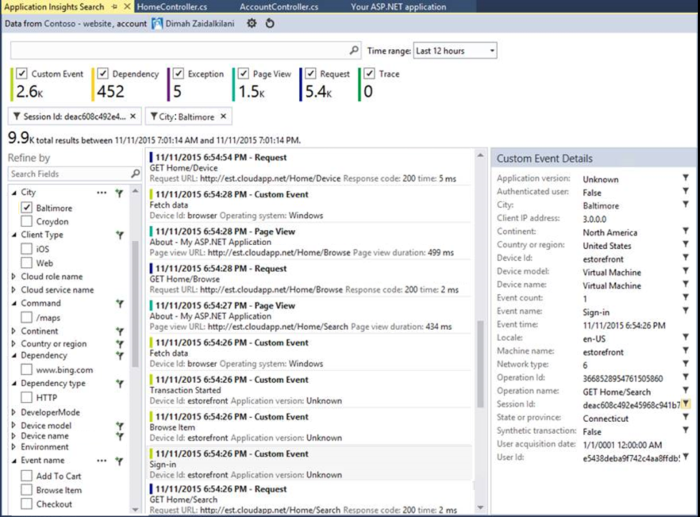

<properties 
    pageTitle="Mithilfe der Suchfunktion Diagnostic | Microsoft Azure" 
    description="Suchen und Filtern einzelne Ereignisse, Serviceanfragen, und melden Sie sich auf." 
    services="application-insights" 
    documentationCenter=""
    authors="alancameronwills" 
    manager="douge"/>

<tags 
    ms.service="application-insights" 
    ms.workload="tbd" 
    ms.tgt_pltfrm="ibiza" 
    ms.devlang="na" 
    ms.topic="article" 
    ms.date="06/09/2016" 
    ms.author="awills"/>
 
# Verwenden von Diagnoseprotokollen Suchen in Anwendung Einsichten

Diagnose Suche ist ein Feature der [Anwendung Einsichten] [ start] , suchen und Untersuchen einzelner werden Elemente, wie z. B. Seitenansichten, Ausnahmen, oder web Anfragen zu verwenden. Und Sie können auf Protokolldateien und Ereignisse, die Sie programmiert haben anzeigen.

## Sehen Sie, wo Diagnostic suchen?

### Azure-Portal

Sie können explizit diagnostic Suche öffnen:

Auch öffnen Wenn Sie über einige Diagramme und Rasterelemente klicken Sie auf. In diesem Fall sind seine Filter vorab festgelegt, auf den Typ des Elements konzentrieren, die Sie ausgewählt haben. 

Ist eine Anwendung eines Webdiensts, zeigt das Blade Übersicht beispielsweise ein Diagramm der Lautstärke Anfragen an. Klicken Sie darauf, und geklickt haben eine ausführlichere Diagramm mit einer Liste mit, wie viele Anfragen für jede URL vorgenommen wurden. Klicken Sie auf eine beliebige Zeile, und Sie erhalten eine Liste der einzelnen Anforderungen für die URL:

Hauptteil Diagnostic Suche finden Sie eine Liste der werden Elemente - Serveranfragen, Seite Ansichten, benutzerdefinierte Ereignisse, die Sie programmiert haben, usw.. Am oberen Rand der Liste wird eine Zusammenfassung mit der Anzahl von Ereignissen über einen Zeitraum.

Ereignisse angezeigt in der Regel in den Diagnoseprotokollen suchen, bevor sie in metrischen Explorer angezeigt werden. Obwohl das Blade selbst in Intervallen aktualisiert, können Sie auf Aktualisieren klicken, wenn Sie für ein bestimmtes Ereignis warten.

### In Visual Studio

Öffnen Sie das Suchfenster in Visual Studio aus:

Das Suchfenster weist die gleichen Funktionen wie das Web-Portal an:

## Werden

Wenn Ihre app werden viele generiert (und dabei die ASP.NET SDK Version 2.0.0-beta3 oder höher), das Modul adaptive werden wird automatisch verringern die Lautstärke, die mit dem Portal per nur einen Vertreter Bruch von Ereignissen gesendet wird. Jedoch Ereignisse, die mit der gleichen Anforderung zusammenhängen werden aktivieren oder deaktivieren als Gruppe, damit Sie zwischen verwandten Ereignisse navigieren können. 

Sie [erhalten grundlegende Informationen zu werden](app-insights-sampling.md).

## Prüfen Sie einzelne Elemente

Wählen Sie alle Elemente werden Schlüsselfelder angezeigt und verwandte Elemente. Wenn Sie die vollständige Reihe von Feldern anzeigen möchten, klicken Sie auf "...". 

Um den vollständigen Satz von Feldern zu suchen, verwenden Sie einfarbigen Zeichenfolgen (ohne Platzhalterzeichen). Die verfügbaren Felder abhängig von den Typ des telemetrieprotokoll ab.

## Erstellen von dient

Sie können einen Fehler mit den Details von jedem beliebigen Element werden in Visual Studio Team Services erstellen. 

Durch diesen Vorgang zum ersten Mal müssen Sie eine Verknüpfung mit Ihr Team Services-Konto und das Projekt konfigurieren.

(Sie können auch aufrufen, das Blade Konfiguration von Einstellungen > Work Items.)

## Ereignis Filtertypen

Öffnen Sie das Blade Filter, und wählen Sie die Ereignis Dateitypen, die angezeigt werden sollen. (Wenn Sie später Wiederherstellen der Filter, mit denen Sie das Blade geöffnet, werden soll, klicken Sie auf Zurücksetzen.)

Die Ereignistypen sind:

* **Spur** - Diagnoseprotokolle einschließlich TrackTrace, log4Net, NLog und System.Diagnostic.Trace Anrufe.
* **Anfordern** – HTTP-Anfragen von der Server-Anwendung, einschließlich Seiten, Skripts, Bilder, Stil-Dateien und Daten empfangen. Diese Ereignisse werden verwendet, um die Anforderung und Antwort Übersicht Diagramme zu erstellen.
* **Datenzugriffsseiten-Ansicht** – von der Webclient gesendet werden verwendet, um die Seite View-Berichte zu erstellen. 
* **Benutzerdefinierte Ereignis** – Wenn Sie Anrufe an TrackEvent() in Reihenfolge [Monitor]Einsatz eingefügt[track], können Sie diese hier suchen.
* **Ausnahme** - nicht abgefangen Ausnahmen in dem Server, und diejenigen, die Sie melden Sie sich mithilfe von TrackException().

## Klicken Sie auf Eigenschaftswerte filtern

Sie können Ereignisse klicken Sie auf die Werte ihrer Eigenschaften filtern. Die verfügbaren Eigenschaften hängen vom Ereignis, das Sie ausgewählt haben. 

Wählen Sie beispielsweise Anfragen mit einer bestimmten Antwortcode ein.

Auswählen einer bestimmten Eigenschaft keine Werte wirkt sich genauso wie die Auswahl aller Werte; Sie deaktiviert Filtern auf die Eigenschaft.

### Eingrenzen der Suche

Beachten Sie, dass der Zähler rechts neben der Filterwerte angezeigt, wie viele Vorkommen es in der aktuellen gefilterten Gruppe sind. 

In diesem Beispiel weist bereinigen, die die `Reports/Employees` Ergebnis in den meisten der 500 Fehler anzufordern:

Darüber hinaus können Sie nach Wunsch auch finden Sie unter welche anderen Ereignisse dieses Zeitraums weiterhin wurden, **Einschließen von Ereignissen mit nicht definierten Eigenschaften**überprüfen.

## Entfernen Sie den Datenverkehr Bot und Web-test

Verwenden Sie den Filter **reellen oder synthetische Datenverkehr** , und aktivieren Sie **Real**.

Sie können auch nach der **Quelle der synthetische Datenverkehr**filtern.

## Prüfen Sie einzelne Vorkommen

Fügen Sie die Anfrage Namen, um den Filter festlegen, und Sie können einzelne Vorkommen dieses Ereignisses untersuchen.

Weitere Informationen zu Ereignissen Anforderung zeigen Details zur Ausnahmen, die aufgetreten sind, während die Anforderung verarbeitet wurde.

Klicken Sie auf durch eine Ausnahme Detail, einschließlich der Spur Stapel angezeigt.

## Suchen nach Ereignissen mit der gleichen-Eigenschaft

Suchen Sie alle Elemente mit dem gleichen Eigenschaftswert:

## Suchen nach metrischen Wert

Abrufen von Besprechungsanfragen Antwort immer > 5 s.  Wie oft werden in Teilstriche dargestellt: 10 000 Teilstriche = 1 ms.

## Suchen von Daten

Sie können Ausdrücke in eines der Eigenschaftswerte suchen. Dies ist besonders hilfreich, wenn Sie [benutzerdefinierte Ereignisse] geschrieben haben[ track] mit Immobilienwerte. 

Sie möchten möglicherweise Festlegen eines Bereichs, als Suchbegriffe ein verkürzen Datumsbereich sind schneller Zeitabstandes. 

Suchen Sie nach Ausdrücke, nicht untergeordneten Zeichenfolgen. Begriffe sind alphanumerische Zeichenfolgen, einschließlich einiger Satzzeichen wie '.' und '_'. Beispiel:

Ausdruck|*nicht* wird durch abgeglichen werden|aber diese stimmen überein
---|---|---
HomeController.About|Informationen zu Start|h\*zu Start\*
IsLocal|lokale ist \*lokale|ISL\* IsLocal i\*l\*
Neue Verzögerung|w d|Neu Verzögerung n\* und d\*

Hier sind die Suche Ausdrücke, die Sie verwenden können:

Beispielabfrage | Effekt 
---|---
verlangsamen|Suchen nach alle Ereignisse in den Datumsbereich, deren Felder den Ausdruck enthalten "langsame"
Datenbank??|Entspricht database01, DatabaseAB... ? ist zu Beginn der einen Suchbegriff nicht zulässig.
Datenbank * |Datenbank, database01, DatabaseNNNN entspricht  * am Anfang der einen Suchbegriff darf keine
Apple und Bananen|Suchen nach Ereignissen, die beide Begriffe enthalten. Verwenden von Grundkapital "und" nicht "und".
Apple oder Bananen Apple Bananen|Suchen nach Ereignissen, die entweder Ausdruck enthalten. Verwenden Sie "Oder", nicht "oder". < /br/ > kurz Formular.
Apple nicht Bananen Apple-Bananen|Suchen nach Ereignissen, die einen Ausdruck aber nicht in der anderen enthalten. Kurze Formular.
App * und Bananen-(grape pear)|Logische Operatoren und Einklammern.
"Metrisch": 0 bis 500 "Metrisch": 500 an * | Suchen nach Ereignissen, die im benannten Maße in den Bereich enthalten.

## Speichern Sie Ihre Suche

Wenn Sie alle Filter erstellt haben, werden soll, können Sie die Suche als Favorit speichern. Wenn Sie in einem organisationskonto arbeiten, können Sie auswählen, ob es für andere Teammitglieder freigeben.

So finden Sie unter die Suchfunktion erneut, **Wechseln Sie zu der Übersicht Blade** und Favoriten öffnen:

Wenn Sie mit der relativen Zeitraums gespeichert haben, weist das erneut geöffnete Blade die neuesten Daten. Wenn Sie mit absoluten Zeitbereich gespeichert haben, wird die gleichen Daten jedes Mal.

## Weitere telemetrieprotokoll an Anwendung Einsichten senden

Neben der Out-of-Box-werden von Anwendung Einsichten SDK gesendet wurden können Sie folgende Aktionen ausführen:

* Erfassen von Log Spuren aus Ihrem bevorzugten Protokollierung Framework in [.NET] [ netlogs] oder [Java][javalogs]. Dies bedeutet, Sie können Ihre Log auf Durchsuchen und zu koordinieren sie mit der Seitenansichten, Ausnahmen und andere Ereignisse. 
* [Schreiben von Code] [ track] Ausnahmen, Seitenansichten und benutzerdefinierte Ereignisse zu senden. 

[Informationen zum Senden von Protokollen und benutzerdefinierte werden an Anwendung Einsichten][trace].

## F & A

### Wie viele Daten werden beibehalten?

Bis zu 500 Ereignisse pro Sekunde aus jeder Anwendung. Ereignisse sind sieben Tage lang aufbewahrt.

### Wie kann ich einen Beitrag Daten in meinem Serveranfragen anzeigen?

Wir nicht melden Sie sich die Daten Beitrag automatisch, jedoch können [TrackTrace oder Log Anrufe][trace]. Setzen Sie die Beitrag Daten in der Nachricht Parameter ein. Kann nicht gefiltert werden die Nachricht die Methode, die können Sie auf Eigenschaften, aber das Größenlimit umfasst mehr.

## Nächste Schritte

* [Senden von Protokollen und benutzerdefinierte werden an Anwendung Einsichten][trace]
* [Einrichten von Verfügbarkeit und Reaktionszeiten tests][availability]
* [Behandlung von Problemen][qna]

<!--Link references-->

[availability]: app-insights-monitor-web-app-availability.md
[javalogs]: app-insights-java-trace-logs.md
[netlogs]: app-insights-asp-net-trace-logs.md
[qna]: app-insights-troubleshoot-faq.md
[start]: app-insights-overview.md
[trace]: app-insights-search-diagnostic-logs.md
[track]: app-insights-api-custom-events-metrics.md

 