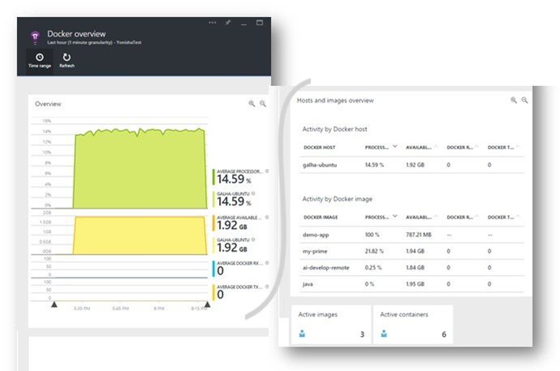
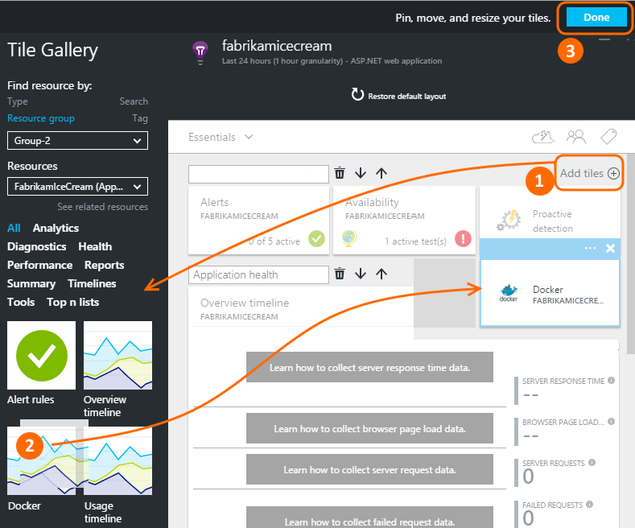
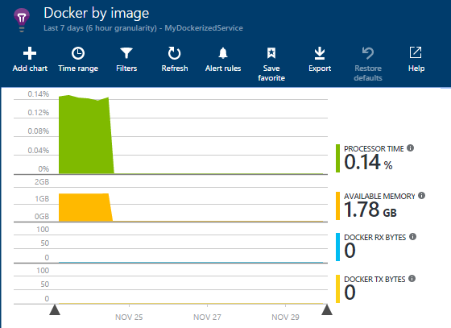
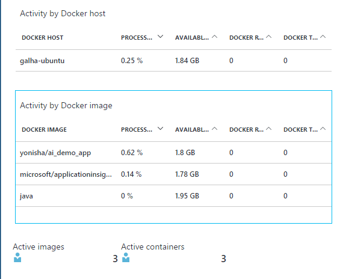
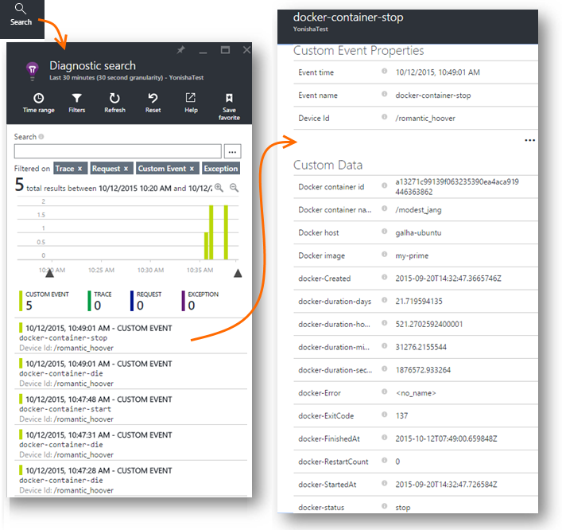
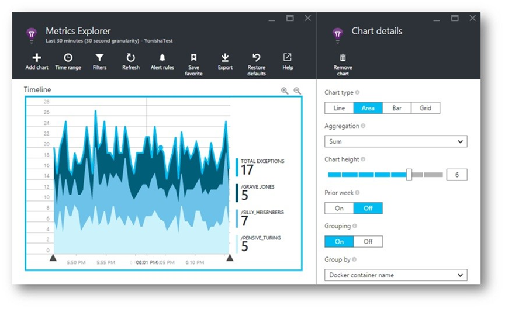
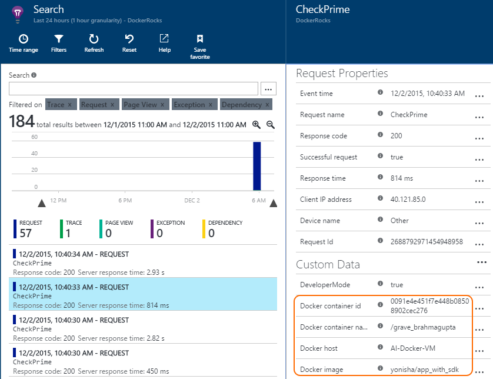
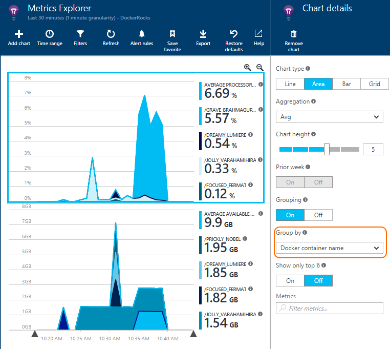

<properties 
    pageTitle="Überwachen von Docker-Anwendungen in der Anwendung Einsichten" 
    description="Docker Leitungsindikatoren, Ereignisse und Ausnahmen können auf Anwendung Einblicken, zusammen mit den werden aus der Sammelartikeleinheit apps angezeigt werden." 
    services="application-insights" 
    documentationCenter=""
    authors="alancameronwills" 
    manager="douge"/>

<tags 
    ms.service="application-insights" 
    ms.workload="tbd" 
    ms.tgt_pltfrm="ibiza" 
    ms.devlang="na" 
    ms.topic="article" 
    ms.date="12/01/2015" 
    ms.author="awills"/>
 
# <a name="monitor-docker-applications-in-application-insights"></a>Überwachen von Docker-Anwendungen in der Anwendung Einsichten

Lebenszyklusereignisse und Leistungsindikatoren aus [Docker](https://www.docker.com/) Container können auf Anwendung Einsichten dargestellt werden. Installieren des [Anwendung Einsichten](app-insights-overview.md) Bilds in einem Container in Ihrem Host und Leistungsindikatoren für den Host und für die anderen Bilder wird angezeigt.

Mit Docker verteilen Sie Ihre apps im lightweight Container mit allen Abhängigkeiten abgeschlossen. Er werden für einen beliebigen Hostcomputer ausgeführt wird, die eine Docker-Engine ausgeführt wird.

Wenn Sie die [Anwendung Einsichten Bild](https://hub.docker.com/r/microsoft/applicationinsights/) auf dem Host Docker ausführen, erhalten Sie folgende Vorteile:

* Lebenszyklus werden über die Container, die für die Ausführung auf dem Host - starten, beenden und vieles mehr.
* Datenquellen für alle im Container. CPU, Speicher, Netzwerkverwendung und mehr.
* Wenn Sie in der apps in den Containern, alle werden diese Apps ausgeführt [Anwendung Einsichten SDK installiert](app-insights-java-live.md) zusätzliche Eigenschaften den Container und Host Computer identifizieren müssen wird. Also beispielsweise wenn Sie Instanzen von app in mehr als einem Server ausgeführt haben, werden Sie einfach Ihre app werden vom Host filtern können.




## <a name="set-up-your-application-insights-resource"></a>Richten Sie Ihrer Anwendung Einsichten Ressource ein

1. Melden Sie sich bei [Microsoft Azure-Portal](https://azure.com) an, und öffnen Sie die Anwendung Einsichten Ressource für Ihre app; oder [Erstellen eines neuen Kontos](app-insights-create-new-resource.md). 

    *Welche Ressource sollte ich verwenden?* Wenn der apps, die auf dem Host ausgeführt werden, die von einer anderen Person entwickelt wurden, klicken Sie dann müssen zum [Erstellen einer neuen Anwendung Einsichten Ressource](app-insights-create-new-resource.md)Sie. Dies ist, wo Sie anzeigen und Analysieren der werden. (Wählen Sie 'Andere' für Anwendungstyp.)

    Aber wenn Sie die Entwicklertools der apps sind, klicken Sie dann wir hoffen, dass Sie auf diese [Anwendung Einsichten SDK hinzugefügt](app-insights-java-live.md) . Wenn sie alle wirklich Komponenten eines einzelnen Geschäftsanwendung befinden, klicken Sie dann möglicherweise Sie Konfigurieren aller Folien werden an eine Ressource zu senden, und Sie verwenden die gleiche Ressource Docker Lebenszyklus und Leistung Daten angezeigt werden. 

    Eine dritte Szenario ist, dass Sie die meisten der apps entwickelt wurde, aber Sie separate Ressourcen verwenden werden, um deren werden angezeigt. In diesem Fall wahrscheinlich müssen Sie auch eine separate Ressource für die Docker Daten erstellen möchten. 

2.  Fügen Sie die Kachel Docker hinzu: Wählen Sie die **Kachel hinzufügen**, ziehen Sie die Kachel Docker aus dem Katalog aus, und klicken Sie dann auf **Fertig**. 

    


3. Klicken Sie auf den **Essentials** Dropdown-Pfeil, und kopieren Sie die Instrumentation-Taste. Sie werden diese verwenden, um dem SDK mitzuteilen, wo senden seine werden soll.


    

Halten Sie die Browserfenster bereit, wie Sie es wieder zu früh zu betrachten Ihre werden werden.


## <a name="run-the-application-insights-monitor-on-your-host"></a>Führen Sie den Anwendung Einsichten Monitor auf dem host
 
Jetzt, da Sie einen Speicherort im telemetrieprotokoll anzeigen eingerichtet haben, können Sie die app Sammelartikeleinheit einrichten, die sammeln und senden Sie es.

1.  Verbinden Sie mit Ihrem Docker Host. 
2.  Bearbeiten Sie den Key Instrumentation in dieser Befehl, und führen Sie diese:
 
    ```

    docker run -v /var/run/docker.sock:/docker.sock -d microsoft/applicationinsights ikey=000000-1111-2222-3333-444444444
    ```

Nur eine Anwendung Einsichten Bild ist pro Docker Host erforderlich. Wenn die Anwendung auf mehreren Docker Hosts bereitgestellt wird, wiederholen Sie dann den Befehl auf jedem Host.

## <a name="update-your-app"></a>Aktualisieren Sie Ihre app

Wenn eine Anwendung mit der [Anwendung Einsichten SDK für Java](app-insights-java-get-started.md)instrumentiert wird, fügen Sie folgende Zeile in der Datei ApplicationInsights.xml in Ihrem Projekt, klicken Sie unter der `<TelemetryInitializers>` Element:

```xml

    <Add type="com.microsoft.applicationinsights.extensibility.initializer.docker.DockerContextInitializer"/> 
```

Hiermit wird jeder telemetrieprotokoll Element aus der app gesendet Docker Informationen wie Container und Host-Id hinzugefügt.

## <a name="view-your-telemetry"></a>Zeigen Sie Ihrer werden an

Wechseln Sie zu der Anwendung Einsichten Ressource im Azure-Portal zurück.

Klicken Sie auf die Kachel Docker.

Sie sehen in Kürze von Daten von der app Docker, insbesondere dann, wenn Sie andere Container für Ihre Docker-Engine ausgeführt haben.


Hier sind einige der Ansichten, die Sie abrufen können.

### <a name="perf-counters-by-host-activity-by-image"></a>Leitungsindikatoren von Host, Aktivität nach Bild








Klicken Sie auf einen beliebigen Namen Host oder das Bild für mehr Details.


Zum Anpassen der Ansicht, klicken Sie auf eine beliebige Diagramm, das Raster Überschrift, oder verwenden Sie Diagramm hinzufügen. 

[Erfahren Sie mehr über Kennzahlen Explorer](app-insights-metrics-explorer.md).

### <a name="docker-container-events"></a>Docker Containerereignisse




Klicken Sie auf [Suchen](app-insights-diagnostic-search.md), um einzelne Ereignisse zu ermitteln. Suchen und filtern, um die Ereignisse gefunden haben. Klicken Sie auf ein beliebiges Ereignis, um weitere Details zu erhalten.
 
### <a name="exceptions-by-container-name"></a>Ausnahmen namentlich container
 



### <a name="docker-context-added-to-app-telemetry"></a>Docker Kontext app werden hinzugefügt

Anfordern von der Anwendung mit AI SDK, erweitert mit Docker Kontext instrumentiert gesendet werden:



CPU-Zeit und verfügbaren Arbeitsspeicher Leistungsindikatoren, erweitert und gruppiert nach Docker Container mit dem Namen:





## <a name="q--a"></a>F & A

*Was mitteilen Anwendung Einsichten mich, die ich kann vom Docker abrufen?*

* Ausführliche Analyse der Leistungsindikatoren, Container und Bild.
* Integrieren von Container und die app-Daten in einem Dashboard.
* [Exportiert werden](app-insights-export-telemetry.md) , zur weiteren Analyse in einer Datenbank, die Power BI oder andere Dashboard.

*Wie erhalte ich werden von der app ähneln?*

* Installieren Sie die Anwendung Einsichten SDK in der app aus. Erfahren Sie, wie für: [Java Web apps](app-insights-java-get-started.md), [Windows web apps](app-insights-asp-net.md).
