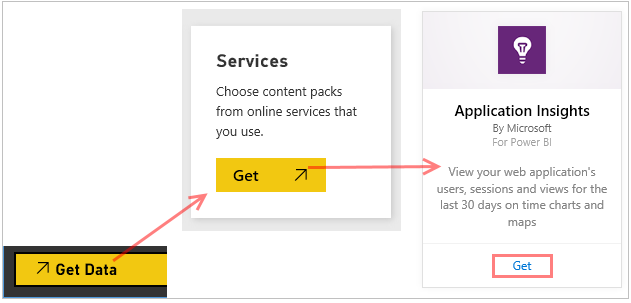
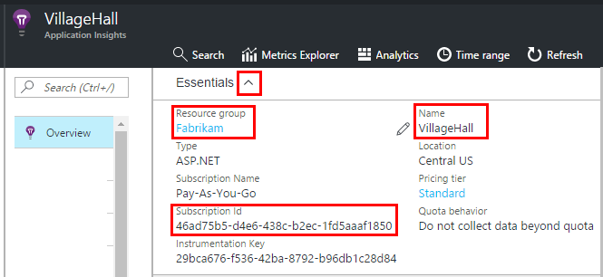
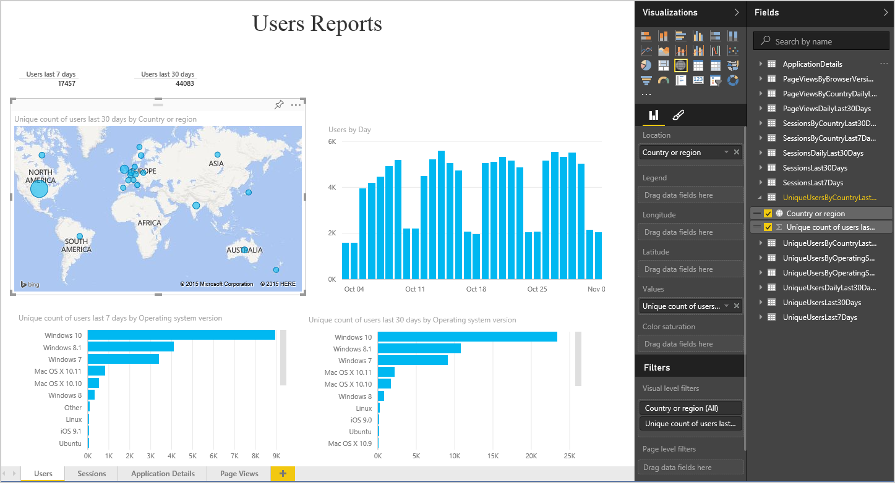
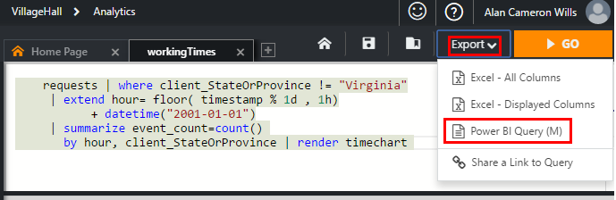
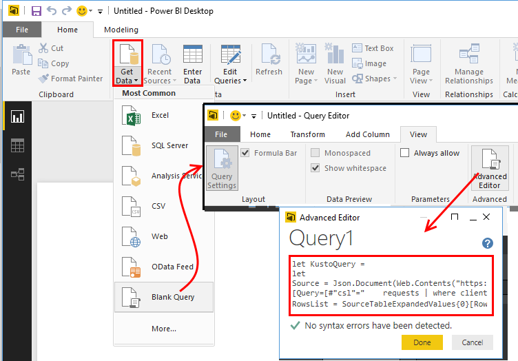
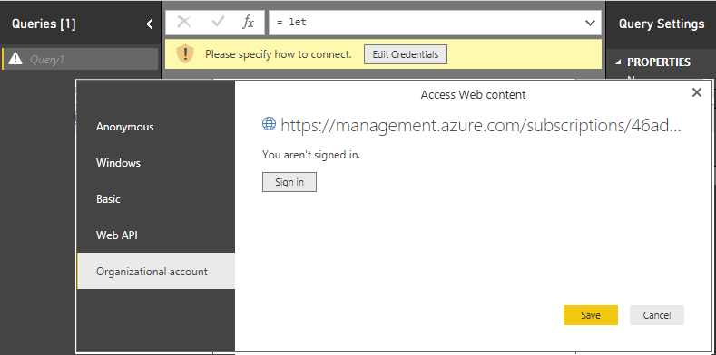
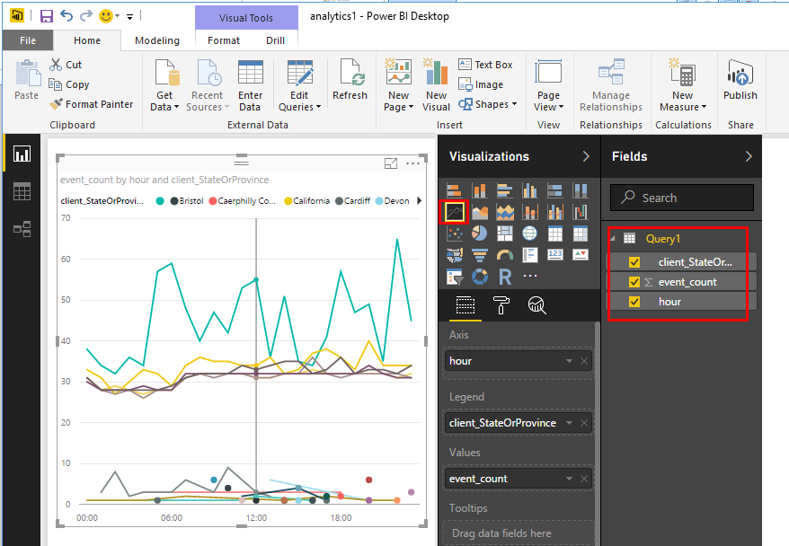
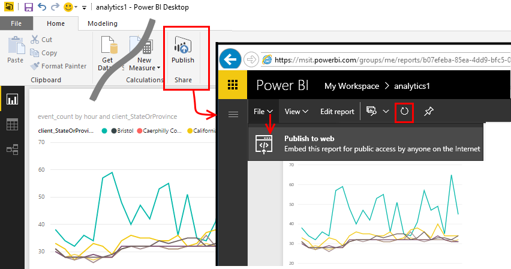

<properties 
    pageTitle="Exportieren von Anwendung Einsichten nach Power BI | Microsoft Azure" 
    description="Analytics-Abfragen können in Power BI angezeigt werden." 
    services="application-insights" 
    documentationCenter=""
    authors="noamben" 
    manager="douge"/>

<tags 
    ms.service="application-insights" 
    ms.workload="tbd" 
    ms.tgt_pltfrm="ibiza" 
    ms.devlang="na" 
    ms.topic="article" 
    ms.date="10/18/2016" 
    ms.author="awills"/>

# Power BI aus Anwendung Einsichten Feed

[Power BI](http://www.powerbi.com/) ist eine Sammlung von Business Analytics-Tools, die Ihnen helfen, Analysieren von Daten und Einsichten. Rich-Dashboards stehen auf jedem Gerät. Sie können Daten aus mehreren Quellen, einschließlich Analytics Abfragen von [Visual Studio-Anwendung Einsichten](app-insights-overview.md)kombinieren.

Es gibt drei Methoden zur empfohlene Datenexport Anwendung Einsichten zu Power BI aus. Sie können diese separat oder zusammen verwenden.

* [**Power BI-Netzwerkadapter**](#power-pi-adapter) – Einrichten eines vollständigen Dashboards der werden aus der app. Festlegen von Diagrammen vordefinierter ist, aber Sie können eigene Abfragen aus einem beliebigen anderen Quellen hinzufügen.
* [**Abfragen exportieren Analytics**](#export-analytics-queries) - schreiben Sie eine Abfrage, die Sie Analytics verwenden möchten, und in Power BI exportieren. Sie können diese Abfrage auf einem Dashboard zusammen mit den anderen Daten platzieren.
* [**Die fortlaufende exportieren und Stream Analytics**](app-insights-export-stream-analytics.md) – Dies umfasst mehr Arbeit einrichten. Es ist sinnvoll, wenn Sie Ihre Daten für längere Zeit beibehalten möchten. Andernfalls werden die anderen Methoden empfohlen.

## Power BI-Netzwerkadapter

Diese Methode wird ein abgeschlossen Dashboard der werden für Sie erstellt. Den ersten Datensatz ein vordefinierter ist, aber Sie können es weitere Daten hinzufügen.

### Abrufen der Netzwerkadapter

1. Melden Sie sich bei [Power BI](https://app.powerbi.com/).
2. **Abrufen von Daten**, die **Dienste**, die **Anwendung Einsichten** zu öffnen

    

3. Geben Sie die Details der Anwendung Einsichten Ressource ein.

    

4. Warten Sie eine oder zwei Minuten für die Daten importiert werden sollen.

    

Sie können im Dashboard bearbeiten, die Anwendung Einsichten Diagramme kombinieren, mit denen aus anderen Quellen und mit Analytics Abfragen. Es ist ein Katalog Visualisierung, wobei gelangen Sie weitere Diagramme und jedes Diagramm verfügt über eine Parameter, die Sie festlegen können.

Nach dem ersten Importieren weiterhin dem Dashboard und Berichte täglich zu aktualisieren. Sie können den Wert für Aktualisierungszeitplan auf das Dataset steuern.

## Exportieren von Analytics-Abfragen

Diese Routing können Sie alle Analytics-Abfrage aus, die Sie schreiben, und exportieren, die Sie dann in einer Power BI-Dashboard. (Sie können dem Dashboard erstellt, die Netzwerkadapter hinzufügen.)

### Einmaliges: Installieren der Power BI-Desktop

Um Ihre Abfrage Anwendung Einsichten zu importieren, verwenden Sie die desktop-Version von Power BI. Aber dann Veröffentlichung kann es im Web oder zu Ihrer Power BI Cloud-Arbeitsbereich. 

[Power BI-Desktop](https://powerbi.microsoft.com/en-us/desktop/)installiert.

### Exportieren einer Analytics-Abfrage

1. [Analytics öffnen, und Schreiben Sie Ihre Abfrage](app-insights-analytics-tour.md).
2. Testen Sie und Optimieren Sie die Abfrage aus, bis Sie mit dem Ergebnis zufrieden sind.
3. Wählen Sie im Menü **Exportieren von** **Power BI (M)**an. Speichern Sie die Textdatei an.

    
4. Wählen Sie in Power BI-Desktop **Daten abrufen, leere Abfrage** aus, und wählen Sie dann im Abfrage-Editor, klicken Sie unter **Ansicht** **Erweiterte Abfrage-Editor**.

    Fügen Sie das exportierte M Sprache Skript in den erweiterten Abfrage-Editor.

    

5. Möglicherweise müssen für die Anmeldeinformationen zum Power BI Azure Zugriff auf zulassen. Verwenden Sie 'organisationskonto' sich mit Ihrem Microsoft-Konto anmelden.

    

6. Wählen Sie eine Visualisierung für die Abfrage aus, und wählen Sie die Felder für x-, y-Achse und Segmentieren Dimension.

    

7. Veröffentlichen des Berichts in der Power BI Cloud-Arbeitsbereich. Hier können Sie eine synchronisierte Version in andere Webseiten einbetten.

    
 
8. Aktualisieren Sie den Bericht manuell in Abständen oder einer planmäßigen Aktualisierung klicken Sie auf der Optionsseite einrichten.

## Informationen zu werden

Wenn eine Anwendung eine große Datenmenge sendet, kann das Feature adaptive werden arbeiten und senden nur Prozentwert der werden. Dies gilt auch, wenn Sie manuell werden im SDK oder auf Aufnahme eingerichtet haben. [Weitere Informationen zu werden.](app-insights-sampling.md)
 

## Nächste Schritte

* [Power BI - Informationen](http://www.powerbi.com/learning/)
* [Analytics-Lernprogramm](app-insights-analytics-tour.md)
