<properties 
    pageTitle="Verwenden Sie Stream Analytics zum Verarbeiten von Anwendung Einsichten exportiert Daten | Microsoft Azure" 
    description="Stream Analytics können kontinuierlich transformieren, Filtern und die Daten, die Sie aus der Anwendung Einsichten exportieren weiterleiten." 
    services="application-insights" 
    documentationCenter=""
    authors="noamben" 
    manager="douge"/>

<tags 
    ms.service="application-insights" 
    ms.workload="tbd" 
    ms.tgt_pltfrm="ibiza" 
    ms.devlang="na" 
    ms.topic="article" 
    ms.date="10/18/2016" 
    ms.author="awills"/>

# <a name="use-stream-analytics-to-process-exported-data-from-application-insights"></a>Verwenden Sie Stream Analytics exportierte Daten aus der Anwendung Einsichten Verarbeitungszeit

[Azure Stream Analytics](https://azure.microsoft.com/services/stream-analytics/) ist das ideale Tool für die Verarbeitung von Daten [aus der Anwendung Einsichten exportiert](app-insights-export-telemetry.md). Stream Analytics können Daten aus einer Vielzahl von Datenquellen abrufen. Es kann transformieren und Filtern der Daten, und klicken Sie dann an eine Vielzahl von Empfängern weiterleiten.

In diesem Beispiel erstellen wir eine Netzwerkadapter, der erfasst Daten in der Anwendung Einblicken, umbenennen und einige Felder verarbeitet und leitet es in Power BI.

> [AZURE.WARNING] Es gibt viele besser und einfacher [Methoden zur Anwendung Einsichten in Power BI Datenanzeige empfohlen](app-insights-export-power-bi.md). Der Pfad hier dargestellt ist nur ein Beispiel zum Veranschaulichen der exportierte Daten zu verarbeiten.

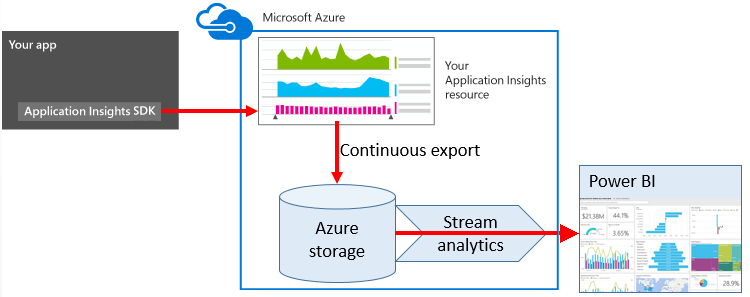


## <a name="create-storage-in-azure"></a>Erstellen von Speicher in Azure

Fortlaufender exportieren gibt Daten mit einer Firma Azure-Speicher immer aus, damit Sie zuerst die Speicherung zu erstellen müssen.

1.  Erstellen Sie ein "klassische" Speicherkonto in Ihr Abonnement im [Azure-Portal](https://portal.azure.com)an.

    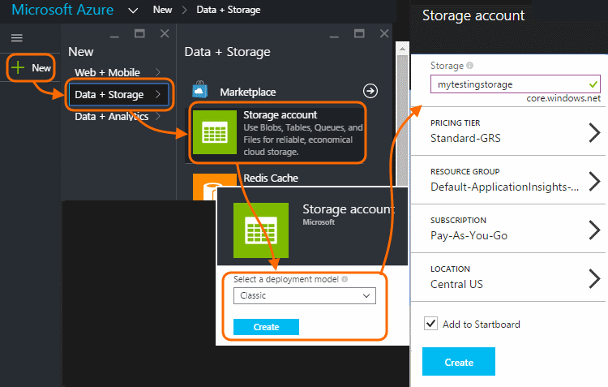

2. Erstellen eines Containers

    

3. Kopieren Sie die Zugriffstaste Speicher

    Sie benötigen sie schnell die Eingabe für den Stream Analytics-Dienst einrichten.

    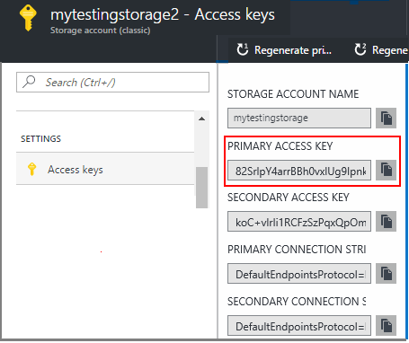

## <a name="start-continuous-export-to-azure-storage"></a>Fortlaufender in Azure-Speicher exportieren starten

Verschiebt [fortlaufend Exportieren von](app-insights-export-telemetry.md) Daten aus Anwendung Einblicke in Azure-Speicher.

1. Navigieren Sie zu der Anwendung Einsichten Ressource, die Sie für eine Anwendung erstellt haben, im Azure-Portal.

    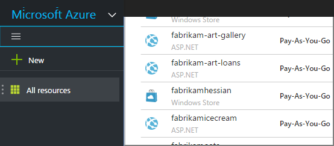

2. Erstellen Sie eine fortlaufende exportieren.

    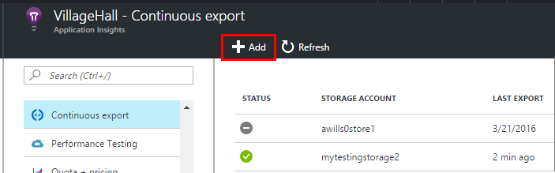


    Wählen Sie das Speicherkonto, die, das Sie zuvor erstellt haben:

    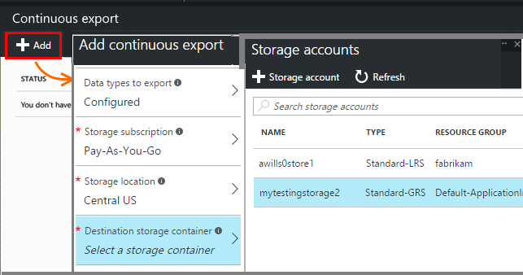
    
    Legen Sie die Ereignis Dateitypen, die angezeigt werden sollen:

    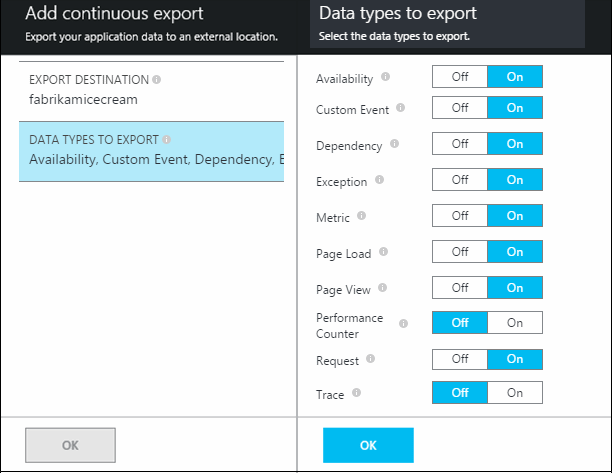

3. Zulassen, dass einige Daten zu sammeln. Befinden sich wieder aus, und lassen Sie Personen, die Anwendung für eine Weile verwendet werden. Nützlich sein werden sollen, und sehen Sie statistische Diagramme in [metrischen Explorer](app-insights-metrics-explorer.md) und einzelne Ereignisse in [diagnostic suchen](app-insights-diagnostic-search.md). 

    Und außerdem die Daten zu Ihrem Storage exportiert. 

4. Prüfen Sie die exportierten Daten ein. Wählen Sie in Visual Studio **Anzeigen / Cloud Explorer**, und öffnen Sie Azure / Speicher. (Wenn Sie mit dieser Option keine haben, müssen Sie das Azure SDK installieren: Öffnen Sie im Dialogfeld Neues Projekt und C#- / Cloud / Microsoft Azure SDK für .NET erhalten.)

    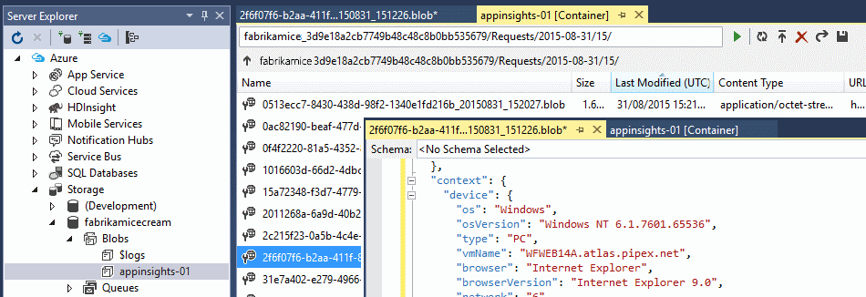

    Notieren Sie den allgemeinen Teil der Pfadnamen, die von Namen und Instrumentation Anwendungstaste abgeleitet wird. 

Der Ereignisse in Dateien im JSON-Format BLOB-geschrieben. Jede Datei kann ein oder mehrere Ereignisse enthalten. Daher möchten wir die Ereignisdaten lesen und die Felder, die später herausfiltern. Es werden alle Arten von Dinge, die wir die Daten gebotenen konnte, aber unsere Plan heute besteht darin, Stream Analytics verwenden, um die Daten Power BI leiten.

## <a name="create-an-azure-stream-analytics-instance"></a>Erstellen Sie eine Instanz Azure Stream Analytics

Wählen Sie aus dem [Klassischen Azure-Portal](https://manage.windowsazure.com/)den Dienst Azure Stream Analytics, und erstellen Sie einen neuen Stream Analytics Auftrag:


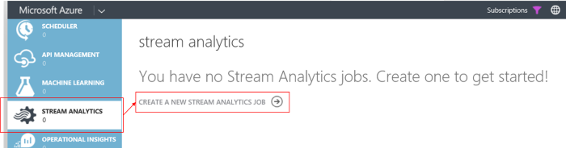


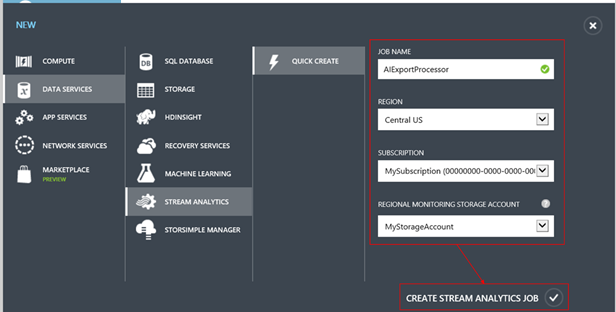

Wenn das neue Projekt erstellt wird, erweitern Sie seine Details:

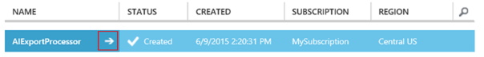


### <a name="set-blob-location"></a>Blob-Standort festlegen

Legen Sie es aus Ihrer fortlaufender exportieren Blob Eingabewerte durchführen:

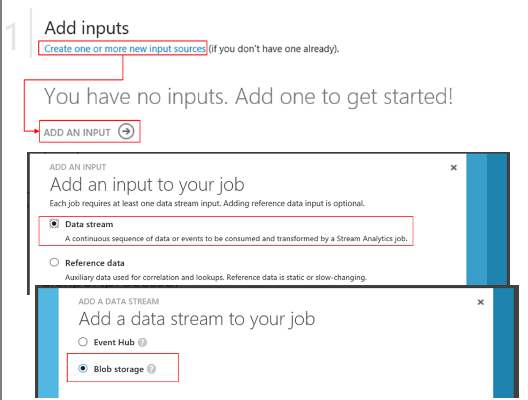

Jetzt benötigen die Access-Primärschlüssel aus Ihrem Konto Speicherplatz Sie, den Sie zuvor notiert haben. Setzen Sie diese als Speicherschlüssel-Konto ein.

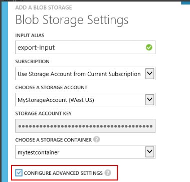

### <a name="set-path-prefix-pattern"></a>Set Pfad Präfixmuster 

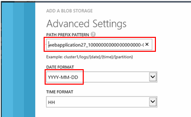


**Achten Sie darauf, um das Datumsformat auf JJJJ / MM / TT (mit Striche) festzulegen.**

Der Pfad Präfix Muster gibt an, wo Stream Analytics die Eingabewerte Dateien im Speicher findet. Sie müssen auf entsprechen wie die Daten fortlaufender Exportieren speichert festlegen. Legen Sie ihn wie folgt aus:

    webapplication27_12345678123412341234123456789abcdef0/PageViews/{date}/{time}

In diesem Beispiel:

* `webapplication27`ist der Name der Anwendung Einsichten Ressource **Alle Kleinbuchstaben**.
* `1234...`ist der Schlüssel Instrumentation der Anwendung Einsichten Ressource, **Striche auslassen**. 
* `PageViews`ist der Typ der Daten, die Sie analysieren möchten. Die verfügbaren Typen abhängig von der Filter, die, den Sie in fortlaufender exportieren festlegen. Prüfen Sie die exportierten Daten aus, um die anderen verfügbaren Typen anzuzeigen, und finden Sie unter dem [Datenmodell exportieren](app-insights-export-data-model.md).
* `/{date}/{time}`ein Muster wird Literal geschrieben werden.

> [AZURE.NOTE] Prüfen Sie die Speicherung, um sicherzustellen, dass Sie den Pfad rechts abzurufen.

### <a name="finish-initial-setup"></a>Ende der ersten Einrichtung

Bestätigen Sie das Format ein:

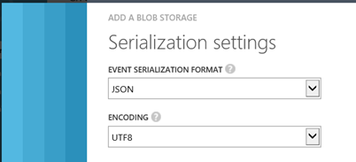

Schließen Sie den Assistenten, und warten Sie, bis das Setup abgeschlossen.

> [AZURE.TIP] Verwenden des Befehls Stichprobe einiger Daten herunterladen. Halten Sie es als Beispiel Testen Ihrer Abfrage Debuggen aus.

## <a name="set-the-output"></a>Stellen Sie die Ausgabe

Jetzt wählen Sie Ihre Position aus, und stellen Sie die Ausgabe.

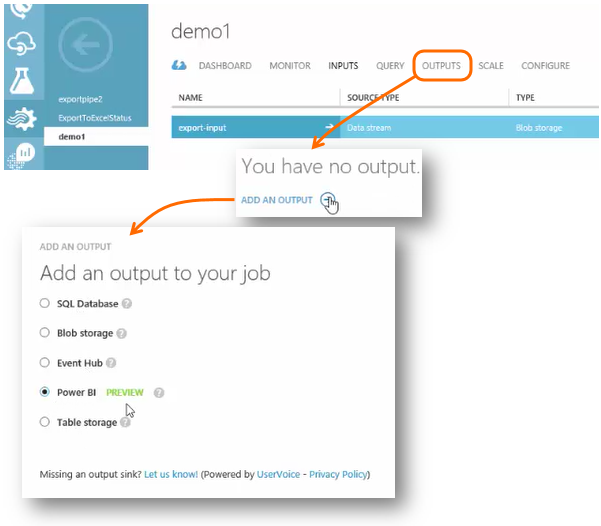

Stellen Sie Ihre **Arbeit oder Schule Konto** um Stream Analytics Zugriff auf Ihre Power BI-Ressource zu autorisieren. Festgelegter klicken Sie dann einen Namen für die Ausgabe und für das Ziel Power BI-Dataset und die Tabelle aus.

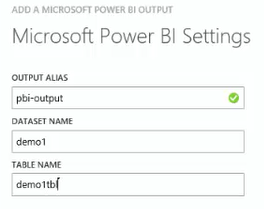

## <a name="set-the-query"></a>Festlegen der Abfrage

Die Abfrage steuert die Übersetzung Eingabe zur Ausgabe an.

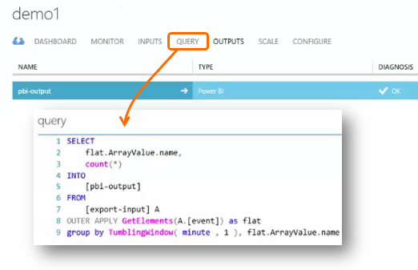


Verwenden Sie die Funktion Test, um zu überprüfen, dass Sie die richtige Ausgabe erhalten. Geben sie die Beispieldaten, die Sie von der Seite Eingaben zu erstellen. 

### <a name="query-to-display-counts-of-events"></a>Zählt die Abfrage zum Anzeigen von Ereignissen

Fügen Sie diese Abfrage:

```SQL

    SELECT
      flat.ArrayValue.name,
      count(*)
    INTO
      [pbi-output]
    FROM
      [export-input] A
    OUTER APPLY GetElements(A.[event]) as flat
    GROUP BY TumblingWindow(minute, 1), flat.ArrayValue.name
```

* Exportieren von Eingabefeldern ist der Alias, die, den wir in den Stream Eingabemethoden gegeben hat.
* Pbi-Ausgabe ist die Ausgabealias, die, den wir definiert
* Wir verwenden [ÄUßERE anwenden GetElements](https://msdn.microsoft.com/library/azure/dn706229.aspx) , da der Namen des Ereignisses ein geschachtelte JSON Arrray wird. Klicken Sie dann wählt auswählen aus den Namen des Ereignisses zusammen mit der Anzahl der Instanzen mit diesem Namen in den Zeitraum. Die [Group By](https://msdn.microsoft.com/library/azure/dn835023.aspx) -Klausel gruppiert die Elemente in Zeiträume von 1 Minute.


### <a name="query-to-display-metric-values"></a>Abfrage metrischen Werte angezeigt werden.


```SQL

    SELECT
      A.context.data.eventtime,
      avg(CASE WHEN flat.arrayvalue.myMetric.value IS NULL THEN 0 ELSE  flat.arrayvalue.myMetric.value END) as myValue
    INTO
      [pbi-output]
    FROM
      [export-input] A
    OUTER APPLY GetElements(A.context.custom.metrics) as flat
    GROUP BY TumblingWindow(minute, 1), A.context.data.eventtime

``` 

* Diese Abfrage erzeugt in der Kennzahlen werden, können Sie die Uhrzeit des Ereignisses und den metrischen Wert zu gelangen. Die metrischen Werte sind innerhalb einer Matrix zurück, damit wir das ÄUßERE anwenden GetElements Muster verwenden, um die Zeilen zu extrahieren. "MyMetric" ist der Name der Metrik in diesem Fall aus. 

### <a name="query-to-include-values-of-dimension-properties"></a>Abfrage Werte Dimension Eigenschaften aufnehmen möchten.

```SQL

    WITH flat AS (
    SELECT
      MySource.context.data.eventTime as eventTime,
      InstanceId = MyDimension.ArrayValue.InstanceId.value,
      BusinessUnitId = MyDimension.ArrayValue.BusinessUnitId.value
    FROM MySource
    OUTER APPLY GetArrayElements(MySource.context.custom.dimensions) MyDimension
    )
    SELECT
     eventTime,
     InstanceId,
     BusinessUnitId
    INTO AIOutput
    FROM flat

```

* Diese Abfrage enthält die Werte der Dimensionseigenschaften ohne je nach einer bestimmten Bemaßung an einem festen Index in der Matrix Dimension wird.

## <a name="run-the-job"></a>Führen Sie die Stapelverarbeitung

Sie können ein Datum in der Vergangenheit So starten Sie den Auftrag aus auswählen. 

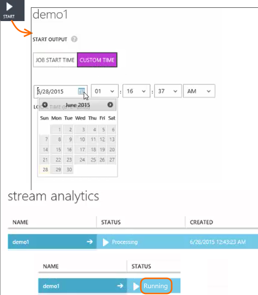

Warten Sie, bis das Projekt ausgeführt wird.

## <a name="see-results-in-power-bi"></a>Ergebnisse in der Power BI

> [AZURE.WARNING] Es gibt viele besser und einfacher [Methoden zur Anwendung Einsichten in Power BI Datenanzeige empfohlen](app-insights-export-power-bi.md). Der Pfad hier dargestellt ist nur ein Beispiel zum Veranschaulichen der exportierte Daten zu verarbeiten.

Öffnen Sie Power BI für Ihre Arbeit oder Schule Konto, und wählen Sie das Dataset und die Tabelle, die Sie als die Ausgabe des Streams Analytics Auftrags definiert.

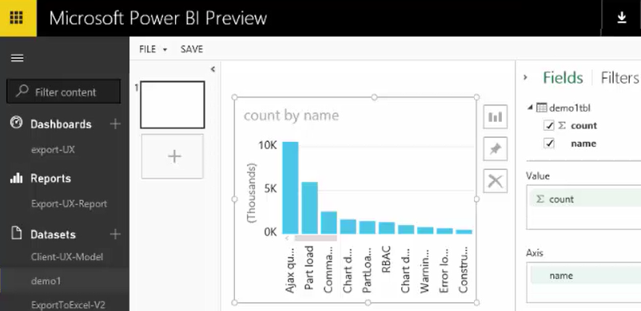

Jetzt können Sie dieses Dataset in Berichten und Dashboards in [Power BI](https://powerbi.microsoft.com).


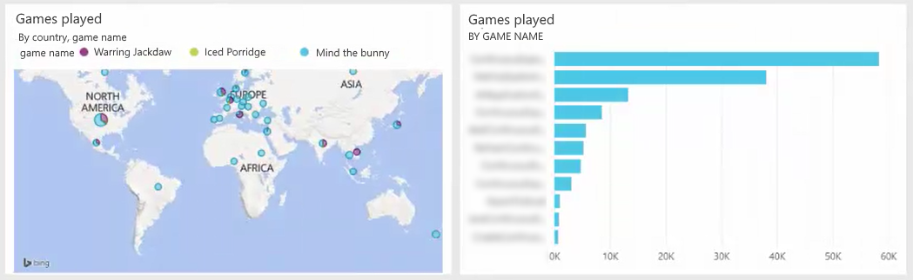


## <a name="no-data"></a>Keine Daten?

* Überprüfen Sie, die Sie [das Datumsformat festlegen](#set-path-prefix-pattern) ordnungsgemäß JJJJ / MM / TT (mit Striche).


## <a name="video"></a>Video

NOAM Ben Zeev wird gezeigt, wie exportierte Stream Analytics mit Daten zu verarbeiten.

> [AZURE.VIDEO export-to-power-bi-from-application-insights]

## <a name="next-steps"></a>Nächste Schritte

* [Fortlaufender exportieren](app-insights-export-telemetry.md)
* [Ausführliche Datenmodell Referenz für die Eigenschaftentypen und Werte.](app-insights-export-data-model.md)
* [Anwendung Einsichten](app-insights-overview.md)
* [Weitere Beispiele und exemplarische Vorgehensweisen](app-insights-code-samples.md)
 
