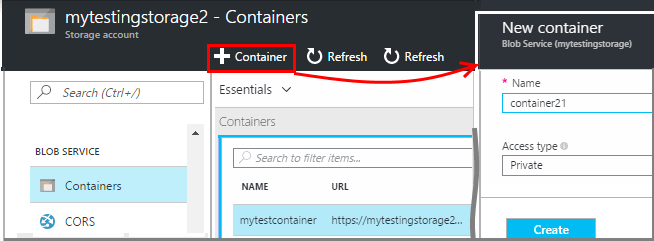
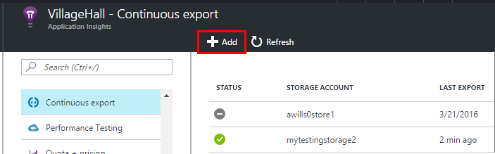
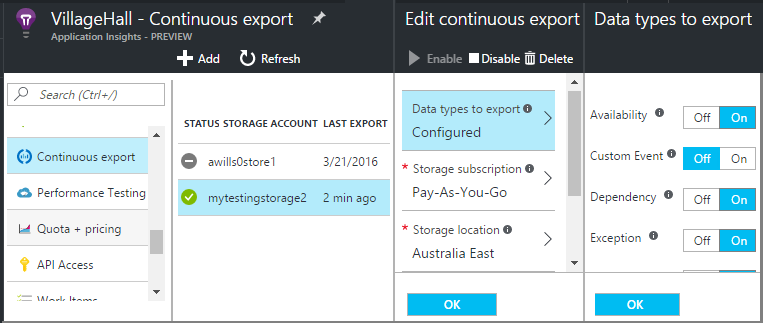
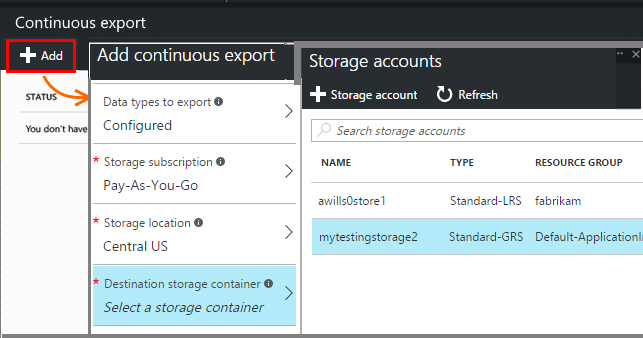
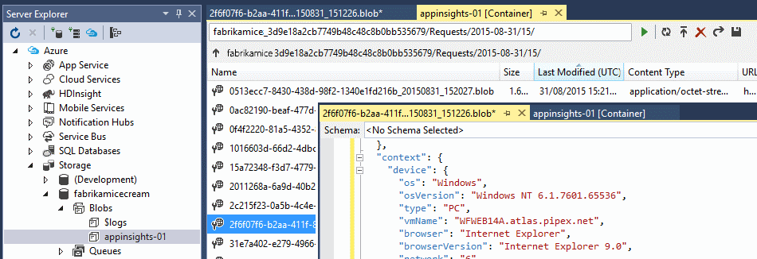
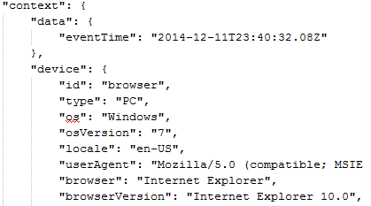
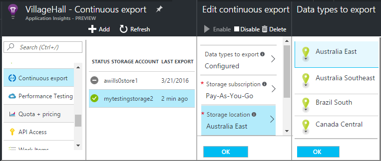

<properties 
    pageTitle="Fortlaufender des Exports von werden aus der Anwendung Einsichten | Microsoft Azure" 
    description="Diagnose- und die Verwendung von Daten in Speicher in Microsoft Azure exportieren und von dort herunterladen." 
    services="application-insights" 
    documentationCenter=""
    authors="alancameronwills" 
    manager="douge"/>

<tags 
    ms.service="application-insights" 
    ms.workload="tbd" 
    ms.tgt_pltfrm="ibiza" 
    ms.devlang="na" 
    ms.topic="article" 
    ms.date="10/18/2016" 
    ms.author="awills"/>
 
# Exportieren von werden aus Anwendung Einsichten

Möchten Sie Ihre werden länger als die standardmäßige Aufbewahrungszeitraum beibehalten? Oder auf spezielle Weise zu verarbeiten? Fortlaufender exportieren eignet sich hierfür ideal. Die Ereignisse, die im Portal Anwendung Einsichten angezeigt werden, können in Speicher in Microsoft Azure im JSON-Format exportiert werden. Sie können auch dort herunterladen von Daten und Schreiben jeder code müssen sie verarbeitet werden.  

Fortlaufender exportieren steht kostenlosen Testversion und in der [Standard- und Preise Pläne Premium](https://azure.microsoft.com/pricing/details/application-insights/).

Vor dem Einrichten von fortlaufender exportieren, gibt es einige Alternativen, die Sie berücksichtigen sollten:

* [Exportieren Sie die Schaltfläche](app-insights-metrics-explorer.md#export-to-excel) am oberen Rand einer Blade Kennzahlen oder suchen können Sie die übertragen von Tabellen und Diagramme in einer Excel-Kalkulationstabelle. 
* [Analytics](app-insights-analytics.md) bietet eine leistungsfähige Abfragesprache für werden, und Sie können auch Ergebnisse exportieren.
* Wenn Sie zum [Untersuchen von Daten in Power BI](http://blogs.msdn.com/b/powerbi/archive/2015/11/04/explore-your-application-insights-data-with-power-bi.aspx)gefunden haben, können Sie das erreichen, ohne fortlaufender exportieren.

## Erstellen Sie ein Speicherkonto

Wenn Sie bereits ein "klassische" Speicherkonto besitzen, erstellen Sie eine jetzt.

1. Erstellen Sie ein Speicherkonto in Ihr Abonnement im [Azure-Portal](https://portal.azure.com)an.

    

2. Erstellen eines Containers an.

    

## Einrichten von fortlaufender exportieren

Öffnen Sie in Ihrer Anwendung Übersicht Blade im Portal Anwendung Einblicken fortlaufender exportieren aus: 

Hinzufügen einer kontinuierlichen exportieren, und wählen Sie die Ereignistypen aus, die Sie exportieren möchten:

Wählen Sie aus, oder erstellen Sie das [Konto Azure-Speicher](../storage/storage-introduction.md) , in dem die Daten gespeichert werden sollen:

Nachdem Sie der Export erstellt haben, wird die vertraut gestartet. (Sie erhalten nur Daten, die nach der Erstellung des Exports eintreffen.) 

Es kann eine Verzögerung von ungefähr eine Stunde, bevor Sie Daten in der Blob angezeigt wird.

Wenn Sie die Ereignistypen später ändern möchten, bearbeiten Sie einfach die exportieren:

Um den Stream beenden möchten, klicken Sie auf deaktivieren. Wenn Sie erneut aktivieren klicken, wird der Stream mit neuen Daten neu gestartet. Daten, die im Portal eingegangen, während der Export deaktiviert wurde, wird nicht gelesen werden.

Löschen Sie den Export Streams dauerhaft um zu beenden. Auf diese Weise wird die Daten aus dem Speicher gelöscht.

#### Nicht hinzufügen oder Ändern einer exportieren?

* Zum Hinzufügen oder Ändern von Exporte, benötigen Sie Besitzer, Mitwirkender oder Anwendung Einsichten Mitwirkender Zugriffsrechte. [Informationen zu Rollen][roles].

## Welche Ereignisse erhalten Sie?

Die exportierten Daten ist der unformatierten werden, die wir von Ihrer Anwendung, erhalten, außer dass wir Standortdaten, die wir berechnen von die IP-Adresse des Clients hinzufügen. 

Daten, der durch [werden](app-insights-sampling.md) verworfen wurde, ist nicht in die exportierten Daten enthalten.

Andere berechneten Kennzahlen werden nicht berücksichtigt. Wir nicht beispielsweise durchschnittliche CPU-Auslastung, aber wir die unformatierten werden, aus denen der Mittelwert berechnet wird, exportieren.

Die Daten enthält auch die Ergebnisse der [Verfügbarkeit Webtests](app-insights-monitor-web-app-availability.md) , die Sie eingerichtet haben. 

> [AZURE.NOTE] **Stichprobe.** Wenn eine Anwendung eine große Datenmenge sendet, und Sie die Anwendung Einsichten SDK für ASP.NET Version 2.0.0-beta3 oder höher verwenden, möglicherweise das Feature adaptive werden die Steuerung und senden nur Prozentwert der werden. [Weitere Informationen zu werden.](app-insights-sampling.md)

## Prüfen Sie die Daten

Sie können die Speicherung direkt im Portal prüfen. Klicken Sie auf **Durchsuchen**, wählen Sie Ihr Speicherkonto aus, und klicken Sie dann öffnen Sie **Container**.

Öffnen Sie zum Prüfen von Azure-Speicher in Visual Studio **Anzeigen**, **Cloud-Explorer**ein. (Wenn Sie diesen Menübefehl im besitzen, müssen Sie das Azure SDK installieren: Öffnen Sie das Dialogfeld **Neues Projekt** , erweitern Sie Visual c# / Cloud, und wählen Sie die **Erste Microsoft Azure SDK für .NET**.)

Wenn Sie Ihre Blob-Speicher zu öffnen, sehen Sie einen Container mit einer Reihe von BLOB-Dateien. Der URI der einzelnen Dateien, die von Ihrer Anwendung Einsichten Ressourcenname, deren Instrumentation Schlüssel, telemetrieprotokoll-Typ/Datum/Uhrzeit abgeleitet. (Der Namen der Ressource ist Kleinbuchstaben und die Taste Instrumentation lässt Striche.)

Datum und Uhrzeit sind UTC und wenn die werden im Speicher - nicht die Zeit abgelegt wurde, die es erstellt wurde. Also wenn Schreiben von Code zum Herunterladen der Daten können sie linear durch die Daten verschieben.

So sieht das Formular den Pfad aus:

    $"{applicationName}_{instrumentationKey}/{type}/{blobDeliveryTimeUtc:yyyy-MM-dd}/{ blobDeliveryTimeUtc:HH}/{blobId}_{blobCreationTimeUtc:yyyyMMdd_HHmmss}.blob"
  
WHERE 

-   `blobCreationTimeUtc`Zeit, in der internen Blob erstellt wurde, die Speicher staging
-   `blobDeliveryTimeUtc`ist die Zeit, wann Blob in der Ziel-Speicher exportieren kopiert werden

## Datenformat

* Jede Blob ist eine Textdatei, die mehrere enthält ' \n'-separated Zeilen. Sie enthält die über einen Zeitraum von ungefähr eine halbe Minute verarbeitet werden.
* Jede Zeile stellt einen Datenpunkt werden wie eine Besprechungsanfrage oder Seite Ansicht.
* Jede Zeile ist ein unformatierten JSON-Dokument. Wenn Sie ungefähr und Fette starren möchten, öffnen Sie sie in Visual Studio, und wählen bearbeiten Sie, erweitert, Formatdatei:

Teilstriche, wo von 10 000 mehr Striche sind Zeit Dauer = 1 ms. Diese Werte anzeigen beispielsweise eine Uhrzeit von 1 ms eine Anforderung im Browser 3 MS es erhalten und 1.8s zum Verarbeiten der Seite im Browser zu senden:

    "sendRequest": {"value": 10000.0},
    "receiveRequest": {"value": 30000.0},
    "clientProcess": {"value": 17970000.0}

[Ausführliche Datenmodell Referenz für die Eigenschaftentypen und Werte.](app-insights-export-data-model.md)

## Verarbeitung der Daten

Klicken Sie auf eine kleine skalieren können Sie entsprechendem Code, um Ihre Daten Auseinanderziehen, lesen es in eine Kalkulationstabelle usw. schreiben. Beispiel:

    private IEnumerable<T> DeserializeMany<T>(string folderName)
    {
      var files = Directory.EnumerateFiles(folderName, "*.blob", SearchOption.AllDirectories);
      foreach (var file in files)
      {
         using (var fileReader = File.OpenText(file))
         {
            string fileContent = fileReader.ReadToEnd();
            IEnumerable<string> entities = fileContent.Split('\n').Where(s => !string.IsNullOrWhiteSpace(s));
            foreach (var entity in entities)
            {
                yield return JsonConvert.DeserializeObject<T>(entity);
            }
         }
      }
    }

Codebeispiel einer größeren finden Sie unter [Verwenden von Worker-Rolle][exportasa].

## Löschen Sie die alten Daten
Bitte beachten Sie, dass Sie für Ihre Speicherkapazität verwalten und löschen die alten Daten bei Bedarf verantwortlich sind. 

## Wenn Sie den Key Speicher neu generieren...

Wenn Sie die Taste in Ihrem Storage ändern, werden fortlaufender exportieren nicht mehr ausgeführt. Sie sehen eine Benachrichtigung in Ihrem Azure-Konto. 

Öffnen Sie das Blade fortlaufender exportieren und bearbeiten Sie Ihre exportieren. Bearbeiten Sie das Ziel exportieren, aber einfach ausgewählten denselben Speicher zu belassen. Klicken Sie auf OK, um zu bestätigen.

Die kontinuierliche exportieren wird neu gestartet.

## Exportieren von Beispielen

* [Exportieren Sie in eine Worker-Rolle mit SQL][exportcode]
* [Exportieren Sie in SQL mit Stream Analytics][exportasa]
* [Stream Analytics Stichprobe 2](app-insights-export-stream-analytics.md)

Erwägen Sie auf größere skaliert [HDInsight](https://azure.microsoft.com/services/hdinsight/) - Hadoop Cluster in der Cloud. HDInsight bietet eine Vielzahl von Technologien zum Verwalten und Analysieren von Daten groß.

## F & A

* *Aber ich möchte lediglich einen einmaligen Download eines Diagramms.*  
 
    Ja, können Sie das erreichen. Klicken Sie am oberen Rand der Blade auf [Daten exportieren](app-insights-metrics-explorer.md#export-to-excel).

* *Ich habe ein Export eingerichtet, aber darin keine Daten im eigenen Speicher.*

    Habe Anwendung Einsichten erhalten alle werden aus der app, da Sie den Export einrichten? Sie erhalten nur neue Daten.

* *Ich versucht, ein Export einrichten, aber der Zugriff verweigert wurde*

    Wenn das Konto Ihrer Organisation gehört, müssen Sie der Besitzer oder Mitwirkenden Gruppen angehören.

* *Kann ich direkt in meinen eigenen lokalen Store exportieren?* 

    Nein, es tut uns leid. Unsere Export-Engine arbeitet derzeit nur mit Azure-Speicher zu diesem Zeitpunkt.  

* *Bestehen Einschränkungen hinsichtlich der Datenmenge, die Sie im eigenen Speicher ablegen?* 

    Nein. Wir werden Daten ablegen beibehalten, bis Sie den Export löschen. Wir werden beenden, wenn wir die äußere Grenzwerte für Blob-Speicher haben, aber das ist ziemlich viel. Es liegt an Sie steuern, wie viel Speicherplatz Sie verwenden.  

* *Wie viele Blobs sollte im Speicher werden angezeigt?*

 * Für jede Datentyp, das Sie zum Exportieren ausgewählt haben, wird ein neuer Blob pro Minute erstellt (wenn die Daten zur Verfügung steht). 
 * Darüber hinaus werden weitere Partition Einheiten für Applikationen mit hoher Auslastung zugewiesen. In diesem Fall erstellt jede Einheit einen Blob pro Minute.

* *Ich erneut generiert die Taste auf Mein Speicher oder den Namen des Containers geändert, und jetzt der Export funktioniert nicht.*

    Bearbeiten Sie den Export aus, und öffnen Sie das Ziel-Blade exportieren. Lassen Sie denselben Speicher wie zuvor aktiviert, und klicken Sie auf OK, um zu bestätigen. Exportieren wird neu gestartet. Wenn die Änderung in den vergangenen Tagen wurde, gehen keine Daten verloren.

* *Kann ich den Export anhalten?*

    Ja. Klicken Sie auf deaktivieren.

## Codebeispielen

* [Analysieren Sie exportierte JSON mithilfe einer Worker-Rolle][exportcode]
* [Stream Analytics Stichprobe](app-insights-export-stream-analytics.md)
* [Exportieren Sie in SQL mit Stream Analytics][exportasa]

* [Ausführliche Datenmodell Referenz für die Eigenschaftentypen und Werte.](app-insights-export-data-model.md)

<!--Link references-->

[exportcode]: app-insights-code-sample-export-telemetry-sql-database.md
[exportasa]: app-insights-code-sample-export-sql-stream-analytics.md
[roles]: app-insights-resources-roles-access-control.md

 
