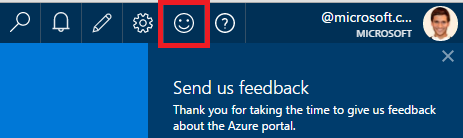
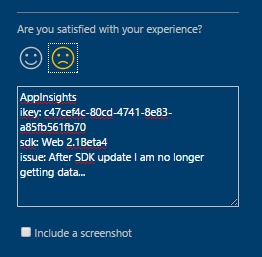
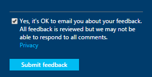

<properties 
    pageTitle="So erhalten Sie an den technischen Support von Anwendung Einsichten Entwicklungsteam | Microsoft Azure" 
    description="Wenn Sie eine Anfrage, die besondere Unterstützung von Anwendung Einsichten Entwicklungsteam erforderlich sind haben, ist dies an, wie Sie die Details zum Abrufen von Support senden können." 
    services="application-insights" 
    documentationCenter=""
    authors="alexbulankou" 
    manager="douge"/>
 
<tags 
    ms.service="application-insights" 
    ms.workload="tbd" 
    ms.tgt_pltfrm="ibiza" 
    ms.devlang="na" 
    ms.topic="article" 
    ms.date="06/01/2016" 
    ms.author="albulank"/>
    
# <a name="how-to-get-technical-support-from-application-insights-development-team"></a>So erhalten Sie an den technischen Support von Anwendung Einsichten Entwicklungsteam
    
Wenn Sie ein technisches Problem mit [Visual Studio-Anwendung Einsichten](app-insights-overview.md)haben, hier Ihre Optionen zum Aufrufen der Hilfe zur Verfügung:

## <a name="1-check-the-documents"></a>1. Überprüfen Sie 1. die Dokumente

* Fehlende Daten? Kontrollkästchen: [Stichproben](app-insights-sampling.md), [Kontingente und Beschränkung](app-insights-pricing.md).
* Problembehandlung: [ASP.NET](app-insights-troubleshoot-faq.md) | [Java](app-insights-java-troubleshoot.md)

## <a name="2-search-the-forums"></a>2 durchsuchen Sie 2 die Foren

* [MSDN-forum](https://social.msdn.microsoft.com/Forums/vstudio/home?forum=ApplicationInsights)
* [StackOverflow](http://stackoverflow.com/questions/tagged/ms-application-insights)

## <a name="3-azure-support-plan"></a>3. Azure-Support-Plan?

Es gibt Situationen, in dem Sie Entwicklern das speziellen Fall ermitteln möchten. 

Wenn Sie einen [Plan mit Microsoft Azure unterstützen](https://azure.microsoft.com/support/plans/) haben können Sie [eine Support-Ticket zu öffnen](https://portal.azure.com/?#blade/Microsoft_Azure_Support/HelpAndSupportBlade).

## <a name="4-contact-the-application-insights-team"></a>4 wenden Sie sich an das Team Einsichten Anwendung

Wenn Sie einen Support-Plan verfügen, ist unser Entwicklungsteam gerne optimale Leistung Support für Anwendung Einsichten anbieten, bei der Vorbereitung für den Meilenstein allgemeinen Verfügbarkeit gebracht. Wir einführen, **eine neue Support-Option**: Sie können Ihr Fall uns durch Senden eines Formulars Feedback Azure-Portal zu beschreiben und einen Entwickler haben, klicken Sie auf die Anwendung Einsichten Team Kontakt Sie wieder, um das Problem zu beheben.


1. Klicken Sie im [Portal Anwendung Einsichten](https://portal.azure.com)das Smiley in der oberen rechten Ecke auf:  

       

2. Klicken Sie in das Kommentarfeld stellen Sie sicher, **AppInsights** als erste Zeile angeben, und machen Sie folgende Angaben:   

    ```

    AppInsights   
    ikey: <instrumentation key>   
    sdk: <SDK that you are using, including name and version>  
    issue: <please describe the problem you are having>

    ```   

       

3. Aktivieren Sie "Ja, es ok, um Sie per e-Mail senden ist". 

      

Ein Engineering Anwendung Einsichten Teammitglieder wird bald erreichen. Wie wir für diesen Dienst auf Basis für optimale Leistung bereit sind, kann keine formale Vereinbarung zum SERVICELEVEL zu diesem Zeitpunkt angegeben sein.


