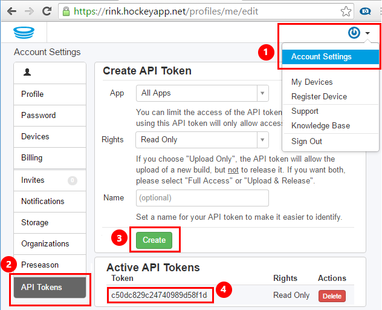
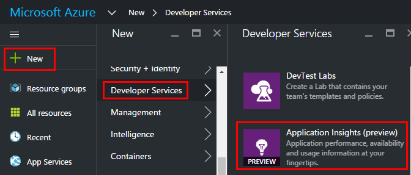
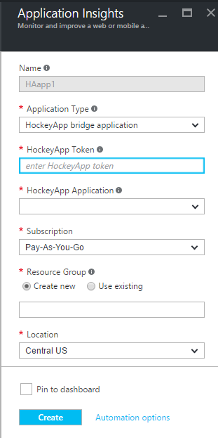
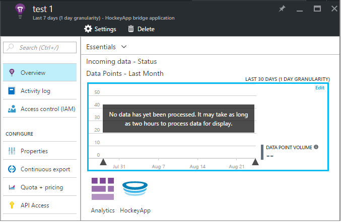
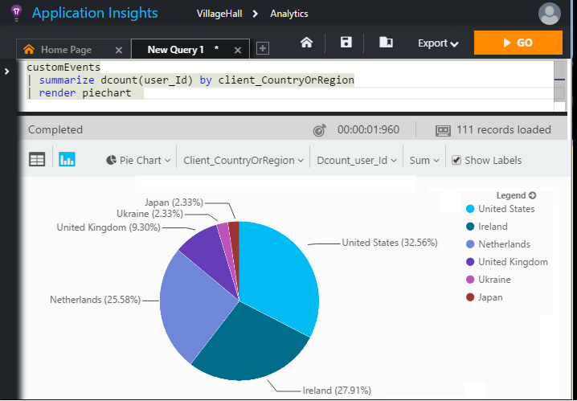

<properties 
    pageTitle="Untersuchen von Daten in der Anwendung Einblicken, HockeyApp | Microsoft Azure" 
    description="Verwendung und Leistung der Azure app mit Anwendung Einsichten zu analysieren." 
    services="application-insights" 
    documentationCenter="windows"
    authors="alancameronwills" 
    manager="douge"/>

<tags 
    ms.service="application-insights" 
    ms.workload="tbd" 
    ms.tgt_pltfrm="ibiza" 
    ms.devlang="na" 
    ms.topic="article" 
    ms.date="08/25/2016" 
    ms.author="awills"/>

#  Untersuchen von Daten in der Anwendung Einblicken, HockeyApp

[HockeyApp](https://azure.microsoft.com/services/hockeyapp/) ist die empfohlene Plattform für die Überwachung live Desktop- und mobile-apps. HockeyApp können Sie benutzerdefinierte senden und Spur zum Überwachen der Verwendung und unterstützen von Diagnose (zusätzlich zum Abrufen von Absturzdaten) werden. Dieser Stream von werden kann mithilfe des leistungsstarken [Analytics](app-insights-analytics.md) -Features von [Visual Studio-Anwendung Einsichten](app-insights-overview.md)abgefragt werden. Darüber hinaus können Sie [das benutzerdefinierte exportieren und verfolgen werden](app-insights-export-telemetry.md). Um diese Features zu aktivieren, richten Sie eine Verbindung aus, die Daten HockeyApp Anwendung Einsichten weiterleitet.

## Die HockeyApp Bridge-app

Die HockeyApp Bridge-App ist die Core-Feature, mit dem Sie Ihre HockeyApp Daten in der Anwendung Einsichten über die Analytics zugreifen kann und die Features fortlaufender exportieren. Durch HockeyApp nach der Erstellung der App Bridge HockeyApp gesammelten Daten aus dieser Features zugegriffen werden. Lassen Sie uns erfahren Sie, wie eine der folgenden Bridge Apps einrichten.

Öffnen Sie in HockeyApp Kontoeinstellungen, [API Token](https://rink.hockeyapp.net/manage/auth_tokens)aus. Erstellen Sie ein neues Token oder wiederverwenden einer vorhandenen Schablone. Der minimalen Rechte erforderlich "schreibgeschützt sind". Nehmen Sie eine Kopie der API token.

Öffnen Sie die Microsoft Azure-Portal und [Erstellen Sie eine Anwendung Einsichten Ressource](app-insights-create-new-resource.md)an. Legen Sie Anwendungstyp auf "HockeyApp Bridge-Anwendung":

Sie brauchen einen Namen festlegen – diese Einstellung automatisch aus den Namen HockeyApp fest.

HockeyApp Bridge Felder angezeigt. 

Geben Sie das HockeyApp Token, die, das Sie zuvor notiert haben. Diese Aktion füllt mit sämtliche HockeyApp Anwendung im Dropdownmenü "HockeyApp Anwendung". Wählen Sie das Element, das Sie verwenden möchten, und füllen Sie die Felder. 

Öffnen Sie die neue Ressource ein. 

Beachten Sie, dass die Daten eine Weile Starten entdeckt annimmt.

Das war's schon! In Ihrer app HockeyApp instrumentierte auf Dokument ab hier erfassten Daten ist jetzt auch in der Analytics und fortlaufender exportieren Funktionen der Anwendung Einsichten zur Verfügung.

Lassen Sie uns kurz jedes dieser Features jetzt zur Verfügung.

## Analytics

Analytics ist ein leistungsfähiges Tool für die Ad-hoc-Abfrage der Daten, so dass Sie diagnostizieren und analysieren Ihre werden und schnell ermitteln Ursachen und Muster.

* [Weitere Informationen zu Analytics](app-insights-analytics-tour.md)
* [Einführungsvideo](https://channel9.msdn.com/events/Build/2016/T666)
* [Erweiterte Konzepte video](https://channel9.msdn.com/Events/Build/2016/P591)

## Fortlaufender exportieren

Fortlaufender exportieren können Sie Ihre Daten in einem Container Azure BLOB-Speicher exportieren. Dies ist sehr hilfreich, wenn Sie Ihre Daten länger als die aktuell Anwendung Einsichten angebotenen Aufbewahrungszeitraum noch benötigen. Sie können die Daten weiterhin in Blob-Speicher, in einer SQL-Datenbank oder eine Lösung für Ihre bevorzugten Datawarehousing zu verarbeiten.

[Weitere Informationen zu fortlaufender exportieren](app-insights-export-telemetry.md)

## Nächste Schritte

* [Anwenden von Analytics auf Ihre Daten](app-insights-analytics-tour.md)

