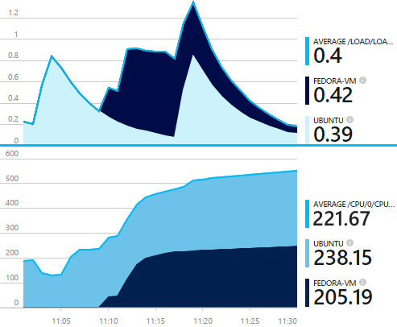
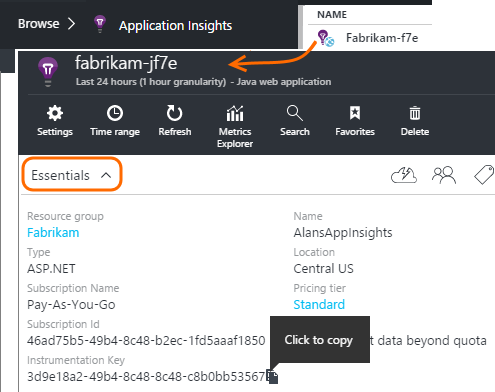
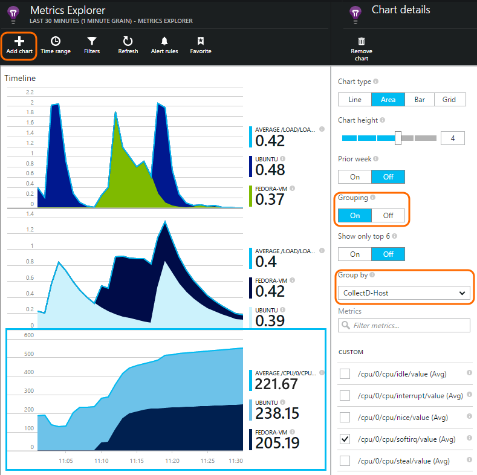

<properties 
    pageTitle="Collectd: Perf Stats für Java unter Unix in Anwendung Einsichten" 
    description="Überwachen Ihrer Java-Website mit der CollectD-Plug-In für die Anwendung Einsichten erweiterten" 
    services="application-insights" 
    documentationCenter="java"
    authors="alancameronwills" 
    manager="douge"/>

<tags 
    ms.service="application-insights" 
    ms.workload="tbd" 
    ms.tgt_pltfrm="ibiza" 
    ms.devlang="na" 
    ms.topic="article" 
    ms.date="08/24/2016" 
    ms.author="awills"/>
 
# <a name="collectd-unix-performance-metrics-in-application-insights"></a>Collectd: Unix Performance-Werte in der Anwendung Einsichten

*Anwendung Einsichten ist in der Vorschau.*

Installieren Sie zum Untersuchen von Unix System Performance-Werte in der [Anwendung Einsichten](app-insights-overview.md) [Collectd](http://collectd.org/)zusammen mit der Anwendung Einsichten-Plug-in aus. Diese Open Source-Lösung sammelt verschiedene System und Netzwerk-Statistiken an.

In der Regel werden Sie Collectd verwenden, wenn [Ihre Java-Webdiensts mit Anwendung Einsichten instrumentiert]bereits[java]. Sie erfahren mehr Daten, mit deren Hilfe Sie verbessern die Leistung Ihrer Anwendung oder Probleme erkennen. 



## <a name="get-your-instrumentation-key"></a>Abrufen der Instrumentation-Taste

Öffnen Sie im [Portal von Microsoft Azure](https://portal.azure.com)- [Anwendung Einsichten](app-insights-overview.md) Ressource, werden die Daten angezeigt werden soll. (Oder [Erstellen Sie eine neue Ressource](app-insights-create-new-resource.md)).

Nehmen Sie eine Kopie der Schlüssel Instrumentation, der die Ressource identifiziert.




## <a name="install-collectd-and-the-plug-in"></a>Installieren von Collectd und das plug-in

Klicken Sie auf den Unix-Servercomputern:

1. Installieren von [Collectd](http://collectd.org/) Version 5.4.0 oder höher.
2. Laden Sie die [Anwendung Einsichten Collectd Autor-Plug-in](https://aka.ms/aijavasdk). Beachten Sie die Versionsnummer.
3. Kopieren Sie das Plug-in-JAR-in `/usr/share/collectd/java`.
3. Bearbeiten von `/etc/collectd/collectd.conf`:
 * Stellen Sie sicher, dass die [der Java-Plug-Ins](https://collectd.org/wiki/index.php/Plugin:Java) aktiviert ist.
 * Aktualisieren der JVMArg für die java.class.path, wenn Sie die folgenden JAR einbeziehen möchten. Aktualisieren Sie die Versionsnummer der übereinstimmt, die Sie heruntergeladen haben:
  * `/usr/share/collectd/java/applicationinsights-collectd-1.0.5.jar`
 * Fügen Sie dieser Ausschnitt, verwenden die Taste Instrumentation aus der Ressource hinzu:

```

     LoadPlugin "com.microsoft.applicationinsights.collectd.ApplicationInsightsWriter"
     <Plugin ApplicationInsightsWriter>
        InstrumentationKey "Your key"
     </Plugin>
```

Hier ist ein Teil einer Stichprobe Konfigurationsdatei:

    ...
    # collectd plugins
    LoadPlugin cpu
    LoadPlugin disk
    LoadPlugin load
    ...

    # Enable Java Plugin
    LoadPlugin "java"

    # Configure Java Plugin
    <Plugin "java">
      JVMArg "-verbose:jni"
      JVMArg "-Djava.class.path=/usr/share/collectd/java/applicationinsights-collectd-1.0.5.jar:/usr/share/collectd/java/collectd-api.jar"

      # Enabling Application Insights plugin
      LoadPlugin "com.microsoft.applicationinsights.collectd.ApplicationInsightsWriter"
                
      # Configuring Application Insights plugin
      <Plugin ApplicationInsightsWriter>
        InstrumentationKey "12345678-1234-1234-1234-123456781234"
      </Plugin>

      # Other plugin configurations ...
      ...
    </Plugin>
.   ...

Konfigurieren von anderen [Collectd-Plug-Ins](https://collectd.org/wiki/index.php/Table_of_Plugins), die verschiedene Daten aus verschiedenen Quellen erfassen können.

Starten Sie Collectd entsprechend der zugehörigen- [Manuelle](https://collectd.org/wiki/index.php/First_steps)neu.

## <a name="view-the-data-in-application-insights"></a>Anzeigen von Daten in der Anwendung Einsichten

Öffnen Sie in Ihrer Anwendung Einsichten Ressource [Kennzahlen Explorer und Hinzufügen von Diagrammen][metrics], Auswählen der Metrik, die von der Kategorie Benutzerdefiniert angezeigt werden sollen.



Standardmäßig werden die Metrik auf allen Hostcomputern aggregiert aus denen die Metrik gesammelt wurden. Zum Anzeigen der Metrik pro Host, in dem Diagramm Details Blade Gruppierung aktivieren Sie, und wählen Sie dann auf Gruppieren nach CollectD-Host.


## <a name="to-exclude-upload-of-specific-statistics"></a>Hochladen von bestimmter Statistiken ausschließen

Standardmäßig sendet die Anwendung Einsichten-Plug-in alle von gesammelten Daten werden alle aktiviert Collectd 'Lesen'-Plug-Ins. 

Daten aus bestimmten-Plug-Ins oder Datenquellen ausschließen möchten:

* Bearbeiten Sie die Konfigurationsdatei. 
* In `<Plugin ApplicationInsightsWriter>`, fügen Sie die Richtlinie Zeilen wie folgt:

Richtlinie | Effekt
---|---
`Exclude disk` | Ausschließen von gesammelte alle Daten der `disk` -Plug-Ins
`Exclude disk:read,write` | Ausschließen von Quellen mit dem Namen `read` und `write` aus der `disk` -Plug-in.

Separate Richtlinien für eine neue Zeile.


## <a name="problems"></a>Probleme?

*Daten im Portal nicht angezeigt werden.*

* Öffnen Sie die [Suche] [ diagnostic] um festzustellen, ob die unformatierten Ereignisse eingegangen sind. Manchmal haben diese mehr Kennzahlen Explorer angezeigt werden sollen.
* Sie müssen [Firewallausnahmen für ausgehende Daten](app-insights-ip-addresses.md) festlegen
* Aktivieren Sie gezeichnet, die in der Anwendung Einsichten-Plug-in. Fügen Sie diese Zeile in `<Plugin ApplicationInsightsWriter>`:
 *  `SDKLogger true`
* Öffnen Sie ein Terminal, und starten Sie Collectd im ausführlichen Modus, um Probleme anzuzeigen, die sie ein Bericht erstellt wird:
 * `sudo collectd -f`


<!--Link references-->

[api]: app-insights-api-custom-events-metrics.md
[apiexceptions]: app-insights-api-custom-events-metrics.md#track-exception
[availability]: app-insights-monitor-web-app-availability.md
[diagnostic]: app-insights-diagnostic-search.md
[eclipse]: app-insights-java-eclipse.md
[java]: app-insights-java-get-started.md
[javalogs]: app-insights-java-trace-logs.md
[metrics]: app-insights-metrics-explorer.md
[usage]: app-insights-web-track-usage.md

 
