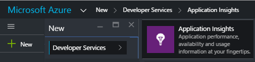
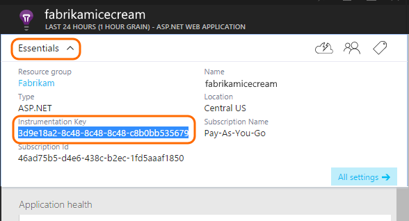
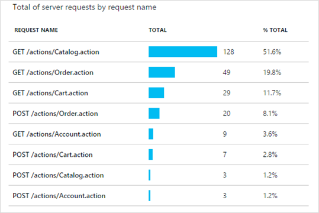
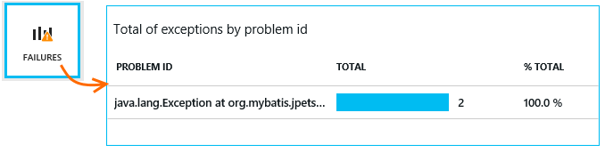

<properties 
    pageTitle="Erste Schritte mit der Anwendung Einsichten mit Java in "Ellipse"" 
    description="Verwenden Sie die Ellipse-Plug-in, um Leistung und Verwendung Ihrer Java-Website mit Anwendung Einsichten Überwachung hinzufügen" 
    services="application-insights" 
    documentationCenter="java"
    authors="alancameronwills" 
    manager="douge"/>

<tags 
    ms.service="application-insights" 
    ms.workload="tbd" 
    ms.tgt_pltfrm="ibiza" 
    ms.devlang="na" 
    ms.topic="article" 
    ms.date="03/02/2016" 
    ms.author="awills"/>
 
# Erste Schritte mit der Anwendung Einsichten mit Java in "Ellipse"

Die Anwendung Einsichten SDK sendet werden aus Ihrer Java-Web-Anwendung, sodass Sie Verwendung und analysieren können. Das plug-in für Anwendung Einsichten "Ellipse" installiert das SDK automatisch in Ihrem Projekt, damit Sie außerhalb des im Feld werden sowie eine API, mit denen Sie benutzerdefinierte werden schreiben, erhalten.   

## Erforderliche Komponenten

Aktuell-Plug-Ins Works für Maven und dynamische Webprojekte in "Ellipse". ([Hinzufügen Anwendung Einsichten an andere Typen von Java-Projekts][java].)

Sie müssen:

* Oracle JRE 1.6 oder höher
* Ein [Microsoft Azure](https://azure.microsoft.com/)-Abonnement. (Sie können mit der [kostenlose Testversion](https://azure.microsoft.com/pricing/free-trial/)beginnen.)
* [Ellipse IDE für Java EE-Entwickler](http://www.eclipse.org/downloads/), Indigo oder höher.
* Windows 7 oder höher oder WindowsServer 2008 oder höher

## Installieren Sie das SDK auf die Ellipse (einmal)

Sie müssen nur einmal pro Computer durchführen. Durch diesen Schritt wird ein Toolkit, das dann das SDK jedes dynamische Web-Projekt hinzufügen kann.

1. Klicken Sie in "Ellipse" klicken Sie auf Hilfe, neue Software installieren.

    

2. Das SDK ist in http://dl.windowsazure.com/eclipse, klicken Sie unter Azure-Toolkit. 
3. Deaktivieren Sie **... Wenden Sie sich an alle Update-Websites**

    

Führen Sie die restlichen Schritte für jedes Projekt Java aus.

## Erstellen Sie eine Ressource Anwendung Einsichten in Azure

1. Melden Sie sich mit dem [Azure-Portal](https://portal.azure.com)aus.
2. Erstellen einer neuen Anwendung Einsichten Ressource an.  

      
3. Legen Sie den Anwendungstyp auf Java-Webanwendung an.  

      
4. Suchen Sie den Instrumentation Schlüssel der neuen Ressource. Sie müssen diese in Kürze in das Codeprojekt einfügen.  

      

## Hinzufügen der Anwendung Einsichten zu einem Projekt

1. Fügen Sie aus dem Kontextmenü des Projekts Web Java Anwendung Einsichten hinzu.

    

2. Fügen Sie die Instrumentation-Taste, die Sie von der Azure-Portal erhalten haben.

    

Der Schlüssel wird zusammen mit wird jedes Element der werden gesendet und erfahren Einsichten Anwendung, um es in Ihre Ressourcen anzuzeigen.

## Führen Sie die Anwendung, und finden Sie unter Kennzahlen

Führen Sie die Anwendung.

Kehren Sie zu Ihrer Anwendung Einsichten Ressource in Microsoft Azure zurück.

HTTP-Anfragen Daten werden auf dem Blade Übersicht angezeigt. (Falls dies erforderlich ist, warten Sie einige Sekunden, und klicken Sie dann auf aktualisieren.)

 

Klicken Sie auf, bis alle Diagramm ausführlichere Metrik finden Sie unter. 

[Weitere Informationen zu Kennzahlen.][metrics]

 

Und beim Anzeigen der Eigenschaften einer Anforderung können Sie sehen, wie Besprechungsanfragen und Ausnahmen zugeordnet werden Ereignisse.
 

## Clientseitige werden

Klicken Sie auf Get-Code zum Überwachen der meine Webseiten, aus dem Blade Schnellstart: 

Fügen Sie den Codeausschnitt im Kopf der HTML-Dateien.

#### Clientseitige-Anzeigedaten

Öffnen Sie die aktualisierten Webseiten und verwenden Sie können. Warten Sie eine oder zwei Minuten, und klicken Sie dann zurückkehren Sie zur Anwendung Einsichten aus, und öffnen Sie das Blade Verwendung. (Aus dem Blade Übersicht über einen Bildlauf nach unten, und klicken Sie auf Verwendung.)

Seite anzeigen, Benutzer- und Sitzung Kennzahlen werden auf dem Blade Verwendung angezeigt:

[Weitere Informationen zum Einrichten von clientseitige werden.][usage]

## Veröffentlichen Sie die Anwendung

Veröffentlichen Sie Ihre app jetzt auf dem Server, Personen verwenden, und Anzeigen der werden im Portal angezeigt.

* Stellen Sie sicher, dass Ihre Firewall Ihrer Anwendung werden an diese Ports senden können:

 * DC.Services.VisualStudio.com:443
 * DC.Services.VisualStudio.com:80
 * F5.Services.VisualStudio.com:443
 * F5.Services.VisualStudio.com:80

* Klicken Sie auf Windows-Servern zu installieren:

 * [Microsoft Visual C++ Redistributable](http://www.microsoft.com/download/details.aspx?id=40784)

    (Dies ermöglicht Leistungsindikatoren.)

## Ausnahmen und Fehlern Anforderung

Ausnahmefehler werden automatisch erfasst:

Zum Sammeln von Daten auf anderen Ausnahmen, haben Sie zwei Optionen:

* [Anrufe an TrackException in den Code einzufügen](app-insights-api-custom-events-metrics.md#track-exception). 
* [Installieren Sie den Java-Agent auf dem Server](app-insights-java-agent.md). Sie angeben die Methoden, die Sie anzeigen möchten.

## Überwachen der Methode Anrufe und externe Abhängigkeiten

Bei der Anmeldung beim [Installieren des Java-Agents](app-insights-java-agent.md) angegebenen internen Methoden und Anrufe über JDBC, Anzeigedauer Daten.

## -Datenquellen

In der Übersicht Blade einen Bildlauf nach unten, und klicken Sie auf die Kachel **Servers** . Sehen Sie einen Zellbereich Leistungsindikatoren ein.

### Anpassen der Leistung Zähler Websitesammlung

Fügen Sie den folgenden Code unter dem Stammknoten der Datei ApplicationInsights.xml, um Sammlung von dem Standardsatz der Leistungsindikatoren zu deaktivieren:

    <PerformanceCounters>
       <UseBuiltIn>False</UseBuiltIn>
    </PerformanceCounters>

### Sammeln zusätzlicher Leistungsindikatoren

Sie können zusätzliche Leistungsindikatoren benutzerspezifisch zusammengestellten angeben.

#### JMX Indikatoren (verfügbar gemacht werden durch die Java virtuellen Computern)

    <PerformanceCounters>
      <Jmx>
        <Add objectName="java.lang:type=ClassLoading" attribute="TotalLoadedClassCount" displayName="Loaded Class Count"/>
        <Add objectName="java.lang:type=Memory" attribute="HeapMemoryUsage.used" displayName="Heap Memory Usage-used" type="composite"/>
      </Jmx>
    </PerformanceCounters>

*   `displayName`– Der Name der Anwendung Einsichten Portal angezeigt.
*   `objectName`– Die JMX zu verwendenden Objektnamen.
*   `attribute`– Das Attribut für die zu verwendenden Objektnamen JMX abgerufen werden sollen
*   `type`(optional) – den Typ des Objekts JMX Attribut:
 *  Standard: einen einfachen Typ wie Int oder Long.
 *  `composite`: befindet sich die Leistungsindikatorendaten in das Format von 'Attribute.Data'
 *  `tabular`: die Leistungsindikatorendaten werden im Format einer Tabellenzeile

#### Windows-Datenquellen

Jeder [Windows-Performance-Zähler](https://msdn.microsoft.com/library/windows/desktop/aa373083.aspx) ist ein Element einer Kategorie (in die gleiche Weise wie ein Feld ein Mitglied einer Klasse ist). Kategorien können können entweder global, sein oder nummeriert oder benannten Instanzen haben.

    <PerformanceCounters>
      <Windows>
        <Add displayName="Process User Time" categoryName="Process" counterName="%User Time" instanceName="__SELF__" />
        <Add displayName="Bytes Printed per Second" categoryName="Print Queue" counterName="Bytes Printed/sec" instanceName="Fax" />
      </Windows>
    </PerformanceCounters>

*   DisplayName – den Namen der Anwendung Einsichten Portal angezeigt.
*   Kategoriename – die Leistung Zähler Kategorie (Leistungsobjekt), dieser Leistungsindikator zugeordnet ist.
*   CounterName – den Namen des Performance-Zähler.
*   InstanceName – den Namen der Kategorieinstanz der Zähler oder eine leere Zeichenfolge (""), wenn die Kategorie eine einzelne Instanz enthält. Wenn der Kategoriename umfasst und der Leistung Zähler, die Sie sammeln möchten aus dem aktuellen JVM Prozess ist, auf dem Ihre app ausgeführt wird, geben Sie `"__SELF__"`.

Die Leistungsindikatoren sind als benutzerdefinierte Kriterien in [Kennzahlen Explorer]sichtbar[metrics].

### UNIX-Datenquellen

* [Collectd mit der Anwendung Einsichten-Plug-in installieren](app-insights-java-collectd.md) , um eine Vielzahl von System und Netzwerk Daten abzurufen.

## Verfügbarkeit von Webtests

Anwendung Einsichten können Ihre Website in regelmäßigen Abständen zu überprüfen, die es liegt und reagiert auch testen. [Zum Einrichten von][availability], einen Bildlauf nach unten, dann auf Verfügbarkeit.

Erhalten Sie Diagramme der Reaktionszeiten sowie e-Mail-Benachrichtigungen, wenn Ihre Website-fällt aus.

[Erfahren Sie mehr über die Verfügbarkeit von Web überprüft werden soll.][availability] 

## Diagnoseprotokolle

Wenn Sie Logback oder Log4J verwenden (Version 1.2 oder Version 2.0) für die Protokollierung, können Sie der Überwachungsprotokolle automatisch an die Anwendung Einblicken, wo Sie durchsuchen können, und suchen diesen, gesendet haben.

[Weitere Informationen zu Diagnoseprotokolle][javalogs]

## Benutzerdefinierte werden 

Fügen Sie ein paar Codezeilen in Ihre Java-Web-Anwendung finden Sie heraus, was Benutzer mit ihr tun oder Probleme diagnostizieren. 

Sie können den Code in Webseite JavaScript sowohl in der serverseitigen Java einfügen.

[Informationen zu benutzerdefinierten werden][track]

## Nächste Schritte

#### Erkennen und diagnostizieren Sie Probleme bei

* [Hinzufügen von Web-Client-telemetrieprotokoll] [ usage] Leistung werden aus der Webclient abgerufen.
* [Einrichten von Webtests] [ availability] um sicherzustellen, dass die Anwendung bleibt der live und reagiert.
* [Suchen von Ereignissen und Protokollen] [ diagnostic] Probleme beim diagnostizieren.
* [Erfassen von Log4J oder Logback auf][javalogs]

#### Nachverfolgen von Verwendung

* [Hinzufügen von Web-Client-telemetrieprotokoll] [ usage] Monitor Seitenansichten und grundlegende Benutzer Kennzahlen.
* [Benutzerdefinierte Ereignisse und Kennzahlen nachverfolgen] [ track] Informationen dazu, wie eine Anwendung sowohl auf dem Client und Server verwendet wird.

<!--Link references-->

[availability]: app-insights-monitor-web-app-availability.md
[diagnostic]: app-insights-diagnostic-search.md
[java]: app-insights-java-get-started.md
[javalogs]: app-insights-java-trace-logs.md
[metrics]: app-insights-metrics-explorer.md
[track]: app-insights-api-custom-events-metrics.md
[usage]: app-insights-web-track-usage.md

 