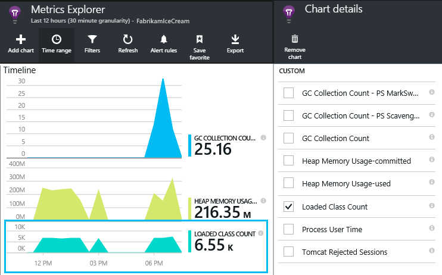

<properties
    pageTitle="Java Web app Analytics mit Anwendung Einsichten | Microsoft Azure"
    description="Überwachen der Leistung und die Verwendung Ihrer Java-Website mit der Anwendung Einsichten. "
    services="application-insights"
    documentationCenter="java"
    authors="alancameronwills"
    manager="douge"/>

<tags
    ms.service="application-insights"
    ms.workload="tbd"
    ms.tgt_pltfrm="ibiza"
    ms.devlang="na"
    ms.topic="get-started-article"
    ms.date="08/17/2016"
    ms.author="awills"/>

# Erste Schritte mit Anwendung Einsichten in einem Java-Web-Projekt

*Anwendung Einsichten ist in der Vorschau.*

[AZURE.INCLUDE [app-insights-selector-get-started](../../includes/app-insights-selector-get-started.md)]

[Anwendung Einsichten](https://azure.microsoft.com/services/application-insights/) ist ein extensible Analytics-Dienst, der hilft Ihnen, die Leistung und die Verwendung der live Anwendung zu verstehen. Verwenden Sie es zu [erkennen und zu diagnostizieren Leistungsprobleme und Ausnahmen](app-insights-detect-triage-diagnose.md), [Schreiben von Code] [ api] , wie Benutzer mit der app Verfahren nachzuverfolgen.

Anwendung Einsichten unterstützt Java-apps für Linux, Unix oder Windows ausgeführt wird.

Du brauchst:

* Oracle JRE 1.6 oder höher oder Zulu JRE 1.6 oder höher
* Ein [Microsoft Azure](https://azure.microsoft.com/)-Abonnement. (Sie können mit der [kostenlose Testversion](https://azure.microsoft.com/pricing/free-trial/)beginnen.)

*Wenn Sie eine Web app, die bereits live ist haben, konnte Sie [das SDK zur Laufzeit in den Webserver](app-insights-java-live.md)hinzufügen das alternative Verfahren ausführen. Die Alternative vermieden werden, den Code neu zu erstellen, aber Sie nicht die Option zum Schreiben von Code zum Nachverfolgen von Benutzeraktivitäten erhalten.*

## 1 holen Sie 1 sich eine Anwendung Einsichten Instrumentation-Taste

1. Melden Sie sich mit dem [Microsoft Azure-Portal](https://portal.azure.com)aus.
2. Erstellen Sie eine Anwendung Einsichten Ressource ein. Legen Sie den Anwendungstyp auf Java-Webanwendung an.

    
4. Suchen Sie den Instrumentation Schlüssel der neuen Ressource. Sie müssen diesen Schlüssel in Kürze in das Codeprojekt einfügen.

    

## 2. Java SDK Einsichten Anwendung zu Ihrem Projekt hinzufügen

*Wählen Sie die geeignete Methode für ein Projekt aus.*

#### Wenn Sie zum Erstellen eines Projekts Maven oder dynamische Web Ellipse verwenden...

Verwenden Sie die [Anwendung Einsichten SDK für Java-Plug-Ins][eclipse].

#### Wenn Sie Maven verwenden...

Wenn Ihr Projekt bereits eingerichtet Maven für Build zu verwendende Zusammenführen Sie den folgenden Code zur Datei pom.xml.

Aktualisieren Sie dann die Abhängigkeiten Project, um die Binärdateien heruntergeladen zu erhalten.

    <repositories>
       <repository>
          <id>central</id>
          <name>Central</name>
          <url>http://repo1.maven.org/maven2</url>
       </repository>
    </repositories>

    <dependencies>
      <dependency>
        <groupId>com.microsoft.azure</groupId>
        <artifactId>applicationinsights-web</artifactId>
        <!-- or applicationinsights-core for bare API -->
        <version>[1.0,)</version>
      </dependency>
    </dependencies>

* *Erstellen oder Prüfsumme Überprüfungsfehler?* Versuchen Sie es mit einer bestimmten Version, z. B.: `<version>1.0.n</version>`. Die neueste Version finden Sie in der [SDK Versionsinformationen](https://github.com/Microsoft/ApplicationInsights-Java#release-notes) oder in unseren [Maven Elemente](http://search.maven.org/#search%7Cga%7C1%7Capplicationinsights).
* *Um ein neues SDK aktualisieren müssen?* Aktualisieren Sie Ihres Projekts Abhängigkeiten an.

#### Wenn Sie Gradle verwenden...

Wenn Ihr Projekt bereits eingerichtet Gradle für Build zu verwendende Zusammenführen Sie den folgenden Code zur Datei build.gradle.

Aktualisieren Sie dann die Abhängigkeiten Project, um die Binärdateien heruntergeladen zu erhalten.

    repositories {
      mavenCentral()
    }

    dependencies {
      compile group: 'com.microsoft.azure', name: 'applicationinsights-web', version: '1.+'
      // or applicationinsights-core for bare API
    }

* *Erstellen oder Prüfsumme Überprüfung Fehler? Versuchen Sie es mit einer bestimmten Version, z. B.:* `version:'1.0.n'`. *Die neueste Version finden Sie in der [SDK Versionsinformationen](https://github.com/Microsoft/ApplicationInsights-Java#release-notes).*
* *Klicken Sie auf ein neues SDK aktualisieren*
 * Aktualisieren Sie Ihres Projekts Abhängigkeiten an.

#### Andernfalls...

Fügen Sie das SDK manuell hinzu:

1. Laden Sie die [Anwendung Einsichten SDK für Java](https://aka.ms/aijavasdk).
2. Extrahieren der Binärdateien aus der Zipdatei, und fügen Sie sie zu Ihrem Projekt.

### Fragen...

* *Was ist die Beziehung zwischen den `-core` und `-web` Komponenten im Zip?*

 * `applicationinsights-core`bietet Ihnen die absolut erforderlichen-API. Sie benötigen immer diese Komponente.
 * `applicationinsights-web`bietet Ihnen Kennzahlen, die HTTP-Anforderung zählt und Reaktionszeiten nachverfolgen. Sie können diese Komponente weglassen, wenn Sie nicht, dass diese automatisch erfasst werden möchten. Angenommen, Sie schreiben möchten Ihre eigenen.

* *Das SDK aktualisieren beim Veröffentlichen von Änderungen*
 * Laden Sie das aktuelle [Anwendung Einsichten SDK für Java](https://aka.ms/qqkaq6) , und Ersetzen Sie die alten.
 * Änderungen werden in der [SDK Versionsinformationen](https://github.com/Microsoft/ApplicationInsights-Java#release-notes)beschrieben.

## 3 Fügen Sie 3 eine Anwendung Einsichten XML-Datei

Fügen Sie zum Ressourcenordner im Projekt ApplicationInsights.xml oder stellen Sie sicher, dass er Ihres Projekts Bereitstellung Klassenpfad hinzugefügt wird. Kopieren Sie die folgende XML-Daten hinein.

Ersetzen Sie die Instrumentation-Taste, die Sie von der Azure-Portal erhalten haben.

    <?xml version="1.0" encoding="utf-8"?>
    <ApplicationInsights xmlns="http://schemas.microsoft.com/ApplicationInsights/2013/Settings" schemaVersion="2014-05-30">

      <!-- The key from the portal: -->

      <InstrumentationKey>** Your instrumentation key **</InstrumentationKey>

      <!-- HTTP request component (not required for bare API) -->

      <TelemetryModules>
        <Add type="com.microsoft.applicationinsights.web.extensibility.modules.WebRequestTrackingTelemetryModule"/>
        <Add type="com.microsoft.applicationinsights.web.extensibility.modules.WebSessionTrackingTelemetryModule"/>
        <Add type="com.microsoft.applicationinsights.web.extensibility.modules.WebUserTrackingTelemetryModule"/>
      </TelemetryModules>

      <!-- Events correlation (not required for bare API) -->
      <!-- These initializers add context data to each event -->

      <TelemetryInitializers>
        <Add   type="com.microsoft.applicationinsights.web.extensibility.initializers.WebOperationIdTelemetryInitializer"/>
        <Add type="com.microsoft.applicationinsights.web.extensibility.initializers.WebOperationNameTelemetryInitializer"/>
        <Add type="com.microsoft.applicationinsights.web.extensibility.initializers.WebSessionTelemetryInitializer"/>
        <Add type="com.microsoft.applicationinsights.web.extensibility.initializers.WebUserTelemetryInitializer"/>
        <Add type="com.microsoft.applicationinsights.web.extensibility.initializers.WebUserAgentTelemetryInitializer"/>

      </TelemetryInitializers>
    </ApplicationInsights>

* Die Taste Instrumentation wird zusammen mit wird jedes Element der werden gesendet und Sie erfahren Einsichten Anwendung, um es in Ihre Ressourcen anzuzeigen.
* Die HTTP-Anforderung Komponente ist optional. Es sendet automatisch zu Anfragen und Reaktionszeiten werden-Portal an.
* Ereignisse Korrelationskoeffizienten ist eine Ergänzung zu der HTTP-Anforderung Komponente. Es weist einen Bezeichner für jede Anforderung vom Server empfangen, und diesen Bezeichner für jedes Element der werden als die Eigenschaft 'Operation.Id' als Eigenschaft hinzugefügt. Es ermöglicht Ihnen, die jeder Anforderung durch Festlegen eines Filters [diagnostic]Suche zugeordnet werden zu koordinieren[diagnostic].
* Der Anwendung Einsichten Schlüssel dynamisch vom Azure-Portal als Systemeigenschaft übergeben werden kann (-DAPPLICATION_INSIGHTS_IKEY = Your_ikey). Wenn es keine Eigenschaft, die definiert ist, überprüft es Umgebungsvariable (APPLICATION_INSIGHTS_IKEY) in Azure-App-Einstellungen. Wenn Sie sowohl die Eigenschaften nicht definiert sind, ist der Standardwert InstrumentationKey von ApplicationInsights.xml verwendet. Diese Sequenz hilft Ihnen, die verschiedene InstrumentationKeys für die verschiedenen Umgebungen dynamisch verwalten.

### Alternative Methoden für die Instrumentation festlegen

Anwendung Einsichten SDK sieht für die Taste in dieser Reihenfolge:

1. System-Eigenschaft:-DAPPLICATION_INSIGHTS_IKEY = Your_ikey
2. Umgebungsvariable: APPLICATION_INSIGHTS_IKEY
3. Konfigurationsdatei: ApplicationInsights.xml

Sie können auch [in Code festlegen](app-insights-api-custom-events-metrics.md#ikey):

    telemetryClient.InstrumentationKey = "...";

## 4. Hinzufügen eines HTTP-Filters

Der letzte Konfigurationsschritt ermöglicht die HTTP-Anforderung-Komponente die Anmeldung bei jeder Anforderung Web. (Nicht erforderlich, wenn Sie nur die absolut erforderlichen-API möchten.)

Öffnen Sie die Datei web.xml in Ihrem Projekt und verbinden Sie den folgenden Code unter dem Knoten Web-app, in dem Ihre Anwendungsfilter konfiguriert sind.

Um die genauesten Ergebnisse zu erhalten, sollte der Filters vor alle anderen Filter zugeordnet werden.

    <filter>
      <filter-name>ApplicationInsightsWebFilter</filter-name>
      <filter-class>
        com.microsoft.applicationinsights.web.internal.WebRequestTrackingFilter
      </filter-class>
    </filter>
    <filter-mapping>
       <filter-name>ApplicationInsightsWebFilter</filter-name>
       <url-pattern>/*</url-pattern>
    </filter-mapping>

#### Wenn Sie Frühling Web MVC 3.1 oder höher verwenden

Bearbeiten Sie diese Elemente, um die Anwendung Einsichten Paket einschließen:

    <context:component-scan base-package=" com.springapp.mvc, com.microsoft.applicationinsights.web.spring"/>

    <mvc:interceptors>
        <mvc:interceptor>
            <mvc:mapping path="/**"/>
            <bean class="com.microsoft.applicationinsights.web.spring.RequestNameHandlerInterceptorAdapter" />
        </mvc:interceptor>
    </mvc:interceptors>

#### Wenn Sie 2 Struts verwenden

Fügen Sie dieses Element in die Struts Konfigurationsdatei (normalerweise struts.xml oder Struts-default.xml genannt) hinzu:

     <interceptors>
       <interceptor name="ApplicationInsightsRequestNameInterceptor" class="com.microsoft.applicationinsights.web.struts.RequestNameInterceptor" />
     </interceptors>
     <default-interceptor-ref name="ApplicationInsightsRequestNameInterceptor" />

(Wenn Sie Interceptors in einem Stapel Standard definiert haben, kann der Interceptor einfach die Stapel hinzugefügt werden.)

## 5 führen Sie 5 die Anwendung

Entweder auf Ihrem Entwicklungscomputer im Debuggen-Modus auszuführen, oder auf dem Server veröffentlichen.

## 6. Ihrer werden in der Anwendung Einsichten anzeigen

Kehren Sie zu Ihrer Anwendung Einsichten Ressource [Microsoft Azure](https://portal.azure.com)-Portal zurück.

HTTP-Anfragen Daten angezeigt wird, klicken Sie auf das Blade Übersicht. (Falls dies erforderlich ist, warten Sie einige Sekunden, und klicken Sie dann auf aktualisieren.)

[Weitere Informationen zu Kennzahlen.][metrics]

Klicken Sie auf, bis alle Diagramm ausführlichere zusammengefasster Metrik finden Sie unter.

> Anwendung Einsichten nimmt an, dass das Format der HTTP-Anfragen für MVC Applications: `VERB controller/action`. Beispielsweise `GET Home/Product/f9anuh81`, `GET Home/Product/2dffwrf5` und `GET Home/Product/sdf96vws` werden in gruppiert `GET Home/Product`. Diese Gruppierung ermöglicht aussagekräftige Aggregationen von Anfragen, z. B. Anzahl von Besprechungsanfragen und Mittelwert Ausführung für Besprechungsanfragen.

### Instanzdaten 

Klicken Sie auf einen bestimmten Anforderungstyp einzelne Instanzen angezeigt. 

Zwei Arten von Daten in der Anwendung Einsichten angezeigt werden: aggregierte Daten, gespeichert und als Mittelwerte, zählt und Summen; angezeigt und Daten - einzelne Berichte von Besprechungsanfragen, Ausnahmen, Seitenansichten oder benutzerdefinierte Ereignisse HTTP-Instanz zurück.

Beim Anzeigen der Eigenschaften einer Anforderung sehen Sie die werden Ereignisse wie Besprechungsanfragen und Ausnahmen zugeordnet.

### Analytics: Leistungsfähige Abfragesprache

Während Sie weitere Daten gesammelt haben, können Sie Abfragen sowohl zum Aggregieren von Daten sowie zum Auffinden von einzelner Instanzen ausführen. [Analytics]() ist ein leistungsfähiges Tool für die beiden für Grundlegendes zu Leistung und die Verwendung und zu Diagnosezwecken.

## 7 installieren Sie 7 Ihre app auf dem server

Veröffentlichen Sie Ihre app jetzt auf dem Server, Personen verwenden, und Anzeigen der werden im Portal angezeigt.

* Stellen Sie sicher, dass Ihre Firewall Ihrer Anwendung werden an diese Ports senden können:

 * DC.Services.VisualStudio.com:443
 * F5.Services.VisualStudio.com:443

* Klicken Sie auf Windows-Servern zu installieren:

 * [Microsoft Visual C++ Redistributable](http://www.microsoft.com/download/details.aspx?id=40784)

    (Dieser Komponente können Leistungsindikatoren.)

## Ausnahmen und Fehlern Anforderung

Ausnahmefehler werden automatisch erfasst:

Zum Sammeln von Daten auf anderen Ausnahmen, haben Sie zwei Optionen:

* [Anrufe an trackException() in den Code einfügen][apiexceptions]. 
* [Installieren Sie den Java-Agent auf dem Server](app-insights-java-agent.md). Sie angeben die Methoden, die Sie anzeigen möchten.

## Überwachen der Methode Anrufe und externe Abhängigkeiten

Bei der Anmeldung beim [Installieren des Java-Agents](app-insights-java-agent.md) angegebenen internen Methoden und Anrufe über JDBC, Anzeigedauer Daten.

## -Datenquellen

Öffnen Sie die **Einstellungen** **Servern**, um einen Bereich an Leistungsindikatoren anzuzeigen.

### Anpassen der Leistung Zähler Websitesammlung

Fügen Sie den folgenden Code unter dem Stammknoten der Datei ApplicationInsights.xml, um Sammlung von dem Standardsatz der Leistungsindikatoren zu deaktivieren:

    <PerformanceCounters>
       <UseBuiltIn>False</UseBuiltIn>
    </PerformanceCounters>

### Sammeln zusätzlicher Leistungsindikatoren

Sie können zusätzliche Leistungsindikatoren benutzerspezifisch zusammengestellten angeben.

#### JMX Indikatoren (verfügbar gemacht werden durch die Java virtuellen Computern)

    <PerformanceCounters>
      <Jmx>
        <Add objectName="java.lang:type=ClassLoading" attribute="TotalLoadedClassCount" displayName="Loaded Class Count"/>
        <Add objectName="java.lang:type=Memory" attribute="HeapMemoryUsage.used" displayName="Heap Memory Usage-used" type="composite"/>
      </Jmx>
    </PerformanceCounters>

*   `displayName`– Der Name der Anwendung Einsichten Portal angezeigt.
*   `objectName`– Die JMX zu verwendenden Objektnamen.
*   `attribute`– Das Attribut für die zu verwendenden Objektnamen JMX abgerufen werden sollen
*   `type`(optional) – den Typ des Objekts JMX Attribut:
 *  Standard: einen einfachen Typ wie Int oder Long.
 *  `composite`: befindet sich die Leistungsindikatorendaten in das Format von 'Attribute.Data'
 *  `tabular`: die Leistungsindikatorendaten werden im Format einer Tabellenzeile

#### Windows-Datenquellen

Jeder [Windows-Performance-Zähler](https://msdn.microsoft.com/library/windows/desktop/aa373083.aspx) ist ein Element einer Kategorie (in die gleiche Weise wie ein Feld ein Mitglied einer Klasse ist). Kategorien können können entweder global, sein oder nummeriert oder benannten Instanzen haben.

    <PerformanceCounters>
      <Windows>
        <Add displayName="Process User Time" categoryName="Process" counterName="%User Time" instanceName="__SELF__" />
        <Add displayName="Bytes Printed per Second" categoryName="Print Queue" counterName="Bytes Printed/sec" instanceName="Fax" />
      </Windows>
    </PerformanceCounters>

*   DisplayName – den Namen der Anwendung Einsichten Portal angezeigt.
*   Kategoriename – die Leistung Zähler Kategorie (Leistungsobjekt), dieser Leistungsindikator zugeordnet ist.
*   CounterName – den Namen des Performance-Zähler.
*   InstanceName – den Namen der Kategorieinstanz der Zähler oder eine leere Zeichenfolge (""), wenn die Kategorie eine einzelne Instanz enthält. Wenn der Kategoriename umfasst und Performance-Zähler, die Sie sammeln möchten aus dem aktuellen JVM Prozess ist, auf dem Ihre app ausgeführt wird, geben Sie `"__SELF__"`.

Die Leistungsindikatoren sind als benutzerdefinierte Kriterien in [Kennzahlen Explorer]sichtbar[metrics].

### UNIX-Datenquellen

* [Collectd mit der Anwendung Einsichten-Plug-in installieren](app-insights-java-collectd.md) , um eine Vielzahl von System und Netzwerk Daten abzurufen.

## Abrufen von Daten für Benutzer und Sitzung

Senden Sie OK, werden aus dem Webserver. Sie können jetzt um die Ansicht 360-Grad der Anwendung zu gelangen, weitere Überwachung hinzufügen:

* [Fügen Sie Ihren Webseiten werden] [ usage] Monitor Seitenansichten und Benutzer Kennzahlen.
* [Einrichten von Webtests] [ availability] um sicherzustellen, dass die Anwendung bleibt der live und reagiert.

## Erfassen von Spuren log

Sie können Anwendung Einsichten zum Segment und Dice Protokolle aus Log4J, Logback oder andere Protokollierung Framework verwenden. Sie können die Protokolle HTTP-Anfragen und andere telemetrieprotokoll zuordnen. [Erfahren Sie, wie][javalogs].

## Senden Sie Ihre eigenen werden

Jetzt, da Sie das SDK installiert haben, können Sie die API zum Senden Ihrer eigenen telemetrieprotokoll verwenden.

* [Benutzerdefinierte Ereignisse und Kennzahlen nachverfolgen] [ api] , wenn Sie wissen, was Benutzer mit der Anwendung ausführen werden.
* [Suchen von Ereignissen und Protokollen] [ diagnostic] Probleme beim diagnostizieren.

## Verfügbarkeit von Webtests

Anwendung Einsichten können Ihre Website in regelmäßigen Abständen zu überprüfen, die es liegt und reagiert auch testen. [Zum Einrichten von][availability], klicken Sie auf Webtests.

Erhalten Sie Diagramme der Reaktionszeiten sowie e-Mail-Benachrichtigungen, wenn Ihre Website-fällt aus.

[Erfahren Sie mehr über die Verfügbarkeit von Web überprüft werden soll.][availability] 

## Fragen? Probleme?

[Problembehandlung bei Java](app-insights-java-troubleshoot.md)

## Nächste Schritte

Weitere Informationen finden Sie im [Java Developer Center](/develop/java/).

<!--Link references-->

[api]: app-insights-api-custom-events-metrics.md
[apiexceptions]: app-insights-api-custom-events-metrics.md#track-exception
[availability]: app-insights-monitor-web-app-availability.md
[diagnostic]: app-insights-diagnostic-search.md
[eclipse]: app-insights-java-eclipse.md
[javalogs]: app-insights-java-trace-logs.md
[metrics]: app-insights-metrics-explorer.md
[usage]: app-insights-web-track-usage.md
