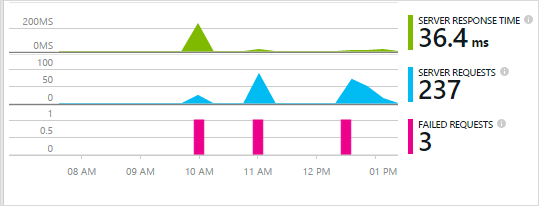
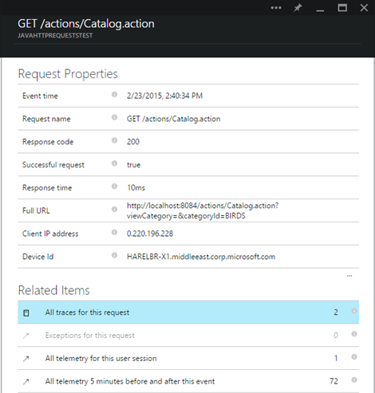

<properties 
    pageTitle="Live Anwendung Einsichten von Java Web apps, die bereits vorhanden sind" 
    description="Starten Sie die Überwachung einer Anwendungs, die bereits auf dem Server ausgeführt wird" 
    services="application-insights" 
    documentationCenter="java"
    authors="alancameronwills" 
    manager="douge"/>

<tags 
    ms.service="application-insights" 
    ms.workload="tbd" 
    ms.tgt_pltfrm="ibiza" 
    ms.devlang="na" 
    ms.topic="article" 
    ms.date="08/24/2016" 
    ms.author="awills"/>
 
# Live Anwendung Einsichten von Java Web apps, die bereits vorhanden sind

*Anwendung Einsichten ist in der Vorschau.*

Wenn Sie eine Webanwendung, die bereits auf dem J2EE-Server ausgeführt wird verfügen, können Sie beginnen, es mit der [Anwendung Einsichten](app-insights-overview.md) Überwachung, ohne dass Code vorzunehmen, oder Kompilieren Sie Ihr Projekt. Mit dieser Option erhalten Sie Informationen über HTTP-Anfragen zu Server, Ausnahmefehler und Leistungsindikatoren gesendet.

Benötigen Sie ein Abonnement von [Microsoft Azure](https://azure.com)ein.

> [AZURE.NOTE] Die Schritte auf dieser Seite hinzugefügt Web app zur Laufzeit das SDK. Dieses Laufzeitinstrumentation empfiehlt sich, wenn Sie nicht zum Aktualisieren oder Neuerstellen Ihren Quellcode einfügen möchten. Wenn Sie können, wir empfehlen jedoch Sie [das SDK des Quellcodes hinzufügen](app-insights-java-get-started.md) stattdessen. Die bietet Ihnen weitere Optionen wie Schreiben von Code zum Nachverfolgen von Benutzeraktivitäten.

## 1 holen Sie 1 sich eine Anwendung Einsichten Instrumentation-Taste

1. Melden Sie sich mit dem [Microsoft Azure-portal](https://portal.azure.com)
2. Erstellen einer neuen Anwendung Einsichten Ressource

    
3. Legen Sie den Anwendungstyp auf Java-Webanwendung an.

    
4. Suchen Sie den Instrumentation Schlüssel der neuen Ressource. Sie müssen diesen Schlüssel in Kürze in das Codeprojekt einfügen.

    

## 2 Laden Sie 2 das SDK

1. Laden Sie die [Anwendung Einsichten SDK für Java](https://aka.ms/aijavasdk). 
2. Extrahieren Sie auf dem Server den Inhalt SDK im Verzeichnis von der Ihrer Projektbinärdateien geladen werden. Wenn Sie Tomcat verwenden, wäre dieses Verzeichnis in der Regel unter`webapps\<your_app_name>\WEB-INF\lib`

## 3 Fügen Sie 3 eine Anwendung Einsichten XML-Datei

Erstellen Sie ApplicationInsights.xml in den Ordner, in dem Sie das SDK hinzugefügt. Setzen Sie darin die folgende XML-Daten aus.

Ersetzen Sie die Instrumentation-Taste, die Sie von der Azure-Portal erhalten haben.

    <?xml version="1.0" encoding="utf-8"?>
    <ApplicationInsights xmlns="http://schemas.microsoft.com/ApplicationInsights/2013/Settings" schemaVersion="2014-05-30">

      <!-- The key from the portal: -->

      <InstrumentationKey>** Your instrumentation key **</InstrumentationKey>

      <!-- HTTP request component (not required for bare API) -->

      <TelemetryModules>
        <Add type="com.microsoft.applicationinsights.web.extensibility.modules.WebRequestTrackingTelemetryModule"/>
        <Add type="com.microsoft.applicationinsights.web.extensibility.modules.WebSessionTrackingTelemetryModule"/>
        <Add type="com.microsoft.applicationinsights.web.extensibility.modules.WebUserTrackingTelemetryModule"/>
      </TelemetryModules>

      <!-- Events correlation (not required for bare API) -->
      <!-- These initializers add context data to each event -->

      <TelemetryInitializers>
        <Add   type="com.microsoft.applicationinsights.web.extensibility.initializers.WebOperationIdTelemetryInitializer"/>
        <Add type="com.microsoft.applicationinsights.web.extensibility.initializers.WebOperationNameTelemetryInitializer"/>
        <Add type="com.microsoft.applicationinsights.web.extensibility.initializers.WebSessionTelemetryInitializer"/>
        <Add type="com.microsoft.applicationinsights.web.extensibility.initializers.WebUserTelemetryInitializer"/>
        <Add type="com.microsoft.applicationinsights.web.extensibility.initializers.WebUserAgentTelemetryInitializer"/>

      </TelemetryInitializers>
    </ApplicationInsights>

* Die Taste Instrumentation wird zusammen mit wird jedes Element der werden gesendet und Sie erfahren Einsichten Anwendung, um es in Ihre Ressourcen anzuzeigen.
* Die HTTP-Anforderung Komponente ist optional. Es sendet automatisch zu Anfragen und Reaktionszeiten werden-Portal an.
* Ereignisse Korrelationskoeffizienten ist eine Ergänzung zu der HTTP-Anforderung Komponente. Es weist einen Bezeichner für jede Anforderung vom Server empfangen, und diesen Bezeichner für jedes Element der werden als die Eigenschaft 'Operation.Id' als Eigenschaft hinzugefügt. Es ermöglicht Ihnen, die jeder Anforderung durch Festlegen eines Filters [diagnostic](app-insights-diagnostic-search.md)Suche zugeordnet werden zu koordinieren.

## 4. Hinzufügen eines HTTP-Filters

Öffnen Sie die Datei web.xml in Ihrem Projekt und verbinden Sie die folgenden Codeausschnitts unter dem Knoten Web-app, in dem Ihre Anwendungsfilter konfiguriert sind.

Um die genauesten Ergebnisse zu erhalten, sollte der Filters vor alle anderen Filter zugeordnet werden.

    <filter>
      <filter-name>ApplicationInsightsWebFilter</filter-name>
      <filter-class>
        com.microsoft.applicationinsights.web.internal.WebRequestTrackingFilter
      </filter-class>
    </filter>
    <filter-mapping>
       <filter-name>ApplicationInsightsWebFilter</filter-name>
       <url-pattern>/*</url-pattern>
    </filter-mapping>

## 5. die Firewallausnahmen Kontrollkästchen

Möglicherweise müssen Sie zum [Festlegen von Ausnahmen von der ausgehende Daten zu senden](app-insights-ip-addresses.md).

## 6. neu starten Sie Web app

## 7. Ihrer werden in der Anwendung Einsichten anzeigen

Kehren Sie zu Ihrer Anwendung Einsichten Ressource [Microsoft Azure](https://portal.azure.com)-Portal zurück.

Klicken Sie auf das Blade Übersicht wird werden über HTTP-Anfragen angezeigt. (Falls dies erforderlich ist, warten Sie einige Sekunden, und klicken Sie dann auf aktualisieren.)

 

Klicken Sie auf, bis alle Diagramm ausführlichere Metrik finden Sie unter. 

 

Und beim Anzeigen der Eigenschaften einer Anforderung können Sie sehen, wie Besprechungsanfragen und Ausnahmen zugeordnet werden Ereignisse.
 

[Weitere Informationen zu Kennzahlen.](app-insights-metrics-explorer.md)

## Nächste Schritte

* [Hinzufügen von werden an Ihren Webseiten](app-insights-web-track-usage.md) Monitor Seitenansichten und Benutzer Kennzahlen.
* [Einrichten von Webtests](app-insights-monitor-web-app-availability.md) , um sicherzustellen, dass die Anwendung bleibt, live und reagiert.
* [Erfassen von Spuren log](app-insights-java-trace-logs.md)
* [Suchen von Ereignissen und Protokollen](app-insights-diagnostic-search.md) Probleme diagnostizieren.

 
