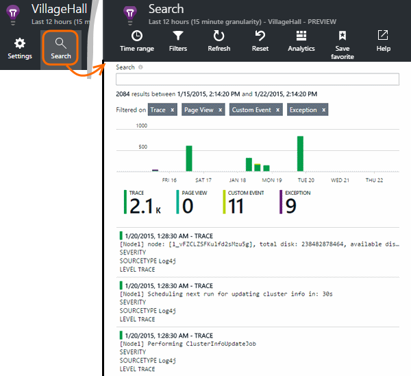

<properties 
    pageTitle="Untersuchen Sie Java Spur in Anwendung Einsichten protokolliert." 
    description="Suche Log4J oder Logback Spuren in Anwendung Einsichten" 
    services="application-insights" 
    documentationCenter="java"
    authors="alancameronwills" 
    manager="douge"/>

<tags 
    ms.service="application-insights" 
    ms.workload="tbd" 
    ms.tgt_pltfrm="ibiza" 
    ms.devlang="na" 
    ms.topic="article" 
    ms.date="07/12/2016" 
    ms.author="awills"/>

# Untersuchen Sie Java Spur in Anwendung Einsichten protokolliert.

Wenn Sie Logback oder Log4J verwenden (Version 1.2 oder Version 2.0) für die Protokollierung, können Sie der Überwachungsprotokolle automatisch an die Anwendung Einblicken, wo Sie durchsuchen können, und suchen diesen, gesendet haben.

Installieren der [Anwendung Einsichten SDK für Java][java], wenn Sie die noch nicht geschehen ist.

## Protokollierung Bibliotheken zum Projekt hinzufügen

*Wählen Sie die geeignete Methode für ein Projekt aus.*

#### Wenn Sie Maven verwenden...

Wenn Ihr Projekt bereits Maven für Build zu verwendende eingerichtet ist, wird Zusammenführen Sie eine der folgenden Codeausschnitte in Ihre Datei pom.xml.

Klicken Sie dann Aktualisieren der Project Abhängigkeiten an, um die Binärdateien heruntergeladen zu erhalten.

*Logback*

    <dependencies>
       <dependency>
          <groupId>com.microsoft.azure</groupId>
          <artifactId>applicationinsights-logging-logback</artifactId>
          <version>[1.0,)</version>
       </dependency>
    </dependencies>

*Log4J Version 2.0*

    <dependencies>
       <dependency>
          <groupId>com.microsoft.azure</groupId>
          <artifactId>applicationinsights-logging-log4j2</artifactId>
          <version>[1.0,)</version>
       </dependency>
    </dependencies>

*Log4J Version 1.2*

    <dependencies>
       <dependency>
          <groupId>com.microsoft.azure</groupId>
          <artifactId>applicationinsights-logging-log4j1_2</artifactId>
          <version>[1.0,)</version>
       </dependency>
    </dependencies>

#### Wenn Sie Gradle verwenden...

Wenn Ihr Projekt bereits Gradle für Build zu verwendende eingerichtet ist, fügen Sie eine der folgenden Zeilen zu der `dependencies` in der Datei build.gradle gruppieren:

Klicken Sie dann Aktualisieren der Project Abhängigkeiten an, um die Binärdateien heruntergeladen zu erhalten.

**Logback**

    compile group: 'com.microsoft.azure', name: 'applicationinsights-logging-logback', version: '1.0.+'

**Log4J Version 2.0**

    compile group: 'com.microsoft.azure', name: 'applicationinsights-logging-log4j2', version: '1.0.+'

**Log4J Version 1.2**

    compile group: 'com.microsoft.azure', name: 'applicationinsights-logging-log4j1_2', version: '1.0.+'

#### Andernfalls...

Herunterladen Sie und extrahieren Sie der entsprechenden Appender, und dann hinzuzufügen Sie die entsprechende Bibliothek zu Ihrem Projekt:

Protokollierung | Herunterladen | Bibliothek
----|----|----
Logback|[SDK mit Logback appender](https://aka.ms/xt62a4)|Applicationinsights-Protokollierung-logback
Log4J Version 2.0|[SDK mit Log4J Version 2 appender](https://aka.ms/qypznq)|Applicationinsights-Protokollierung-log4j2 
Log4j Version 1.2|[SDK mit Log4J Version 1.2 appender](https://aka.ms/ky9cbo)|Applicationinsights-Protokollierung-log4j1_2 

## Hinzufügen der Appender für Ihr Framework Protokollierung

Zusammen Sie, um die erste Spuren zu den relevanten Code in die Konfigurationsdatei Log4J oder Logback-Codeausschnitt: 

*Logback*

    <appender name="aiAppender" 
      class="com.microsoft.applicationinsights.logback.ApplicationInsightsAppender">
    </appender>
    <root level="trace">
      <appender-ref ref="aiAppender" />
    </root>

*Log4J Version 2.0*

    <Configuration packages="com.microsoft.applicationinsights.Log4j">
      <Appenders>
        <ApplicationInsightsAppender name="aiAppender" />
      </Appenders>
      <Loggers>
        <Root level="trace">
          <AppenderRef ref="aiAppender"/>
        </Root>
      </Loggers>
    </Configuration>

*Log4J Version 1.2*

    <appender name="aiAppender" 
         class="com.microsoft.applicationinsights.log4j.v1_2.ApplicationInsightsAppender">
    </appender>
    <root>
      <priority value ="trace" />
      <appender-ref ref="aiAppender" />
    </root>

Die Anwendung Einsichten Appenders können von einem beliebigen Protokollierung konfiguriert und nicht unbedingt von der Stammwebsite Protokollierung verwiesen werden (wie in den Codebeispielen oben gezeigt).

## Erkunden Sie Ihre Spuren im Portal Anwendung Einsichten

Jetzt, da Sie Ihr Projekt, um auf an Anwendung Einsichten zu senden konfiguriert haben, können Sie anzeigen und suchen Sie diese Spuren im Portal Anwendung Einblicke in das Feld [Suchen] [ diagnostic] Blade.

## Nächste Schritte

[Diagnose suchen][diagnostic]

<!--Link references-->

[diagnostic]: app-insights-diagnostic-search.md
[java]: app-insights-java-get-started.md

 
