<properties
    pageTitle="Web apps-Anwendung Einsichten für JavaScript | Microsoft Azure"
    description="Erste Seite anzeigen und Sitzung zählt, Web-Client-Daten und Verwendungsmustern nachverfolgen. Erkennen von Ausnahmen und Leistungsprobleme in JavaScript-Webseiten."
    services="application-insights"
    documentationCenter=""
    authors="alancameronwills"
    manager="douge"/>

<tags
    ms.service="application-insights"
    ms.workload="tbd"
    ms.tgt_pltfrm="ibiza"
    ms.devlang="na"
    ms.topic="get-started-article"
    ms.date="08/15/2016"
    ms.author="awills"/>

# Anwendung Einsichten für Webseiten

[AZURE.INCLUDE [app-insights-selector-get-started-dotnet](../../includes/app-insights-selector-get-started-dotnet.md)]

Informieren Sie sich über die Leistung und die Verwendung Ihrer Webseite oder die app aus. Wenn Sie Visual Studio-Anwendung Einsichten zu Ihrer Seitenskript hinzufügen, erhalten Sie Zeitabläufe der Seite geladen und AJAX-Aufrufe, zählt und Details Browser Ausnahmen und AJAX-Fehlern als auch Benutzer und Sitzung zählt. Alle, die diese Seite Client-Betriebssystem und Browserversion, Geo Speicherort und andere Dimensionen unterteilt werden können. Sie können auch festlegen von Benachrichtigungen für Fehler zählt oder verlangsamen Laden von Seiten.

Können Sie mit einem beliebigen Webseiten Anwendung Einsichten – Sie nur eine kurze JavaScript hinzufügen. Wenn Ihr Webdienst [Java](app-insights-java-get-started.md) oder [ASP.NET](app-insights-asp-net.md)ist, können Sie auf Ihrem Server und Clients werden integrieren.

Sie benötigen ein [Microsoft Azure](https://azure.com)-Abonnement. Wenn Ihr Team ein Organisations-Abonnement verfügt, bitten Sie den Besitzer der Microsoft Account hinzuzufügen. Es ist eine kostenlose Preisgestaltung Stufe, Entwicklung und kleine verwenden nichts Kosten wird nicht.

## Einrichten der Anwendung Einsichten für Ihre Webseite

Zuerst müssen Sie die Anwendung Einsichten zu Ihren Webseiten hinzufügen? Sie möglicherweise bereits getan haben. Wenn Sie Anwendung Einsichten zu Ihrem Web app im Dialogfeld Neues Projekt in Visual Studio hinzugefügt haben, wurde das Skript dann hinzugefügt. In diesem Fall müssen Sie nicht mehr führen.

Andernfalls müssen Sie einem Codeausschnitt wie folgt Ihren Webseiten hinzuzufügen.

### Öffnen Sie eine Anwendung Einsichten Ressource

Die Anwendung Einsichten-Ressource ist, wo die Daten zu Leistung und die Verwendung Ihrer Seite angezeigt wird. 

Melden Sie sich bei [Azure-Portal](https://portal.azure.com)werden soll.

Wenn Sie bereits für die Serverseite der app für die Überwachung einrichten, besitzen Sie bereits eine Ressource aus:

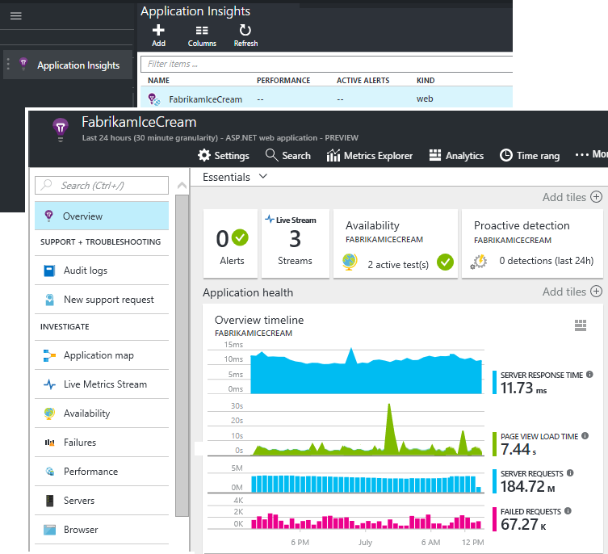

Wenn Sie eine besitzen, erstellen Sie ihn:

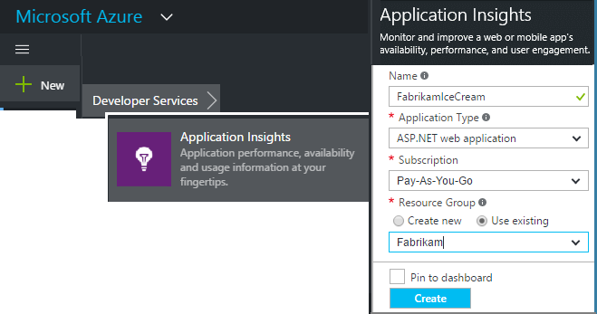

*Noch Fragen?* [Weitere Informationen zum Erstellen einer Ressource](app-insights-create-new-resource.md).

### Fügen Sie das Skript SDK zur app oder Webseiten

Schnellstart erhalten Sie das Skript für Webseiten:

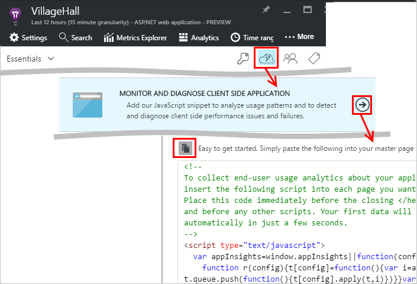

Das Skript unmittelbar vor dem Einfügen der `</head>` Kategorie jeder Seite, die Sie nachverfolgen möchten. Wenn Ihre Website auf eine Masterseite verfügt, können Sie das Skript dort ablegen. Beispiel:

* In einem ASP.NET-MVC-Projekt würden Sie es in einfügen`View\Shared\_Layout.cshtml`
* Öffnen Sie in einer SharePoint-Website, auf dem Bedienfeld [Websiteeinstellungen / Gestaltungsvorlage](app-insights-sharepoint.md).

Das Skript enthält die Instrumentation-Taste, die die Daten an Ihrer Anwendung Einsichten Ressource weiterleitet. 

([Detailliertere Erklärung Skript zugreifen.](http://apmtips.com/blog/2015/03/18/javascript-snippet-explained/))

*(Wenn Sie einen Rahmen bekannten Webseite verwenden, suchen Sie für die Anwendung Einsichten an. For example, [ein AngularJS Modul](http://ngmodules.org/modules/angular-appinsights)vorhanden ist.)*

## Detaillierte Konfiguration

Es gibt mehrere [Parameter](https://github.com/Microsoft/ApplicationInsights-JS/blob/master/API-reference.md#config) , die Sie festlegen können, obwohl in den meisten Fällen Sie müssen dürfen nicht. Sie können beispielsweise deaktivieren oder die Anzahl der Ajax-Aufrufe gemeldet pro Datenzugriffsseiten-Ansicht (um den Datenverkehr zu verringern). Oder Sie können festlegen, Debuggen-Modus können Sie schnell über die Verkaufspipeline verschieben, ohne wird zusammengefasst werden.

Zum Festlegen der folgenden Parameter für diese Zeile in der Codeausschnitt Aussehen und weitere durch Kommas getrennten Elemente dahinter hinzufügen:

    })({
      instrumentationKey: "..."
      // Insert here
    });

Die [verfügbaren Parameter](https://github.com/Microsoft/ApplicationInsights-JS/blob/master/API-reference.md#config) umfassen:

    // Send telemetry immediately without batching.
    // Remember to remove this when no longer required, as it
    // can affect browser performance.
    enableDebug: boolean,

    // Don't log browser exceptions.
    disableExceptionTracking: boolean,

    // Don't log ajax calls.
    disableAjaxTracking: boolean,

    // Limit number of Ajax calls logged, to reduce traffic.
    maxAjaxCallsPerView: 10, // default is 500

    // Time page load up to execution of first trackPageView().
    overridePageViewDuration: boolean,

    // Set these dynamically for an authenticated user.
    appUserId: string,
    accountId: string,

## Führen Sie die app

Führen Sie die Web-app, verwenden sie eine Weile werden generieren, und warten Sie einige Sekunden dauern. Entweder können verwenden die Taste **F5** auf Ihrem Entwicklungscomputer auszuführen oder veröffentlichen und zulassen, dass Benutzer mit wiedergeben.

Wenn Sie die werden aktivieren, an die Anwendung Einsichten ist eine Web app senden möchten, verwenden Sie die Tools zum Debuggen Ihres Browsers (**F12** in vielen Browsern). Daten werden an dc.services.visualstudio.com gesendet.

## Erkunden Sie Ihre Browser Performance-Daten

Öffnen Sie das Blade Browser zum Anzeigen zusammengefasster von Leistungsdaten aus Ihrer Benutzer für den Browser.

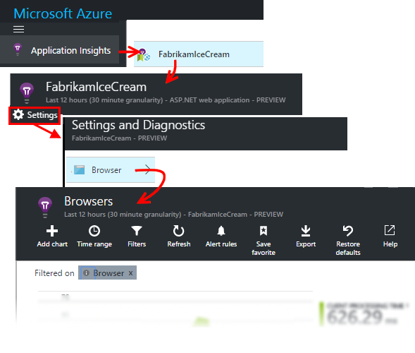

*Noch keine Daten? Klicken Sie auf ** am oberen Rand der Seite *Aktualisieren* . Immer noch nichts? Finden Sie unter [Problembehandlung](app-insights-troubleshoot-faq.md).*

Das Browser-Blade ist ein [Kennzahlen Explorer Blade](app-insights-metrics-explorer.md) mit voreingestellten filtern und Diagramm Auswahl. Sie können den Zeitbereich, Filter und Diagrammkonfiguration bearbeiten, wenn Sie möchten, und das Ergebnis als Favorit speichern. Klicken Sie auf **Standard wiederherstellen** , um an der ursprünglichen Blade-Konfiguration zurückzukehren.

## Seite laden Leistung

Oben wird ein Diagramm segmentierter Seitenladezeiten. Die gesamte Höhe des Diagramms stellt die durchschnittliche Zeit zum Laden und Anzeigen von Seiten aus der app in Ihrer Benutzer für den Browser. Wenn der Browser, bis alle synchroner laden die ursprüngliche HTTP-Anfrage, die Ereignisse einschließlich Layouts und Ausführen von Skripts verarbeitet wurden sendet, wird die die Zeit von gemessen. Diese nicht asynchrone Aufgaben wie beispielsweise das Laden von Webparts von AJAX-Aufrufe enthalten sind.

Das Diagramm Segmente die Gesamtzahl der Seiten Laden Zeit in die [standard Anzeigedauern durch W3C definiert](http://www.w3.org/TR/navigation-timing/#processing-model). 

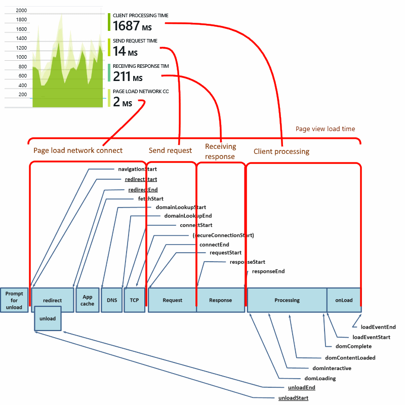

Beachten Sie, dass die *Verbindung mit dem Netzwerk* Zeit häufig niedriger als erwartet, da sie einen Mittelwert über alle Anfragen über den Browser auf dem Server ist. Viele einzelne Anfragen haben eine Verbindungszeit von 0, da bereits eine aktive Verbindung mit dem Server besteht.

### Verlangsamen Sie laden?

Langsam Seite geladen sind die wichtigsten Ursache der Unzufriedenheit für Ihre Benutzer. Wenn das Diagramm zeigt an, langsam Seite geladen, ganz einfach einige diagnostic Recherche durchführen.

Das Diagramm zeigt den Mittelwert aller Laden der Seite in Ihrer app. Um festzustellen, ob das Problem zu bestimmten Seiten beschränkt ist, suchen Sie weiter unten in der Blade, in einem Raster aufgeteilt, indem Sie Seiten-URL vorhanden ist:

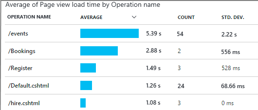

Beachten Sie die Seitenzahl für die Ansicht und die Standardabweichung. Wenn die Seitenzahl sehr niedrig ist, ist nicht klicken Sie dann das Problem auswirkt Benutzer viel. Eine hohe Standardabweichung (vergleichbar mit den Mittelwert selbst) Zeigt große Unterschiede zwischen den einzelnen Maßeinheiten an.

**Klicken Sie auf eine URL und eine Seitenansicht vergrößern.** Klicken Sie auf einer beliebigen Seitennamen einer Falz Browser Diagramme, die URL einfach gefiltert anzuzeigen. und dann auf einer Instanz von einer Seite anzeigen.

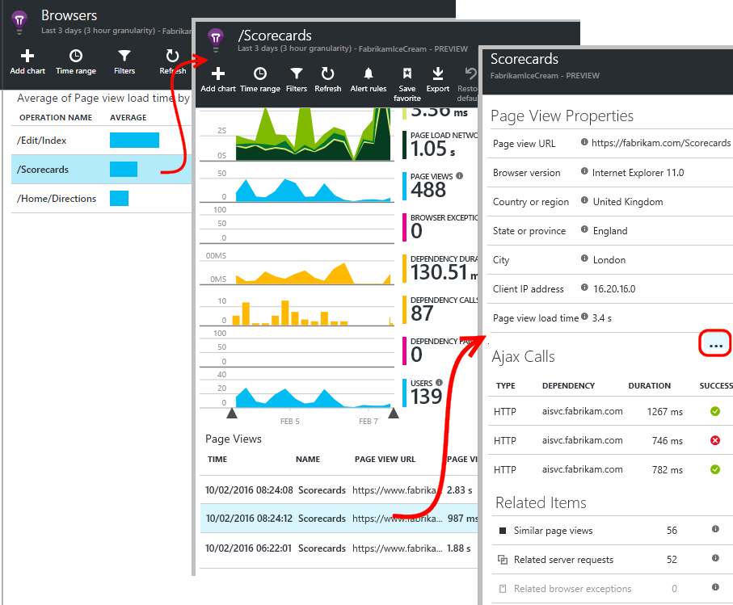

Klicken Sie auf `...` für eine vollständige Liste der Eigenschaften für das betreffende Ereignis oder Prüfen der Ajax-Aufrufe und die zugehörigen Ereignisse. Langsam Ajax-Aufrufe Einfluss auf die Gesamtdauer der Seite laden, wenn diese synchron sind. Verwandte Ereignisse einschließen Serveranfragen für dieselbe URL (falls Sie Einsichten Anwendung auf dem Webserver eingerichtet haben).

**Seite Leistung über einen Zeitraum.** Zurück in das Blade Browser ändern Sie das Seite Ansicht laden Zeitraster in einem Liniendiagramm, um festzustellen, ob es Spitzen zu bestimmten Zeiten wurden aus:

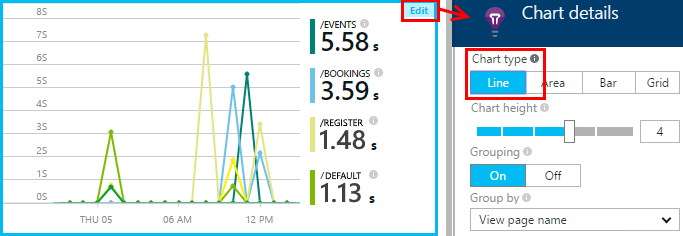

**Nach anderen Dimensionen segmentieren.** Vielleicht sind Ihre Seiten langsamer beim Laden auf einer bestimmten Browser, einem Client-Betriebssystem oder einem Benutzer Ort? Hinzufügen eines neuen Diagramms, und experimentieren Sie mit der **Group by -** Dimension.

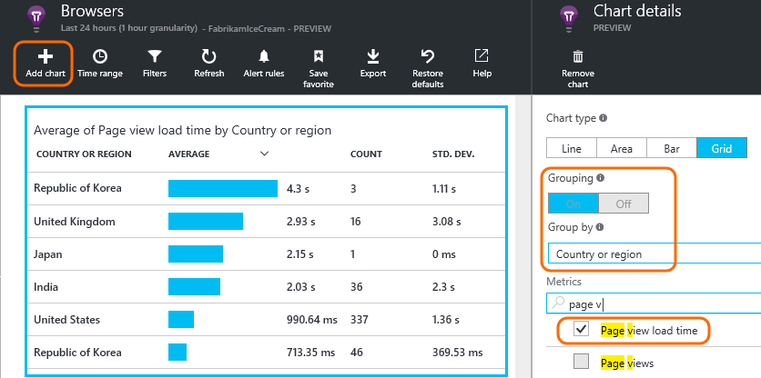

## AJAX-Leistung

Vergewissern Sie sich auch alle AJAX-Aufrufe in Ihren Webseiten ausführen möchten. Sie werden häufig verwendet, um asynchrone Teile der Seite zu füllen. Obwohl die übrige Seite umgehend laden möglicherweise, konnte Ihre Benutzer unbefriedigend werden beginnend bei leeren Webparts, warten auf Daten in der sie angezeigt werden.

AJAX-Aufrufe aus Ihrer Webseite werden auf dem Browser-Blade als Abhängigkeiten angezeigt.

Es gibt Zusammenfassungsdiagramme im oberen Teil des Blades aus:

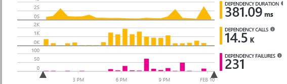

und detaillierte Raster weiter unten:

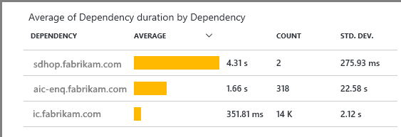

Klicken Sie auf eine beliebige Zeile für bestimmte Details.

> [AZURE.NOTE] Wenn Sie den Browser-Filter für das Blade löschen, werden sowohl AJAX Abhängigkeiten als auch Server in diesen Diagrammtypen enthalten. Klicken Sie auf Standard wiederherstellen, um den Filter neu zu konfigurieren.

**Zum Ausführen von Drilldowns in Fehler beim Ajax-Aufrufe oder** führen Sie einen Bildlauf nach unten zu Fehlern Rasters Abhängigkeit, und klicken Sie dann auf eine Zeile, um bestimmte Instanzen finden Sie unter.

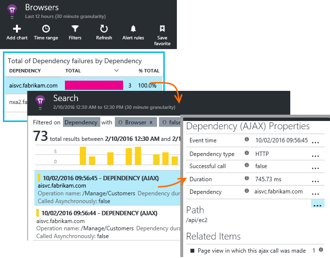

Klicken Sie auf `...` für die vollständige werden bei einem Anruf Ajax.

### Keine Ajax-Aufrufe gemeldet?

AJAX-Aufrufe gehören alle HTTP-Aufrufe aus dem Skript Ihrer Webseite. Wenn Sie diese gemeldet angezeigt werden, überprüfen Sie, dass der Codeausschnitt festgelegt wird nicht die `disableAjaxTracking` oder `maxAjaxCallsPerView` [Parameter](https://github.com/Microsoft/ApplicationInsights-JS/blob/master/API-reference.md#config).

## Browser Ausnahmen

In den Browsern Blade gibt es eine Zusammenfassung Ausnahmen-Diagramm und einem Raster Ausnahme Typen weiter unten das Blade.

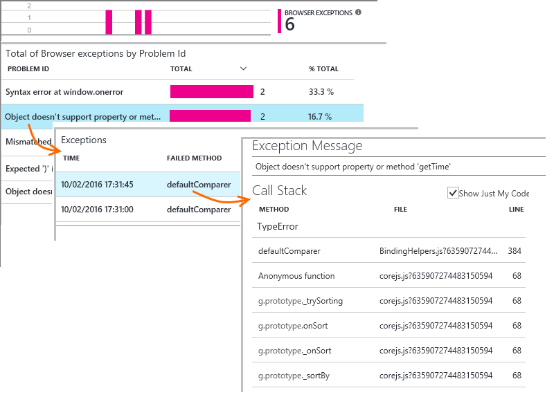

Wenn Sie den Browser Ausnahmen gemeldet angezeigt werden, überprüfen, dass der Codeausschnitt festgelegt wird nicht die `disableExceptionTracking` [Parameter](https://github.com/Microsoft/ApplicationInsights-JS/blob/master/API-reference.md#config).

## Prüfen der Ereignisse für einzelne Seite anzeigen

In der Regel wird die Seite Ansicht werden durch die Anwendung Einsichten analysiert und nur kumulierte Berichte als Mittelwert für alle Benutzer angezeigt. Für das Debuggen können Sie auch bei einer einzelnen Seite Ansicht Ereignisse sehen aber.

Legen Sie das Blade Diagnostic suchen Filter auf Seitenansicht.

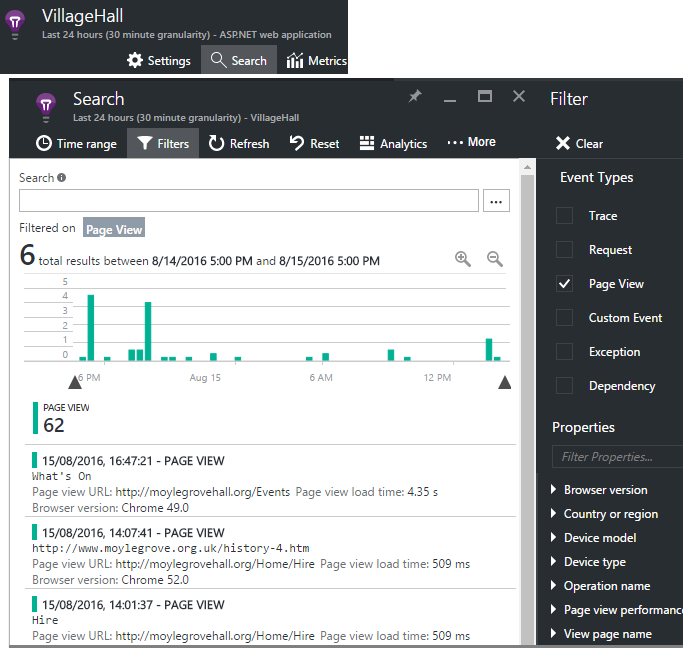

Wählen Sie ein beliebiges Ereignis, um weitere Details anzuzeigen. Klicken Sie auf der Detailseite auf "...", um noch mehr Details anzuzeigen.

> [AZURE.NOTE] Wenn Sie die [Suche](app-insights-diagnostic-search.md)verwenden, beachten Sie, dass Sie nach ganzen Wörtern: "En" und "Informationen zu" stimmen nicht überein, "Info".

Die leistungsfähige [Analytics-Abfragesprache](app-insights-analytics-tour.md) können Sie auch auf der Seitenansichten suchen.

### Anzeigen der Seiteneigenschaften

* **Seite Ansicht Dauer** 

 * Standardmäßig die Zeit, die zum Laden der Seite Desktopclient benötigt anfordern, vollständige Auslastung (einschließlich Hilfsdateien ausgenommen sind asynchrone Aufgaben wie Ajax-Anrufe). 
 * Wenn Sie festlegen `overridePageViewDuration` in der [Seitenkonfiguration](#detailed-configuration), anfordern der Zeitraum zwischen Client für die Ausführung von der ersten `trackPageView`. Wenn Sie nach der Initialisierung der das Skript TrackPageView von seiner üblichen Position verschoben haben, wird es wirken sich auf einen anderen Wert aus.
 * Wenn `overridePageViewDuration` festgelegt ist und eine Dauer Argument, in angegeben wird der `trackPageView()` anrufen möchten, und klicken Sie dann der Argumentwert stattdessen verwendet wird. 

## Benutzerdefinierte Seite ermittelt.

Standardmäßig wird eine Seitenzahl jedes Mal, wenn eine neue Seite in den Clientbrowser lädt.  Aber möglicherweise zusätzliche Ansichten zählen möchten. Beispielsweise eine Seite möglicherweise anzeigen, deren Inhalt in Registerkarten und eine Seite einbezogen werden, wenn der Benutzer Registerkarten wechselt werden sollen. Oder JavaScript-Code auf der Seite möglicherweise neuen Inhalte ohne Ändern der URL des Browsers zu laden.

Einfügen eines Anrufs JavaScript wie folgt an der entsprechenden Stelle im Clientcode:

    appInsights.trackPageView(myPageName);

Der Name der Seite enthalten kann dieselben Zeichen im URL, aber einen anderen Wert als nach "#" oder "?" wird ignoriert.

## Verwendung der Überwachung

Möchten Sie herausfinden, was Ihre Benutzer-App tun?

* [Erfahren Sie mehr über die Verwendung der Überwachung](app-insights-web-track-usage.md)
* Sie [erhalten grundlegende Informationen zu benutzerdefinierten Ereignisse und Kennzahlen API](app-insights-api-custom-events-metrics.md).

#### Video: Nachverfolgen Verwendung

> [AZURE.VIDEO tracking-usage-with-application-insights]

## Nächste Schritte

* [Nachverfolgen von Verwendung](app-insights-web-track-usage.md)
* [Benutzerdefinierte Ereignisse und Kriterien](app-insights-api-custom-events-metrics.md)
* [Generator-Measure erfahren](app-insights-overview-usage.md)

