<properties 
    pageTitle="Erkunden von Kriterien in der Anwendung Einsichten | Microsoft Azure" 
    description="Wie Diagramme auf metrischen Explorer interpretiert, und wie Sie metrischen Explorer Blades anpassen." 
    services="application-insights" 
    documentationCenter=""
    authors="alancameronwills" 
    manager="douge"/>

<tags 
    ms.service="application-insights" 
    ms.workload="tbd" 
    ms.tgt_pltfrm="ibiza" 
    ms.devlang="na" 
    ms.topic="article" 
    ms.date="10/15/2016" 
    ms.author="awills"/>
 
# Erkunden von Kriterien in der Anwendung Einsichten

Kennzahlen [Anwendung Einsichten] [ start] sind gemessen Werte und der Anzahl von Ereignissen, die von Ihrer Anwendung in werden gesendet werden. Sie dienen Leistungsprobleme erkennen, und schauen Sie sich die Trends in Ihrer Anwendung wie verwendet wird. Es gibt eine Vielzahl von standard Kennzahlen und können Sie auch eigene benutzerdefinierte Maße und Ereignisse erstellen.

Kennzahlen und Ereignis zählt werden in Diagrammen, wie z. B. Summen, Mittelwerte oder zählt aggregierte Werte angezeigt.

So sieht ein Beispieldiagramm aus:

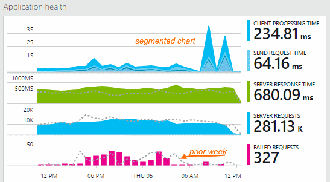

Einige Diagramme werden unterteilt: die gesamte Höhe des Diagramms zu einem beliebigen Zeitpunkt sind die Summe der Metrik angezeigt. Die Legende standardmäßig zeigt die größten Mengen.

Gepunktete Linien zeigen den Wert der Metrik eine Woche zuvor.

## Zeitraums

Sie können den Zeitbereich fallen Diagramme oder der angezeigten Datenblätter auf eine beliebige Blade ändern.

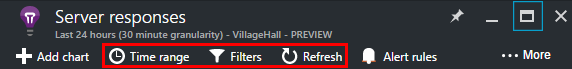

Wenn Sie einige Daten, die noch angezeigte noch nicht erwartet sind, klicken Sie auf aktualisieren. Diagramme, aktualisieren selbst in Abständen, aber die Intervalle für größere Zeiträume länger sind. Im Release-Modus kann es eine Weile für Daten in der Verkaufspipeline Analyse auf ein Diagramm überstehen dauern.

Um Teil eines Diagramms zu vergrößern, ziehen Sie über die Schaltfläche:

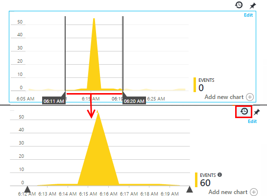

Klicken Sie auf die Schaltfläche rückgängig zu machen Zoom, um sie wiederherzustellen.

## Genauigkeit und Punkt-Werte

Zeigen Sie mit dem Mauszeiger über dem Diagramm, um die Werte der Metrik, die zu diesem Zeitpunkt anzuzeigen.

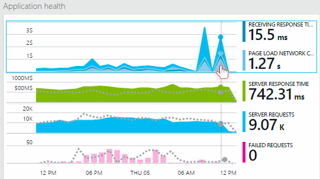

Für das vorherige werden Intervall wird der Wert der Metrik zu einem bestimmten Zeitpunkt aggregiert. 

Die Stichprobe-Intervall oder "Genauigkeit" wird am oberen Rand der Blade angezeigt. 

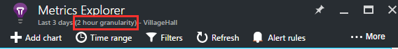

Sie können der Reihenfolge, in der Zeit Bereich Blade anpassen:

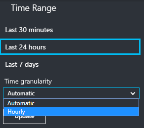

Die Granularität der verfügbaren abhängig des Zeitraums, den Sie auswählen. Die explizite Granularität der sind Alternativen zu den "automatisch" Genauigkeit für den Zeitraum an. 

## Kennzahlen Explorer

Klicken Sie auf jedes Diagramm auf das Blade Übersicht eine ausführlichere Reihe von verknüpften Diagramme und Raster anzeigen. Sie können diese Diagramme und Raster auf die Details konzentrieren, die Sie interessiert bearbeiten.

Oder Sie können nur auf die Schaltfläche Kennzahlen Explorer am Anfang des Blades Übersicht.

Klicken Sie beispielsweise über das Web-app fehlerhaften Anforderungen Diagramm auf:

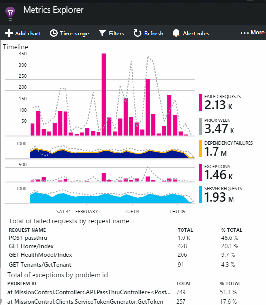

## Was bedeuten die Zahlen?

Die Legende auf der Seite standardmäßig zeigt den Aggregatwert normalerweise über den Zeitraum des Diagramms. Wenn Sie auf das Diagramm zeigen, zeigt es den Wert an diesem Punkt.

Jeder Datenpunkt im Diagramm wird ein Aggregat der Datenwerte in der vorherigen Intervall oder "Genauigkeit" erhalten. Die Genauigkeit wird am oberen Rand der Blade angezeigt und unterscheidet sich je nach der gesamten Zeitskala des Diagramms.

Kennzahlen können auf verschiedene Arten aggregiert sein: 

 * **Summe** addiert die Werte für alle Datenpunkte über das Stichprobe-Intervall oder den Zeitraum des Diagramms empfangen.
 * **Durchschnittliche** dividiert die Summe durch die Anzahl von Datenpunkten, die für das Intervall erhalten.
 * Anzahl der Benutzer und Konten dienen zählt **eindeutig fest** . Die Abbildung zeigt die Anzahl der verschiedenen Benutzer in dieser Zeitspanne angezeigt, für das Intervall werden oder über den Zeitraum des Diagramms.

Sie können die Aggregationsmethode ändern:

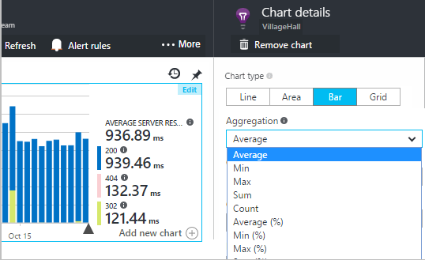

Beim Erstellen eines neuen Diagramms oder wenn alle Kriterien deaktiviert sind, ist die standardmäßige Methode für jede Metrik dargestellt:

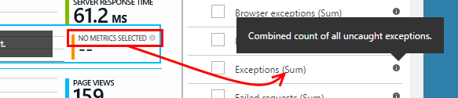

## Diagramme und Raster bearbeiten

So fügen Sie ein neues Diagramm an die Blade hinzu:

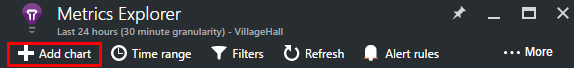

Wählen Sie auf einer vorhandenen oder neuen Diagramm zu bearbeiten, was es zeigt **Bearbeiten** :

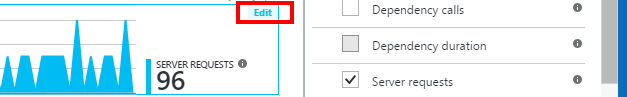

Sie können mehrere Metrisch in einem Diagramm anzeigen, obwohl es gibt Einschränkungen zu den möglichen Kombinationen, die zusammen angezeigt werden können. Sobald Sie einen Metrisch auswählen, werden einige der anderen deaktiviert. 

Wenn Sie [benutzerdefinierte Metrik] codiert[ track] in Ihrer app (Anrufe an TrackMetric und TrackEvent) werden sie hier aufgelistet werden.

## Segmentieren von Daten

Sie können eine Metrik beispielsweise von Eigenschaft - Teilen, um die Seitenansichten auf Clients mit unterschiedlichen Betriebssystemen vergleichen. 

Wählen Sie ein Diagramm oder Raster, wechseln Sie auf Gruppieren, und wählen Sie eine Eigenschaft auf Gruppieren nach aus:

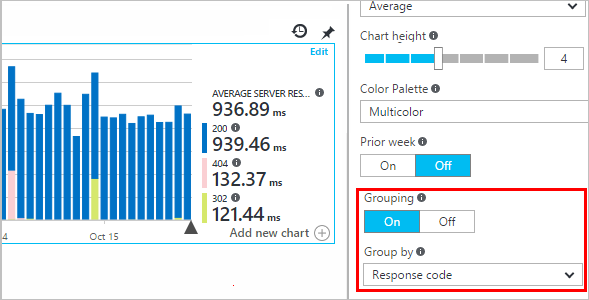

> [AZURE.NOTE] Wenn Sie die Gruppierung verwenden, verfügen über die Bereich und Balkendiagramm Datentypen eine gestapelte. Dies ist geeignete Stelle, an der die Aggregationsmethode Summe ist. Aber wo finde ich der Aggregationstyp Mittelwert, wählen Sie die Linie oder Raster anzeigen. 

Wenn Sie [benutzerdefinierte Metrik] codiert[ track] in Ihrer app und sie die Eigenschaftswerte umfassen, die Eigenschaft in der Liste auswählen können zwar.

Ist das Diagramm zu klein für segmentierter Daten? Passen Sie die Höhe an:

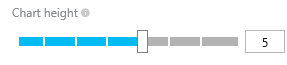

## Filtern von Daten

Um nur die Metrik für einen ausgewählten Satz von Immobilienwerte anzuzeigen:

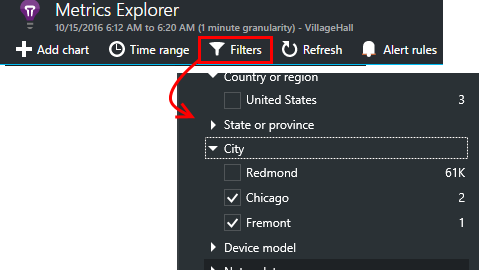

Wenn Sie alle Werte für eine bestimmte Eigenschaft nicht auswählen, ist es auswählen, dass alle identisch: keine Filter vorhanden ist, klicken Sie auf die Eigenschaft.

Beachten Sie die Anzahl der Ereignisse neben jeder Eigenschaftswert. Wenn Sie die Werte einer Eigenschaft auswählen, werden die zählt zusammen mit anderen Eigenschaftswerten angepasst.

Filter gelten für alle Diagramme auf einer-Blade. Wenn verschiedene Filter auf unterschiedliche Diagramme angewendet werden soll, erstellen Sie und speichern Sie unterschiedliche Maße Blades. Wenn Sie möchten, können Sie Diagramme aus anderen Blades zum Dashboard, anheften, damit Sie nebeneinander sehen kann.

### Entfernen Sie den Datenverkehr Bot und Web-test

Verwenden Sie den Filter **reellen oder synthetische Datenverkehr** , und aktivieren Sie **Real**.

Sie können auch nach der **Quelle der synthetische Datenverkehr**filtern.

### Eigenschaften der Filterliste hinzu

Möchten Sie gefiltert werden, klicken Sie auf eine Kategorie Ihrer Wahl? Beispielsweise vielleicht Sie Aufteilen von Benutzer in anderen Kategorien und möchte Sie Ihre Daten nach dieser Kategorie zu segmentieren.

[Erstellen eigener Eigenschaft](app-insights-api-custom-events-metrics.md#properties). Legen Sie sie in einer [Initialisierung werden](app-insights-api-custom-events-metrics.md#telemetry-initializers) so, dass sie alle werden – einschließlich der standardmäßigen werden von verschiedenen SDK Module gesendet werden angezeigt.

## Bearbeiten Sie den Diagrammtyp

Beachten Sie, dass Sie zwischen Raster und Diagramme wechseln können:

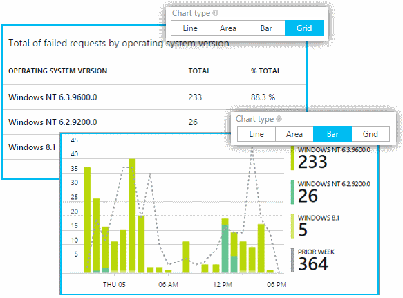

## Speichern Sie Ihre Kennzahlen blade

Wenn Sie einige Diagramme erstellt haben, speichern Sie sie als Favoriten. Sie können auswählen, ob es für andere Teammitglieder freigeben, wenn Sie ein Organisations-Konto verwenden.

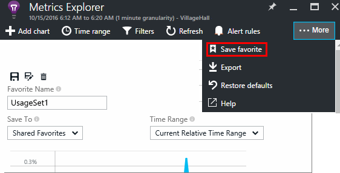

So finden Sie unter dem Blade erneut, **Wechseln Sie zu dem Blade Übersicht** und Favoriten öffnen:

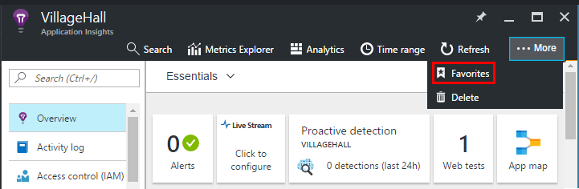

Wenn Sie Relative Zeitraums ausgewählt haben, wenn Sie gespeichert haben, wird das Blade mit der neuesten Kennzahlen aktualisiert werden. Wenn Sie Absolute Zeitraums ausgewählt haben, wird es jedes Mal dieselben Daten angezeigt.

## Zurücksetzen der blade

Wenn Sie eine Blade bearbeiten, aber dann Sie mit dem Original gespeichert festlegen zurückzukehren möchten, klicken Sie einfach auf Zurücksetzen.

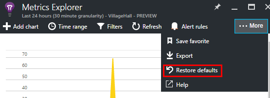

## Live Kennzahlen Stream: instant Kennzahlen für die Überwachung schließen

Live Kennzahlen Stream zeigt Sie Anwendung metrischen rechts zu diesem Zeitpunkt sehr mit einer nahezu in Echtzeit Wartezeit von 1 Sekunde. Dies ist sehr hilfreich, wenn Sie einen neuen Build freigeben sind und möchten sicherstellen, dass alles funktioniert wie erwartet, oder Untersuchung läuft einen Vorfall in Echtzeit ist.

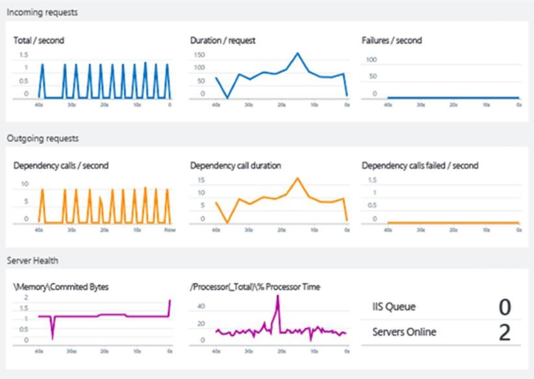

Im Gegensatz zu Kennzahlen Explorer zeigt Live Kennzahlen Stream eine feste Anzahl von Kennzahlen. Die Daten beibehalten werden nur solange es, klicken Sie auf das Diagramm ist, und klicken Sie dann verworfen. 

Live Kennzahlen Stream gehört zum Lieferumfang der Anwendung Einsichten SDK für ASP.NET, Version 2.1.0 oder höher.

## Festlegen von Benachrichtigungen

Wenn Sie per e-Mail von einer Metrik ungewöhnliche Werte benachrichtigt werden, fügen Sie eine Benachrichtigung hinzu. Sie können entweder die e-Mail zu senden, können Sie das Konto-Administratoren oder bestimmte e-Mail-Adressen auswählen.

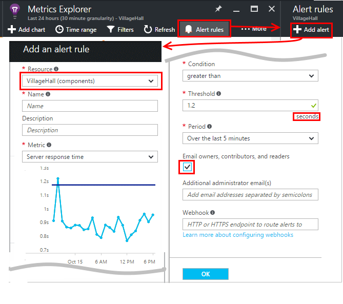

[Weitere Informationen zu Benachrichtigungen][alerts].

## Exportieren nach Excel

Sie können metrische Daten exportieren, die in einer Excel-Datei in Metrisch Explorer angezeigt wird. Die exportierten Daten enthält Daten aus allen Diagramme und Tabellen im Portal gesehen. 

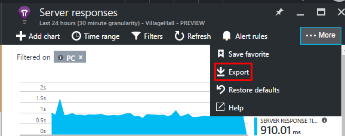

Die Daten für jedes Diagramm oder eine Tabelle werden in einem anderen Arbeitsblatt in der Excel-Datei exportiert.

Was Sie finden Sie unter Was exportiert wird. Ändern Sie den Zeitraum oder Filter, ändern den Bereich der Daten, die exportiert werden soll. Für Tabellen Wenn der Befehl **mehr laden** angezeigt wird, können Sie darauf klicken, bevor Sie klicken Sie auf exportieren, um weitere Daten exportiert haben.

*Exportieren Sie funktioniert nur für Internet Explorer und Chrome am präsentieren. Wir arbeiten zum Hinzufügen von Unterstützung für andere Browser.*

## Fortlaufender exportieren

Wenn die gewünschten Daten kontinuierlich exportiert, sodass die extern verarbeitet werden können, sollten Sie [fortlaufend exportieren](app-insights-export-telemetry.md).

### Power BI

Wenn sogar aussagefähigere Ansichten der Daten gewünscht, können Sie [auf Power BI exportieren](http://blogs.msdn.com/b/powerbi/archive/2015/11/04/explore-your-application-insights-data-with-power-bi.aspx).

## Analytics

[Analytics](app-insights-analytics.md) ist eine wesentlich flexibler Möglichkeit zum Analysieren Ihrer mithilfe einer leistungsfähigen Abfragesprache werden. Verwenden Sie diese kombinieren Ergebnisse von Kennzahlen berechnen oder Ausführen einer Untersuchung in Deph der zuletzt verwendete Leistung Ihrer app werden soll. Verwenden Sie Kennzahlen Explorer andererseits, wenn Sie die automatische Aktualisierung Diagramme auf Dashboard und Benachrichtigungen möchten.

## Behandlung von Problemen

*Das Diagramm wird keine Daten angezeigt.*

* Filter gelten für alle Diagramme den Blade. Stellen Sie sicher, dass Sie, während Sie sich in einem Diagramm konzentrieren sind, haben Sie einen Filter festlegen, der alle Daten auf einem anderen ausschließt. 

    Wenn Sie verschiedene Filter für andere Diagramme festgelegt, in anderen Blades zu erstellen möchten, speichern Sie diese als separate Favoriten. Wenn Sie möchten, können Sie sie auf dem Dashboard anheften, damit Sie nebeneinander sehen kann.

* Wenn Sie ein Diagramm nach einer Eigenschaft, die nicht auf die Metrik definiert ist gruppieren, dann werden nichts im Diagramm. Versuchen Sie leeren 'Gruppieren nach', oder wählen Sie eine unterschiedliche Gruppierungseigenschaft aus.
* Performance-Daten (CPU, EA Zins usw.) steht für Java-Webdiensten, Windows-desktop-apps, [IIS web apps und Diensten, wenn Sie den Statusmonitor installieren](app-insights-monitor-performance-live-website-now.md)und [Azure-Cloud-Dienste](app-insights-azure.md). Es ist nicht verfügbar für Azure Websites.

## Nächste Schritte

* [Überwachen der Verwendung mit Anwendung Einsichten](app-insights-overview-usage.md)
* [Mithilfe der Suchfunktion Diagnose](app-insights-diagnostic-search.md)

<!--Link references-->

[alerts]: app-insights-alerts.md
[start]: app-insights-overview.md
[track]: app-insights-api-custom-events-metrics.md

 