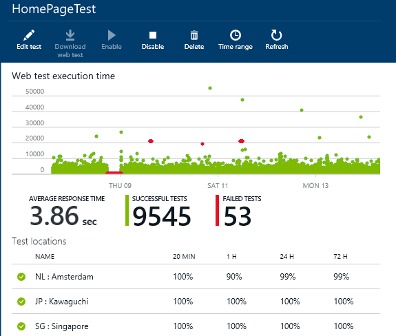
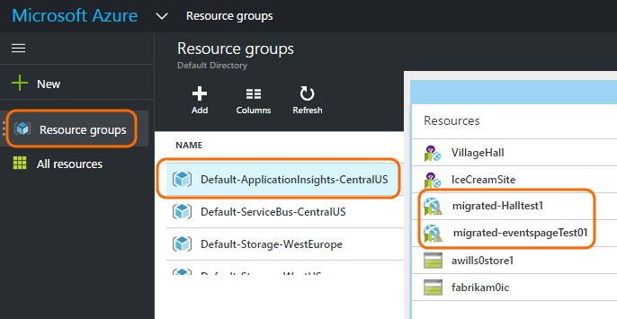
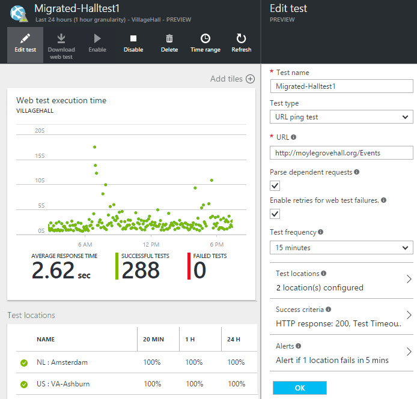

<properties 
    pageTitle="Migrieren von Azure-Endpunkt zu Anwendung Einsichten Verfügbarkeit überprüft" 
    description="Migrieren von klassischen Azure Endpunkt Überwachung Tests Anwendung Einblicke in überprüft Verfügbarkeit von 31 Oktober 2016."
    services="application-insights" 
    documentationCenter=""
    authors="soubhagyadash" 
    manager="douge"/>

<tags 
    ms.service="application-insights" 
    ms.workload="tbd" 
    ms.tgt_pltfrm="ibiza" 
    ms.devlang="na" 
    ms.topic="article" 
    ms.date="07/25/2016" 
    ms.author="awills"/>
 
# Verschieben von Azure-Endpunkt zu Anwendung Einsichten Verfügbarkeit Tests für die Überwachung

[Überwachen der Endpunkt](https://blogs.msdn.microsoft.com/mast/2013/03/03/windows-azure-portal-update-configure-web-endpoint-status-monitoring-preview/) für Ihre apps Azure verwenden Sie? *31 Oktober 2016*werden wir sie durch die neuen und leistungsfähigeren [Verfügbarkeit überprüft](app-insights-monitor-web-app-availability.md)ersetzen. Wir haben einige der neuen Tests, bereits erstellt, obwohl sie bis 31 Oktober 2016 deaktiviert sind. 

Können Sie die neuen Tests bearbeiten und führen Sie den Schalter selbst wenn Sie möchten. Sie werden [Azure-Portal](https://portal.azure.com) in Standard-ApplicationInsights-CentralUS Ressourcengruppe fündig.

## Was sind die Verfügbarkeit überprüft?

Testen der Verfügbarkeit ist ein Feature von Azure, die ständig überprüft, dass eine Website oder einen bestimmten Dienst aktiv ist und Ausführung per HTTP-Anfragen (einzelne Ping-Tests oder Visual Studio Webtests) bis zu 16 Orten weltweit. 

In der [klassischen Azure-Portal](https://manage.windowsazure.com)wurden diese Tests Endpunkt Überwachung bezeichnet. Sie wurden mehr Umfang eingeschränkt. Die neuen Verfügbarkeit Tests sind eine wesentliche Verbesserung:

* Bis zu 10 Visual Studio Webtests oder Ping-Tests pro Anwendung Einsichten Ressource. 
* Bis zu 16 Speicherorte weltweit für Test Anfragen an Ihre Web app. Bessere Kontrolle Test Erfolg Kriterien. 
* Testen Sie eine Website oder einen bestimmten Dienst – nicht nur Azure Web apps.
* Testen der Wiederholungsversuche: falsch positiv Benachrichtigungen aufgrund einer vorübergehenden Netzwerkproblemen zu verringern. 
* Webhooks können HTTP POST Benachrichtigungen für die Benachrichtigungen erhalten.

Weitere Informationen zur [Verfügbarkeit Tests hier](app-insights-monitor-web-app-availability.md).

Verfügbarkeit Tests gehören [Visual Studio Anwendung Einblicken](app-insights-overview.md), welche eines extensible Analytics-Diensts für jede Web-Anwendung ist.

## Was passiert mit meinem Endpunkt also überprüft wird?

* Wir haben Ihre Überwachung Tests durch, um die neuen Einblicken Verfügbarkeit Tests Endpunkt kopiert.
* Die neuen Verfügbarkeit Tests sind derzeit deaktiviert, und die alte Endpunkt Tests immer noch ausgeführt werden.
* Die Warnung Regeln *nicht* migriert wurden. Die neuen Tests wurden ursprünglich mithilfe einer Standardregel eingerichtet:
 * Wird ausgelöst, wenn mehr als 1 Speicherort Fehlern in 5 Minuten Berichte.
 * Sendet eine e-Mail an die Administratoren Abonnement.

Im [Portal Azure](https://portal.azure.com)finden Sie die migrierte Tests in der Ressourcengruppe "Standard-ApplicationInsights-CentralUS". Die Testnamen werden mit dem Präfix "Migriert-". 

## Was muss ich tun?

* Wenn wir aus irgendeinem Grund verpasst die Tests migrieren haben, sind die neuen Verfügbarkeit Tests [leicht zu einrichten](app-insights-monitor-web-app-availability.md).

### Option A: Führen Sie nichts. Lassen sie uns.

**Klicken Sie auf 31 Oktober 2016,** werden folgende Themen erläutert:

* Deaktivieren Sie das alte Endpunkt überprüft.
* Aktivieren Sie das migrierte Verfügbarkeit überprüft.

### Option B: Sie verwalten und/oder die neuen Tests aktivieren.

* Überprüfen Sie und bearbeiten Sie die neuen Verfügbarkeit Tests im neuen [Azure-Portal](https://portal.azure.com). 
 * Überprüfen Sie die Auslöserkriterien
 * Überprüfen Sie die e-Mail-Empfänger
* Aktivieren Sie die neuen tests
* Wir werden den Überwachung Tests auf 31 Oktober 2016 legacy Endpunkt deaktivieren. 

### Option C: entscheiden

Wenn Sie nicht Verfügbarkeit Tests verwenden möchten, können Sie diese [Azure](https://portal.azure.com)-Portal löschen. Es gibt auch ein Link Abo kündigen am unteren Rand der Benachrichtigung-e-Mails.

Wir werden weiterhin die alte Endpunkt Tests auf 31 Oktober 2016 gelöscht. 

## Wie bearbeite ich die neuen Tests?

Melden Sie sich bei der [Azure-Portal](https://portal.azure.com) , und suchen Sie die 'Migriert-' Web Tests durch: 

Bearbeiten und/oder den Test zu aktivieren:

## Woran liegt dies?

Bessere Dienste. Der alten Endpunkt Dienst wurde viel schmaler zu gestalten. Sie können nur zwei URLs für einfache Ping-Tests von 3 Geo Positionen für eine Azure virtuellen Computers oder Web-app bereitstellen. Die neuen Tests können mit mehreren Schritten Webtests Ausführen von bis zu 16 Speicherorte, und Sie können bis zu 10 Tests für eine Anwendung angeben. Sie können einen beliebigen URL testen – es verfügt nicht über eine Azure-Website sein.

Die neuen Tests sind separat konfiguriert aus dem Web app oder virtuellen Computer, den Sie testen möchten. 

Die Migration die Tests durch, um sicherzustellen, dass Sie weiterhin Kontrolle über die sie beim Verwenden des neuen Portal haben. 

## Was ist eine Anwendung Einsichten?

Die neuen Verfügbarkeit Tests [Visual Studio Anwendung Einsichten](app-insights-overview.md)gehören. Hier ist ein [2-Minuten-Video](http://go.microsoft.com/fwlink/?LinkID=733921).

## Verwende ich für die neuen Tests Bezahlung?

Die migrierte Tests werden in der kostenlosen Standard-Plan in einer Anwendung Einsichten Ressource ausgerichtet. Dadurch wird die Sammlung von bis zu 5 Millionen Datenpunkten. Die behandelt einfach die Lautstärke von Daten, die die Tests aktuell verwendet werden. 

Natürlich Wenn zufrieden sind Einblicken Anwendung und mehr Verfügbarkeit Tests erstellen oder mehr Leistung für die Überwachung und Diagnose Features übernehmen, werden dann Sie weitere Datenpunkte generieren.  Das Ergebnis wäre jedoch nur, dass Sie das Kontingent für den kostenlosen Plan erreichen wird. Sie erhalten keine Rechnung, es sei denn, Sie in der Standard oder Premium-Pläne auswählen. 

[Erfahren Sie mehr über die Anwendung Einsichten Preise und Kontingent für die Überwachung](app-insights-pricing.md). 

## Was ist, und migriert ist nicht?

Beibehalten der alten Endpunkt Tests:

* Endpunkt-URL getestet werden.
* Geo Speicherorte aus denen die Anfragen gesendet werden.
* Test Häufigkeit bleibt 5 Minuten.
* Test Timeout bleibt 30 Sekunden. 

Nicht migriert werden:

* Benachrichtigung auslösen Regel. Die Regel, die wir Trigger eingerichtet haben, wenn 1 Speicherort Fehlern in 5 Minuten Berichte.
* Warnen Sie Empfänger. Benachrichtigung sendet per e-Mail werden der Besitzer des Abonnements und gemeinsame gesendet werden. 

## Wie finde ich die neuen Tests?

Sie können eines der neuen Tests jetzt bearbeiten, wenn Sie möchten. Melden Sie sich bei der [Azure-Portal](https://portal.azure.com), öffnen Sie **Ressourcengruppen** zu, und wählen Sie **Standard-ApplicationInsights-CentralUS**aus. In dieser Gruppe finden Sie die neuen Webtests. [Erfahren Sie mehr über die neuen Verfügbarkeit Tests](app-insights-monitor-web-app-availability.md).

Bitte beachten Sie, dass die neue Benachrichtigung e-Mails von dieser Adresse gesendet werden soll: App Einsichten Benachrichtigungen(ai-noreply@microsoft.com)

## Was passiert, wenn ich nichts tun?

Die Option A wird angewendet. Wir die migrierte Tests aktivieren, und richten Sie die standardmäßigen Warnungsregeln wie zuvor erwähnt. Sie müssen alle benutzerdefinierten Warnungsregeln Empfänger oben erwähnten hinzufügen. Wir werden den legacy-Endpunkt Tests für die Überwachung zu deaktivieren. 

## Wo kann ich Feedback zu diesem ermöglichen? 

Vielen Dank für Ihr Feedback. Melden Sie [uns eine e-Mail](mailto:vsai@microsoft.com)aus. 

