<properties
    pageTitle="Diagnostizieren Leistungsprobleme auf einer laufenden IIS-Website | Microsoft Azure"
    description="Überwachen der Leistung einer Website ohne es erneut bereitstellen. Verwenden von eigenständigen oder Anwendung Einsichten SDK abzurufenden Abhängigkeit werden."
    services="application-insights"
    documentationCenter=".net"
    authors="alancameronwills"
    manager="douge"/>

<tags
    ms.service="application-insights"
    ms.workload="tbd"
    ms.tgt_pltfrm="ibiza"
    ms.devlang="na"
    ms.topic="get-started-article"
    ms.date="10/24/2016"
    ms.author="awills"/>

# Urkunde Web apps zur Laufzeit in der Anwendung Einsichten

*Anwendung Einsichten ist in der Vorschau.*

Sie können eine live-Web app mit Visual Studio-Anwendung Einblicken, ohne zu ändern oder das erneute Bereitstellen von Code instrumentieren. In Ihrer apps gehostet werden durch eine lokale IIS-Server, installieren Sie Status Monitor; oder wenn sie Azure Web apps sind oder ein Azure-virtuellen Computer ausführen möchten, können Sie die Anwendung Einsichten Erweiterung installieren. (Es gibt auch separate Artikel zu instrumentieren [live J2EE Web apps](app-insights-java-live.md) und [Azure Cloud Services](app-insights-cloudservices.md).)

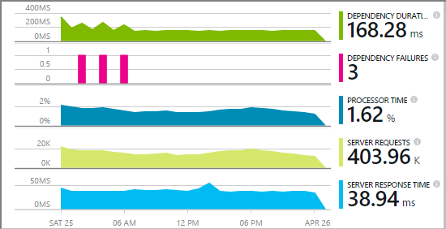

Sie haben die Wahl der drei leitet Anwendung Einsichten zu Ihren Web anwenden:

* **Zeit zu erstellen:** [Hinzufügen die Anwendung Einsichten SDK] [greenbrown] dem Web app-Code. 
* **Laufzeit:** Instrumentieren Sie Web app auf dem Server an, wie unten beschrieben, ohne erneut erstellen und erneutes Bereitstellen des Codes.
* **Beide:** Erstellen Sie das SDK in den Code der Web-app, und wenden Sie außerdem die Laufzeit-Erweiterungen. Erhalten Sie das beste aus beiden Optionen. 

Hier finden Sie eine Zusammenfassung der was Sie nach jeder Routing erhalten möchten:

||Erstellen der Uhrzeit|Laufzeit|
|---|---|---|
|Anfragen und Ausnahmen|Ja|Ja|
|[Ausführlichere Ausnahmen](app-insights-asp-net-exceptions.md)||Ja|
|[Abhängigkeit Diagnose](app-insights-asp-net-dependencies.md)|Klicken Sie auf .NET 4.6 +|Ja|
|[Systemleistungsindikatoren](app-insights-performance-counters.md)||IIS oder Azure-Cloud-Dienst, nicht Azure Web app|
|[API für benutzerdefinierte werden][api]|Ja||
|[Verfolgen von Log-integration](app-insights-asp-net-trace-logs.md)|Ja||
|[Seite anzeigen und Benutzer Daten](app-insights-javascript.md)|Ja||
|Keine müssen Code neu erstellen.|Nein||

## Instrumentieren Sie Web app zur Laufzeit

Sie benötigen eine [Microsoft Azure](http://azure.com) -Abonnement.

### Ist Ihre app ein Azure Web app oder Cloud-Dienst

* Wählen Sie auf Systemsteuerung in Azure des app Anwendung Einsichten aus. 

    [Erfahren Sie mehr](app-insights-azure.md).

### Wenn Ihre app auf Ihrem IIS-Server gehostet wird

1. Melden Sie sich mit Administratorberechtigungen, auf dem IIS-Webserver.
2. Herunterladen Sie, und führen Sie das [Installationsprogramm Status überwachen](http://go.microsoft.com/fwlink/?LinkId=506648).
4. Melden Sie sich im Assistenten Installation in Microsoft Azure an.

    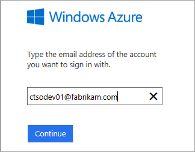

    *Fehler bei der Verbindung? Lesen Sie [Problembehandlung](#troubleshooting).*

5. Wählen Sie aus der installierten Web-Anwendung oder eine Website, die Sie überwachen möchten, und dann konfigurieren Sie die Ressource aus, in der Sie die Ergebnisse der Anwendung Einsichten Portal anzeigen möchten.

    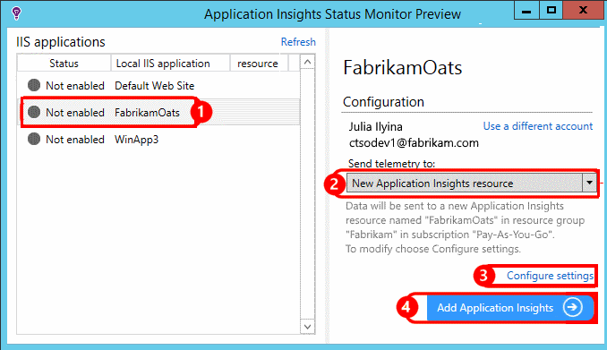

    In der Regel wählen Sie so konfigurieren Sie eine neue Ressource und der [Ressourcengruppe][roles].

    Andernfalls eine vorhandene Ressource verwenden, wenn Sie bereits [überprüft Web] eingerichtet[ availability] für Ihre Website oder [WebClient Überwachung][client].

6. Starten Sie IIS neu.

    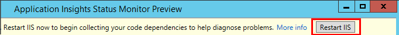

    Der Webdienst wird für einen kurzen unterbrochen.

6. Beachten Sie, dass ApplicationInsights.config in den Web apps eingefügt wurde, die Sie überwachen möchten.

    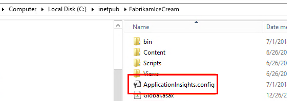

   Es gibt auch einigen Änderungen web.config.

#### Möchten Sie später (erneut) konfigurieren?

Nach Abschluss des Assistenten können Sie den Agent immer, wenn Sie erneut konfigurieren. Sie können dies auch verwenden, wenn Sie den Agent installiert, aber es einige Probleme mit der ersten Einrichtung wurde.

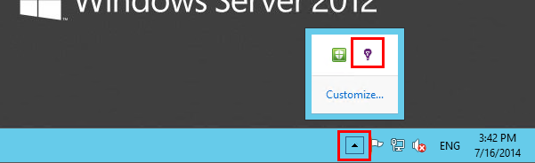

## Ansicht Leistung werden

Melden Sie sich bei [der Azure-Portal](https://portal.azure.com), Anwendung Einsichten zu navigieren, und öffnen Sie die Ressource, die Sie erstellt haben.

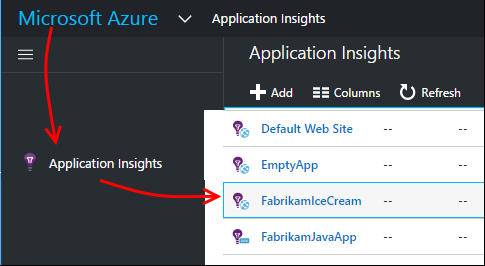

Öffnen Sie das Blade Leistung um Anforderung, Antwortzeit, Abhängigkeit und anderen Daten anzuzeigen.

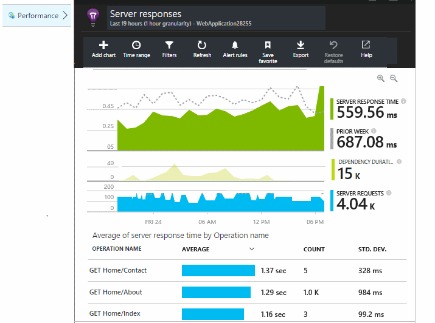

Klicken Sie auf eine beliebige Diagramm, um eine detailliertere Ansicht öffnen.

Sie können [Bearbeiten, neu anordnen möchten, speichern](app-insights-metrics-explorer.md), und Diagramme oder das gesamte Blade in einem [Dashboard](app-insights-dashboards.md)anheften.

## Abhängigkeiten

Das Dauer der Abhängigkeit Diagramm zeigt die Zeit, die Anrufe aus der app an externe Komponenten wie Datenbanken, REST-APIs oder Azure Blob-Speicher.

Das Diagramm durch Anrufe an andere Abhängigkeiten segmentieren: Bearbeiten des Diagramms, aktivieren Sie gruppieren und dann gruppieren nach Abhängigkeit, Abhängigkeitstyp oder Abhängigkeit Leistung.

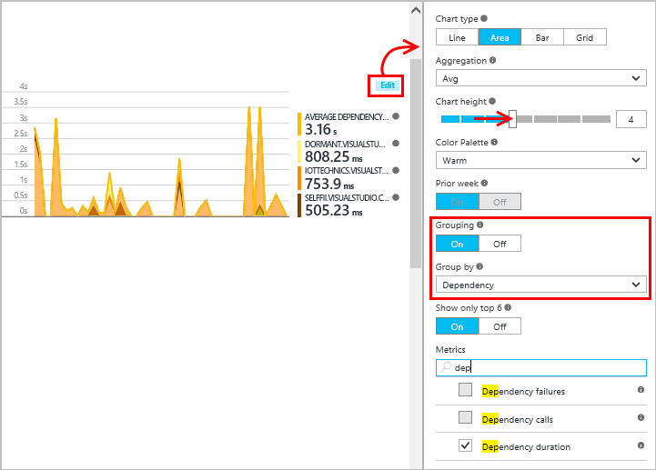

## -Datenquellen 

(Nicht für Azure Web apps.) Klicken Sie auf Servern das Blade Übersicht Diagramme Server Leistung Indikatoren wie Belegung und Speicherkapazität CPU-Auslastung angezeigt.

Wenn Sie mehrere Serverinstanzen verfügen, empfiehlt es sich, die Diagramme Gruppieren nach Rolleninstanz bearbeiten.

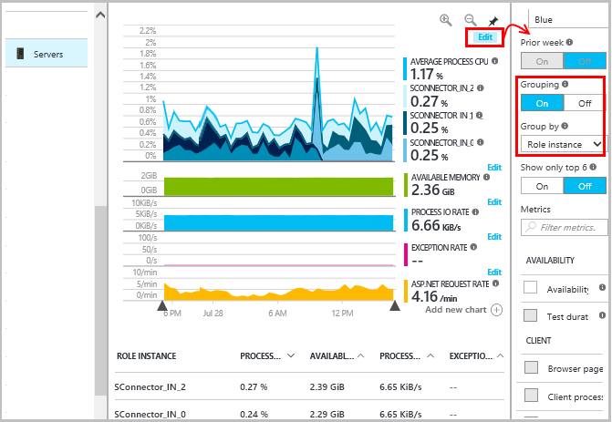

Sie können auch das [Ändern der Gruppe von Datenquellen, die vom SDK gemeldet werden](app-insights-configuration-with-applicationinsights-config.md#nuget-package-3). 

## Ausnahmen

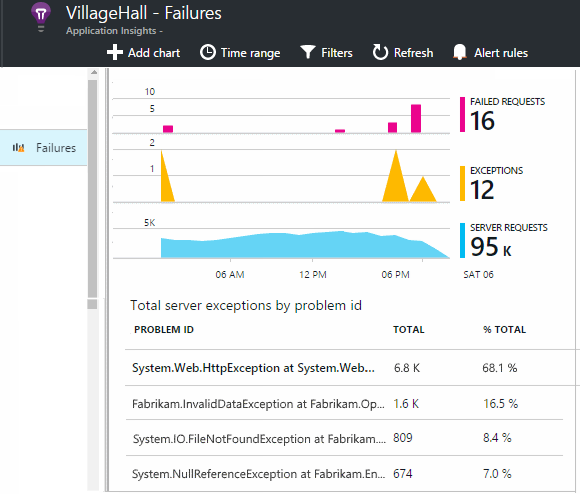

Sie können Drilldowns auf bestimmte Ausnahmen (aus der letzten sieben Tage) und Stapel Spuren und Kontextdaten abrufen.

## Werden

Wenn eine Anwendung eine große Datenmenge sendet, und Sie die Anwendung Einsichten SDK für ASP.NET Version 2.0.0-beta3 oder höher verwenden, möglicherweise das Feature adaptive werden die Steuerung und senden nur Prozentwert der werden. [Weitere Informationen zu werden.](app-insights-sampling.md)

## Behandlung von Problemen

### Fehler bei der Verbindung

Sie müssen [einige ausgehenden Ports](app-insights-ip-addresses.md#outgoing-ports) in der Firewall des Servers Status Monitor entwickelt zulassen zu öffnen.

### Keine werden?

  * Verwenden Sie Ihrer Website, um einige Daten zu generieren.
  * Warten Sie einige Minuten, wenn Sie zulassen, dass die Daten kommen an, und klicken Sie auf **Aktualisieren**.
  * Öffnen Sie die Diagnose Suche (die Kachel suchen) auf einzelne Ereignisse anzuzeigen. Ereignisse werden häufig in Diagnostic suchen angezeigt werden, bevor Aggregieren von Daten in den Diagrammen angezeigt wird.
  * Öffnen Sie Status Monitor, und wählen Sie die Anwendung linken Bereich. Prüfen Sie, ob es keine Nachrichten Diagnose für diese Anwendung im Abschnitt "Konfiguration Benachrichtigungen gibt":

  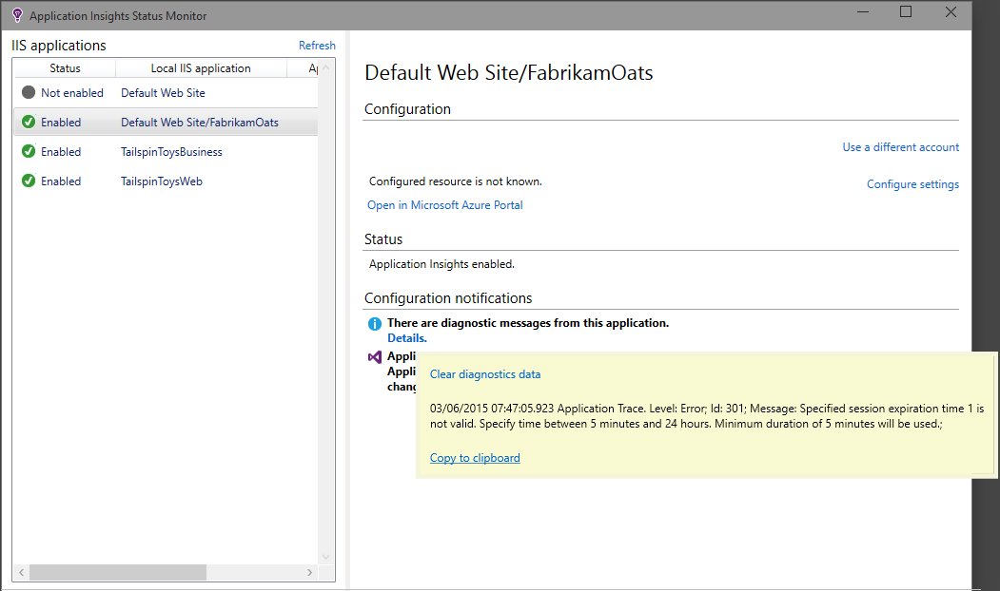

  * Stellen Sie sicher, dass die Serverfirewall ausgehenden Datenverkehr auf die oben aufgeführten Ports zulässt.
  * Auf dem Server Wenn eine Meldung zum "unzureichender Berechtigungen" angezeigt wird, versuchen Sie Folgendes:
    * Wählen Sie im IIS-Manager aus Ihrer Anwendung Ressourcenpool, **Erweiterte Einstellungen**zu öffnen Sie, und notieren Sie sich unter **Process Model** der Identität.
    * Fügen Sie in der Systemsteuerung Management Computer diese Identität zur Performance Monitor Benutzergruppe ein.
  * Wenn Sie MMA/SCOM auf dem Server installiert haben, können einige Versionen in Konflikt stehen. Deinstallieren Sie sowohl SCOM und Status Monitor, und installieren Sie die neuesten Versionen erneut.
  * [Problembehandlung]finden Sie unter[qna].

## Systemanforderungen

Unterstützte Betriebssysteme für Application Einsichten Status Monitor auf Server:

- WindowsServer 2008
- Windows Server 2008 R2
- WindowsServer 2012
- WindowsServer 2012 R2

mit den neuesten Service Packs und .NET Framework 4.0 und 4.5

Auf dem Client Windows 7, 8 und Windows 8.1, erneut mit .NET Framework 4.0 und 4.5

IIS-Unterstützung wird: IIS 7 7.5, 8, 8.5 (IIS ist erforderlich)

## Automatisierung mit PowerShell

Sie können starten und beenden die Überwachung mithilfe der PowerShell auf dem IIS-Server.

Importieren Sie zuerst das Anwendung Einsichten Modul:

`Import-Module 'C:\Program Files\Microsoft Application Insights\Status Monitor\PowerShell\Microsoft.Diagnostics.Agent.StatusMonitor.PowerShell.dll'`

Erfahren Sie, welche apps überwacht werden:

`Get-ApplicationInsightsMonitoringStatus [-Name appName]`

* `-Name`(Optional) Der Name einer Web App.
* Zeigt die Anwendung Einsichten Überwachung Status für jede Web-app (oder die benannten app) in diesem IIS-Server.

* Gibt `ApplicationInsightsApplication` für jede app:
 * `SdkState==EnabledAfterDeployment`: App wird überwacht, und zur Laufzeit ausgestattet wurde, entweder durch das Tool Status Monitor oder durch `Start-ApplicationInsightsMonitoring`.
 * `SdkState==Disabled`: Die app ist nicht für die Anwendung Einsichten instrumentiert. Entweder nie instrumentiert oder Laufzeit-Überwachung deaktiviert wurde, mit dem Tool Status Monitor oder mit `Stop-ApplicationInsightsMonitoring`.
 * `SdkState==EnabledByCodeInstrumentation`: Die app wurde durch Hinzufügen des SDKS des Quellcodes instrumentiert. Seine SDK kann nicht aktualisiert oder beendet werden.
 * `SdkVersion`Zeigt die Version für diese app für die Überwachung verwenden.
 * `LatestAvailableSdkVersion`Zeigt die aktuell verfügbare Version auf dem NuGet-Katalog. Verwenden Sie zum Aktualisieren der app auf dieser Version `Update-ApplicationInsightsMonitoring`.

`Start-ApplicationInsightsMonitoring -Name appName -InstrumentationKey 00000000-000-000-000-0000000`

* `-Name`Die Namen der app in IIS
* `-InstrumentationKey`Der Ikey der Anwendung Einsichten Ressource, werden die Ergebnisse angezeigt werden soll.

* Dieses Cmdlet wirkt sich nur auf apps, die noch nicht instrumentiert - d. h., SdkState == NotInstrumented.

    Das Cmdlet wirkt sich nicht auf eine app aus, die bereits, instrumentiert ist, zur Erstellungszeit durch das SDK an den Code hinzufügen oder zur Laufzeit durch eine vorherige Verwendung dieses Cmdlets.

    Das SDK verwendet, um die app Instrumentieren ist die Version, die zuletzt auf diesem Server heruntergeladen wurde.

    Verwenden Sie Update-ApplicationInsightsVersion aus, um die neueste Version herunterzuladen.

* Gibt `ApplicationInsightsApplication` bei Erfolg. Schlägt fehl, protokolliert eine Spur an Stderr.

    
          Name                      : Default Web Site/WebApp1
          InstrumentationKey        : 00000000-0000-0000-0000-000000000000
          ProfilerState             : ApplicationInsights
          SdkState                  : EnabledAfterDeployment
          SdkVersion                : 1.2.1
          LatestAvailableSdkVersion : 1.2.3

`Stop-ApplicationInsightsMonitoring [-Name appName | -All]`

* `-Name`Der Name des einer IIS-app
* `-All`Beendet alle apps in diesen IIS-Server für die Überwachung`SdkState==EnabledAfterDeployment`

* Beendet die Überwachung der angegebenen apps und Instrumentation entfernt. Es ist nur für apps, die instrumentiert wurden zur Laufzeit mit dem Tool für die Überwachung Status oder Start-ApplicationInsightsApplication. (`SdkState==EnabledAfterDeployment`)

* Gibt ApplicationInsightsApplication an.

`Update-ApplicationInsightsMonitoring -Name appName [-InstrumentationKey "0000000-0000-000-000-0000"`]

* `-Name`: Der Name einer Web-App in IIS.
* `-InstrumentationKey`(Optional). Hiermit können Sie die Ressource ändern, die die app werden gesendet wird.
* Dieses Cmdlet aus:
 * Mehrfarbige heruntergeladen die benannte app auf die Version des SDK zuletzt auf diesem Computer. (Funktioniert nur, wenn `SdkState==EnabledAfterDeployment`)
 * Wenn Sie Instrumentation Key angeben, wird die benannte app konfiguriert, um werden an die Ressource mit diesem Schlüssel zu senden. (Funktioniert, wenn `SdkState != Disabled`)

`Update-ApplicationInsightsVersion`

* Downloads für die aktuelle Anwendung Einsichten SDK auf dem Server.

## Nächste Schritte

* [Erstellen Sie Webtests] [ availability] um sicherzustellen, dass Ihre Website live bleibt.
* [Suchen von Ereignissen und Protokollen] [ diagnostic] Probleme beim diagnostizieren.
* [Hinzufügen von Web-Client-telemetrieprotokoll] [ usage] Ausnahmen durch Webseitencode anzeigen und lassen Sie die Spur Anrufe einfügen.
* [Web Service-Code Anwendung Einsichten SDK hinzufügen] [ greenbrown] , damit Sie Spur einfügen können und Log in den Server-Code ruft.

<!--Link references-->

[api]: app-insights-api-custom-events-metrics.md
[availability]: app-insights-monitor-web-app-availability.md
[client]: app-insights-javascript.md
[diagnostic]: app-insights-diagnostic-search.md
[greenbrown]: app-insights-asp-net.md
[qna]: app-insights-troubleshoot-faq.md
[roles]: app-insights-resources-roles-access-control.md
[usage]: app-insights-web-track-usage.md
