<properties
    pageTitle="Überwachen der Verfügbarkeit und eine Website Reaktionszeiten | Microsoft Azure"
    description="Richten Sie Webtests in Anwendung Einsichten aus. Erhalten Sie Benachrichtigungen, wenn eine Website zur Verfügung steht oder langsam reagiert."
    services="application-insights"
    documentationCenter=""
    authors="alancameronwills"
    manager="douge"/>

<tags
    ms.service="application-insights"
    ms.workload="tbd"
    ms.tgt_pltfrm="ibiza"
    ms.devlang="na"
    ms.topic="get-started-article"
    ms.date="09/07/2016"
    ms.author="awills"/>

# Überwachen der Verfügbarkeit und Reaktionszeiten einer Website

Nachdem Sie ein Web-app oder eine Website auf einem beliebigen Server bereitgestellt haben, können Sie Webtests zum Überwachen der Verfügbarkeit sowie der Reaktionszeiten einrichten. [Visual Studio-Anwendung Einsichten](app-insights-overview.md) sendet Webanfragen an Ihrer Anwendung in regelmäßigen Abständen von Punkt auf der ganzen Welt. Sie benachrichtigt, wenn die Anwendung nicht reagieren oder langsam reagiert.

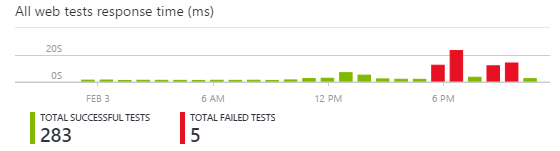

Sie können Webtests für jeden HTTP oder HTTPS-Endpunkt einrichten, die vom öffentlichen Internet zugegriffen werden kann.

Es gibt zwei Arten von Webtest:

* [URL-Ping testen](#create): einen einfachen Test, die Sie in der Azure-Portal erstellen können.
* [Web mit mehreren Schritten testen](#multi-step-web-tests): das Sie in Visual Studio Ultimate oder Visual Studio Enterprise erstellen und auf das Portal hochladen.

Sie können bis zu 10 Webtests pro Anwendungsressource erstellen.

## 1. erstellen Sie 1. eine Ressource für Ihre Testberichte

Wenn Sie bereits [eine Anwendung Einsichten Ressource eingerichtet] haben, überspringen Sie diesen Schritt[ start] für diese Anwendung, und Sie die Verfügbarkeitsberichte an derselben Stelle angezeigt möchten.

Melden Sie sich bei [Microsoft Azure](http://azure.com), wechseln Sie zum [Azure-Portal](https://portal.azure.com), und erstellen Sie eine Anwendung Einsichten Ressource.

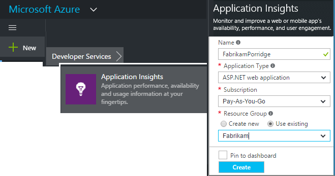

Klicken Sie auf **alle Ressourcen** , um das Blade Übersicht für die neue Ressource zu öffnen.

## 2. erstellen Sie eine URL-Pingtest

Suchen Sie in Ihrer Anwendung Einsichten Ressourcen für die Verfügbarkeit Kachel. Klicken Sie auf, um das Web Tests Blade für eine Anwendung zu öffnen, und fügen Sie eine Web hinzu.

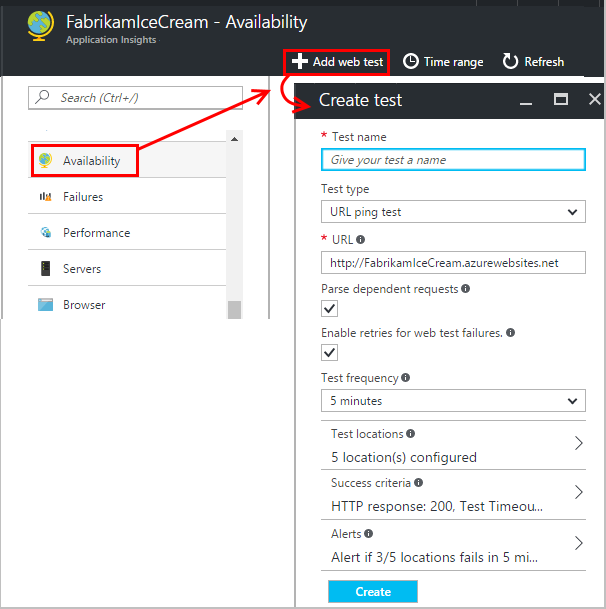

- **Die URL** muss vom öffentlichen Internet sichtbar sein. Sie können eine Abfragezeichenfolge & #151 einschließen; also beispielsweise, Sie können Übung Ihrer Datenbank etwas. Wenn die URL in eine Umleitung aufgelöst wird, führen wir sie bis zu 10 leitet ein.
- **Abhängige Anforderungen analysieren**: Bildern, Skripts, Stil-Dateien und andere Ressourcen der Seite als Teil des Tests angefordert werden, und die Uhrzeit der aufgezeichneten Antwort enthält diese Zeiten. Der Test schlägt fehl, wenn alle diese Ressourcen innerhalb der Timeout für den gesamten Test nicht erfolgreich heruntergeladen werden können.
- **Aktivieren der Wiederholungsversuche**: Wenn der Test fehlschlägt, wird es nach einer kurzen Intervall wiederholt. Ein Fehler wird gemeldet, nur, wenn Sie drei aufeinanderfolgende Versuche fehl. Nachfolgenden Tests werden dann mit der Häufigkeit üblichen Test ausgeführt. Wiederholen Sie den Vorgang wird, bis die nächste erfolgreiche vorübergehend unterbrochen. Mit dieser Regel wird an jeder Position Test unabhängig voneinander angewendet. (Es empfiehlt sich diese Einstellung. Klicken Sie auf Mittelwert verschwinden etwa 80 % von Fehlern bei der Wiederholung.)
- **Testen der Häufigkeit**: Legt fest, wie oft der Test von jedem Standort Test ausgeführt wird. Mit einer Häufigkeit von fünf Minuten und Testen der fünf Orte wird Ihre Website im Durchschnitt pro Minute getestet.
- **Test Speicherorte** befinden sich die Positionen aus, in dem unsere Server Webanfragen an Ihre URL zu senden. Wählen Sie mehrere, damit Sie Probleme in Ihrer Website von Netzwerkproblemen unterscheiden können. Sie können bis zu 16 Speicherorte auswählen.

- **Kriterien für Erfolg**:

    **Timeout Test**: verringern Sie diesen Wert über langsam Antworten informiert werden sollen. Der Test wird als ein Fehler gezählt, wenn die Antworten von Ihrer Website nicht innerhalb dieses Zeitraums empfangen wurden. Bei Auswahl von **abhängige Anforderungen analysieren**, klicken Sie dann alle Bilder, Stil-Dateien, müssen Skripts und anderen Ressourcen abhängigen innerhalb dieses Zeitraums eingegangen sind.

    **HTTP-Antwort**: die zurückgegebenen Status-Code, der als einen Erfolg gezählt wird. 200 ist der Code, der angibt, dass eine normale Webseite zurückgegeben wurde.

    **Inhalt überein**: eine Zeichenfolge, wie "Willkommen!" Testen wir, dass es in jeder Antwort auftritt. Es muss eine einfache Zeichenfolge, ohne Platzhalter. Vergessen Sie nicht, die, wenn die Seite Inhalt Änderungen Sie möglicherweise aktualisiert müssen.

- **Benachrichtigungen** werden standardmäßig an Sie gesendet, wenn es Fehler in drei Speicherorte mehr als fünf Minuten gibt. Ein Fehler an einem Ort ist zu rechnen ist ein Netzwerkproblem und nicht um ein Problem mit Ihrer Website sein. Jedoch können Sie den Schwellenwert für mehr oder weniger vertrauliche benutzerspezifisch ändern, und Sie können auch ändern, die an die e-Mail-Nachrichten gesendet werden soll.

    Sie können eine [Webhook](../monitoring-and-diagnostics/insights-webhooks-alerts.md) einrichten, die aufgerufen wird, wenn eine Warnung ausgelöst wird. (Beachten Sie aber, dass bei präsentieren Abfrageparameter nicht durch als Eigenschaften geleitet werden.)

### Testen Sie weitere URLs

Fügen Sie weitere Tests hinzu. Beispiel, als auch der Startseite zu testen können Sie sicherstellen, dass Ihre Datenbank ausgeführt wird, indem Sie die URL für die Suche.

## 3 finden Sie unter Ihrem Web Testergebnisse

Ergebnisse werden nach 1 und 2 Minuten das Web Test Blade angezeigt.

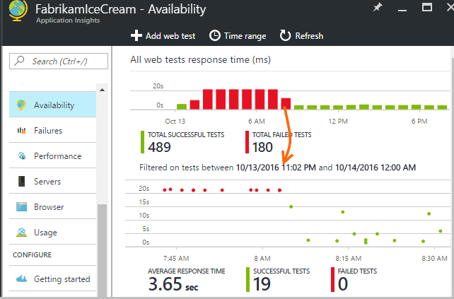

Klicken Sie auf Balken im Zusammenfassung Diagramm für eine ausführlichere Ansicht der angegebenen Periode.

Diese Diagramme Kombinieren der Ergebnisse für alle Webtests dieser Anwendung.

## Wenn Sie Fehler entdecken

Klicken Sie auf ein roter Punkt.

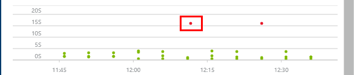

Oder einen Bildlauf nach unten, und klicken Sie auf testen, wo Sie sehen, kleiner als 100 % Erfolg.

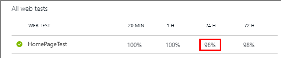

Testen Sie die Ergebnisse dieser öffnen.

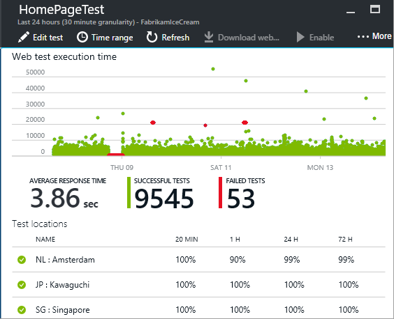

Der Testlauf aus mehreren Speicherorten & #151; wählen Sie eine Stelle, an der die Ergebnisse weniger als 100 % sind.

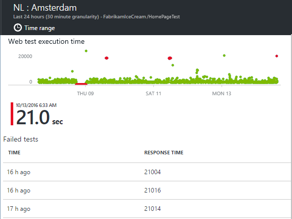

Führen Sie einen Bildlauf nach unten bis zum **Fehler überprüft** , und wählen Sie ein Ergebnis aus.

Klicken Sie auf das Ergebnis, um es im Portal ausgewertet werden soll, und finden Sie unter Gründe für den Fehler.

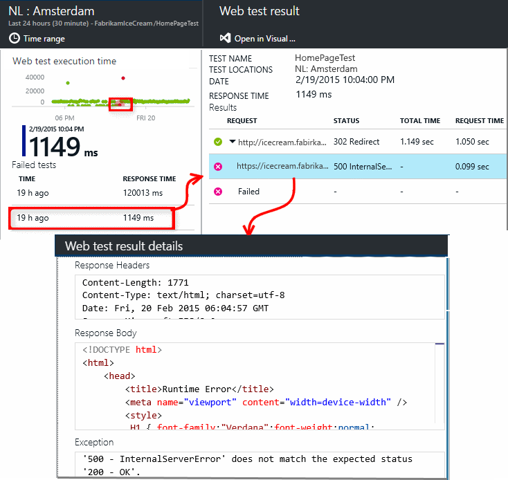

Alternativ können Sie die Ergebnisdatei herunterladen und prüfen es in Visual Studio.

*Sieht OK aus, aber als ein Fehler gemeldet?* Überprüfen Sie alle Bilder, Skripts, Stylesheets und andere Dateien, die von der Seite geladen. Wenn jede hiervon fehlschlägt, der Test als ausgefallen gemeldet, selbst wenn die Hauptfenster HTML-Seite OK geladen.

## Webtests mit mehreren Schritten

Sie können ein Szenario überwachen, die eine Abfolge von URLs umfasst. Wenn Sie eine Website sales überwachen möchten, können Sie beispielsweise testen, Hinzufügen von Elementen in der Einkaufs-ordnungsgemäß funktioniert Einkaufswagen.

Um einen Testanruf mit mehreren Schritten zu erstellen, zeichnen Sie das Szenario mit Visual Studio, und Laden Sie die Aufzeichnung in Anwendung Einsichten. Anwendung Einsichten werden wiedergegeben, der das Szenario in Intervallen und die Antworten überprüft.

Funktionen in Ihren Tests der codierten Notiz, die Sie verwenden können: die Szenarienschritte müssen als Skript in der .webtest-Datei enthalten sein.

#### 1. Datensatz ein Szenario

Aufzeichnen einer Sitzung Web verwenden Sie Visual Studio Enterprise oder Ultimate.

1. Erstellen Sie ein Projekt.

    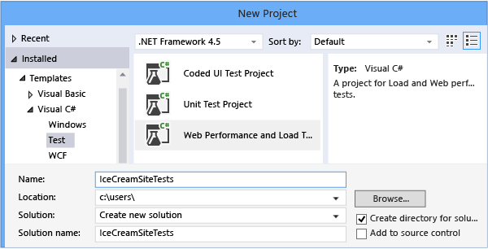

2. Öffnen Sie die Datei .webtest und Aufzeichnung starten.

    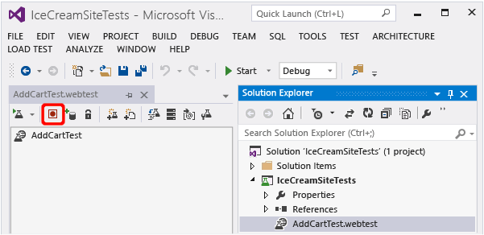

3. Führen Sie die Aktionen des Benutzers, die Sie in Ihrem Test simulieren möchten: Ihrer Website öffnen, ein Produkt dem Einkaufswagen hinzufügen und so weiter. Beenden Sie dann den Test.

    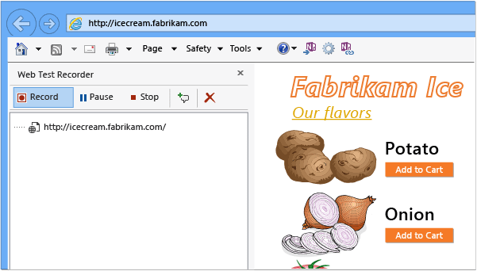

    Stellen Sie eine lange Szenario nicht. Es gibt maximal 100 Schritten und 2 Minuten.

4. Bearbeiten dieser Test:
 - Hinzufügen von Validierungen, um die empfangenen Text und Antwort-Codes überprüfen.
 - Entfernen Sie alle überflüssigen Interaktionen an. Sie können auch abhängige Anforderungen für Bilder oder Ad oder Sites nachverfolgen entfernen.

    Denken Sie daran, dass das Testskript Sie nur bearbeiten können – können Sie keine benutzerdefinierten Code oder andere Webtests anrufen. Fügen Sie Schleifen nicht in den Test aus. Standard-Web-Test-Plug-ins können.

5. Führen Sie den Test in Visual Studio, um sicherzustellen, dass er immer funktioniert.

    Der Web Test Läufer öffnet ein Webbrowser und wiederholt die Aktionen, die Sie aufgezeichnet. Stellen Sie sicher, dass es wie erwartet funktioniert.

    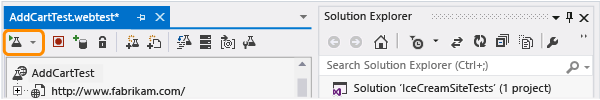

#### 2. Hochladen Sie den Webtest auf Anwendung Einsichten

1. Erstellen Sie einen neuen Webtest im Portal Anwendung Einsichten.

    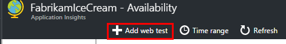

2. Wählen Sie aus mehreren Schritten testen und Hochladen Sie die .webtest-Datei.

    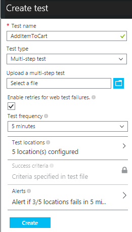

    Festlegen der Test Orte, Häufigkeit und benachrichtigen Parameter auf die gleiche Weise wie für Ping-Tests an.

Anzeigen der Testergebnisse und alle Fehler auf die gleiche Weise wie für einzelne-Url überprüft.

Ein häufiger Grund für Fehler ist, dass der Test zu lang ausgeführt wird. Er darf nicht mehr als zwei Minuten ausgeführt werden.

Vergessen Sie nicht, dass alle Ressourcen einer Seite richtig für den Test erfolgreich durchgeführt werden kann, laden müssen einschließlich Skripts, Stylesheets, Bilder und So weiter.

Beachten Sie, dass der Webtest vollständig in der .webtest-Datei enthalten sein muss: Sie können keine codierte Funktionen verwenden, in der Test.

### Zeit und Zufallszahlen anzuschließen an Ihre mit mehreren Schritten testen.

Nehmen Sie an, dass Sie ein Tool testen, die Abhängigkeit von der Zeit Daten wie Bestände aus einer externen Feed bezieht. Wenn Sie Ihre Webtest aufzeichnen, müssen Sie bestimmte Zeiten verwenden, aber Sie als Parameter des Tests, Startzeit und Endzeit festlegen.

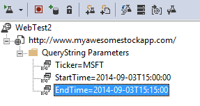

Wenn der Test ausgeführt wird, möchte Sie Endzeit immer in Zeit werden und Startzeit sollten vor 15 Minuten.

Web Test-Plug-ins Möglichkeit die Zeiten parametrisieren.

1. Fügen Sie einen Webtest-Plug-In für jeden Variable Parameterwert gewünschten. Wählen Sie in der Web-Symbolleiste **Testen-Plug-In hinzufügen**aus.

    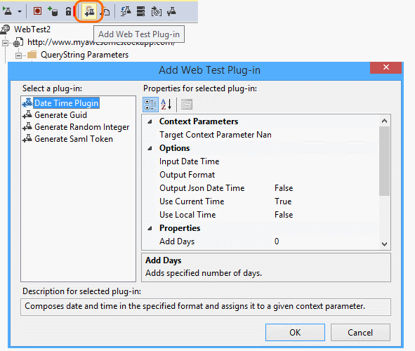

    In diesem Beispiel verwenden wir zwei Instanzen von der Datum-Uhrzeit-Plug-in. Eine Instanz ist "15 Minuten vor" und eine weitere "jetzt".

2. Öffnen Sie die Eigenschaften für jedes plug-in an. Geben sie einen Namen ein, und legen sie die aktuelle Uhrzeit verwenden. = Für eine von Ihnen, legen hinzufügen Minuten -15 ein.

    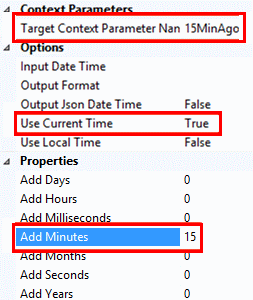

3. Testen Sie Parameter im Web, verwenden Sie {{-Plug-in Name}} zum Verweisen auf eine Plug-in-Namen.

    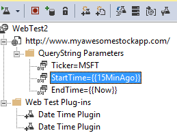

Jetzt hochladen Sie Ihrer Test-Portal an. Es wird die dynamischen Werte bei jeder Ausführung des Tests verwendet.

## Umgang mit Anmeldung

Wenn Ihre Benutzer zu Ihrer Anwendung anmelden, müssen Sie die verschiedenen Optionen für das simulieren anmelden, damit Sie Seiten hinter der Anmeldung testen können. Der Ansatz, die, den Sie verwenden, hängt von den Typ der Sicherheit, die von der app bereitgestellt.

In allen Fällen sollten Sie ein Konto in Ihrer Anwendung einfach zu prüfen erstellen. Falls möglich Einschränken der Berechtigungen von diesem Testkonto, damit ist es keine Möglichkeit der Auswirkungen real Benutzer Webtests.

### Einfache Benutzernamen und Ihr Kennwort

Zeichnen Sie einen Webtest wie gewohnt ein. Löschen Sie Cookies zuerst ein.

### SAML-Authentifizierung

Verwenden der SAML-Plug-Ins, die für das Webtests verfügbar ist.

### Geheim Client

Wenn Ihre app eine Anmeldung Routing, die ein Client Geheimnis umfasst enthält, verwenden Sie diese weiterleiten aus. Azure Active Directory (AAD) ist ein Beispiel für ein Dienst, der einen Client geheimen anmelden. In AAD ist das Geheimnis Client die App-Taste.

Hier ist ein Beispiel-Web-Test für eine Azure Web app mit einer app-Taste ein:

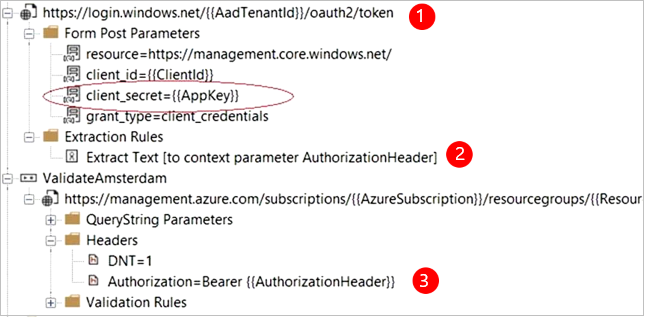

1. Abrufen von token AAD Client geheim (AppKey) verwenden.
2. Extrahiert Person Token aus Antwort an.
3. Rufen Sie die API Person Token in der Kopfzeile der Autorisierung verwenden.

Stellen Sie sicher, dass der Webtest für einen Kunden ist – d. h., es eigene app AAD - hat und deren ClientId + Appkey verwendet werden. Der Dienst testenden hat eine eigene app auch AAD: die AppID URI für diese app in der Webtest in das Ressourcenfeld "" wiedergegeben wird.

### Offene Authentifizierung

Beispiel für offene Authentifizierung bei der Anmeldung mit Ihrem Microsoft oder Google-Konto ist. Stellen Sie dem Client viele apps, mit denen OAuth geheimen Alternative, damit Ihre erste Vorgehensweise diese Möglichkeit untersuchen werden sollen.

Wenn der Test mit OAuth anmelden muss, ist der allgemeine Ansatz:

 * Verwenden Sie ein Tool wie Fiddler, um den Datenverkehr zwischen Ihrem Webbrowser, die Authentifizierung Website- und Ihre app zu untersuchen.
 * Führen Sie zwei oder mehr Zeichen-ins mit unterschiedlichen Computern oder Browser, oder am langen Intervalle (Token abläuft zulassen).
 * Identifizieren Sie durch Vergleichen von anderen Sitzungen das Token übergeben wieder aus der Authentifizierung-Website, die dann nach Anmeldung an Ihre app-Server gesendet wird.
 * Aufzeichnen eines Webtests mit Visual Studio.
 * Parametrisieren der Tokens Festlegen des Parameters aus, wenn das Token von der Authentifizierung zurückgegeben wird, und es in einer Abfrage in der Website verwendet wird.
 (Visual Studio versucht, die Teststatistik eines parametrisieren, aber die Token wird nicht ordnungsgemäß parametrisieren.)

## Bearbeiten oder Deaktivieren eines Tests

Öffnen eines einzelnen Tests zum Bearbeiten oder deaktivieren es.

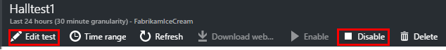

Möglicherweise möchten die Webtests deaktivieren, während Sie Ihrem Dienst gewartet werden.

## Performance-tests

Sie können einen Testanruf Laden auf Ihrer Website ausführen. Wie die Verfügbarkeit testen können Sie entweder einfache Serviceanfragen oder mit mehreren Schritten Anfragen von unserem Punkt auf der ganzen Welt senden. Im Gegensatz zu einer Test Verfügbarkeit werden mehrere Benutzer gleichzeitig simulieren viele Anfragen gesendet.

Öffnen Sie aus dem Blade Übersicht **Einstellungen** **Performance Tests**aus. Wenn Sie einen Test erstellen, werden Sie eingeladen zum Herstellen einer Verbindung mit oder zum Erstellen eines Visual Studio Team Services-Konto.

Wenn der Test abgeschlossen ist, werden Sie Reaktionszeiten und Erfolg Sätzen angezeigt.

## Automatisierung

* [Verwenden von PowerShell Skripts zum Einrichten eines Webtests](https://azure.microsoft.com/blog/creating-a-web-test-alert-programmatically-with-application-insights/) automatisch.
* Richten Sie eine [Webhook](../monitoring-and-diagnostics/insights-webhooks-alerts.md) , die aufgerufen wird, wenn eine Warnung ausgelöst wird.

## Fragen? Probleme?

* *Kann ich aus meinen Webtest Code aufrufen?*

    Nein. Die Schritte des Tests muss in der .webtest-Datei. Und Sie keine anderen Webtests anrufen oder Schleifen verwenden. Es gibt jedoch einige mehrere-Plug-ins, die Sie möglicherweise hilfreich finden.

* *Wird HTTPS unterstützt?*

    Wir unterstützen TLS 1.1 und TLS 1.2.

* *Gibt es einen Unterschied zwischen "Web" und "Verfügbarkeit Tests"?*

    Wir verwenden die beiden Begriffe Synonym.

* *Ich möchte Verfügbarkeit Tests auf unsere internen Server verwenden, die eine Firewall ausgeführt wird.*

    Konfigurieren der Firewalls Anfragen aus der [IP-Adressen der Web test-Agents](app-insights-ip-addresses.md#availability)zulassen.

* *Hochladen eines Webtests mit mehreren Schritten schlägt fehl*

    Es gibt Größe maximal 300 K.

    Schleifen werden nicht unterstützt.

    Bezüge auf andere Web überprüft werden nicht unterstützt.

    Datenquellen werden nicht unterstützt.

* *Meine mit mehreren Schritten Test nicht abgeschlossen.*

    Es gibt maximal 100 Abfragen pro Test aus.

    Der Test wird beendet, wenn mehr als zwei Minuten ausgeführt wird.

* *Wie kann ich einen Test mit Client-Zertifikate ausführen?*

    Nicht unterstützt, das es tut uns leid.

## Video

> [AZURE.VIDEO monitoring-availability-with-application-insights]

## Nächste Schritte

[Diagnoseprotokolle suchen][diagnostic]

[Behandlung von Problemen][qna]

[IP-Adressen der Web-Test-agents](app-insights-ip-addresses.md)

<!--Link references-->

[azure-availability]: ../insights-create-web-tests.md
[diagnostic]: app-insights-diagnostic-search.md
[qna]: app-insights-troubleshoot-faq.md
[start]: app-insights-overview.md
