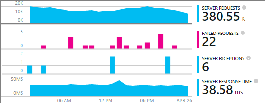
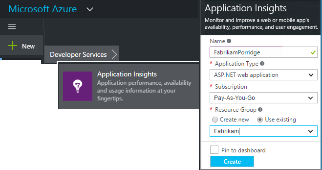
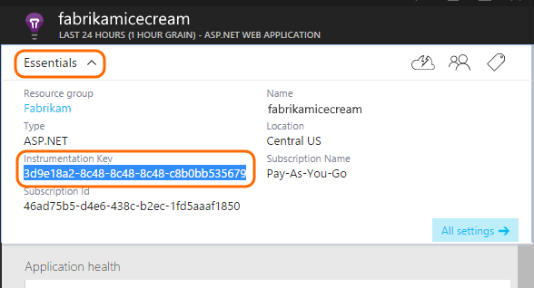
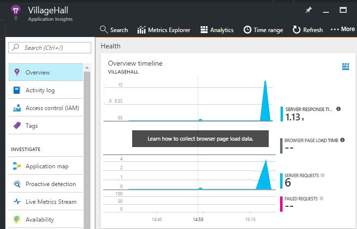

<properties
    pageTitle="Hinzufügen der Anwendung Einsichten SDK zum Überwachen der app Node.js | Microsoft Azure"
    description="Verwendung, Verfügbarkeit und Leistung von Ihrem lokalen oder Microsoft Azure-Webanwendung mit Anwendung Einsichten zu analysieren."
    services="application-insights"
    documentationCenter=""
    authors="alancameronwills"
    manager="douge"/>

<tags
    ms.service="application-insights"
    ms.workload="tbd"
    ms.tgt_pltfrm="ibiza"
    ms.devlang="na"
    ms.topic="get-started-article"
    ms.date="08/30/2016"
    ms.author="awills"/>


# <a name="add-application-insights-sdk-to-monitor-your-nodejs-app"></a>Hinzufügen der Anwendung Einsichten SDK zum Überwachen der Node.js-app

*Anwendung Einsichten ist in der Vorschau.*

[Visual Studio-Anwendung Einsichten](app-insights-overview.md) überwacht Ihrer Anwendung live, damit Sie [erkennen und zu diagnostizieren Leistungsprobleme und Ausnahmen](app-insights-detect-triage-diagnose.md), und [erfahren Sie, wie Ihre app genutzt werden](app-insights-overview-usage.md)können. Funktionsweise für apps, die auf Ihrer eigenen lokalen IIS-Servern oder auf Azure-virtuellen Computern gehostet werden als auch Azure Web apps.


Das SDK bietet automatische Zusammenstellung von eingehenden HTTP-Anforderung Sätzen und Antworten, -Datenquellen (CPU, Arbeitsspeicher, RPS) und Ausnahmefehler. Darüber hinaus können Sie benutzerdefinierte Anrufe zum Nachverfolgen von Abhängigkeiten, Kennzahlen oder andere Ereignisse hinzufügen.




#### <a name="before-you-start"></a>Bevor Sie beginnen

Du brauchst:

* Visual Studio 2013 oder höher. Höher ist besser.
* Ein [Microsoft Azure](http://azure.com)-Abonnement. Wenn Ihr Team oder der Organisation ein Azure-Abonnement verfügt, kann der Besitzer Sie hinzufügen, mit Ihrem [Microsoft-Konto](http://live.com).

## <a name="a-nameaddacreate-an-application-insights-resource"></a><a name="add"></a>Erstellen Sie eine Anwendung Einsichten Ressource

Melden Sie sich bei der [Azure-Portal][portal], und erstellen Sie eine neue Anwendung Einsichten Ressource. Eine [Ressource] [ roles] in Azure ist eine Instanz eines Diensts. Diese Ressource ist, werden aus der app analysiert und zur Verfügung gestellt werden.



Wählen Sie andere als die Anwendungstyp aus. Die Wahl der Anwendungstyp legt den Standardinhalt der Ressource Blades und die Eigenschaften in Windows [Explorer Kennzahlen][metrics].

#### <a name="copy-the-instrumentation-key"></a>Kopieren Sie die Taste Instrumentation

Die Taste identifiziert die Ressource aus, und installieren Sie es bald im SDK von Daten, die der Ressource direkte.




## <a name="a-namesdka-install-the-sdk-in-your-application"></a><a name="sdk"></a>Installieren Sie das SDK in Ihrer Anwendung

```
npm install applicationinsights --save
```

## <a name="usage"></a>Verwendung

Dadurch werden Anforderung Überwachung, Ausnahmefehler nachverfolgen und Systemleistung Überwachung (CPU/Arbeitsspeicher/RPS).

```javascript

var appInsights = require("applicationinsights");
appInsights.setup("<instrumentation_key>").start();
```

Die Taste Instrumentation kann auch in der Umgebungsvariablen APPINSIGHTS_INSTRUMENTATIONKEY festgelegt werden. Ist dies der Fall, ist kein Argument erforderlich beim Aufrufen von `appInsights.setup()` oder `appInsights.getClient()`.

Das SDK können Sie versuchen, ohne dass gesendet werden: die Instrumentation-Taste auf eine nicht leere Zeichenfolge festgelegt.


## <a name="a-nameruna-run-your-project"></a><a name="run"></a>Führen Sie Ihr Projekt

Führen Sie die Anwendung, und probieren Sie es aus: Öffnen von anderen Seiten, um einige werden generieren.


## <a name="a-namemonitora-view-your-telemetry"></a><a name="monitor"></a>Zeigen Sie Ihrer werden an

Kehren Sie zu der [Azure-Portal](https://portal.azure.com) zurück, und navigieren Sie zu Ihrer Anwendung Einsichten Ressource.


Suchen Sie nach Daten in der Prozessübersicht. Zuerst sehen Sie nur eine oder zwei Punkten. Beispiel:



Klicken Sie auf, bis alle Diagramm ausführlichere Metrik finden Sie unter. [Weitere Informationen zu Kennzahlen.][perf]

#### <a name="no-data"></a>Keine Daten?

* Verwenden Sie die Anwendung, die andere Seiten öffnen, damit es einige werden generiert.
* Öffnen Sie die Kachel " [Suchen](app-insights-diagnostic-search.md) ", um einzelne Ereignisse anzuzeigen. Unter Umständen dauert es Ereignisse etwas während Sie mehr über die Kennzahlen Verkaufspipeline anzuzeigen.
* Warten Sie einige Sekunden, und klicken Sie auf **Aktualisieren**. Diagramme selbst regelmäßig aktualisieren, aber Sie können manuell aktualisieren, wenn Sie für einige Daten warten angezeigt.
* [Problembehandlung]finden Sie unter[qna].

## <a name="publish-your-app"></a>Veröffentlichen Sie Ihre app

Jetzt die Anwendung IIS oder Azure bereitstellen, und schauen Sie sich die Daten zu sammeln.


#### <a name="no-data-after-you-publish-to-your-server"></a>Keine Daten nach dem Veröffentlichen auf dem Server?

Öffnen Sie diese Ports für ausgehenden Datenverkehr in des Servers firewall

+ `dc.services.visualstudio.com:443`
+ `f5.services.visualstudio.com:443`


#### <a name="trouble-on-your-build-server"></a>Probleme auf dem Server erstellen?

Finden Sie [dieses Element Problembehandlung](app-insights-asp-net-troubleshoot-no-data.md#NuGetBuild).


## <a name="customized-usage"></a>Angepasste Verwendung 

### <a name="disabling-auto-collection"></a>Deaktivieren der automatischen-Websitesammlung

```javascript
import appInsights = require("applicationinsights");
appInsights.setup("<instrumentation_key>")
    .setAutoCollectRequests(false)
    .setAutoCollectPerformance(false)
    .setAutoCollectExceptions(false)
    // no telemetry will be sent until .start() is called
    .start();
```

### <a name="custom-monitoring"></a>Benutzerdefinierte Überwachung

```javascript
import appInsights = require("applicationinsights");
var client = appInsights.getClient();

client.trackEvent("custom event", {customProperty: "custom property value"});
client.trackException(new Error("handled exceptions can be logged with this method"));
client.trackMetric("custom metric", 3);
client.trackTrace("trace message");
```

[Erfahren Sie mehr über die API werden](app-insights-api-custom-events-metrics.md).

### <a name="using-multiple-instrumentation-keys"></a>Die Verwendung mehrerer Instrumentation Schlüssel

```javascript
import appInsights = require("applicationinsights");

// configure auto-collection with one instrumentation key
appInsights.setup("<instrumentation_key>").start();

// get a client for another instrumentation key
var otherClient = appInsights.getClient("<other_instrumentation_key>");
otherClient.trackEvent("custom event");
```

## <a name="examples"></a>Beispiele

### <a name="tracking-dependency"></a>Verlauf Abhängigkeit

```javascript
import appInsights = require("applicationinsights");
var client = appInsights.getClient();

var startTime = Date.now();
// execute dependency call
var endTime = Date.now();

var elapsedTime = endTime - startTime;
var success = true;
client.trackDependency("dependency name", "command name", elapsedTime, success);
```


### <a name="manual-request-tracking-of-all-get-requests"></a>Manuelle Anforderung Nachverfolgen von Besprechungsanfragen für alle "Abrufen"

```javascript
var http = require("http");
var appInsights = require("applicationinsights");
appInsights.setup("<instrumentation_key>")
    .setAutoCollectRequests(false) // disable auto-collection of requests for this example
    .start();

// assign common properties to all telemetry sent from the default client
appInsights.client.commonProperties = {
    environment: process.env.SOME_ENV_VARIABLE
};

// track a system startup event
appInsights.client.trackEvent("server start");

// create server
var port = process.env.port || 1337
var server = http.createServer(function (req, res) {
    // track all "GET" requests
    if(req.method === "GET") {
        appInsights.client.trackRequest(req, res);
    }

    res.writeHead(200, { "Content-Type": "text/plain" });
    res.end("Hello World\n");
}).listen(port);

// track startup time of the server as a custom metric
var start = +new Date;
server.on("listening", () => {
    var end = +new Date;
    var duration = end - start;
    appInsights.client.trackMetric("StartupTime", duration);
});
```

## <a name="next-steps"></a>Nächste Schritte

* [Überwachen Sie Ihrer werden im Portal](app-insights-dashboards.md)
* [Schreiben Sie über Ihre werden Analytics-Abfragen](app-insights-analytics-tour.md)


<!--Link references-->

[knowUsers]: app-insights-overview-usage.md
[metrics]: app-insights-metrics-explorer.md
[perf]: app-insights-web-monitor-performance.md
[portal]: http://portal.azure.com/
[qna]: app-insights-troubleshoot-faq.md
[roles]: app-insights-resources-roles-access-control.md
