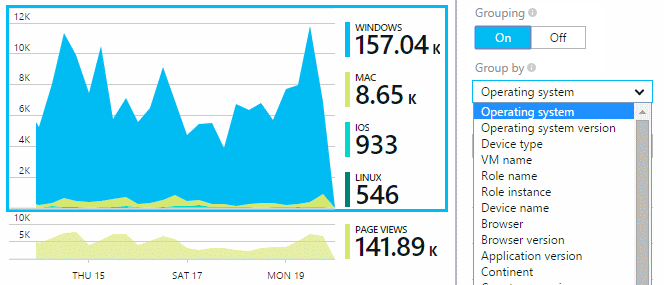
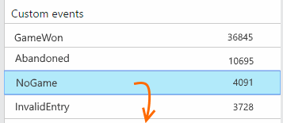
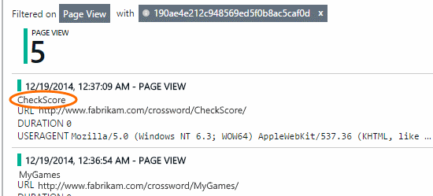
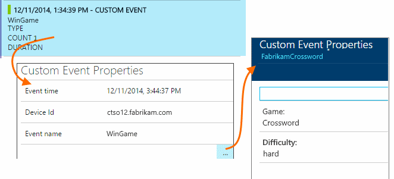

<properties
    pageTitle="Verwendungsanalyse mit Anwendung Einsichten"
    description="Übersicht über Nutzungsanalysen mit Anwendung Einsichten"
    services="application-insights"
    documentationCenter=""
    authors="alancameronwills"
    manager="douge"/>

<tags
    ms.service="application-insights"
    ms.workload="tbd"
    ms.tgt_pltfrm="ibiza"
    ms.devlang="multiple"
    ms.topic="article" 
    ms.date="04/08/2016"
    ms.author="awills"/>

# Verwendungsanalyse mit Anwendung Einsichten

Wissen, wie Personen eine Anwendung verwenden, können Sie die Szenarien, die besonders wichtig sind Ihre Entwicklungsarbeit konzentrieren und gewinnen Sie Einsichten in die Ziele, die sie einfacher oder schwieriger zu erzielen finden.

Anwendung Einsichten können Sie bieten einen klaren Überblick über die Verwendung der Anwendung, hilft Ihnen, um Ihre Benutzer zu verbessern und Ihre geschäftlichen Ziele entsprechen.

Anwendung Einsichten funktioniert für beide eigenständigen apps (auf iOS, Android und Windows) und Web apps (in .NET oder J2EE gehostet). 

## Hinzufügen der Anwendung Einsichten zu einem Projekt

Um anzufangen, erhalten Sie ein kostenloses mit [Microsoft Azure](https://azure.com)-Konto ein. (Nach Ablauf des Testzeitraums, können Sie die kostenlose Ebene des Diensts fortsetzen.)

Erstellen Sie eine Anwendung Einsichten Ressource im [Azure-Portal](https://portal.azure.com). Dies ist die Stelle, an der Sie Verwendung und Leistung von Daten über Ihre app sehen.

**Ist Ihre app ein Gerät app** Hinzufügen der Anwendung Einsichten SDK zu einem Projekt. Die genaue Vorgehensweise hängt von der [IDE und Plattform](app-insights-platforms.md). Für Windows-apps einfach mit der rechten Maustaste in des Projekts in Visual Studio und wählen Sie "Hinzufügen Anwendung Einsichten".

**Ist eine Web-app,** öffnen Sie das Blade Schnellstart und Abrufen den Codeausschnitt um Ihren Webseiten hinzuzufügen. Veröffentlichen Sie diese mit dieser Ausschnitt erneut.

Sie können auch weitere werden von Client- und kombinieren Servercode [ASP.NET](app-insights-asp-net.md) oder [J2EE](app-insights-java-get-started.md) Anwendung Einsichten hinzufügen.

### Führen Sie Ihr Projekt und die ersten Ergebnisse angezeigt

Führen Sie Ihr Projekt im Debuggen-Modus für einige Minuten, und wechseln Sie zum [Azure-Portal](https://portal.azure.com) , und navigieren Sie zu Ihrem Projektressourcen in Anwendung Einsichten.

Veröffentlichen Sie Ihre app, um weitere werden abrufen und finden Sie heraus, was Ihre Benutzer-App tun.

## Analytics im Paket

Klicken Sie auf der Seitenansichten Kachel um Verwendungsdetails anzuzeigen.

Zeigen Sie in den leeren Bereich oberhalb eines Diagramms, um die Anzahl zu einem bestimmten Zeitpunkt finden Sie unter. Andernfalls zeigen die Zahlen den Wert über den Zeitraum, wie etwa einen Mittelwert, einer Summe oder Anzahl der verschiedene Benutzer über den Zeitraum aggregiert.

In Webanwendungen werden Benutzer mithilfe von Cookies berücksichtigt. Eine Person, die mehrere Browser verwendet, löscht Cookies oder das Feature für private verwendet wird mehrmals gezählt.

Eine Web-Sitzung wird nach 30 Minuten gezählt. Eine Sitzung auf einem Mobiltelefon oder ein anderes Gerät wird, wenn die app für mehr als ein paar Sekunden angehalten wird gezählt.

Klicken Sie auf, bis alle Diagramm, um mehr Details anzuzeigen. Beispiel:

(In diesem Beispiel wird von einer Website, aber die Diagramme sind vergleichbar für apps, die auf Geräten ausgeführt werden.)

Vergleichen Sie mit der vorherigen Woche, um festzustellen, ob die Dinge ändern möchten:

Vergleichen von zwei Kennzahlen, beispielsweise Benutzer und neue Benutzer:

(Segment) Gruppendaten von einer Eigenschaft wie Browser, Betriebssystem oder Ort:

## Verwendung der Seite

Klicken Sie auf die Seitenansichten zum Abrufen Kachel eines einen Überblick über die am häufigsten verwendeten Seiten:

Im oben genannten Beispiel befindet sich in einer Spiele-Website. Es können wir sofort angezeigt werden:

* Verwendung noch nicht in der letzten Woche verbessert. Vielleicht sollten wir suchmaschinenoptimierung anzustellen?
* Viele weniger Personen finden Sie unter Spiele Seiten als der Homepage. Warum wird nicht unsere Startseite Personen spielen aufmerksam zu machen?
* 'Kreuzworträtseln' ist die am häufigsten verwendeten Spiel. Wir sollten Priorität auf neue Ideen und es Verbesserungen gewähren.

## Benutzerdefinierte Verlauf

Angenommen, statt jedes Spiel in einer separaten Webseite zu implementieren, doch Sie können alle in der gleichen einseitige-app für die meisten Funktionen codierten als JavaScript-Code in die Webseite zu gestalten. Dies kann der Benutzer schnell zwischen ein Spiel und einen anderen wechseln oder sogar mehrere Spiele auf einer Seite haben.

Und möchten Sie noch Anwendung Einsichten zu melden Sie sich an, wie oft jedes Spiel auf genau die gleiche Weise wie geöffnet wird, wenn sie auf separaten Webseiten waren. Das ist ganz einfach: Legen Sie einen Anruf an das Modul werden nur in Ihrer JavaScript, für den Datensatz, der eine neue Seite geöffnet hat möchten:

    telemetryClient.trackPageView(game.Name);

## Benutzerdefinierte Ereignisse

Telemetrieprotokoll können auf verschiedene Weise zu verstehen, wie eine Anwendung verwendet wird. Aber möchten Sie nicht immer die Nachrichten mit Seitenansichten mischen Sie nach oben. Verwenden Sie stattdessen benutzerdefinierte Ereignisse an. Sie können den Benutzern vom Gerät apps, Webseiten oder einem Webserver senden:

(JavaScript)

    telemetryClient.trackEvent("GameEnd");

(C#)

    var tc = new Microsoft.ApplicationInsights.TelemetryClient();
    tc.TrackEvent("GameEnd");

(VB)

    Dim tc = New Microsoft.ApplicationInsights.TelemetryClient()
    tc.TrackEvent("GameEnd")

Das Blade Übersicht werden die am häufigsten benutzerdefinierte Ereignisse aufgelistet.

Klicken Sie auf den Anfang der Tabelle total Nummern von Ereignissen angezeigt werden. Sie können das Diagramm von verschiedenen Attributen, wie z. B. den Namen des Ereignisses segmentieren:

Das besonders nützliches Feature für Zeitpläne ist, dass die Änderungen mit anderen Maße und Ereignisse koordinieren. Manchmal, wenn Sie weitere Spiele abgespielt werden, erwarten Sie beispielsweise eine zunehmenden verwendete Spiele sowie finden Sie unter. Aber die zunehmenden verwendete Spiele ist einem, würde möchten herausfinden, ob der hohe Auslastung Probleme verursacht, die Benutzern inakzeptabel gefunden.

## Detailliert auswerten bestimmte Ereignisse

Um besser zu verstehen, wie eine normale Sitzung geht zu erhalten, sollten Sie auf eine bestimmte Benutzer Sitzung konzentrieren, die einen bestimmten Typ von Ereignis enthält.

In diesem Beispiel codierten wir ein benutzerdefiniertes Ereignis "NoGame", die bei der Anmeldung des Benutzers ohne tatsächlich ein Spiel starten aufgerufen wird. Warum sollte ein Benutzer erledigen? Wenn wir einen Drilldown in einige bestimmten Vorkommen durchführen, erhalten wir vielleicht einen Hinweis können.

Die benutzerdefinierten Ereignisse in der app empfangen werden anhand des Namens auf das Blade Übersicht aufgelistet:

Klicken Sie auf, bis das Ereignis relevante, und wählen Sie ein bestimmtes aktuelle vorkommen:

Sehen wir uns die alle werden für die Sitzung in der dieses Ereignis NoGame aufgetreten ist.

Es wurden keine Ausnahmen, damit der Benutzer daran gehindert wurde nicht, indem einige Fehler bei der Wiedergabe.

Wir können alle Arten von werden mit Ausnahme der Seitenansichten für diese Sitzung herausfiltern:

Und jetzt können wir sehen, dass diese Benutzer angemeldet, einfach, um die neuesten Ergebnisse zu überprüfen. Vielleicht sollten wir die Entwicklung von eines Textabschnitts, der erledigen erleichtert. (Und wir sollten ein benutzerdefiniertes Ereignis Bericht tritt dieses bestimmten Geschichte implementieren.)

## Filtern, suchen und Segmentieren von Daten mit Eigenschaften
Sie können beliebige Tags und numerische Werte an Ereignisse anfügen.

JavaScript-Client

    appInsights.trackEvent("WinGame",
        // String properties:
        {Game: currentGame.name, Difficulty: currentGame.difficulty},
        // Numeric measurements:
        {Score: currentGame.score, Opponents: currentGame.opponentCount}
    );

C#-Servers

    // Set up some properties:
    var properties = new Dictionary <string, string>
        {{"game", currentGame.Name}, {"difficulty", currentGame.Difficulty}};
    var measurements = new Dictionary <string, double>
        {{"Score", currentGame.Score}, {"Opponents", currentGame.OpponentCount}};

    // Send the event:
    telemetry.TrackEvent("WinGame", properties, measurements);

VB am server

    ' Set up some properties:
    Dim properties = New Dictionary (Of String, String)
    properties.Add("game", currentGame.Name)
    properties.Add("difficulty", currentGame.Difficulty)

    Dim measurements = New Dictionary (Of String, Double)
    measurements.Add("Score", currentGame.Score)
    measurements.Add("Opponents", currentGame.OpponentCount)

    ' Send the event:
    telemetry.TrackEvent("WinGame", properties, measurements)

Fügen Sie Eigenschaften auf die gleiche Weise wie auf der Seitenansichten an:

JavaScript-Client

    appInsights.trackPageView("Win",
        {Game: currentGame.Name},
        {Score: currentGame.Score});

Diagnose suchen zeigen Sie die Eigenschaften an, indem Sie durch eine einzelne Eintreten eines Ereignisses auf.

Verwenden Sie das Suchfeld ein, um Ereignis Vorkommen mit einem bestimmten Eigenschaftswert anzuzeigen.

## A | B testen

Wenn Sie nicht wissen, welche Variante des ein Feature mehr hergestellt werden kann, lassen Sie beide zu ausführenden jedes können andere Benutzer. Den Erfolg der einzelnen messen, und klicken Sie dann auf eine einheitliche Version verschieben.

Für dieses Verfahren ordnen Sie distinct Kategorien, für alle werden, die von den einzelnen Versionen der app gesendet wird. Sie können das erreichen, indem Sie die Eigenschaften in der aktiven TelemetryContext definieren. Diese Standardeigenschaften werden auf alle werden Nachrichten, die von der Anwendung gesendet – nicht nur Ihre benutzerdefinierten Nachrichten, aber auch die Standardansicht werden hinzugefügt.

Im Portal Anwendung Einblicken, dann können zwar zu filtern und gruppieren (Segment) Ihre Daten auf der Kategorien, weitere verschiedene Versionen vergleichen.

C#-Servers

    using Microsoft.ApplicationInsights.DataContracts;

    var context = new TelemetryContext();
    context.Properties["Game"] = currentGame.Name;
    var telemetry = new TelemetryClient(context);
    // Now all telemetry will automatically be sent with the context property:
    telemetry.TrackEvent("WinGame");

VB am server

    Dim context = New TelemetryContext
    context.Properties("Game") = currentGame.Name
    Dim telemetry = New TelemetryClient(context)
    ' Now all telemetry will automatically be sent with the context property:
    telemetry.TrackEvent("WinGame")

Einzelne werden kann die Standardwerte außer Kraft setzen.

Sie können eine universal Initialisierung einrichten, dass alle neuen TelemetryClients automatisch Kontext verwenden.

    // Telemetry initializer class
    public class MyTelemetryInitializer : ITelemetryInitializer
    {
        public void Initialize (ITelemetry telemetry)
        {
            telemetry.Properties["AppVersion"] = "v2.1";
        }
    }

In der app-Initialisierung wie Global.asax.cs:

    protected void Application_Start()
    {
        // ...
        TelemetryConfiguration.Active.TelemetryInitializers
        .Add(new MyTelemetryInitializer());
    }

## Generator - Measure - Informationen

Wenn Sie Analytics verwenden, wird es sich um einen integrierten Teil Ihres Entwicklungszyklus – nicht nur eines Beitrags Meinung Pfeile zum Lösen von Problemen. Hier sind einige Tipps:

* Ermitteln Sie die Taste Metrik Ihrer Anwendung. Möchten Sie so viele Benutzer wie möglich, oder möchten Sie lieber eine kleine Gruppe von Benutzern sehr zufrieden? Möchten Sie besuchen oder Sales maximieren?
* Planen Sie für jeden Textabschnitt messen. Wenn Sie einen neuen Benutzertextabschnitt skizzieren oder Feature oder Plan aktualisieren eine vorhandenen immer überlegen Sie, wie Sie den Erfolg der Änderung messen werden. Vor dem Codieren gestartet wird, bitten Sie "welche Auswirkung dies auf unsere Kennzahlen, hat, wenn er immer funktioniert? Sollten wir alle neuen Ereignisse nachverfolgen?"
Und natürlich, wenn das Feature live ist, stellen Sie sicher, Sie sehen Sie sich die Analytics und wirken sich auf die Ergebnisse.
* Die wichtigsten Metrik betreffen Sie anderer Größen. Beispielsweise, wenn Sie ein Feature "Favoriten" hinzufügen, Sie möchten wissen, wie oft "Favoriten" Hinzufügen von Benutzern. Aber es sieht vielleicht interessant zu wissen, wie oft sie wieder zu ihren Favoriten stammen. Und der wichtigste Benutzer von Favoriten schließlich kaufe Weitere Ihres Produkts?
* Kanarischen testen. Richten Sie ein Feature wechseln, die Ihnen ermöglicht, ein neues Feature nur für einige Benutzer sichtbar zu machen. Verwenden Sie Anwendung Einblicken, um festzustellen, ob das neue Feature verarbeitet verwendet wird, die Sie beabsichtigten. Nehmen Sie Anpassungen vor, und klicken Sie dann einem breiteren Publikum freigegeben Sie werden soll.
* Sprechen Sie Ihren Benutzern! Analytics reicht nicht eigenständig, aber Komplement zur Verwaltung der einer gute Kunden Beziehung.

## Weitere Informationen

* [Erkennen Sie, zu Sichten Sie und diagnostizieren Sie abstürzen und Leistungsprobleme in Ihrer app](app-insights-detect-triage-diagnose.md)
* [Erste Schritte mit Anwendung Einsichten auf vielen Plattformen](app-insights-detect-triage-diagnose.md)

## Video

> [AZURE.VIDEO usage-monitoring-application-insights]

 
