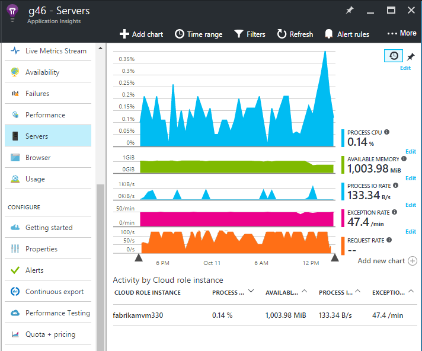
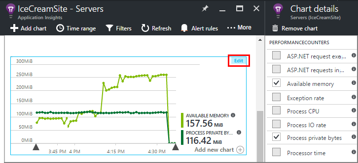
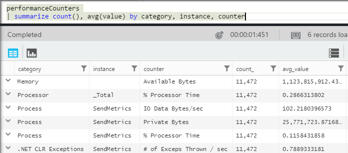

<properties 
    pageTitle="Leistungsindikatoren in Anwendung Einsichten | Microsoft Azure" 
    description="System und benutzerdefinierte .NET Leistungsindikatoren in der Anwendung Einsichten zu überwachen." 
    services="application-insights" 
    documentationCenter=""
    authors="alancameronwills" 
    manager="douge"/>

<tags 
    ms.service="application-insights" 
    ms.workload="tbd" 
    ms.tgt_pltfrm="ibiza" 
    ms.devlang="na" 
    ms.topic="article" 
    ms.date="10/11/2016" 
    ms.author="awills"/>
 
# <a name="system-performance-counters-in-application-insights"></a>Systemleistungsindikatoren in Anwendung Einsichten


Windows bietet eine Vielzahl von [Datenquellen](http://www.codeproject.com/Articles/8590/An-Introduction-To-Performance-Counters) , z. B. CPU-Belegung, Speicher, Datenträger und Netzwerkverwendung. Sie können auch eigene definieren. [Anwendung Einsichten](app-insights-overview.md) können diese Leistungsindikatoren anzeigen, wenn die Anwendung, klicken Sie unter IIS auf einem lokalen Host oder virtuellen Computern ausgeführt wird, auf die Sie Administratorzugriff haben. Die Diagramme an Ihrer Anwendung live verfügbaren Ressourcen anzuzeigen, und können dazu beitragen um nicht angeglichene laden zwischen Instanzen von Server zu identifizieren.

Datenquellen werden in das Blade Servern, wozu auch einer Tabelle die Segmente vom Server-Instanz aus.



(-Datenquellen stehen für Azure Web Apps. Jedoch können Sie die [Anwendung Einsichten Azure-Diagnose senden](app-insights-azure-diagnostics.md).)

## <a name="configure"></a>Konfigurieren

Wenn die Anwendung Einsichten Status Monitor noch nicht auf den Servercomputern installiert ist, müssen Sie darauf, um die Leistungsindikatoren finden Sie unter installieren.

Herunterladen und Ausführen von [Status Monitor Installer](http://go.microsoft.com/fwlink/?LinkId=506648) auf jede Server-Instanz aus. Wenn sie bereits installiert ist, müssen Sie nicht erneut zu installieren.

* *Kann ich während der Entwicklung [der Anwendung Einsichten SDK in Meine app installiert](app-insights-asp-net.md) . Benötige ich weiterhin Status Monitor?*

    Ja, ist Status Monitor erforderlich, um die von Leistungsindikatoren für ASP.NET Web apps zu sammeln. Wie Sie bereits wissen vielleicht, kann [Überwachen der Web apps, die bereits live sind](app-insights-monitor-performance-live-website-now.md), die Status Monitor auch ohne Installation von SDK während der Entwicklung verwendet werden.


## <a name="view-counters"></a>Anzeigen von Indikatoren

Das Blade Servern zeigt einen Standardsatz von Datenquellen. 

Wenn andere Indikatoren anzeigen möchten, entweder die Diagramme auf dem Server-Blade, bearbeiten oder Öffnen eines neuen [Metrik Explorer](app-insights-metrics-explorer.md) Blades und fügen Sie neue Diagramme. 

Die verfügbaren Indikatoren werden als Kennzahlen aufgeführt, beim Bearbeiten eines Diagramms.



Wenn alle besonders hilfreich Diagramme an einem Ort anzeigen möchten, erstellen Sie ein [Dashboard](app-insights-dashboards.md) und darauf zu fixieren.

## <a name="add-counters"></a>Hinzufügen von Indikatoren

Falls der gewünschte Performance-Zähler in der Liste der Kriterien angezeigt wird, d.h., da die Anwendung Einsichten SDK in Ihrem Webserver sammeln nicht zur Verfügung. Sie können es dazu konfigurieren.

1. Erfahren Sie, welche Indikatoren in dem Server verfügbar sind, mit dem folgenden PowerShell-Befehl auf dem Server:

    `Get-Counter -ListSet *`

    (See [`Get-Counter`](https://technet.microsoft.com/library/hh849685.aspx).)

1. Öffnen Sie ApplicationInsights.config.

 * Wenn Sie während der Entwicklung Anwendung Einsichten zu Ihrer Anwendung hinzugefügt haben, ApplicationInsights.config in Ihrem Projekt bearbeiten, und klicken Sie dann erneut auf Ihre Server bereitstellen.
 * Wenn Sie Status Monitor verwendet, um eine Web app zur Laufzeit instrumentieren, suchen Sie im Stammverzeichnis der app in IIS ApplicationInsights.config. Aktualisieren sie es in jeder Server-Instanz aus.

2. Bearbeiten der Leistung Collection Richtlinie an:

 ```XML

    <Add Type="Microsoft.ApplicationInsights.Extensibility.PerfCounterCollector.PerformanceCollectorModule, Microsoft.AI.PerfCounterCollector">
      <Counters>
        <Add PerformanceCounter="\Objects\Processes"/>
        <Add PerformanceCounter="\Sales(photo)\# Items Sold" ReportAs="Photo sales"/>
      </Counters>
    </Add>

```

Standard-Indikatoren und die Sie selbst implementiert haben, können Sie erfassen. `\Objects\Processes`ist ein Beispiel für einen standard-Indikator, auf alle Windows-Betriebssysteme zur Verfügung. `\Sales(photo)\# Items Sold`ist ein Beispiel für einen benutzerdefinierten Zähler, der möglicherweise in einem Webdienst implementiert werden. 

Das Format ist `\Category(instance)\Counter"`, oder nur für Kategorien, die Instanzen besitzen, `\Category\Counter`.

`ReportAs`ist erforderlich, damit der Zählernamen, die nicht entsprechen `[a-zA-Z()/-_ \.]+` -d. h., sie nicht in den folgenden Sätzen enthaltenen Zeichen enthalten: Buchstaben, runden Klammern, Schrägstrich, Bindestrich, Unterstrich, Abstand, dot.

Wenn Sie eine Instanz angeben, wird es als Dimension "CounterInstanceName", der die gemeldeten Metrik erfasst.

### <a name="collecting-performance-counters-in-code"></a>Sammeln der Leistungsindikatoren in code

Wenn Systemleistungsindikatoren auflisten und an die Anwendung Einsichten senden, können Sie den folgenden Codeausschnitt anpassen:

    var perfCollectorModule = new PerformanceCollectorModule();
    perfCollectorModule.Counters.Add(new PerformanceCounterCollectionRequest(
      @"\.NET CLR Memory([replace-with-application-process-name])\# GC Handles", "GC Handles")));
    perfCollectorModule.Initialize(TelemetryConfiguration.Active);

Oder Sie können das gleiche mit benutzerdefinierten Kennzahlen, die Sie erstellt haben:

    var perfCollectorModule = new PerformanceCollectorModule();
    perfCollectorModule.Counters.Add(new PerformanceCounterCollectionRequest(
      @"\Sales(photo)\# Items Sold", "Photo sales"));
    perfCollectorModule.Initialize(TelemetryConfiguration.Active);

## <a name="performance-counters-in-analytics"></a>Leistungsindikatoren in Analytics

Sie können Suchen und [Analytics](app-insights-analytics.md)Leistung Zähler Berichte anzuzeigen.


Das Schema **PerformanceCounters** macht den `category`, `counter` Namen, und `instance` Namen der einzelnen Performance-Zähler.  In der werden für jede Anwendung sehen Sie nur die Indikatoren für die Anwendung. Um finden Sie unter sind beispielsweise, welche Indikatoren verfügbar: 



('Instanz' Hier bezieht sich auf die Leistung Zählerinstanz, nicht auf die Rolle oder Server Computer Instanz. Der Leistung Zähler Instanznamen Segmente in der Regel Indikatoren wie CPU-Zeit nach dem Namen der Prozess oder einer Anwendung.)

So erhalten Sie ein Diagramm der verfügbaren Arbeitsspeicher über die letzten Zinstermin zurück 


Wie andere werden, enthält die **PerformanceCounters** auch eine Spalte `cloud_RoleInstance` angibt, dass die Identität des die Host Server-Instanz auf dem Ihre app ausgeführt wird. Wenn Sie beispielsweise die Leistung der app auf den anderen Computern vergleichen: 


## <a name="aspnet-and-application-insights-counts"></a>ASP.NET und der Anwendung Einsichten Anzahl

*Was ist der Unterschied zwischen der Ausnahme Zins und Ausnahmen Kennzahlen?*

* *Ausnahme Zins* ist ein System Performance-Zähler. Die CLR ermittelt alle Ausnahmen und nicht verwaltete Ausnahmen, die ausgelöst werden, und dividiert die Summe in einem Intervall werden durch die Länge des Intervalls. Die Anwendung Einsichten SDK dieses Ergebnis sammelt und sendet es im Portal.
* *Ausnahmen* ist die Anzahl der TrackException Berichte vom im Portal in das Stichprobe-Intervall des Diagramms. Sie enthält nur die verarbeiteten Ausnahmen, in dem Sie geschrieben haben TrackException ruft in Ihren Code, und nicht alle [Ausnahmefehler](app-insights-asp-net-exceptions.md)enthalten. 

## <a name="alerts"></a>Benachrichtigungen

Wie andere Kennzahlen können Sie [eine Benachrichtigung festlegen](app-insights-alerts.md) , um Sie zu warnen, wenn ein Performance-Zähler außerhalb maximal geht, die Sie angeben. Öffnen Sie das Blade Benachrichtigungen, und klicken Sie auf benachrichtigen hinzufügen.


## <a name="a-namenextanext-steps"></a><a name="next"></a>Nächste Schritte

* [Abhängigkeit nachverfolgen](app-insights-asp-net-dependencies.md)
* [Ausnahme nachverfolgen](app-insights-asp-net-exceptions.md)