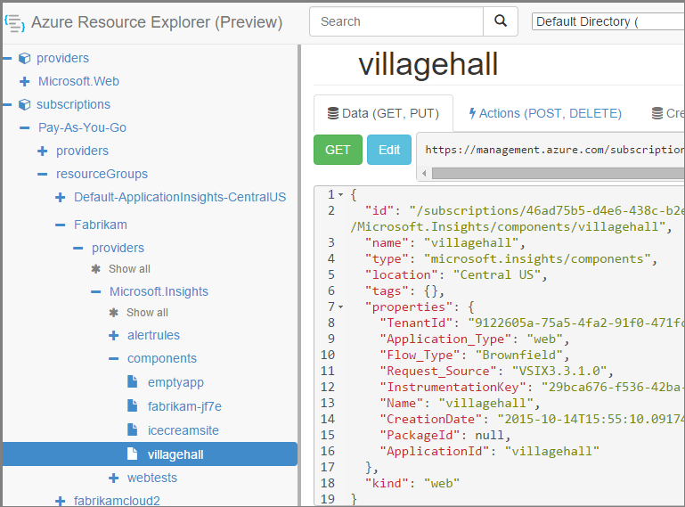

<properties 
    pageTitle="Erstellen der Anwendung Einsichten Ressourcen mithilfe der PowerShell" 
    description="Erstellen Sie programmgesteuert Anwendung Einsichten Ressourcen als Teil Ihrer erstellen." 
    services="application-insights" 
    documentationCenter=""
    authors="alancameronwills" 
    manager="douge"/>

<tags 
    ms.service="application-insights" 
    ms.workload="tbd" 
    ms.tgt_pltfrm="ibiza" 
    ms.devlang="na" 
    ms.topic="article" 
    ms.date="03/02/2016" 
    ms.author="awills"/>
 
# <a name="create-application-insights-resources-using-powershell"></a>Erstellen der Anwendung Einsichten Ressourcen mithilfe der PowerShell

In diesem Artikel wird gezeigt, wie Sie eine [Anwendung Einsichten](app-insights-overview.md) Ressource automatisch in Azure erstellen. Möglicherweise, beispielsweise als Teil eines Prozesses erstellen möchten. Zusammen mit der grundlegenden Anwendung Einsichten Ressource können [Verfügbarkeit Webtests](app-insights-monitor-web-app-availability.md), [Benachrichtigungen einrichten](app-insights-alerts.md)möchten, erstellen und weitere Ressourcen Azure erstellen.

Die EINGABETASTE, um diese Ressourcen erstellen ist JSON-Vorlagen für [Ressourcenmanager Azure](../powershell-azure-resource-manager.md). Kurz gesagt, das Verfahren gilt: Herunterladen die JSON-Definitionen der vorhandenen Ressourcen; parametrisieren Sie bestimmte Werte z. B.; ein, und führen Sie dann die Vorlage aus, wenn Sie eine neue Ressource erstellen möchten. Sie können mehrere Ressourcen zusammen verpacken, deren Erstellung alle in einem wechseln - beispielsweise einen app Monitor mit Verfügbarkeit überprüft, Hinweise und Speicherplatz für kontinuierliche exportieren. Es gibt einige Besonderheiten zu einigen der Parametrisierungen, die wir hier erläutert werden.

## <a name="one-time-setup"></a>Einmalige Einrichtung

Wenn Sie mit Ihrem Azure-Abonnement vor dem PowerShell verwendet haben:

Installieren Sie das Azure Powershell-Modul auf dem Computer, in dem die Skripts ausgeführt werden soll:

1. Installieren von [Microsoft Web Platform Installer (v5 oder höher)](http://www.microsoft.com/web/downloads/platform.aspx).
2. Verwenden sie Microsoft Azure Powershell installieren.

## <a name="copy-the-json-for-existing-resources"></a>Kopieren Sie die JSON für vorhandene Ressourcen

1. Richten Sie [Anwendung Einsichten](app-insights-overview.md) für ein Projekt ähnlich wie diejenigen, die automatisch generiert werden sollen. Fügen Sie Web überprüft und Benachrichtigungen, wenn Sie möchten.
2. Erstellen einer neuen .json Datei – Wir nennen Sie diese `template1.json` in diesem Beispiel. Kopieren Sie diesen Inhalt in ein:


    ```JSON

        {
          "$schema": "https://schema.management.azure.com/schemas/2015-01-01/deploymentTemplate.json#",
          "contentVersion": "1.0.0.0",
          "parameters": {
            "appName": { "type": "string" },
            "webTestName": { "type": "string" },
            "url": { "type": "string" },
            "text": { "type" : "string" }
          },
          "variables": {
            "testName": "[concat(parameters('webTestName'), 
               '-', toLower(parameters('appName')))]"
            "alertRuleName": "[concat(parameters('webTestName'), 
               '-', toLower(parameters('appName')), 
               '-', subscription().subscriptionId)]"
          },
          "resources": [
            {
              // component JSON file contents
            },
            {
              //web test JSON file contents
            },
            {
              //alert rule JSON file contents
            }
 
            // Any other resources go here
          ]
        }
    
    ```

    Mit dieser Vorlage wird eine Verfügbarkeit testen sowie die wichtigsten Ressource einrichten.


2. [Azure Ressourcenmanager](https://resources.azure.com/)zu öffnen. Navigieren Sie nach unten bis `subscriptions/resourceGroups/<your resource group>/providers/Microsoft.Insights/components`, zu der Anwendungsressource. 

    

    *Komponenten* sind die grundlegenden Anwendung Einsichten Ressourcen für die Anzeige von Applications. Es gibt separate Ressourcen für die zugeordnete Warnungsregeln und Verfügbarkeit Webtests.

3. Kopieren Sie die JSON der Komponente in der richtigen Stelle im `template1.json`.
6. Löschen Sie die folgenden Eigenschaften:
  * `id`
  * `InstrumentationKey`
  * `CreationDate`
4. Öffnen Sie in den Abschnitten Webtests und Alertrules, und kopieren Sie die JSON für einzelne Elemente in der Vorlage. (Nicht von den Knoten Webtests oder Alertrules kopieren: Wechseln Sie in die Elemente unter diese.)

    Jede Webtest weist eine zugeordnete benachrichtigen Regel, sodass Sie beide kopieren müssen.

    Bevor Sie die Regel sollte der Webtest wechseln.

5. Fügen Sie diese Zeile in jeder Ressource, um das Schema zu erfüllen:

    `"apiVersion": "2014-04-01",`

    (Das Schema darin auch über die Groß-/Kleinschreibung von den Typ Ressourcennamen `Microsoft.Insights/*` – *nicht* diese jedoch ändern.)


## <a name="parameterize-the-template"></a>Die Vorlage parametrisieren

Jetzt haben Sie die spezifischen Namen mit den Parametern zu ersetzen. Zu [eine Vorlage parametrisieren](../resource-group-authoring-templates.md)schreiben Sie Ausdrücke, die mit einer [Gruppe von Funktionen Helper](../resource-group-template-functions.md)aus. 

Sie können nicht nur Teil einer Zeichenfolge parametrisieren, verwenden Sie also `concat()` Zeichenfolgen erstellen.

Hier sind Beispiele für die Platzhalter, die Sie vornehmen möchten, werden ein. Es gibt mehrere Vorkommen der einzelnen ersetzen. Sie gegebenenfalls andere Personen in Ihrer Vorlage. In diesen Beispielen verwenden die Parameter und Variablen, die wir definiert am oberen Rand der Vorlage ein.

Suchen nach | Ersetzen durch
---|---
`"hidden-link:/subscriptions/.../components/MyAppName"`| `"[concat('hidden-link:',`<br/>` resourceId('microsoft.insights/components',` <br/> ` parameters('appName')))]"`
`"/subscriptions/.../alertrules/myAlertName-myAppName-subsId",` | `"[resourceId('Microsoft.Insights/alertrules', variables('alertRuleName'))]",`
`"/subscriptions/.../webtests/myTestName-myAppName",` | `"[resourceId('Microsoft.Insights/webtests', parameters('webTestName'))]",`
`"myWebTest-myAppName"` | `"[variables(testName)]"'`
`"myTestName-myAppName-subsId"` | `"[variables('alertRuleName')]"`
`"myAppName"` | `"[parameters('appName')]"`
`"myappname"`(Kleinbuchstaben) | `"[toLower(parameters('appName'))]"`
`"<WebTest Name=\"myWebTest\" ...`<br/>` Url=\"http://fabrikam.com/home\" ...>"`|`[concat('<WebTest Name=\"',` <br/> `parameters('webTestName'),` <br/> `'\" ... Url=\"', parameters('Url'),` <br/> `'\"...>')]" `


## <a name="set-dependencies-between-the-resources"></a>Festlegen von Abhängigkeiten zwischen den Ressourcen

Die Ressourcen in striktem Reihenfolge sollte Azure einrichten. Um sicherzustellen, dass eine Setup abgeschlossen ist, vor Beginn der nächsten, fügen Sie Verknüpfungslinien hinzu:

* Prüfen Sie im Web Ressource aus:

    `"dependsOn": ["[resourceId('Microsoft.Insights/components', parameters('appName'))]"],`

* In der Benachrichtigung Ressource:

    `"dependsOn": ["[resourceId('Microsoft.Insights/webtests', variables('testName'))]"],`

## <a name="create-application-insights-resources"></a>Erstellen der Anwendung Einsichten Ressourcen

1. Melden Sie in PowerShell sich bei Azure

    `Login-AzureRmAccount`

2. Führen Sie einen Befehl wie folgt:

    ```PS

        New-AzureRmResourceGroupDeployment -ResourceGroupName Fabrikam `
               -templateFile .\template1.json `
               -appName myNewApp `
               -webTestName aWebTest `
               -Url http://myapp.com `
               -text "Welcome!"
               -siteName "MyAzureSite"

    ``` 

    * -ResourceGroupName ist die Gruppe, in dem Sie die neuen Ressourcen erstellen möchten.
    * TemplateFile - muss vor den benutzerdefinierten Parametern liegen.
    * -AppName den Namen der Ressource zu erstellen.
    * -WebTestName den Namen des Webtests zu erstellen.
    * -Url die Url des Web app.
    * -Text eine Zeichenfolge, die in Ihrer Webseite angezeigt wird.
    * -SiteName - verwendet wird, ist eine Azure-website


## <a name="define-metric-alerts"></a>Definieren von metrischen Benachrichtigungen

Es gibt eine [PowerShell-Methode zum Festlegen von Benachrichtigungen](app-insights-alerts.md#set-alerts-by-using-powershell)aus.


## <a name="an-example"></a>Ein Beispiel

Hier ist die vollständige Komponente, Webtest und Web Test alert ich erstellte Vorlage:

``` JSON

{
  "$schema": "https://schema.management.azure.com/schemas/2015-01-01/deploymentTemplate.json#",
  "contentVersion": "1.0.0.0",
  "parameters": {
    "webTestName": { "type": "string" },
    "appName": { "type": "string" },
    "URL": { "type": "string" },
    "text": { "type" : "string" }
  },
  "variables": {
    "alertRuleName": "[concat(parameters('webTestName'), '-', toLower(parameters('appName')), '-', subscription().subscriptionId)]",
    "testName": "[concat(parameters('webTestName'), '-', toLower(parameters('appName')))]"
  },
  "resources": [
    {
      //"id": "[resourceId('Microsoft.Insights/components', parameters('appName'))]",
      "apiVersion": "2014-04-01",
      "kind": "web",
      "location": "Central US",
      "name": "[parameters('appName')]",
      "properties": {
        "TenantId": "9122605a-471fc50f8438",
        "Application_Type": "web",
        "Flow_Type": "Brownfield",
        "Request_Source": "VSIX3.3.1.0",
        "Name": "[parameters('appName')]",
        //"CreationDate": "2015-10-14T15:55:10.0917441+00:00",
        "PackageId": null,
        "ApplicationId": "[parameters('appName')]"
      },
      "tags": { },
      "type": "microsoft.insights/components"
    },
    {
      //"id": "[resourceId('Microsoft.Insights/webtests', variables('testName'))]",
      "name": "[variables('testName')]",
      "apiVersion": "2014-04-01",
      "type": "microsoft.insights/webtests",
      "location": "Central US",
      "tags": {
        "[concat('hidden-link:', resourceId('microsoft.insights/components', parameters('appName')))]": "Resource"
      },
      "properties": {
        "provisioningState": "Succeeded",
        "Name": "[parameters('webTestName')]",
        "Description": "",
        "Enabled": true,
        "Frequency": 900,
        "Timeout": 120,
        "Kind": "ping",
        "RetryEnabled": true,
        "Locations": [
          {
            "Id": "us-va-ash-azr"
          },
          {
            "Id": "emea-nl-ams-azr"
          },
          {
            "Id": "emea-gb-db3-azr"
          }
        ],
        "Configuration": {
          "WebTest": "[concat(
             '<WebTest   Name=\"', 
                parameters('webTestName'), 
              '\"  Id=\"32cfc791-aaad-4b50-9c8d-993c21beb218\"   Enabled=\"True\"         CssProjectStructure=\"\"    CssIteration=\"\"  Timeout=\"120\"  WorkItemIds=\"\"         xmlns=\"http://microsoft.com/schemas/VisualStudio/TeamTest/2010\"         Description=\"\"  CredentialUserName=\"\"  CredentialPassword=\"\"         PreAuthenticate=\"True\"  Proxy=\"default\"  StopOnError=\"False\"         RecordedResultFile=\"\"  ResultsLocale=\"\">  <Items>  <Request Method=\"GET\"         Guid=\"a6f2c90b-61bf-b28hh06gg969\"  Version=\"1.1\"  Url=\"', 
              parameters('Url'), 
              '\" ThinkTime=\"0\"  Timeout=\"300\" ParseDependentRequests=\"True\"         FollowRedirects=\"True\" RecordResult=\"True\" Cache=\"False\"         ResponseTimeGoal=\"0\"  Encoding=\"utf-8\"  ExpectedHttpStatusCode=\"200\"         ExpectedResponseUrl=\"\" ReportingName=\"\" IgnoreHttpStatusCode=\"False\" />        </Items>  <ValidationRules> <ValidationRule  Classname=\"Microsoft.VisualStudio.TestTools.WebTesting.Rules.ValidationRuleFindText, Microsoft.VisualStudio.QualityTools.WebTestFramework, Version=10.0.0.0, Culture=neutral, PublicKeyToken=b03f5f7f11d50a3a\" DisplayName=\"Find Text\"         Description=\"Verifies the existence of the specified text in the response.\"         Level=\"High\"  ExectuionOrder=\"BeforeDependents\">  <RuleParameters>        <RuleParameter Name=\"FindText\" Value=\"', 
              parameters('text'), 
              '\" />  <RuleParameter Name=\"IgnoreCase\" Value=\"False\" />  <RuleParameter Name=\"UseRegularExpression\" Value=\"False\" />  <RuleParameter Name=\"PassIfTextFound\" Value=\"True\" />  </RuleParameters> </ValidationRule>  </ValidationRules>  </WebTest>')]"
        },
        "SyntheticMonitorId": "[variables('testName')]"
      }
    },
    {
      //"id": "[resourceId('Microsoft.Insights/alertrules', variables('alertRuleName'))]",
      "name": "[variables('alertRuleName')]",
      "apiVersion": "2014-04-01",
      "type": "microsoft.insights/alertrules",
      "location": "East US",
      "dependsOn": [
        "[resourceId('Microsoft.Insights/components', parameters('appName'))]",
        "[resourceId('Microsoft.Insights/webtests', variables('testName'))]"
      ],
      "tags": {
        "[concat('hidden-link:', resourceId('Microsoft.Insights/components', parameters('appName')))]": "Resource",
        "[concat('hidden-link:', resourceId('Microsoft.Insights/webtests', variables('testName')))]": "Resource"
      },
      "properties": {
        "name": "[variables('alertRuleName')]",
        "description": "",
        "isEnabled": true,
        "condition": {
          "$type": "Microsoft.WindowsAzure.Management.Monitoring.Alerts.Models.LocationThresholdRuleCondition, Microsoft.WindowsAzure.Management.Mon.Client",
          "odata.type": "Microsoft.Azure.Management.Insights.Models.LocationThresholdRuleCondition",
          "dataSource": {
            "$type": "Microsoft.WindowsAzure.Management.Monitoring.Alerts.Models.RuleMetricDataSource, Microsoft.WindowsAzure.Management.Mon.Client",
            "odata.type": "Microsoft.Azure.Management.Insights.Models.RuleMetricDataSource",
            "resourceUri": "[resourceId('microsoft.insights/webtests', variables('testName'))]",
            "metricName": "GSMT_AvRaW"
          },
          "windowSize": "PT15M",
          "failedLocationCount": 2
        },
        "action": {
          "$type": "Microsoft.WindowsAzure.Management.Monitoring.Alerts.Models.RuleEmailAction, Microsoft.WindowsAzure.Management.Mon.Client",
          "odata.type": "Microsoft.Azure.Management.Insights.Models.RuleEmailAction",
          "sendToServiceOwners": true,
          "customEmails": [ ]
        },
        "provisioningState": "Succeeded",
        "actions": [ ]
      }

    }
  ]
}

```

## <a name="see-also"></a>Siehe auch

Weitere Artikel Automatisierung:

* [Erstellen einer Ressource Anwendung Einsichten](app-insights-powershell-script-create-resource.md) - schnelle Methode ohne Vorlage zu erhalten.
* [Einrichten von Benachrichtigungen](app-insights-powershell-alerts.md)
* [Erstellen von Webtests](https://azure.microsoft.com/blog/creating-a-web-test-alert-programmatically-with-application-insights/)
* [Senden von Azure Diagnose an Anwendung Einsichten](app-insights-powershell-azure-diagnostics.md)
* [Erstellen von Anmerkungen release](https://github.com/Microsoft/ApplicationInsights-Home/blob/master/API/CreateReleaseAnnotation.ps1)
