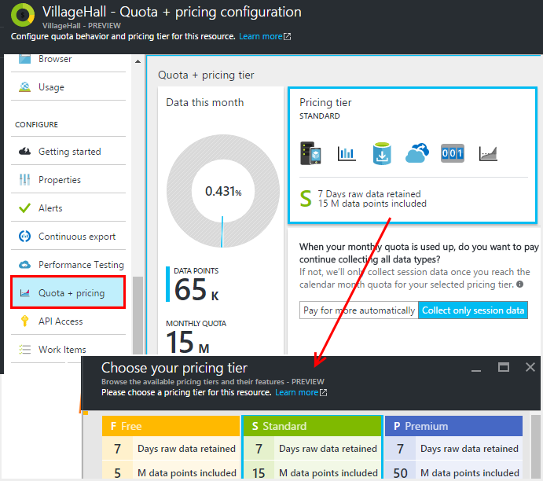
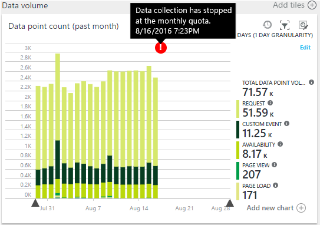
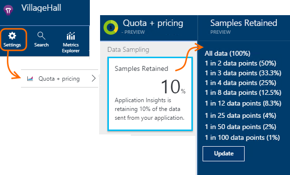
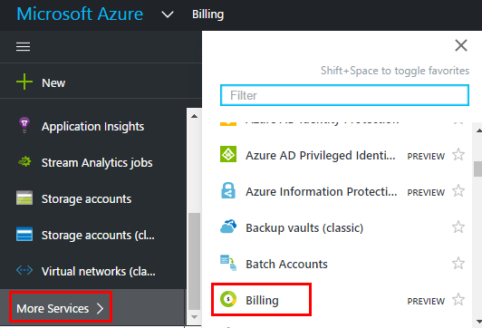

<properties 
    pageTitle="Preise und Kontingent für die Anwendung Einsichten verwalten | Microsoft Azure" 
    description="Wählen Sie den Preisplan, die, den Sie werden Datenmengen verwalten benötigen," 
    services="application-insights" 
    documentationCenter=""
    authors="alancameronwills" 
    manager="douge"/>

<tags 
    ms.service="application-insights" 
    ms.workload="tbd" 
    ms.tgt_pltfrm="ibiza" 
    ms.devlang="na" 
    ms.topic="article" 
    ms.date="10/13/2016" 
    ms.author="awills"/>

# Preise und Kontingent für die Anwendung Einsichten verwalten

*Anwendung Einsichten ist in der Vorschau.*

[Preise] [ pricing] für [Visual Studio-Anwendung Einsichten] [ start] basiert auf Datenvolumen pro Anwendung. Es gibt eine wesentliche kostenlose Stufe, in der Sie die meisten Features mit einige Einschränkungen erhalten.

Jede Anwendung Einsichten Ressource werden als separate Dienst in Rechnung gestellt, und auf die Rechnung für Ihr Abonnement für Azure beiträgt.

[Die Preise des Farbschemas finden Sie unter][pricing].

## Speicherkontingent überprüfen und den Preis für die Ressource ein Anwendung Einsichten planen

Sie können das Kontingent + Preise Blade aus Ihrer Anwendung Ressourceneinstellungen öffnen.

Verwendeter Preise Farbschema wirkt sich auf:

* [Monatliche Kontingent](#monthly-quota) - die Menge des werden Sie jeden Monat analysieren können.
* [Data Rate](#data-rate) - die maximale Rate, die Daten aus der app verarbeitet werden können.
* [Exportieren von fortlaufend](#continuous-export) - gibt an, ob die Daten mit anderen Tools und Diensten exportiert werden können.

Diese Grenzwerte werden separat für jede Anwendung Einsichten Ressource festgelegt.

### Kostenlose Testversion von Premium

Wenn Sie zuerst eine neue Anwendung Einsichten Ressource erstellen, wird es in der kostenlosen Ebene gestartet.

Zu einem beliebigen Zeitpunkt können Sie zur kostenlosen 30-Tage-Testversion von Premium wechseln. Dadurch werden die Vorteile der Stufe Premium. 30 Tage, wird es automatisch in welchen Sie Stufen zurückgesetzt wurden vor – es sei denn, Sie wählen explizit einer anderen Ebene aus. Wählen Sie die Ebene, die Sie zu einem beliebigen Zeitpunkt während des Testzeitraums möchten, aber erhalten Sie weiterhin die kostenlose Testversion bis zum Ende der 30 Tage lang.

## Monatliche Kontingent

* In jedem Kalender Monat kann die Anwendung zu einer bestimmten Anzahl von werden in der Anwendung Einsichten von senden. Aktuell wird das Kontingent für die kostenlose Preisgestaltung Ebene 5 Millionen Datenpunkte pro Monat und erheblich mehr für die anderen Schemas; Sie können weitere erwerben, wenn Sie das Kontingent erreicht haben.  Die [Preise des Farbschemas] finden Sie unter[ pricing] für die ist-Zahlen. 
* Das Kontingent hängt von der Preisgestaltung Ebene, die Sie ausgewählt haben.
* Das Kontingent wird von Mitternacht UTC am ersten Tag des Monats gezählt.
* Das Daten-Punkt-Diagramm angezeigt wird, wie viel Ihrer Quote nach oben in diesem Monat verwendet wurde.
* Das Kontingent wird in gemessen *Datenpunkte.* Ein einzelnen Datenpunkt ist einen Anruf an eine der Methoden, nachverfolgen, ob im Code oder durch eines der Module standard werden explizit aufgerufen. Sie können mehrere angefügte Eigenschaften und Kennzahlen haben.
* Datenpunkte werden von generiert:
 * [SDK Module](app-insights-configuration-with-applicationinsights-config.md) , die automatisch, beispielsweise Sammeln von Daten einer Besprechungsanfrage oder Absturz Bericht oder Leistung messen.
 * [API](app-insights-api-custom-events-metrics.md) `Track...` Anrufe, die Sie, wie geschrieben haben `TrackEvent` oder `trackPageView`.
 * [Verfügbarkeit Webtests](app-insights-monitor-web-app-availability.md) , die Sie eingerichtet haben.
* Während Sie testen, können Sie Ihre app im Visual Studio-Ausgabefenster gesendete Datenpunkte anzeigen. Client-Ereignisse können durch Öffnen angezeigt werden, dass die Registerkarte Netzwerk in Ihrem Browser Bereich (normalerweise F12) für das Debuggen ist.
* *Sitzungsdaten* ist in das Kontingent nicht berücksichtigt. Anzahl der Benutzer, Sitzung, Umgebung und Gerätedaten umfasst.
* Wenn Sie nach der Überprüfung von Datenpunkten zählen möchten, können Sie problemlos an verschiedenen Stellen finden:
 * Jedes Element wird in den [Diagnoseprotokollen suchen](app-insights-diagnostic-search.md), sodass die HTTP-Anfragen, Ausnahmen, Log Spuren, Seitenansichten, Abhängigkeit Ereignisse und benutzerdefinierte Ereignisse enthält.
 * Jede unformatierten Maßeinheiten einer [Metrik](app-insights-metrics-explorer.md) wie ein Performance-Zähler. (Die Punkte, die auf die Diagramme angezeigt, werden normalerweise Aggregate von mehreren unformatierten Datenpunkte.)
 * Jeder Punkt in einem Diagramm des Web Verfügbarkeit ist ebenfalls ein Aggregat viele verschiedene Datenpunkte.
* Sie können einzelne Datenpunkte auf Quelle auch beim Debuggen prüfen:
 * Wenn Sie Ihre app im Debuggen-Modus in Visual Studio ausführen, werden die Datenpunkte im Ausgabefenster protokolliert. 
 * Finden Sie unter Client vorkommenden Datenpunkte, öffnen Sie den Druckbefehl des Browsers Debuggen Bereich (normalerweise F12), und öffnen Sie die Registerkarte Netzwerk.
* Die Datenrate kann (standardmäßig) um [adaptive werden](app-insights-sampling.md)verringert werden. Dies bedeutet, dass unter Verwendung des Ihre app erhöht die Geschwindigkeit werden erhöhen wird nicht, wie man erwarten könnte.

### Überschuss

Wenn eine Anwendung mehr als das monatliche Kontingent sendet, können Sie:

* Achten Sie auf weitere Daten. Die [Preise des Farbschemas] finden Sie unter[ pricing] Details. Sie können diese Option im Voraus auswählen. Diese Option ist nicht in der Ebene Preise kostenlos verfügbar.
* Aktualisieren Sie Ihrer Preisgestaltung Ebene an.
* Nichts Unternehmen. Sitzungsdaten weiterhin aufgezeichnet werden, aber andere Daten werden nicht in diagnostic suchen oder in Kennzahlen Explorer angezeigt.

## Wie viele Daten bin ich senden?

Das Diagramm am unteren Rand der Preise Blade zeigt Datenmenge Punkt Ihrer Anwendung nach Punkt Datentyp gruppiert. (Sie können auch ein Diagramm dieses Typs im Explorer Metrisch erstellen.)

Klicken Sie auf das Diagramm für ausführlicher, oder ziehen Sie ihn, und klicken Sie auf (+) für die Details der eines Zeitraums.

Das Diagramm zeigt die Menge der Daten, die bei der Anwendung Einsichten Dienst nach [werden](app-insights-sampling.md)eintrifft.

Wenn die Lautstärke der Daten Ihrer monatliche Kontingent erreicht, wird eine Anmerkung im Diagramm angezeigt.

## Daten Zins

Zusätzlich zu den monatliche Kontingent Leuchten Drosselung Beschränkungen der Rate. Für die [Preise Ebene] kostenlosen[ pricing] die Beschränkung ist 200 Punkte/Sekunde Durchschnitt über 5 Minuten Daten und für die kostenpflichtiges leisten ist 500/s Durchschnitt über eine Minute. 

Es gibt drei Buckets die separat gezählt werden:

* [TrackTrace Anrufe](app-insights-api-custom-events-metrics.md#track-trace) und [Protokolle erfasst](app-insights-asp-net-trace-logs.md)
* [Ausnahmen](app-insights-api-custom-events-metrics.md#track-exception), um 50 Punkte/s eingeschränkt.
* Alle anderen werden (Seitenansichten, Sitzungen, Besprechungsanfragen, Abhängigkeiten, Metrik, benutzerdefinierte Ereignisse, Webtestergebnisse).

*Was passiert, wenn mein app, die pro Sekunde überschreitet?*

* Die Menge der Daten, die Ihre app sendet, wird jede Minute bewertet. Wenn sie die Anzahl der pro Sekunde Durchschnittswert wie die Minute überschreitet, lehnt der Server einige Anfragen ab. Das SDK puffert die Daten und dann zum erneuten Senden, versucht ein Überspannung sich über mehrere Minuten verbreitet. Wenn Ihre app konsistente Daten am oberhalb der Drosselung Zins sendet, werden einige Daten gelöscht. (Der ASP.NET, Java und JavaScript-SDKs versuchen, auf diese Weise erneut zu senden, andere SDKs möglicherweise einfach ablegen gedrosselt Daten.)

Wenn begrenzungsebene auftritt, sehen Sie eine Benachrichtigung, die darauf hinzuweisen, dass dieser Fehler aufgetreten ist.

*Wie kann ich feststellen, wie viele Datenpunkte Meine app senden ist?*

* Öffnen Sie die Einstellungen/Kontingent und Preise, um das Diagramm Volume Daten anzuzeigen.
* Oder klicken Sie im Explorer Kennzahlen Hinzufügen eines neuen Diagramms, und wählen Sie **Datenpunkt Lautstärke** als deren Metrisch aus. Wechseln Sie auf Gruppierung und Gruppieren nach **Datentyp**.

## Um Ihre Daten Zins zu verringern.

Wenn Sie die Drosselung Grenzwerte auftreten, hier einige Punkte, die Sie ausführen können:

* Verwendet [werden](app-insights-sampling.md). Diese Technologie verringert Daten Zins, ohne die Neigung metrischen und ohne Unterbrechung die Möglichkeit zum Navigieren zwischen verwandten Elementen suchen.
* [Einschränken der Anzahl von Ajax-Aufrufe, die gemeldet werden kann,](app-insights-javascript.md#detailed-configuration) in jeder Ansicht oder wechseln deaktivieren Ajax reporting.
* Schalten Sie Websitesammlung Module durch [Bearbeiten von ApplicationInsights.config](app-insights-configuration-with-applicationinsights-config.md)nicht benötigte. Beispielsweise könnten, dass die Leistungsindikatoren oder Abhängigkeit Daten inessential werden.
* Vorab eine Zusammenfassung der Kennzahlen. Wenn Sie Anrufe an TrackMetric in Ihrer app eingefügt haben, können Sie den Datenverkehr mithilfe der Überladung, die der Berechnung des Durchschnitts und die Standardabweichung der eine Reihe von Maße akzeptiert reduzieren. Oder Sie können ein [Paket vorab aggregieren](https://www.myget.org/gallery/applicationinsights-sdk-labs). 

## Werden

[Stichproben](app-insights-sampling.md) ist eine Methode zum Verringern der Rate werden zu Ihrer Anwendung, während Sie behalten die Möglichkeit gesendet wird, verwandte Ereignisse diagnostic Suchvorgängen suchen und behalten, dass Ereignis zählt die richtige. 

Stichproben ist eine effiziente Möglichkeit zum Verringern der Gebühren und bleiben innerhalb des monatlichen Kontingents. Der Algorithmus werden behält verwandte Elemente werden, damit die, beispielsweise wenn Sie die Suche verwenden, Sie die Anfrage im Zusammenhang mit einer bestimmten Ausnahme finden können. Der Algorithmus behält auch korrekt zählt, damit Sie sehen, dass die richtigen Werte in Metrisch Explorer für Anforderung Sätze, Ausnahme Sätzen und andere zählt.

Es gibt verschiedene Arten von werden.

* [Adaptive werden](app-insights-sampling.md) , ist die Standardeinstellung für das SDK ASP.NET automatisch die Lautstärke der werden anpasst, die Ihre app sendet. Es arbeitet automatisch in Ihrem Web app im SDK, sodass der Datenverkehr werden im Netzwerk reduziert ist. 
* *Aufnahme werden* ist eine Alternative, die an der Stelle in Betrieb sind, werden aus der app der Anwendung Einsichten-Dienst erreicht. Er wirkt sich nicht auf die Lautstärke der aus der app gesendet werden, aber es verringert die Lautstärke vom Dienst beibehalten. Sie können das Kontingent untersuchten werden von Browsern und anderen SDKs zu verringern.

Legen Sie das Steuerelement Aufnahme werden um festzulegen, Kontingente + Preise Blade:

> [AZURE.WARNING] Der Wert, der angezeigt wird, klicken Sie auf die Kachel Beispiele beibehalten zeigt nur den Wert für die Erfassung werden festgelegten an. Es wird nicht die Rate werden angezeigt, die auf das SDK in Ihrer app. 
> 
> Wenn die eingehende werden bereits bei der SDK Stichprobe ist, wird Aufnahme werden nicht angewendet.
 
Verwenden Sie zum Ermitteln der tatsächlichen werden Zins unabhängig davon, wo sie angewendet wurde, eine [Abfrage Analytics](app-insights-analytics.md) wie folgt aus:

    requests | where timestamp > ago(1d)
  	| summarize 100/avg(itemCount) by bin(timestamp, 1h) 
  	| render areachart 

In den einzelnen beibehalten Datensatz `itemCount` gibt die Anzahl der ursprünglichen Datensätze, die ihn darstellt, gleich 1 + die Anzahl der vorherigen verworfen Datensätze. 

## Überprüfen der Rechnung für Ihr Abonnement für Azure

Anwendung Einsichten Gebühren werden Ihrer Rechnung Azure hinzugefügt. Sie können Ihre Azure in dem Abschnitt Abrechnung Azure-Portal oder im [Abrechnung Azure-Portal](https://account.windowsazure.com/Subscriptions)Stücklisten angezeigt. 

## Grenzwerte für Namen

1.  Bis zu 200 eindeutige metrischen Namen und 200 eindeutige Eigenschaftennamen für die Anwendung. Kennzahlen per TrackMetric als auch auf andere Datentypen wie Ereignisse Maße gesendete Daten.  [Kennzahlen und Eigenschaften Namen] [ api] globale pro Instrumentation Schlüssel sind.
2.  [Eigenschaften] [ apiproperties] für die Filterung verwendet werden kann und Group by nur während sie weniger als 100 für jede Eigenschaft eindeutige Werte aufweisen. Nach die Anzahl eindeutiger Werte 100 überschreiten, können weiterhin die Eigenschaft suchen, aber nicht mehr für Filter verwenden oder Gruppieren nach.
3.  Standardeigenschaften wie Name anfordern oder Seiten-URL sind auf 1000 eindeutige Werte pro Woche beschränkt. Nach eindeutigen Werten 1000 werden zusätzliche Werte als "Andere Werte." markiert. Die ursprünglichen Werte können weiterhin für vollständigen Text suchen und Filtern verwendet werden.

Wenn Sie, dass die Anwendung diese Grenzwerte überschreitet feststellen, sollten Sie die Daten zwischen verschiedenen Instrumentation Tasten - d. h., [Erstellen Sie neue Anwendung Einsichten Ressourcen](app-insights-create-new-resource.md) Teilen, und senden Sie einige der Daten an die neuen Instrumentation Schlüssel. Unter Umständen, dass das Ergebnis besser strukturiert sind. [Dashboards](app-insights-dashboards.md#dashboards) können, um die unterschiedliche Maße auf demselben Bildschirm, damit dieser Ansatz die Möglichkeit, unterschiedliche Maße vergleichen einschränken nicht zu schalten. 

## Grenzwerte Zusammenfassung

[AZURE.INCLUDE [application-insights-limits](../../includes/application-insights-limits.md)]

<!--Link references-->

[api]: app-insights-api-custom-events-metrics.md
[apiproperties]: app-insights-api-custom-events-metrics.md#properties
[start]: app-insights-overview.md
[pricing]: http://azure.microsoft.com/pricing/details/application-insights/

 