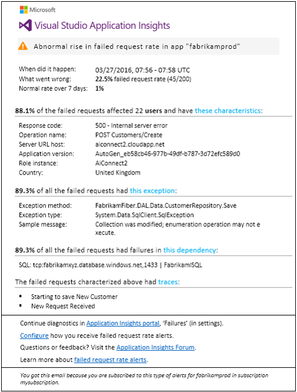
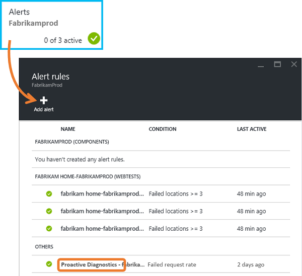
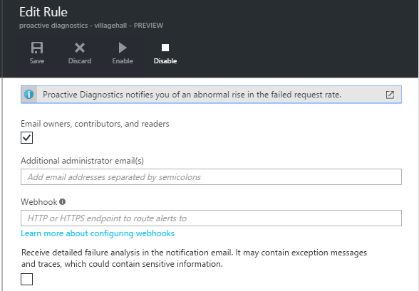
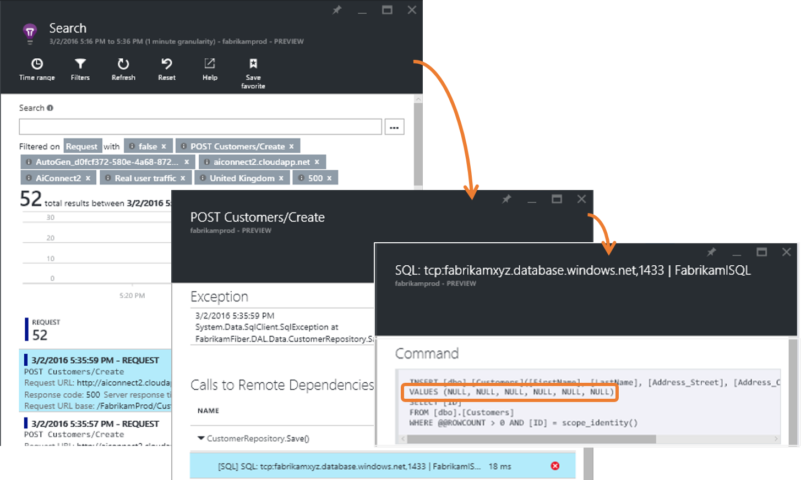
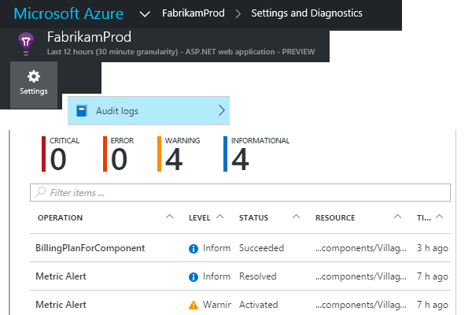
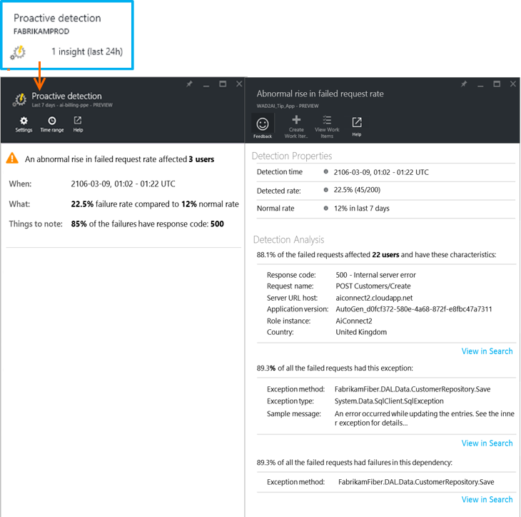

<properties 
    pageTitle="Proaktive Fehler Zins Diagnose in Anwendung Einsichten | Microsoft Azure" 
    description="Benachrichtigt Sie ungewöhnliche Änderungen in Rate der fehlgeschlagene Anfragen zu Ihrem Web app und stellt diagnostic Analyse. Es ist keine Konfiguration erforderlich." 
    services="application-insights" 
    documentationCenter=""
    authors="yorac" 
    manager="douge"/>

<tags 
    ms.service="application-insights" 
    ms.workload="tbd" 
    ms.tgt_pltfrm="ibiza" 
    ms.devlang="na" 
    ms.topic="article" 
    ms.date="10/12/2016" 
    ms.author="awills"/>
 
# Proaktive Fehler Zins Diagnose

[Visual Studio-Anwendung Einsichten](app-insights-overview.md) benachrichtigt automatisch Sie nahezu in Echtzeit Wenn Web app eine ungewöhnliche zunehmenden die Rate der Fehler auftritt. Das Programm erkennt eine ungewöhnliche zunehmenden Rate der HTTP-Anfragen als ausgefallen. Diese sind in der Regel mit Antwortcodes in 400 und 500-Bereiche. Damit Sie Sichten und das Problem diagnostizieren, wird eine Analyse der Merkmale der Fehler beim Besprechungsanfragen und verwandte werden in der Benachrichtigung bereitgestellt. Es gibt auch Links zu der Anwendung Einsichten Portal für die weitere Diagnose. Das Feature benötigt keine ansetzen oder -Konfiguration, wie der Computer Learning Algorithmen verwendet, um die normalen Fehlerrate Vorhersagen.

Dieses Feature ist für Java und ASP.NET Web-apps, die in der Cloud oder auf Ihren eigenen Servern gehostet verfügbar. Funktioniert auch für eine beliebige app, die Anforderung werden generiert – beispielsweise, wenn Sie eine Worker-Rolle haben Anrufe, die [TrackRequest()](app-insights-api-custom-events-metrics.md#track-request). 

Nach [Anwendung Einsichten für ein Projekt](app-insights-overview.md)einrichten und zur Verfügung gestellt, Ihre app generiert eine bestimmte minimale Menge an telemetrieprotokoll, proaktiven Fehler bei der Diagnose dauert 24 Stunden erfahren Sie, das normale Verhalten der app, bevor er eingeschaltet ist und kann die Benachrichtigungen senden.

Hier ist eine Beispiel für Benachrichtigung aus. 

> [AZURE.NOTE] Standardmäßig erhalten Sie eine kürzere Format e-Mail als in diesem Beispiel wird ein. [Wechseln Sie zu diesem detaillierte Format](#configure-alerts)können jedoch.

Beachten Sie, dass es die Meldung angezeigt wird:

* Fehler bei der Anzahl, die im Vergleich zum normalen app Verhalten.
* Wie viele Benutzer betroffen sind –, damit Sie wie viel wissen um zu sorgen.
* Eine Eigenschaft Muster der Fehlern zugeordnet. In diesem Beispiel ist es bestimmte Antwortcode, Anforderung Name (Vorgang) und app-Version. Die erfahren sofort Sie, wo Sie beginnen, suchen Sie in Ihrem Code. In anderer Weise könnte ein bestimmtes Betriebssystem Browser oder einem Client.
* Die Ausnahme, Log Spuren und Abhängigkeit Ausfall (Datenbanken oder andere externen Komponenten), die angezeigt werden, die bekannte fehlgeschlagenen Anfragen zugeordnet werden soll.
* Enthält Links zu relevante Suchergebnisse auf die werden in der Anwendung Einsichten direkt.

## Vorteile der proaktive Benachrichtigungen

Einfache [metrischen Benachrichtigungen](app-insights-alerts.md) informieren Sie, dass es möglicherweise ein Problem aufgetreten. Aber proaktiven Fehler bei der Diagnose startet den Diagnoseprotokollen Arbeitsaufwand, Durchführung zahlreiche die Analyse, dass Sie andernfalls hätten selbst auszuführen. Sie erhalten die Ergebnisse übersichtlich verpackt, hilft Ihnen, die die Ursache des Problems schnell.

## So funktioniert es

In der Nähe Echtzeit proaktive Diagnose Monitore Rate der empfangenen der werden aus der app, insbesondere die fehlgeschlagene Abfrage. Diese Metrik ermittelt die Anzahl von Besprechungsanfragen für die der `Successful request` Eigenschaft ist falsch. Standardmäßig `Successful request== (resultCode < 400)` (es sei denn, Sie [Filtern](app-insights-api-filtering-sampling.md#filtering) benutzerdefinierten Code geschrieben haben oder eigene Anrufe [TrackRequest](app-insights-api-custom-events-metrics.md#track-request) generieren). 

Die Leistung Ihrer Anwendung verfügt über eine typische Muster des Verhaltens. Einige Anfragen werden Ihre Fehler als andere; und die allgemeine Fehlerrate kann zunehmender Auslastung steigen. Proaktive Fehler bei der Diagnose verwendet Computer lernen, wie Sie finden diese Bildschirmdarstellung auftreten. 

Wie werden Anwendung Einsichten aus der Web-app-Zeile vergleicht proaktiven Fehler bei der Diagnose das aktuelle Verhalten mit Mustern über den letzten Tagen angezeigt. Wenn eine zunehmenden Fehler Zins im Vergleich zu vorherigen Leistung berechneter ist, wird eine Analyse ausgelöst.

Wenn eine Analyse ausgelöst wird, führt der Dienst eine Cluster Analyse auf die fehlgeschlagene Anforderung, versuchen, ein Muster von Werten zu identifizieren, die der Fehler zu kennzeichnen. Im obigen Beispiel wurde die Analyse entdeckt, sind von den meisten Fehlern zu einer bestimmten Ergebniscode, Anforderung Name Server-URL Host und Instanz der Rolle. Hingegen hat die Analyse festgestellt, dass die Client-Betriebssystem-Eigenschaft über mehrere Werte wird und daher ist es nicht aufgeführt.

Wenn es sich bei Ihrem Dienst mit diesen werden instrumentiert wird, findet der Analysator eine Ausnahme und Abhängigkeit Fehler, die im Cluster Anfragen zugeordnet sind, die sie identifiziert hat, die zusammen mit Beispiel für alle Überwachungsprotokolle diese Anfragen zugeordnet.

Die resultierende Analyse wird als Benachrichtigung an Sie gesendet, es sei denn, Sie zu nicht konfiguriert haben.

Wie die [Benachrichtigungen, die Sie manuell festlegen](app-insights-alerts.md)können Sie prüfen den Status der Warnung und konfigurieren Sie ihn in Ihrer Anwendung Einsichten Ressource Falz Benachrichtigungen. Aber im Gegensatz zu anderen Benachrichtigungen, müssen Sie nicht eingerichtet oder proaktiven Fehler bei der Diagnose konfigurieren. Wenn Sie möchten, können Sie ihn deaktivieren oder seine Ziel-e-Mail-Adressen ändern.

## Konfigurieren von Benachrichtigungen 

Sie können proaktive Diagnose deaktivieren, ändern die e-Mail-Empfänger, erstellen eine Webhook oder entscheiden Sie sich für ausführlichere Warnhinweise.

Öffnen Sie die Seite Benachrichtigungen. Proaktive Diagnose ist enthalten, sowie alle Benachrichtigungen, die Sie manuell festgelegt haben, und Sie können sehen, ob die Benachrichtigung Zustand gerade bearbeitet wird.

Klicken Sie auf die Benachrichtigung, um ihn zu konfigurieren.

Beachten Sie, dass Sie können proaktive Diagnose deaktivieren, aber nicht löschen (oder erstellen Sie ein neues).

#### Ausführliche Benachrichtigungen

Bei Auswahl von "Erhalten detaillierte Analyse" enthält die e-Mail weitere Diagnoseinformationen zu erhalten. Manchmal werden Sie das Problem nur aus den Daten in der e-Mail diagnostizieren wäre. 

Geringe Risiko, dass die ausführlichere Benachrichtigung vertrauliche Informationen enthalten könnte denn es Ausnahme und Spur Nachrichten enthält. Dies würde jedoch nur geschehen, wenn Code vertraulichen Informationen in diesen Nachrichten erlangen könnte. 

## Selektierung und Diagnosezwecken einer Benachrichtigung

Eine Warnung weist darauf hin, dass ein zunehmenden die fehlgeschlagene Anforderungsrate erkannt wurde. Ist zu rechnen, es einige Probleme mit der app oder seine Umgebung gibt.

Aus dem Prozentsatz der Besprechungsanfragen und die Anzahl der betroffenen Benutzer können Sie entscheiden, wie dringende das Problem wird. Im Beispiel oben der Fehler Zinsfuß 22,5 % im Vergleich zu einer normalen Geschwindigkeit von 1 %, gibt an, dass ein Fehler vor sich geht. Andererseits, wurden nur 11 Benutzer betroffen. Wenn sie Ihre app wurden, möchten Sie möglicherweise bewerten wie ernst ist.

In vielen Fällen werden Sie kann zur diagnose des Problems schnell über die Anforderung Name, Ausnahme, Abhängigkeit Fehler und Spur Daten zur Verfügung gestellt. 

Es gibt einige andere Hinweise, beispielsweise ein. Die Abhängigkeit Fehlerrate in diesem Beispiel beträgt beispielsweise identisch mit der Ausnahme Zins (89.3 %). Dies zeigt, dass die Ausnahme direkt aus der Abhängigkeit Fehler – gibt Ihnen eine klare Vorstellung davon, wo Sie beginnen, suchen Sie in Ihrem Code entsteht.

Weitere aus, um die Links in jedem Bereich direkt auf einer [Suchergebnisseite](app-insights-diagnostic-search.md) gefiltert, dass die relevanten Besprechungsanfragen, Ausnahme, Abhängigkeit oder der Spuren gelangen Sie. Oder Sie können das [Azure-Portal](https://portal.azure.com), navigieren Sie zu der Anwendung Einsichten Ressource für Ihre app, und öffnen das Blade Fehlern.

In diesem Beispiel auf den Link zum Anzeigen von Informationen zur Abhängigkeit von Fehlern wird geöffnet, Anwendung Einsichten Suche Blade auf die SQL-Anweisung die Ursache: NULL, wobei am Pflichtfelder bereitgestellt und Überprüfung während des Speicherns nicht bestanden Vorgang.

## Überprüfen Sie die zuletzt verwendete Benachrichtigungen

Öffnen Sie zum Überprüfen von Benachrichtigungen im Portal **Überwachungsprotokolle Einstellungen**aus.

Klicken Sie auf eine beliebige Benachrichtigung, um die vollständigen Details zu sehen.

Oder klicken Sie auf **proaktive Erkennung** zu begradigen auf die letzte Warnung:

## Was ist der Unterschied...

Proaktive Fehler Zins Diagnose ergänzen andere ähnliche aber unterschiedlichen Merkmalen der Anwendung Einsichten. 

* [Metrisch Benachrichtigungen](app-insights-alerts.md) , die von Ihnen festgelegt werden und eine Vielzahl von Kennzahlen wie CPU-Belegung, Anforderung Sätzen, Seitenladezeiten und usw. zu überwachen. Sie können diese, beispielsweise eine Warnung aus, wenn Sie weitere Ressourcen hinzufügen müssen. Proaktive Fehler bei der Diagnose hervorgehen hingegen eine kleine Palette kritische Kriterien (aktuell nur fehlgeschlagene Anforderungsrate), entwickelt darüber informiert, dass Sie in Echtzeit gegenseitig, sobald der Web-app konnte nicht in der Nähe anfordern, dass Zins tragen erheblich Web-app normalen Verhalten verglichen.

    Proaktive Fehler Zins Diagnose passt automatisch den Schwellenwert Reaktion auf geltenden Bedingungen an.

    Proaktive Fehler Zins Diagnose starten der Diagnose Arbeitsaufwand. 
* [Proaktive Performance Diagnose](app-insights-proactive-performance-diagnostics.md) wird auch Computer Intelligence verwendet, um ungewöhnliche Muster in metrischen ermitteln und ist keine Konfiguration von Ihnen erforderlich. Aber im Gegensatz zu Rate Diagnose proaktiven Fehler, ist der Zweck des proaktive Performance Diagnose um Segmente des Ihrer Verwendung vielfach-, die möglicherweise falsch bereitgestellt werden – beispielsweise, um bestimmte Seiten zu finden, auf einen bestimmten Typ von Browser. Die Analyse täglich ausgeführt wird, und falls alle Ergebnis gefunden wird, ist es wahrscheinlich, viel kleiner als eine Warnung dringende sein. Im Gegensatz dazu die Analyse für proaktive Fehler bei der Diagnose auf eingehende werden kontinuierlich ausgeführt wird, und Sie innerhalb von Minuten benachrichtigt, wenn der Server Fehler Sätzen größer ist als erwartet werden.

## Wenn Sie eine proaktive Fehler Zins Diagnose Benachrichtigung erhalten

*Warum haben ich diese Benachrichtigung erhalten?*

*   Wir festgestellt eine ungewöhnliche zunehmenden fehlgeschlagene Anfragen Zins im Vergleich zu den normalen Basisplan des vorherigen Zeitraums. Nach der Analyse der Fehler und verknüpft werden glauben wir, dass ein Problem, das Sie in achten sollten. 

*Bedeutet die Benachrichtigung, dass ich auf jeden Fall ein Problem?*

*   Wir versuchen, auf app Unterbrechung oder Verschlechterung, benachrichtigen, obwohl nur Sie die Semantik und den Einfluss auf die app oder Benutzer nachvollziehen können.

*Ja, suchen doch Meine Daten?*

*   Nein. Der Dienst ist vollständig automatische. Nur erhalten Sie die Benachrichtigungen aus. Ihre Daten sind [als "Privat"](app-insights-data-retention-privacy.md).

*Habe ich diese Benachrichtigung abonnieren?* 

*   Nein. Jeder Anwendung sendende Anforderung werden weist diese Regel benachrichtigen.

*Kann ich Kündigen des Abonnements oder erhalten die Benachrichtigungen gesendet werden Meine Kollegen stattdessen?*

*   Ja, In Warnungsregeln, klicken Sie auf proaktive Diagnose Regel konfigurieren. Sie können die Benachrichtigung deaktivieren oder ändern die Empfänger für die Benachrichtigung. 

*Ich verloren gegangen sind die e-Mail aus. Wo finde ich die Benachrichtigungen im Portal?*

*   In den Überwachungsprotokollen. Klicken Sie auf Einstellungen Überwachungsprotokolle, und klicken Sie dann eine benachrichtigen, um deren vorkommen, finden Sie unter jedoch mit eingeschränkter Detailansicht.

*Von der Benachrichtigungen einige der bekannten Probleme und ich nicht sie erhalten möchten.*

*   Wir haben unsere Rückstand benachrichtigen unterdrücken.

## Nächste Schritte

Folgenden Diagnosetools Ihnen helfen den werden aus der app zu prüfen:

* [Metrische explorer](app-insights-metrics-explorer.md)
* [Search-explorer](app-insights-diagnostic-search.md)
* [Analytics - Abfragesprache leistungsfähige](app-insights-analytics-tour.md)

Proaktive Erkennung sind vollständig automatische. Aber vielleicht möchten Sie einige weitere Benachrichtigungen einrichten?

* [Manuell konfigurierten metrischen Benachrichtigungen](app-insights-alerts.md)
* [Verfügbarkeit von Webtests](app-insights-monitor-web-app-availability.md) 

