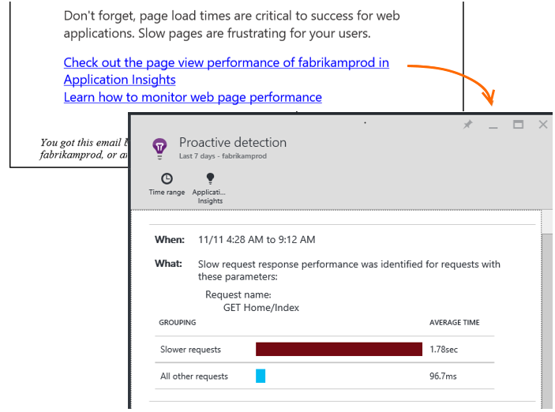

<properties 
    pageTitle="Anwendung Einsichten: Proaktive Performance Diagnose | Microsoft Azure" 
    description="Anwendung Einsichten führt Tiefe Analyse für Ihre app werden und gewarnt potenzieller Probleme." 
    services="application-insights" 
    documentationCenter="windows"
    authors="antonfrMSFT" 
    manager="douge"/>

<tags 
    ms.service="application-insights" 
    ms.workload="tbd" 
    ms.tgt_pltfrm="ibiza" 
    ms.devlang="na" 
    ms.topic="article" 
    ms.date="08/31/2016" 
    ms.author="awills"/>

#  Proaktive Performance-Diagnose

*Anwendung Einsichten ist in der Vorschau.*

[Visual Studio-Anwendung Einsichten](app-insights-overview.md) führt Tiefe Analyse für Ihre app werden, und können Sie über potenzielle Leistungsprobleme warnen. Sie sind dies wahrscheinlich lesen, da Sie eine der unsere proaktiven Benachrichtigungen per e-Mail erhalten haben. 

Dieses Feature nicht eingerichtet werden muss, und ist automatisch aktiviert, wenn Ihre app genügend werden generiert.

## Was sind proaktive Performance Diagnose?

Proaktive Performance Diagnose erkennt ungewöhnliche Muster der Leistung in Ihrer app, durch die Analyse der werden, die Ihre app zu Anwendung Einsichten sendet. 

Insbesondere findet es Leistungsprobleme, die wirken sich nur auf bestimmte Benutzer oder wirken sich nur auf Benutzer in einigen Fällen.

Beispielsweise können sie Sie benachrichtigen, wenn Ihre app-Seiten sehr viel langsamer auf einem Typ des Browsers als andere laden oder Besprechungsanfragen von einer bestimmten Server langsamer bereitgestellt werden. Sie können auch Problemen im Zusammenhang mit Kombinationen der Eigenschaften ermitteln, wie langsam Seite in einem geografischen Bereich zu bestimmten Zeiten des Tages geladen.

Bildschirmdarstellung auftreten, wie diese sind sehr schwer zu erkennen, wenn die Daten zu prüfen, jedoch häufiger als Sie vielleicht denken. Diese surface häufig nur, wenn Ihre Kunden melden. Durch die Uhrzeit, zu spät ist: die betroffenen Benutzer sind bereits umsteigen, auf Ihrer Mitbewerber!

Unsere Algorithmen prüfen derzeit Seitenladezeiten, Anforderung Reaktionszeiten auf dem Server und Abhängigkeit Reaktionszeiten.  

Sie müssen keine Schwellenwerte festlegen oder Konfigurieren von Regeln. Computer lernen und Dataminingalgorithmen werden verwendet, um ungewöhnliche Muster zu erkennen. 

Wir haben, dass Ihr Feedback sehr möchten sofort richtig loslegen können. Bitte lassen Sie uns wissen Sie, wie Sie Ihnen, wie proaktive Erkennung verbessert werden kann und welche weiteren Funktionen uns hinzufügen möchten. Sie können Feedback durch Senden eines Lächeln/Stirnrunzeln im Portal oder eine e-Mail zu AppInsightsML@microsoft.com. 

## Über die proaktive Benachrichtigung

* *Warum haben ich diese e-Mail erhalten?*
 * Proaktive Erkennung analysiert die telemetrieprotokoll, die Ihrer Anwendung an Anwendung Einsichten gesendet und ein Leistungsproblem in Ihrer Anwendung erkannt. 
* *Bedeutet die Benachrichtigung, dass ich auf jeden Fall ein Problem?*
 * Nein. Es ist einfach ein Vorschlag zu einem eng eigenständig mehr anzeigen möchten. 
* *Was tun kann ich?*
 * [Schauen Sie sich die Daten dargestellt](#responding-to-an-alert). Überprüfen Sie die Leistung über einen Zeitraum und einen Drilldown ausführen, um zusätzliche Statistiken mithilfe Kennzahlen-Explorer. Verwenden der Suchfunktion bestimmte Ereignisse herausfiltern, mit denen Sie ermitteln die Ursache. 
* *Ja, suchen doch Meine Daten?*
 * Nein. Der Dienst ist vollständig automatische. Nur erhalten Sie die Benachrichtigungen aus. Ihre Daten sind [als "Privat"](app-insights-data-retention-privacy.md).

## Der Erkennungsvorgang

* *Welche Arten von Leistung Bildschirmdarstellung auftreten erkannt werden?*
 * Muster, die es sie prüfen zeitaufwändiger für sich selbst zu finden ist. Beispielsweise beeinträchtigt Leistung in einer bestimmten Kombination von Ort, Uhrzeit und Plattform.
* *Analysieren Sie alle von Anwendung Einsichten gesammelten Daten?*
 * Nicht bei präsentieren. Aktuell, analysieren wir die Anforderung, dass die Antwortzeit, Abhängigkeit Antwortzeit und Seite Zeit zu laden. Analyse der zusätzliche Statistiken wird in Kürze zur Verfügung. 
* *Kann ich meinen eigenen Anomalie Erkennung Regeln erstellen?*
 * Noch nicht. Aber Sie können:
 * [Einrichten von Benachrichtigungen](app-insights-alerts.md) , die Sie feststellen, wann eine Metrik einen Schwellenwert überschreitet.)
 * [Exportieren von werden](app-insights-export-telemetry.md) in einer [Datenbank](app-insights-code-sample-export-sql-stream-analytics.md) [auf PowerBI](app-insights-export-power-bi.md) oder [andere](app-insights-code-sample-export-telemetry-sql-database.md) Tools, wo Sie sie selbst analysieren können.
* *Wie oft wird die Analyse ausgeführt?*
 * Wir führen Sie die Analyse täglich auf die werden aus den vorherigen Tag.
* * Daher ersetzt diese [metrischen Benachrichtigungen](app-insights-alerts.md)?
 * Nein.  Wir abzuschließen nicht, um jede Verhalten erkennen, die möglicherweise berücksichtigt.

## Zum Untersuchen der ausgelösten Probleme

Öffnen Sie die im Diagnosebericht aus der e-Mail oder in der Liste Bildschirmdarstellung auftreten.

* **Wird die Zeit, die das Problem erkannt wurde.**
* Beschreibt, **welche**
 * Das Problem, das erkannt wurde;
 * Die Eigenschaften von dem Satz von Ereignissen, die wir gefunden angezeigt, das Problem Verhalten.
* Die Tabelle vergleicht, mit dem Mittelwert Verhalten für alle anderen Ereignisse schlechter festlegen.

Klicken Sie auf die Links, um Metrisch-Explorer, und suchen Sie auf die relevanten Berichten, gefiltert nach Datum und Eigenschaften des langsam leistungsfähigeren festlegen zu öffnen.

Ändern der Zeitraums und Filter zum Erforschen der werden.

## Wie kann ich die Leistung verbessern?

Langsam und Fehler beim Antworten gehören zu den wichtigsten Frustrations für Websitebenutzer, wie Sie aus Ihrer eigenen Erfahrung wissen. Daher ist es wichtig, um die Probleme.

### Auswahl beschränkt

Zunächst ist es wichtig? Wenn eine Seite ist immer langsam geladen, aber nur 1 % der Benutzer der Website jemals ansehen müssen, müssen Sie möglicherweise weitere wichtige anzustellen. Andererseits, wenn nur 1 % der Benutzer öffnen, aber es Ausnahmen jedes Mal löst, die im Wert Untersuchung läuft möglicherweise.

Verwenden Sie die Auswirkungen-Anweisung in der e-Mail als einem allgemeinen Leitfaden, aber Achten Sie darauf, dass der gesamte Textabschnitt nicht gefunden. Sammeln Sie andere beweisen, um zu bestätigen.

Erwägen Sie die Parameter des Problems. Wenn es Geography abhängt, [Verfügbarkeit Tests](app-insights-monitor-web-app-availability.md) einschließlich dieser Region einrichten: es einfach möglicherweise Netzwerkproblemen in diesem Bereich. 

### Diagnostizieren von langsam Seite geladen 

Wo befindet sich das Problem? Langsamer der Server reagieren, wird die Seite möglicherweise erst nach langer oder müssen im Browser viel Arbeit, um ihn anzuzeigen?

Öffnen Sie das Browser metrische Blade. [Segmentierter Browser Seite laden Zeitraum](app-insights-javascript.md#explore-your-data) angezeigt, in dem die Zeit aufgewendet wird. 

* Wenn **Senden Anforderungszeit** hoch ist, der Server reagiert langsam, oder die Anforderung wurde nach für eine große Datenmenge. Schauen Sie sich die [Leistungswerte](app-insights-web-monitor-performance.md#metrics) Reaktionszeiten untersuchen. 
* Einrichten von [Abhängigkeit nachverfolgen](app-insights-dependencies.md) , ob die langsame aufgrund von externen Diensten oder Ihrer Datenbank vorhanden sind.
* Wenn die **Antwort empfangen** überwiegend ist, sind Ihre Seite und deren abhängigen Parts - JavaScript, CSS, Bilder usw. (aber nicht asynchrone geladen Daten) lang. Richten Sie einer [Verfügbarkeit testen ein](app-insights-monitor-web-app-availability.md), und achten Sie darauf, dass Sie die Option zum Laden abhängige Teile festlegen. Wenn Sie einige Ergebnisse zu erhalten, öffnen Sie die Details des Ergebnisses eines und erweitern Sie darauf, um die Zeiten Laden von anderen Dateien anzuzeigen.
* Hohe **Verarbeitungszeit der Client** schlägt Skripts langsam ausgeführt werden. Wenn der Grund nicht offensichtlich ist, ist es sinnvoll entsprechendem Code, der Anzeigedauer und senden die Zeiten in TrackMetric aufrufen.

### Verbessern der Langsame Seiten

Ist eine Web voller Hinweise zur Verbesserung der Serverantworten und Seitenladezeiten, damit wir nicht mehr sie alle hier nicht wiederholt versucht. Hier sind einige Tipps, denen Sie wahrscheinlich bereits kennen, um einfach zu gelangen Sie zum Nachdenken:

* Langsam geladen, da große Dateien: Laden Sie die Skripts und andere Teile asynchrone. Verwenden Sie das Skript bündeln. Unterbrechen der Hauptseite in Widgets, die ihre Daten getrennt zu laden. Senden Sie keine einfarbigen alten HTML-Code für bei langen Tabellen: verwenden ein Skript, um die Daten als JSON oder einem anderen Format compact anfordern, und füllen Sie die Tabelle erstellt haben. Es gibt gute Framework mit all dies helfen. (Diese nach sich ziehen auch große Skripts, natürlich.)
* Verlangsamen Server Abhängigkeiten: erwägen Sie die geografischen Standorten Ihrer Komponenten. Wenn Sie Azure verwenden, stellen Sie beispielsweise sicher, dass die Webserver und die Datenbank in der gleichen Region sind. Führen Sie Abfragen abrufen als benötigten Informationen? Möchten Sie Zwischenspeichern oder Batchverarbeitung Hilfe?
* Kapazität Probleme: Prüfen Sie die Server-Metrik der Reaktionszeiten und Anforderung zählt. Wenn Reaktionszeiten unproportional mit Spitzen in Anforderung zählt maximale, ist es wahrscheinlich, dass Ihre Server gestreckt werden. 

## Benachrichtigung sendet per e-Mail

* *Muss ich mich für diesen Dienst abonnieren, um Benachrichtigungen zu erhalten?*
 * Nein. Unsere Bot regelmäßig die Daten aus allen Benutzern der Anwendung Einsichten Umfragen und sendet Benachrichtigungen, wenn es Probleme erkennt.
* *Kann ich Kündigen des Abonnements oder erhalten die Benachrichtigungen gesendet werden Meine Kollegen stattdessen?*
 * Klicken Sie auf in der Benachrichtigung oder e-Mail-Link zum Abmelden. 
 
    Sie sind derzeit auf, die gesendet [Schreibzugriff auf die Ressource Anwendung Einsichten](app-insights-resources-roles-access-control.md)Berechtigung.

    Sie können auch die Liste der Empfänger Einstellungen in das proaktive Erkennung Blade bearbeiten.
* *Ich möchte nicht mit den folgenden Nachrichten überlastet zu werden.*
 * Sie sind auf eine pro Tag mit der relevantesten Problem, dem wir noch über gemeldet noch nicht beschränkt. Sie wird nicht wiederholt eine Nachricht erhalten.
* *Wenn ich nichts tun, erhalte ich eine Erinnerung?*
 * Nein, erhalten Sie eine Meldung zu den einzelnen Problemen nur einmal. 
* *Ich verloren gegangen sind die e-Mail aus. Wo finde ich die Benachrichtigungen im Portal?*
 * Klicken Sie in der Anwendung Einsichten Übersicht der app auf die Kachel **Proaktive Erkennung** . Es werden Sie alle Benachrichtigungen nach oben in den Hintergrund sieben Tage finden können.

## Nächste Schritte

Folgenden Diagnosetools Ihnen helfen den werden aus der app zu prüfen:

* [Metrische explorer](app-insights-metrics-explorer.md)
* [Search-explorer](app-insights-diagnostic-search.md)
* [Analytics - Abfragesprache leistungsfähige](app-insights-analytics-tour.md)

Proaktive Erkennung sind vollständig automatische. Aber vielleicht möchten Sie einige weitere Benachrichtigungen einrichten?

* [Manuell konfigurierten metrischen Benachrichtigungen](app-insights-alerts.md)
* [Verfügbarkeit von Webtests](app-insights-monitor-web-app-availability.md) 

