<properties
    pageTitle="Versionsinformationen für Visual Studio-Erweiterung für Entwickler Analytics"
    description="Die neuesten Updates für Visual Studio-Tools für Entwickler Analytics."
    services="application-insights"
    documentationCenter=""
    authors="acearun"
    manager="douge"/>
<tags
    ms.service="application-insights"
    ms.workload="tbd"
    ms.tgt_pltfrm="ibiza"
    ms.devlang="na"
    ms.topic="article"
    ms.date="06/09/2016"
    ms.author="acearun"/>

# Versionsinformationen für Analytics Entwicklertools
Was ist neu: Anwendung Einsichten und HockeyApp Analytics in Visual Studio.
## Version 7.0
### Visual Studio-Anwendung Einsichten Trends
Visual Studio-Anwendung Einsichten ist ein neues Tool in Visual Studio, die Sie verwenden können, mit deren Hilfe Sie die Funktionsweise der app über einen Zeitraum zu analysieren. Wählen Sie, die **Anwendung Einsichten** Symbolleisten-Schaltfläche oder in der Anwendung Einsichten Suchfenster ersten **Werden Trends untersuchen**aus. Oder, im Menü **Ansicht** auf **Andere Fenster**und klicken Sie dann auf **Anwendung Einsichten Trends**. Wählen Sie eine der fünf allgemeine Abfragen Schritte aus. Sie können verschiedene Datensätze basierend auf werden Typen, Zeiträume und andere Eigenschaften analysieren. Um Bildschirmdarstellung auftreten in Ihren Daten zu finden, wählen Sie eine der Optionen Anomalie in der Dropdownliste **Typ anzeigen** aus. Die Filteroptionen am unteren Rand des Fensters erleichtern eine bestimmte Teilmenge der werden weiter.

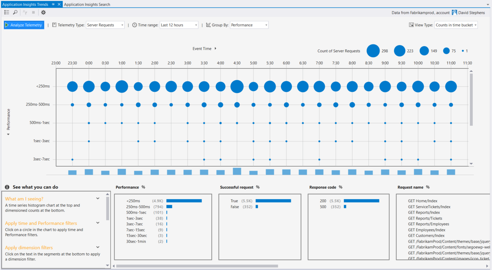

### Ausnahmen in CodeLens
Ausnahme werden wird nun in CodeLens angezeigt. Wenn Sie Ihr Projekt in der Anwendung Einsichten Service verbunden haben, sehen Sie die Anzahl der Ausnahmen, die in jeder Methode produziert in den letzten 24 Stunden aufgetreten sind. Sie können von CodeLens suchen oder Trends untersuchen die Ausnahmen ausführlicher wechseln.

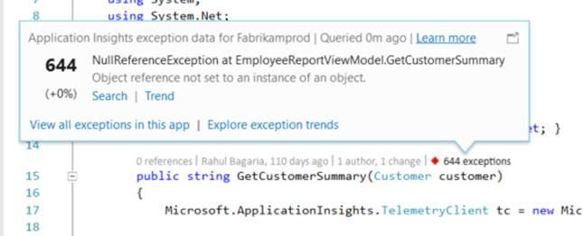

### ASP.NET Core-support
Anwendung Einsichten und unterstützt jetzt ASP.NET Core RC2 Projekte in Visual Studio aus. Wählen Sie im Dialogfeld **Neues Projekt** wie in den folgenden Screenshot können Sie neue ASP.NET Core RC2 Projekte Anwendung Einsichten hinzufügen. Alternativ können Sie Lizenz zu einem vorhandenen Projekt, mit der rechten Maustaste im Projekts im Solution Explorer und klicken Sie dann auf **Hinzufügen Anwendung Einsichten werden**.

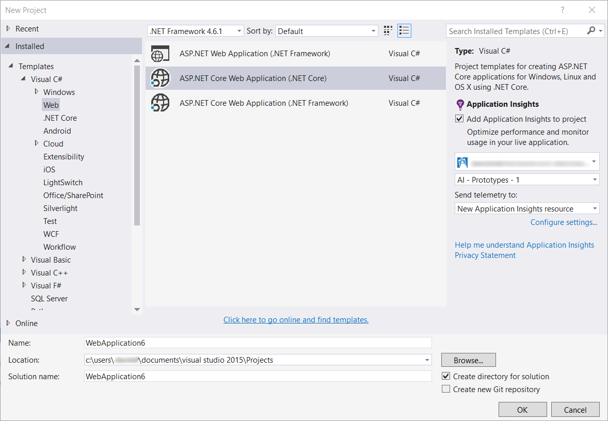

ASP.NET 5 RC1 und ASP.NET Core RC2 Projekten auch haben neue Unterstützung im Fenster Diagnosetools. Sehen Sie Anwendung Einsichten Ereignisse wie Besprechungsanfragen und Ausnahmen aus der app ASP.NET gedrückt, während Sie lokal auf Ihrem PC Debuggen. Jedes Ereignis klicken Sie auf **Suchen** , Drilldown für Weitere Informationen.

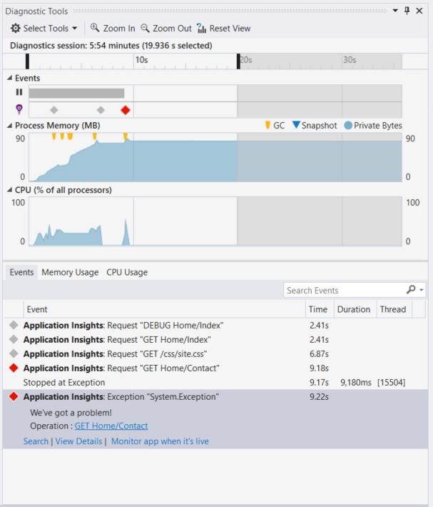

### HockeyApp für Universal Windows-apps
Zusätzlich zur Beta-Verteilung zurück und Benutzer Feedback bietet HockeyApp symbolicated Absturz reporting für Ihre Universal Windows-apps. Wir haben Feinabstimmung auch das HockeyApp SDK hinzufügen: mit der rechten Maustaste auf Ihr Projekt Universal Windows, und klicken Sie dann auf **"Hockey" App - abstürzen Analytics aktivieren**. Dies installiert das SDK, richtet Absturz Websitesammlung und Vorschriften, die eine Ressource HockeyApp in der Cloud, alle ohne Ihre app zum Dienst HockeyApp hochladen.

Anderen neuen Features:

* Wir haben die Anwendung Einsichten Suchfunktion schneller und mehr intuitive vorgenommen werden. Nun werden Zeiträume und Details Filter automatisch angewendet, wie Sie diese auszuwählen.
* Auch in der Anwendung Einsichten Suche besteht jetzt die Möglichkeit zu den Code direkt aus der Anforderung werden springen können.
* Wir haben die HockeyApp Anmeldeverhalten Verbesserungen vorgenommen.
* In Diagnosetools wird der Herstellung werden Informationen für Ausnahmen angezeigt.

## Version 5.2
Es tut mitteilen zu können die Einführung von HockeyApp-Szenarien in Visual Studio. Die erste Integration ist in Beta-Verteilung der Universal Windows-apps und Windows Forms-apps in Visual Studio.

Beta-Verteilung Laden Sie frühe Versionen von Ihrer apps in HockeyApp für die Verteilung an eine ausgewählte Untermenge von Kunden oder Tester hoch. Beta-Verteilung, kombiniert mit HockeyApp Absturz Sammlung und Benutzer Feedback Features kann Ihnen wichtige Informationen zu den Ihre app bevor Sie eine umfassende Veröffentlichung vornehmen. Diese Informationen zur Lösung von Problemen können mit der app, damit Sie vermeiden oder langfristig zu Problemen, wie z. B. niedrig app Bewertungen, Negative Bewertung usw. minimieren können.

Auschecken, wie einfach es ist hochladen erstellt für Beta-Verteilung von Visual Studio.
### Universal Windows-apps
Das Kontextmenü für einen Universal Windows-app Projektknoten enthält jetzt eine Option, um Ihre eigene in HockeyApp hochladen.

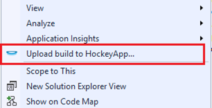

Wählen Sie das Element und den HockeyApp Upload-Dialogfeld wird geöffnet. Sie benötigen ein HockeyApp-Konto, um Ihre eigene hochladen. Wenn Sie ein neuer Benutzer sind, keine Sorge. Erstellen eines Kontos ist ein einfacher Vorgang.

Wenn Sie verbunden sind, wird das Formular Upload im Dialogfeld angezeigt.

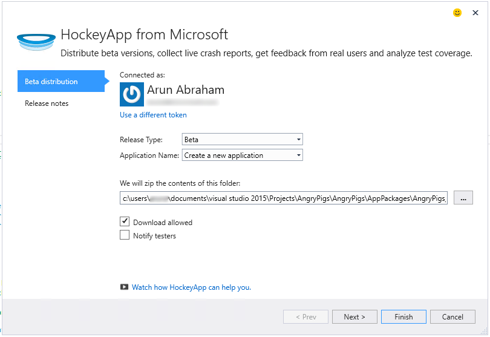

Wählen Sie den Inhalt hochladen (.appxbundle oder .appx-Datei), und wählen Sie dann im Assistenten Release-Optionen. Optional können Sie Versionsinformationen auf der nächsten Seite hinzufügen. Wählen Sie auf **Fertig stellen** , um den Upload zu beginnen.

Wenn der Upload abgeschlossen ist, wird eine Benachrichtigung HockeyApp mit Bestätigung und einen Link zur app im Portal HockeyApp angezeigt.

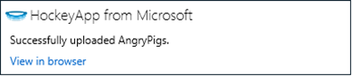

Das war's schon! Sie haben gerade einen Build für Beta-Verteilung mit nur wenigen Klicks hochgeladen werden.

Sie können Ihrer Anwendung auf verschiedene Arten im Portal HockeyApp verwalten. Dies umfasst einladen von Benutzern, Absturz Berichte anzeigen und details Feedback, ändern und so weiter.

Finden Sie ausführliche Informationen zu app-Verwaltung der [HockeyApp Knowledge Base](http://support.hockeyapp.net/kb/app-management-2) .

### Apps für Windows-Formularen
Das Kontextmenü für einen Windows-Formular Projektknoten enthält jetzt eine Option, um Ihre eigene in HockeyApp hochladen.

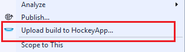

Daraufhin wird in eine Universal Windows-app einer ähnelt HockeyApp-Dialogfeld hochladen.

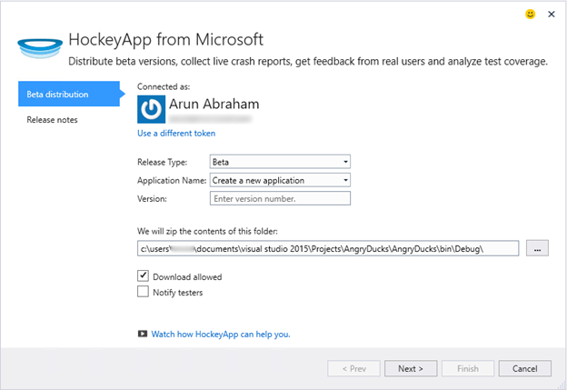

Beachten Sie ein neues Feld mit diesem Assistenten zum Angeben der Version der app aus. Für Universal Windows-apps wird die Informationen aus dem Manifest gefüllt. Windows-Formulare apps, keine Entsprechung für dieses Feature leider. Sie müssen sie manuell angegeben werden.

Die restlichen illustrieren ähnelt dem Universal Windows-apps: Wählen Sie erstellen und Freigeben von Optionen, fügen Sie Release Notizen hochladen und im Portal HockeyApp verwalten.

Es ist so einfach wie die. Probieren Sie es aus, und teilen Sie uns Ihre Meinung mitzuteilen.
## Version 4.3
### Suche werden aus lokalen Debuggen Sitzungen
In dieser Version können Sie jetzt nach Anwendung Einsichten werden in der Visual Studio-Sitzung Debuggen generiert suchen. Zuvor können Sie suchen, nur, wenn Sie Ihre app bei Anwendung Einsichten registriert. Jetzt muss Ihre app nur die Anwendung Einsichten SDK zum Suchen von lokalen werden installiert haben.

Wenn Sie eine ASP.NET-Anwendung mit der Anwendung Einsichten SDK haben, führen Sie die folgenden Schritte aus, um die Suche verwenden.

1. Debuggen der Anwendung.
2. Öffnen Sie Anwendung Einsichten Suchen in eine der folgenden Arten:
    - Klicken Sie auf **Weitere Fenster**im Menü **Ansicht** , und klicken Sie dann auf **Anwendung Einsichten suchen**.
    - Klicken Sie auf die **Anwendung Einsichten** Symbolleisten-Schaltfläche.
    - Im Explorer-Lösung erweitern Sie **ApplicationInsights.config**, und klicken Sie dann auf **Suche Debuggen Sitzung werden**.
3. Wenn Sie sich mit der Anwendung Einsichten angemeldet haben, wird das Suchfenster im Debuggen Sitzung werden-Modus öffnen.
4. Klicken Sie auf das Symbol **Suchen** , um Ihrem lokalen werden angezeigt.

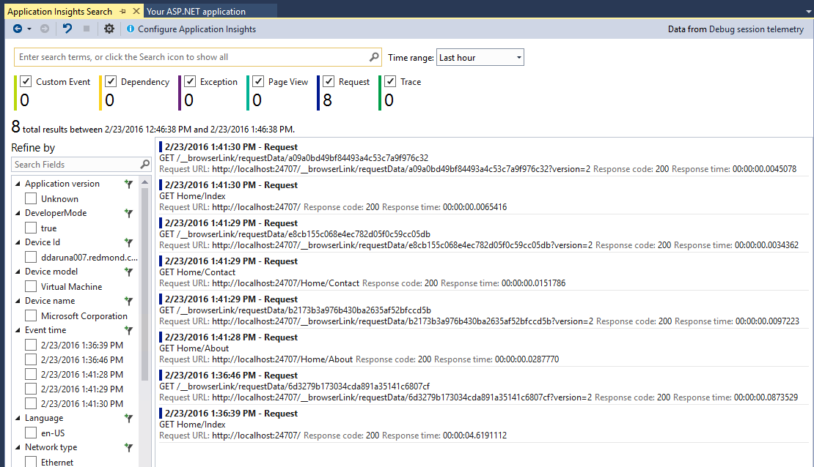

## Version 4.2
In dieser Version haben wir Features, um die Suche nach Daten einfacher im Kontext von Ereignissen, die Möglichkeit zur Code mehr Datenereignisse, und eine mühelos Erfahrung mit Ihrer Protokollierungsdaten an Anwendung Einsichten senden springt hinzugefügt. Diese Erweiterung wird monatlich aktualisiert. Wenn Sie Feedback oder Feature Anfragen haben, senden Sie ihn an aidevtools@microsoft.com.
### Protokollierung keine Klick-Benutzeroberfläche
Wenn Sie bereits NLog, log4net oder System.Diagnostics.Tracing verwenden, müssen Sie nicht kümmern, alle Ihre Spuren in Anwendung Einsichten zu verschieben. In dieser Version haben wir die Anwendung Einsichten Protokollierung Netzwerkadapter mit der normalen Konfiguration Erfahrung integriert.
Wenn Sie bereits eine der folgenden Protokollierung Framework konfiguriert haben, werden im folgende Abschnitt Bezugsarten aus.
**Wenn Sie die Anwendung Einsichten bereits hinzugefügt haben:**
1. Mit der rechten Maustaste in des Projektknoten, und klicken Sie dann auf **Anwendung Einsichten**und klicken Sie dann auf **Anwendung Einsichten konfigurieren**. Stellen Sie sicher, dass Sie die Option zum Hinzufügen der richtigen Netzwerkadapter im Konfigurationsfenster angezeigt.
2. Sie können auch wenn Sie die Lösung erstellen, beachten Sie im Popupmenü oben angezeigten Fenster rechts des Bildschirms, und klicken Sie auf **Konfigurieren**.

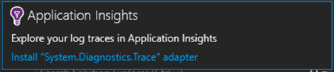

Wenn Sie den Protokollierung Netzwerkadapter installiert haben, führen Sie die Anwendung, und stellen Sie sicher, dass die Daten in der Registerkarte Diagnosetools wie folgt angezeigt:

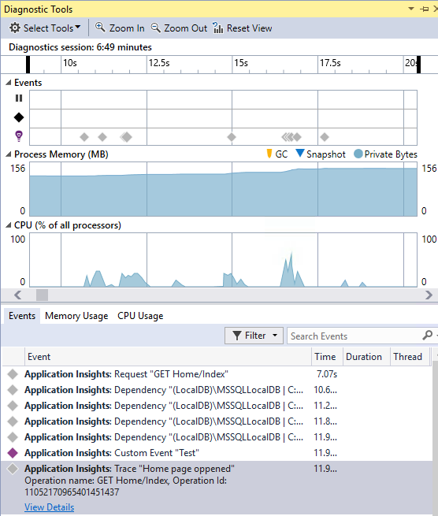

### Springen zu oder suchen Sie den Code auf die Stelle, an der die Ereigniseigenschaft werden ausgegeben wird
Für die neue Version Benutzer kann Klicken Sie auf einen beliebigen Wert im Detail, und Suchen nach einer übereinstimmenden Zeichenfolge in der aktuellen geöffneten Lösung. Ergebnisse angezeigt werden, in Visual Studio Liste "Suchergebnisse", wie unten dargestellt:

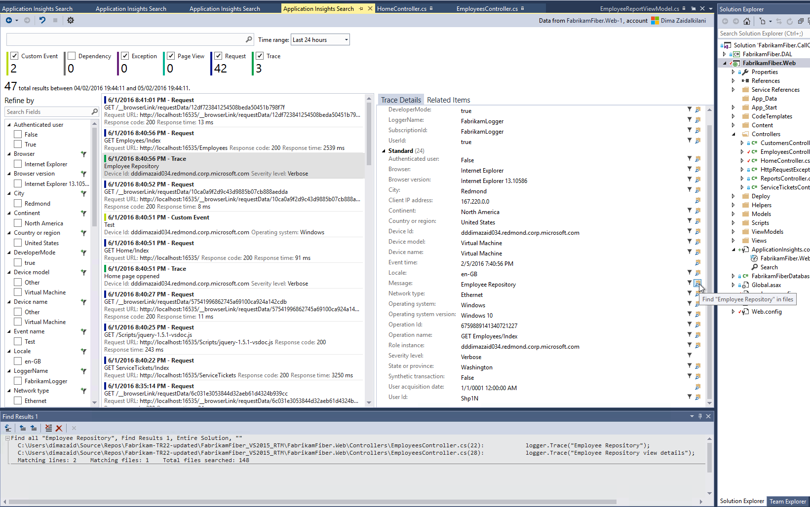

### Neues Suchfenster für, wenn Sie nicht angemeldet sind
Wir haben das Aussehen des Fensters Anwendung Einsichten suchen, mit deren Hilfe Sie Ihre Daten zu suchen, während die app produziert wird verbessert.

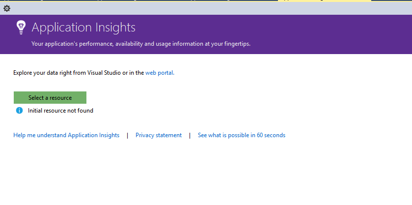

### Finden Sie unter alle werden Ereignisse im Zusammenhang mit der Veranstaltung
Wir haben eine neue Registerkarte mit vordefinierten Abfragen für alle Daten in Bezug auf das Ereignis werden, dass der Benutzer angezeigt wird, neben der Registerkarte für Ereignisdetails hinzugefügt. Angenommen, hat eine Anforderung ein Feld mit dem Namen des **Vorgangs-ID**an. Jeder Ereignis im Zusammenhang mit dieser Anforderung hat den gleichen Wert für **Vorgangs-ID**an. Wenn eine Ausnahme auftritt, während der Vorgang die Anforderung verarbeitet wird, erhält die Ausnahme dieselbe Operation ID wie die Anfrage nach zu erleichtern. Wenn Sie bei einer Anforderung gefunden haben, klicken Sie auf **alle werden für diesen Vorgang** , um eine neue Registerkarte öffnen, die die neuen Suchergebnissen angezeigt werden.

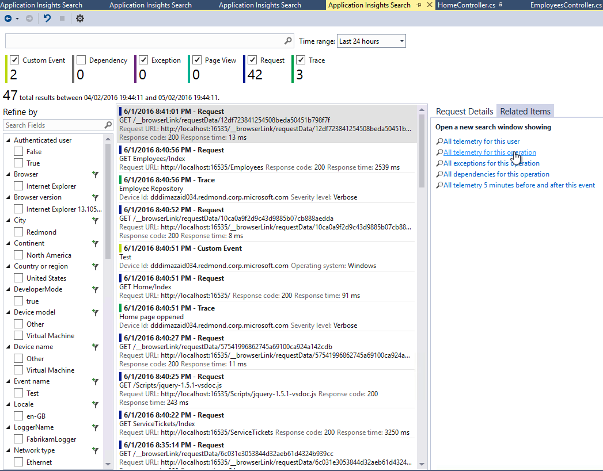

### Weiterleiten und Durchsuchen des Verlaufs zurück
Jetzt können Sie zwischen Suchergebnissen wechseln.

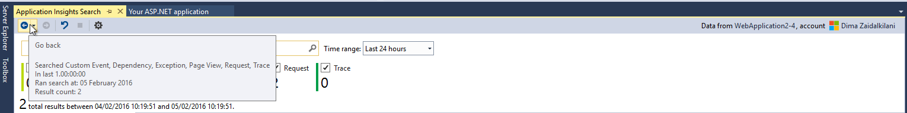

## Version 4.1
Diese Version enthält eine Reihe von neuen Features und Updates. Sie benötigen Update 1 installiert haben, um diese Version zu installieren.

### Springen von eine Ausnahme zu Methode im Quellcode
Jetzt, wenn Sie Ausnahmen aus der Herstellung-app in der Anwendung Einsichten Suchfenster anzeigen, können Sie springen an die Methode im Code, wo ist die Ausnahme auftritt. Müssen Sie nur das richtige Projekt geladen haben und die Anwendung Einsichten sorgt dafür, dass die übrigen! (Wenn Sie weitere Informationen zur Anwendung Einsichten Suchfenster finden Sie unter den Versionsinformationen Version 4.0 in den folgenden Abschnitten.)

Wie funktioniert dies? Suchen von Applications Einsichten können auch, wenn eine Lösung nicht geöffnet ist. Der Stapel Spur Bereich zeigt eine informationsmeldung, und viele der Elemente in der Spur Stapel nicht verfügbar sind.

Wenn die Dateiinformationen verfügbar sind, einige Elemente möglicherweise Links, aber das Lösung Informationselement trotzdem sichtbar sein.

Wenn Sie den Link klicken, werden Sie in Ihrem Code an die Position der ausgewählten Methode springen. Möglicherweise ein Unterschied in die Versionsnummer, aber das Feature, um die richtige Version des Codes, springen werden neuere Versionen nützlich sein.

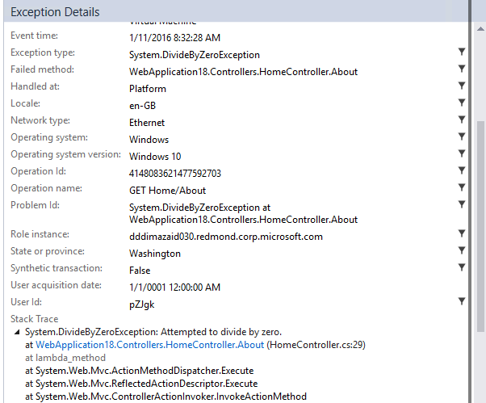

### Explorer-Lösung Erfahrung mit neuen Eintrag Punkte suchen
Jetzt können Sie die Suche bis Lösung Explorer zugreifen.

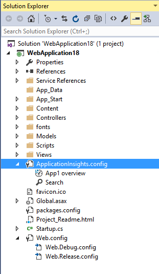

### Zeigt eine Benachrichtigung bei der Veröffentlichung abgeschlossen ist
Popupmenü wird ein Dialogfeld angezeigt, wenn das Projekt online veröffentlicht wird, sodass die Herstellung die Anwendung Einsichten Daten angezeigt werden können.

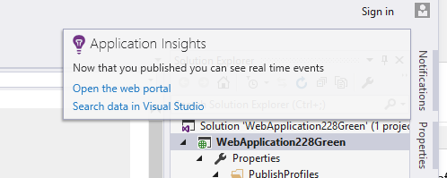

## Version 4.0

### Suchen Sie die Anwendung Einsichten Daten in Visual Studio
Wie die Suchfunktion in der Anwendung Einsichten Portal jetzt in Visual Studio können Sie filtern, und suchen Sie auf Ereignistypen, Eigenschaftswerte und Text, und überprüfen Sie dann auf einzelne Ereignisse.

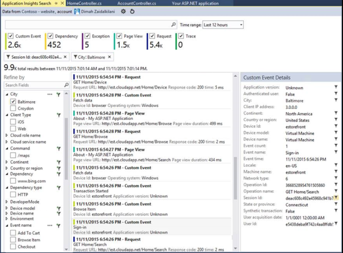

### Finden Sie unter Daten aus Ihrem lokalen Computer in Diagnosetools stammen

Sie können Ihre werden, sowie weitere Daten zum Debuggen auf der Seite Visual Studio Diagnosetools anzeigen. Nur ASP.NET 4.5 unterstützt wird.

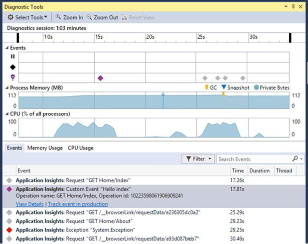

### Hinzufügen des SDKS zum Projekt ohne Anmeldung bei Azure

Sie müssen nicht mehr in Azure melden Sie sich bei der Anwendung Einsichten Pakete zu einem Projekt, entweder über das Dialogfeld **Neues Projekt** oder aus dem Projektkontextmenü hinzufügen. Wenn Sie sich anmelden können, wird das SDK installiert und so konfiguriert ist, werden mit dem Portal als vor dem senden. Wenn Sie sich nicht anmelden können, wird das SDK zum Projekt hinzugefügt werden und generiert er für den Diagnoseprotokollen Hub werden. Sie können es später konfigurieren, wenn Sie möchten.

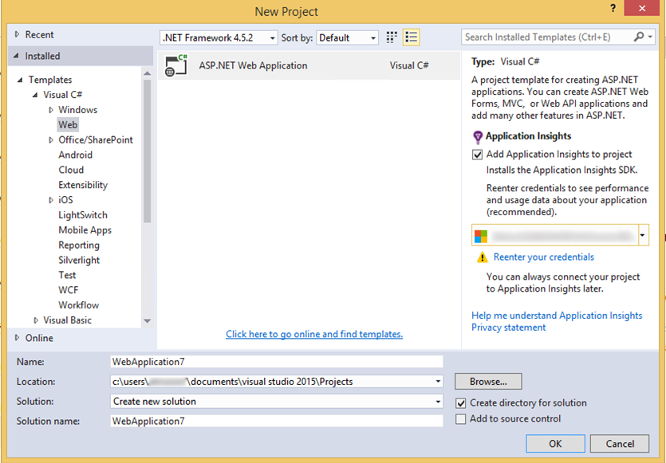

### Unterstützung für Geräte

Bei *Connect();* 2015 wir, dass unsere mobile Developer Experience für Geräte HockeyApp ist [angekündigt](https://azure.microsoft.com/blog/deep-diagnostics-for-web-apps-with-application-insights/) . HockeyApp hilft Ihnen die Beta Builds an Ihre Tester verteilen, sammeln und alle Absturz aus der app analysieren und Sammeln von Feedback direkt aus Ihren Kunden.
HockeyApp unterstützt Ihre app auf einer beliebigen Plattform, die Sie erstellen, auswählen, ob die iOS, Android oder Windows oder eine Lösung Plattformen wie Xamarin, Cordova oder eins sein.

In zukünftigen Versionen der Anwendung Einsichten Erweiterung, möchte wir eine weitere integrierte Lösung zwischen HockeyApp und Visual Studio vorstellen. Jetzt können Sie mit HockeyApp starten, indem Sie einfach den Bezug NuGet hinzufügen. Finden Sie in der [Dokumentation](http://support.hockeyapp.net/kb/client-integration-windows-and-windows-phone) Weitere Informationen.
