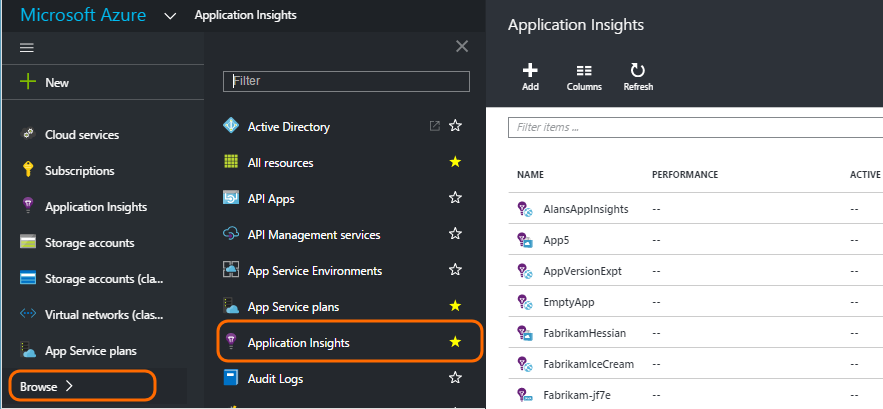
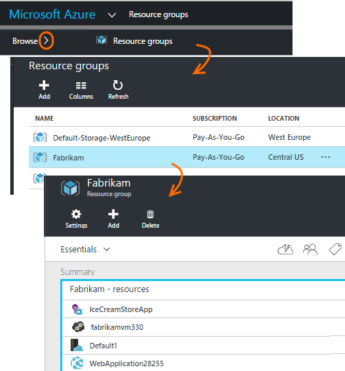
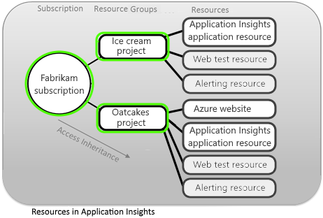
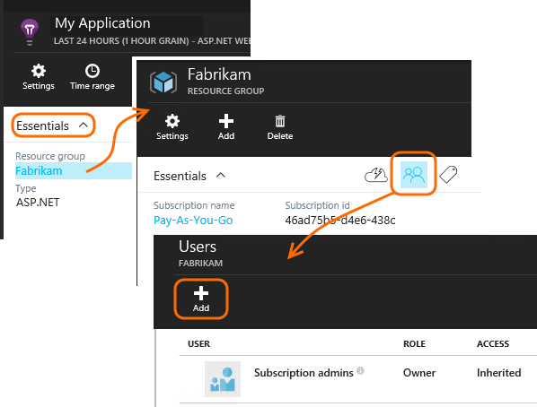
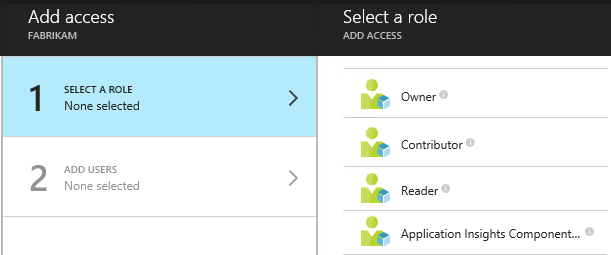
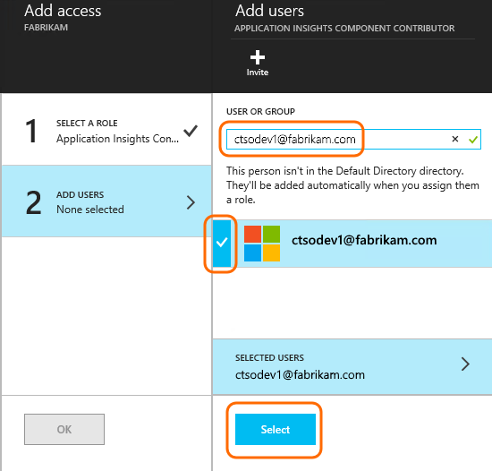

<properties
    pageTitle="Ressourcen, die Rollen und Access-Steuerelement in der Anwendung Einsichten"
    description="Besitzer, Mitwirkende und Leser von Ihrer Organisation Einsichten."
    services="application-insights"
    documentationCenter=""
    authors="alancameronwills"
    manager="douge"/>

<tags
    ms.service="application-insights"
    ms.workload="tbd"
    ms.tgt_pltfrm="ibiza"
    ms.devlang="na"
    ms.topic="article"
    ms.date="05/07/2016"
    ms.author="awills"/>

# Ressourcen, Rollen und Access-Steuerelement in der Anwendung Einsichten

Sie können steuern, wer Lese- und aktualisieren Zugriff auf Ihre Daten in Visual Studio- [Anwendung Einsichten][start], mithilfe von [Access rollenbasierte Steuerelement in Microsoft Azure](../active-directory/role-based-access-control-configure.md).

> [AZURE.IMPORTANT] Weisen Sie Zugriff für Benutzer in der **Ressourcengruppe oder das Abonnement** zu dem Ihrer Anwendungsressource gehört – nicht in die Ressource selbst. Zuweisen der **Anwendung Einsichten Komponente** Teilnehmerrolle. Dadurch wird sichergestellt, einheitliche Steuerung des Zugriffs auf Web überprüft und Benachrichtigungen zusammen mit Ihrer Anwendung Ressourcen. [Erfahren Sie mehr](#access).

## Ressourcen, Gruppen und Abonnements

Zunächst einige Definitionen:

* **Ressourcen** - eine Instanz eines Microsoft Azure-Diensts. Ihrer Anwendung Einsichten Ressource erfasst, analysiert und zeigt Daten werden von der Anwendung gesendet.  Andere Arten von Azure Ressourcen zählen Web apps, Datenbanken und virtuellen Computern an.

    Um alle Ihre Ressourcen anzuzeigen, wechseln Sie zum [Azure-Portal][portal], melden Sie sich an, und klicken Sie auf Durchsuchen.

    

* [**Ressourcengruppe** ] [ group] -jeder Ressource gehört zu einer Gruppe. Eine Gruppe ist eine bequeme Möglichkeit zum Verwalten von zugehörige Ressourcen, vor allem für Access-Steuerelement. Beispielsweise in einer Ressourcengruppe könnte eine Web App, eine Anwendung Einsichten zum Überwachen der app, und eine Speicherressource zum Beibehalten der exportierter Daten ablegen.

    

* [**Abonnement**](https://manage.windowsazure.com) - Anwendung Einblicken oder andere Ressourcen zu Azure verwenden Sie melden Sie sich bei einem Azure-Abonnement. Jeder Ressourcengruppe gehört zu einem Azure-Abonnement, in dem Sie Ihr Paket Preis und, ist ein Abonnement Organisation, wählen Sie die Mitglieder und deren Zugriffsberechtigungen.
* [**Microsoft-Konto** ] [ account] -den Benutzernamen und das Kennwort für die Anmeldung bei Microsoft Azure-Abonnements, XBox Live, Outlook.com und anderen Microsoft-Diensten.

## Steuern des Zugriffs in der Ressourcengruppe

Es ist wichtig zu verstehen, dass neben der Ressource, die Sie für eine Anwendung erstellt haben, auch separate ausgeblendete Ressourcen für Benachrichtigungen und Webtests sind. Sie sind in der gleichen [Ressourcengruppe](#resource-group) wie Ihrer Anwendung angefügt. Sie möglicherweise auch andere Dienste Azure in dort, wie z. B. Websites oder Speicher eingefügt haben.

Steuern des Zugriffs auf diese Ressourcen empfiehlt es sich daher um:

* Steuern des Zugriffs auf die Ebene **Ressourcengruppe oder das Abonnement** .
* Die **Anwendung Einsichten Komponente** Teilnehmerrolle Benutzern zuweisen. Dies ermöglicht es ihnen Webtests, Hinweise und Anwendung Einsichten Ressourcen, ohne den Zugriff auf alle anderen Diensten in der Gruppe bearbeiten.

## Den Zugriff auf einen anderen Benutzer

Sie müssen Besitzer des Abonnements oder der Ressourcengruppe Rechte verfügen.

Der Benutzer muss ein [Microsoft-Konto]verfügen[account], oder Zugriff auf ihre [Organisation Microsoft-Konto](..\active-directory\sign-up-organization.md). Sie können den Zugriff auf Personen, und auch in Azure Active Directory definiert Benutzergruppen bereitstellen.

#### Navigieren Sie zu der Ressourcengruppe

Fügen Sie es dem Benutzer hinzu.

Können oder von einer anderen Ebene wechseln und mit dem Abonnement für den Benutzer hinzufügen.

#### Wählen Sie eine Rolle

Rolle | In der Ressourcengruppe
---|---
Besitzer | Nichts, einschließlich des Benutzerzugriffs ändern können
Mitwirkenden | Nichts, einschließlich aller Ressourcen bearbeiten können
Anwendung Einsichten Komponente Mitwirkender | Können Anwendung Einsichten Ressourcen, Web überprüft und Benachrichtigungen bearbeiten.
Reader | Kann anzeigen, aber nicht ändern können

'Bearbeiten' enthält, erstellen, löschen und aktualisieren:

* Ressourcen
* Webtests
* Benachrichtigungen
* Fortlaufender exportieren

#### Wählen Sie den Benutzer

Wenn Sie der gewünschten Benutzer im Verzeichnis nicht ist, können Sie jede Person mit einem Microsoft-Konto einladen.
(Wenn sie Dienste wie Outlook.com, OneDrive, Windows Phone oder XBox Live verwenden, müssen sie ein Microsoft-Konto.)

## Benutzer und Rollen

* [Rollenbasierte Zugriffssteuerung in Azure](../active-directory/role-based-access-control-configure.md)

<!--Link references-->

[account]: https://account.microsoft.com
[group]: ../resource-group-overview.md
[portal]: https://portal.azure.com/
[start]: app-insights-overview.md
