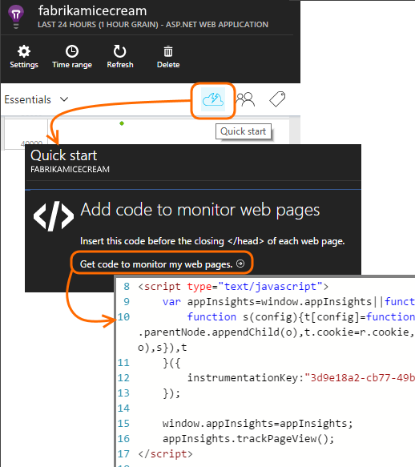

<properties 
    pageTitle="Exemplarische Vorgehensweise: Überwachen von Microsoft Dynamics CRM mit Anwendung Einsichten" 
    description="Rufen Sie werden von Microsoft Dynamics CRM Online-Anwendung Einsichten verwenden. Exemplarische Vorgehensweise des Installationsprogramms, Abrufen von Daten, Visualisierung und exportieren." 
    services="application-insights" 
    documentationCenter=""
    authors="mazharmicrosoft" 
    manager="douge"/>

<tags 
    ms.service="application-insights" 
    ms.workload="tbd" 
    ms.tgt_pltfrm="ibiza" 
    ms.devlang="na" 
    ms.topic="article" 
    ms.date="11/17/2015" 
    ms.author="awills"/>
 
# Exemplarische Vorgehensweise: Aktivieren von werden für Microsoft Dynamics CRM Online-Anwendung Einsichten verwenden

In diesem Artikel wird gezeigt, wie abzurufenden Daten werden von [Microsoft Dynamics CRM Online](https://www.dynamics.com/) [Visual Studio Anwendung Einsichten](https://azure.microsoft.com/services/application-insights/)verwenden. Wir werden auf den gesamten Prozess des Hinzufügens Anwendung Einsichten Skript an Ihrer Anwendung, durchzuführen Erfassen von Daten und Visualisierung von Daten.

>[AZURE.NOTE] [Durchsuchen Sie die Lösung für die Stichprobe](https://dynamicsandappinsights.codeplex.com/).

## Hinzufügen von Anwendung Einsichten zu neuen oder vorhandenen CRM Online-Instanz 

Um eine Anwendung zu überwachen, fügen Sie eine Anwendung Einsichten SDK an Ihrer Anwendung. Das SDK sendet werden- [Anwendung Einsichten Portal](https://portal.azure.com)können unsere leistungsstarke Datenanalyse und Diagnosetools verwenden, oder die Daten in Speicher exportieren.

### Erstellen Sie eine Ressource Anwendung Einsichten in Azure

1. Erhalten Sie [ein Konto in Microsoft Azure](http://azure.com/pricing). 
2. Melden Sie sich bei der [Azure-Portal](https://portal.azure.com) an, und fügen Sie eine neue Anwendung Einsichten Ressource. Dies ist die Stelle, an der die Daten verarbeitet und angezeigt werden.

    

    Wählen Sie als den Anwendungstyp ASP.NET aus.

3. Öffnen Sie die Registerkarte Schnellstart, und öffnen Sie das Skript Code.

    

**Lassen Sie die Codepage geöffnet** , während Sie führen Sie die nächste Schritt in einem anderen Browserfenster. Sie benötigen den Code verfügbar. 

### Erstellen Sie eine JavaScript-Web-Ressource in Microsoft Dynamics CRM

1. Öffnen Sie Ihre CRM Online-Instanz und melden Sie sich mit Administratorrechten an.
2. Öffnen von Microsoft Dynamics CRM Einstellungen Anpassungen, Anpassen des Systems

    
    
    

    

3. Erstellen Sie eine JavaScript-Ressource ein.

    

    Geben sie einen Namen, wählen Sie **Skript (JScript)** und Text-Editor geöffnet.

    
    
4. Kopieren Sie den Code aus Anwendung Einsichten aus. Sicherzustellen Sie beim Kopieren der Skript-Tags zu ignorieren. Im folgenden Bildschirmfoto finden:

    

    Der Code enthält die Instrumentation-Taste, die Ihrer Anwendung Einsichten Ressource bezeichnet.

5. Speichern und veröffentlichen.

    

### Urkunde Formulare

1. Öffnen Sie in Microsoft CRM Online Formulars "Firma"

    

2. Öffnen Sie das Formular Eigenschaften

    

3. Fügen Sie JavaScript-Web-Ressource, die Sie erstellt haben.

    

    

4. Speichern Sie und veröffentlichen Sie Ihre Anpassungen Formular.

## Kennzahlen erfasst

Sie haben nun werden erfassen für das Formular eingerichtet. Immer, wenn er verwendet wird, werden die Daten an Ihrer Anwendung Einsichten Ressource gesendet.

Hier sind Beispiele für die Daten, die Sie sehen.

#### Integrität der Anwendung

Browser-Ausnahmen:

Klicken Sie auf das Diagramm, um weitere Details zu sehen:

#### Verwendung

#### Browser

#### Geografischen Standort

#### Innere Seite Ansicht Anforderung

## Beispiel-code

[Beispiel-Code durchsuchen](https://dynamicsandappinsights.codeplex.com/).

## Power BI

Sie können sogar tieferen Analyse ausführen, wenn Sie [die Daten nach Microsoft Power BI exportieren](app-insights-export-power-bi.md).

## Beispiel für Microsoft Dynamics CRM-Lösung

[Hier die Stichprobe-Lösung in Microsoft Dynamics CRM implementiert] (https://dynamicsandappinsights.codeplex.com/).

## Weitere Informationen

* [Was ist eine Anwendung Einsichten?](app-insights-overview.md)
* [Anwendung Einsichten für Webseiten](app-insights-javascript.md)
* [Weitere Beispiele und exemplarische Vorgehensweisen](app-insights-code-samples.md)

 
