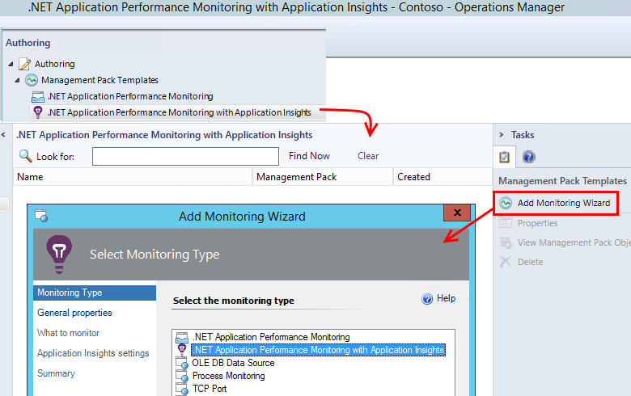
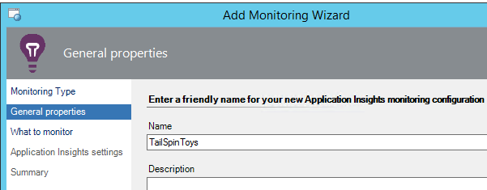
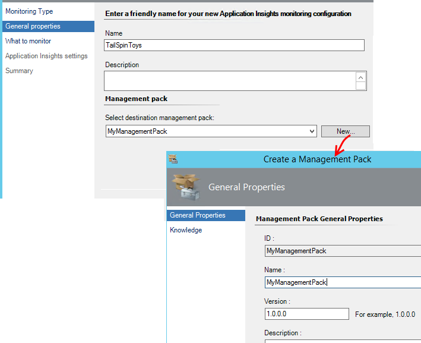
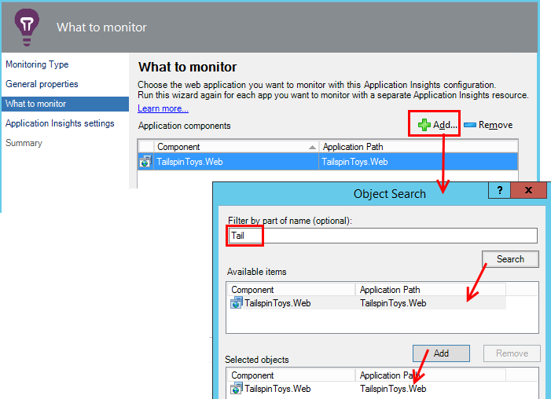
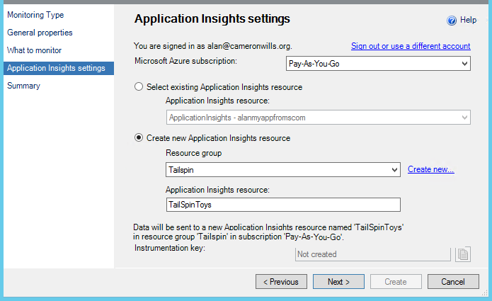
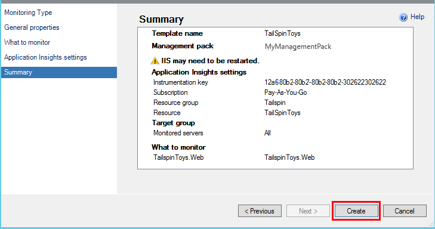
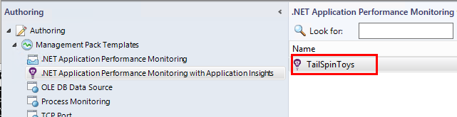
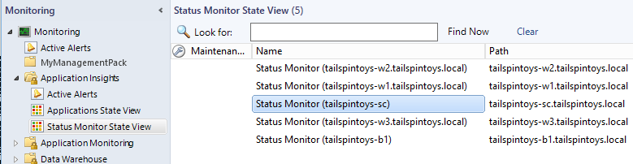

<properties 
    pageTitle="SCOM Integration in Anwendung Einsichten | Microsoft Azure" 
    description="Wenn Sie einen Benutzer SCOM befinden, überwachen Sie der Leistung und diagnostizieren Sie Probleme bei der Anwendung Einsichten. Umfassende Dashboards, smart-Benachrichtigungen, leistungsfähige Diagnosetools und Analysis-Abfragen." 
    services="application-insights" 
    documentationCenter=""
    authors="alancameronwills" 
    manager="douge"/>

<tags 
    ms.service="application-insights" 
    ms.workload="tbd" 
    ms.tgt_pltfrm="ibiza" 
    ms.devlang="na" 
    ms.topic="article" 
    ms.date="08/12/2016" 
    ms.author="awills"/>
 
# Anwendung Leistung Überwachung Anwendung Einsichten für SCOM verwenden

Wenn Sie System Center Operations Manager (SCOM) zum Verwalten Ihrer Server verwenden, können Sie Leistung überwachen und Leistungsprobleme mit Hilfe der [Visual Studio-Anwendung Einsichten](app-insights-asp-net.md)diagnostizieren. Anwendung Einsichten überwacht eingehenden Anfragen der Webanwendung, ausgehende REST und SQL-Anrufe, Ausnahmen und Log auf. Darüber Dashboards mit metrischen Diagramme und SmartArt-Benachrichtigungen, ebenso wie leistungsfähige diagnostic suchen und analytischen Abfragen über diese werden. 

Sie können auf die Anwendung Einsichten Überwachung mithilfe eines SCOM Management Packs wechseln.

## Bevor Sie beginnen

Wir nehmen Sie an:

* Mit SCOM vertraut sind, und Verwenden von SCOM 2012 R2 oder 2016 zum Verwalten der IIS-web-Servern.
* Sie haben bereits auf Ihren Servern eine Webanwendung installiert, die Sie mit der Anwendung Einsichten überwachen möchten.
* App-Framework-Version ist .NET 4.5 oder höher.
* Sie haben Zugriff auf ein Abonnement in [Microsoft Azure](https://azure.com) und [Azure-Portal](https://portal.azure.com)anmelden können. Ihrer Organisation möglicherweise müssen Sie ein Abonnement, und fügen Sie Ihrem Microsoft-Konto kann darauf.

(Das Entwicklungsteam möglicherweise die [Anwendung Einsichten SDK](app-insights-asp-net.md) in die Web app erstellen. Diese Erstellungszeit Instrumentation können sie flexibler Schreiben von benutzerdefinierten werden. Es ist jedoch unerheblich: Sie können die mit oder ohne das SDK sich hier beschriebenen Schritte folgen.)

## (Einmal) Installieren der Anwendung Einsichten Management pack

Auf dem Computer, in dem Sie Operations Manager ausführen:

2. Deinstallieren Sie alle alte Version des Management Packs an:
 1. Öffnen Sie in Operations Manager Management Packs Administration aus. 
 2. Löschen Sie die alte Version.
1. Herunterladen Sie und installieren Sie das Management Pack aus dem Katalog.
2. Starten Sie Operations Manager erneut.

## Erstellen eines Management Packs

1. Klicken Sie in Operations Manager öffnen Sie **Dokumenterstellung**, **.NET... mit Anwendung Einblicken**, **Überwachung Assistenten zum Hinzufügen**zu, und wählen Sie **.NET... mit Einsichten Anwendung**erneut.

    

2. Benennen Sie die Konfiguration nach der app. (Sie müssen eine app nacheinander instrumentieren.)
    
    

3. Erstellen eines neuen Management Packs, oder Wählen eines Sprachpakets, das Sie für die Anwendung Einsichten zuvor erstellt haben, klicken Sie auf der gleichen Seite des Assistenten.

     (Die Anwendung Einsichten [Management Pack](https://technet.microsoft.com/library/cc974491.aspx) ist eine Vorlage, aus der Sie eine Instanz erstellen. Sie können die gleiche Instanz später wiederverwenden.)

    

4. Wählen Sie eine app, die Sie überwachen möchten. Die Suchfunktion durchsucht zwischen auf den Servern installierten apps.

    

    Das Feld im Bereich optionale Überwachung kann verwendet werden, um anzugeben, eine Untermenge von Ihren Servern, wenn Sie nicht die app in allen Servern überwachen möchten.

5. Klicken Sie auf der nächsten Seite des Assistenten müssen Sie zuerst Ihre Anmeldeinformationen ein, für die Anmeldung bei Microsoft Azure bereitstellen.

    Auf dieser Seite Wählen Sie die Anwendung Einsichten Ressource, werden die Daten werden analysiert und angezeigt werden soll. 

 * Wenn die Anwendung während der Entwicklung für Anwendung Einsichten konfiguriert wurde, wählen Sie die vorhandene Ressource aus.
 * Erstellen Sie andernfalls eine neue Ressource mit dem Namen für die app aus. Wenn es andere apps, die Komponenten des gleichen Systems sind gibt, müssen Sie diese in derselben Ressourcengruppe, um Zugriff auf die telemetrieprotokoll verwalten zu erleichtern.

    Sie können diese Einstellungen später ändern.

    

6. Abschließen des Assistenten.

    
    
Wiederholen Sie diesen Vorgang für jedes app, die zu überwachenden.

Wenn Sie später Einstellungen ändern müssen, öffnen Sie die Eigenschaften des Monitors aus dem Fenster Dokumenterstellung erneut.

## Vergewissern Sie sich für die Überwachung

Den Monitor, dass Sie für Ihre app Suchbegriffe auf jedem Server installiert haben. Stelle, an der sie die app findet wird Application Einsichten Status Monitor zum Überwachen der app konfiguriert. Falls erforderlich, wird zuerst Status Monitor auf dem Server installiert.

Sie können überprüfen, welche Instanzen von der app gefunden wurden:

## Ansicht werden in der Anwendung Einsichten

Navigieren Sie im [Portal Azure](https://portal.azure.com), die der Ressource für Ihre app ein. Sie [finden Sie unter Diagramme mit werden](app-insights-dashboards.md) aus der app. (Wenn sie auf der Hauptseite noch noch nicht nach oben angezeigt, klicken Sie auf Live Kennzahlen Stream.)

## Nächste Schritte

* [Einrichten eines Dashboards](app-insights-dashboards.md) auf die wichtigsten Diagramme für die Überwachung diese und andere apps zu kombinieren.
* [Erfahren Sie mehr über Kennzahlen](app-insights-metrics-explorer.md)
* [Einrichten von Benachrichtigungen](app-insights-alerts.md)
* [Analyse von Leistungsproblemen](app-insights-detect-triage-diagnose.md)
* [Leistungsfähige Analytics-Abfragen](app-insights-analytics.md)
* [Verfügbarkeit von Webtests](app-insights-monitor-web-app-availability.md)
