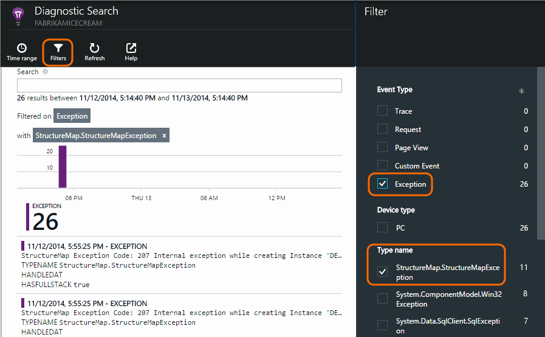

<properties 
    pageTitle="Protokolle, Ausnahmen und benutzerdefinierte Diagnose für ASP.NET in Anwendung Einsichten" 
    description="Diagnostizieren Sie Probleme in ASP.NET Web apps durch Suchen Besprechungsanfragen, Ausnahmen und Protokolle mit Spur, NLog oder Log4Net generiert." 
    services="application-insights" 
    documentationCenter=""
    authors="alancameronwills" 
    manager="douge"/>

<tags 
    ms.service="application-insights" 
    ms.workload="tbd" 
    ms.tgt_pltfrm="ibiza" 
    ms.devlang="na" 
    ms.topic="article" 
    ms.date="04/08/2016" 
    ms.author="awills"/>
 
# Protokolle, Ausnahmen und benutzerdefinierte Diagnose für ASP.NET in Anwendung Einsichten

[Anwendung Einsichten] [ start] enthält eine leistungsfähige [Diagnostic Suche] [ diagnostic] Tool, mit dem Sie zu durchsuchen und einen Drilldown ausführen, um durch die Anwendung Einsichten SDK aus Ihrer Anwendung gesendet werden. Viele Ereignisse wie Seite Benutzeransichten werden automatisch vom SDK gesendet.

Sie können auch Code um benutzerdefinierte Ereignisse, Ausnahme Berichte und auf senden. Und wenn Sie bereits eine Protokollierung Framework wie log4J, log4net, NLog oder System.Diagnostics.Trace verwenden, können Sie diese Protokolle erfassen und Einbinden in das Feld Suchen. Dies erleichtert das Protokoll auf Aktionen des Benutzers, Ausnahmen und andere Ereignisse zuordnen.

## Bevor Sie benutzerdefinierte werden schreiben

Wenn dies noch nicht geschehen ist [Anwendung Einsichten für ein Projekt einrichten][start], führen Sie die jetzt.

Wenn Sie die Anwendung ausführen, es einige werden senden, die in Diagnostic suchen, einschließlich Besprechungsanfragen, die vom Server, empfangenen angezeigt wird, Seite Ansichten auf dem Client angemeldet und unerwarteter Ausnahmen.

Öffnen Sie Diagnostic Suche auf die werden angezeigt, die das SDK automatisch sendet.

Die Details unterschiedlich aus einem Anwendungstyp in ein anderes. Sie können über eine beliebige einzelne Ereignis ausführlicher abrufen klicken.

## Werden 

Wenn eine Anwendung eine große Datenmenge sendet, und Sie die Anwendung Einsichten SDK für ASP.NET Version 2.0.0-beta3 oder höher verwenden, möglicherweise das Feature adaptive werden die Steuerung und senden nur Prozentwert der werden. [Weitere Informationen zu werden.](app-insights-sampling.md)

##Benutzerdefinierte Ereignisse

Benutzerdefinierte Ereignisse werden beide [Diagnostic] Suche[ diagnostic] und im [Explorer Metrisch][metrics]. Sie können den Benutzern von Geräten, Webseiten und Server Applications senden. Sie können verwendet werden, zu Diagnosezwecken und [verstehen Verwendungsmuster][track].

Ein benutzerdefiniertes Ereignis hat einen Namen, und Sie können auch Eigenschaften, die Sie, zusammen mit numerischen Maße Filtern führen.

JavaScript-Client

    appInsights.trackEvent("WinGame",
         // String properties:
         {Game: currentGame.name, Difficulty: currentGame.difficulty},
         // Numeric measurements:
         {Score: currentGame.score, Opponents: currentGame.opponentCount}
         );

C#-Servers

    // Set up some properties:
    var properties = new Dictionary <string, string> 
       {{"game", currentGame.Name}, {"difficulty", currentGame.Difficulty}};
    var measurements = new Dictionary <string, double>
       {{"Score", currentGame.Score}, {"Opponents", currentGame.OpponentCount}};

    // Send the event:
    telemetry.TrackEvent("WinGame", properties, measurements);

VB am server

    ' Set up some properties:
    Dim properties = New Dictionary (Of String, String)
    properties.Add("game", currentGame.Name)
    properties.Add("difficulty", currentGame.Difficulty)

    Dim measurements = New Dictionary (Of String, Double)
    measurements.Add("Score", currentGame.Score)
    measurements.Add("Opponents", currentGame.OpponentCount)

    ' Send the event:
    telemetry.TrackEvent("WinGame", properties, measurements)

### Führen Sie die app, und anzuzeigen Sie die Ergebnisse.

Öffnen Sie die Diagnose suchen.

Wählen Sie benutzerdefinierte Ereignis, und wählen Sie einen Ereignisnamen für die bestimmte.

Filtern der Daten, die durch Eingeben von einen Suchbegriff nach einem Eigenschaftswert weitere an.  

Ausführen von Drilldowns oder in ein einzelnes Ereignis detaillierten Eigenschaften anzeigen.

##Seitenansichten

Seite Ansicht werden wird gesendet, indem Sie den Anruf trackPageView() in [den JavaScript-Codeausschnitt, die Sie in Ihren Webseiten einfügen][usage]. Ihr Hauptfenster Zweck ist auf die Anzahl der Seitenansichten beteiligen möchten, die Sie auf der Übersichtsseite angezeigt.

In der Regel heißt es einmal in jede HTML-Seite, aber Sie können weiterer Anrufe – beispielsweise einfügen, wenn Sie eine einzelne Seite app haben und Sie eine neue Seite melden Sie sich immer, wenn der Benutzer weitere Daten erhält möchten.

    appInsights.trackPageView(pageSegmentName, "http://fabrikam.com/page.htm"); 

Manchmal ist es sinnvoll, Eigenschaften anfügen, die Sie als Filter im diagnostic Suche verwenden können:

    appInsights.trackPageView(pageSegmentName, "http://fabrikam.com/page.htm",
     {Game: currentGame.name, Difficulty: currentGame.difficulty});

##Spur werden

Spur werden ist Code, der Sie speziell zum Erstellen von Diagnoseprotokollen einfügen. 

Beispielsweise könnten Sie Anrufe wie folgt einfügen:

    var telemetry = new Microsoft.ApplicationInsights.TelemetryClient();
    telemetry.TrackTrace("Slow response - database01");

####  Installieren eines Netzwerkadapter für Ihre Framework Protokollierung

Sie können auch mit einem Protokollierung Framework - generierten Protokolle suchen log4Net, NLog oder System.Diagnostics.Trace. 

1. Wenn Sie beabsichtigen, log4Net oder NLog verwenden, installieren Sie sie in Ihrem Projekt. 
2. Klicken Sie im Explorer-Lösung mit der rechten Maustaste in Ihrem Projekts, und wählen Sie **NuGet-Pakete verwalten**.
3. Wählen Sie Online > alle, wählen Sie **Vorabversion einschließen** und suchen Sie nach "Microsoft.ApplicationInsights"

    

4. Wählen Sie das entsprechende Paket – eine der:
  + Microsoft.ApplicationInsights.TraceListener (zum Erfassen von System.Diagnostics.Trace Anrufe)
  + Microsoft.ApplicationInsights.NLogTarget
  + Microsoft.ApplicationInsights.Log4NetAppender

NuGet-Paket installiert die notwendigen Assemblys und auch ändert web.config oder app.config.

#### Einfügen von Diagnoseprotokoll Anrufe

Wenn Sie System.Diagnostics.Trace verwenden, wäre eine typische anrufen:

    System.Diagnostics.Trace.TraceWarning("Slow response - database01");

Wenn Sie log4net oder NLog bevorzugen:

    logger.Warn("Slow response - database01");

Ihre app im Debuggen-Modus ausgeführt, oder es bereitstellen.

Sehen Sie die Nachrichten in Diagnostic suchen, wenn Sie den Filter Spur auswählen.

### Ausnahmen

Erste Ausnahme Berichte in der Anwendung Einsichten bietet sehr leistungsfähige, insbesondere, da zwischen den fehlerhaften Besprechungsanfragen und die Ausnahmen navigieren, und lesen den Ausnahmestapel.

In einigen Fällen müssen Sie [einige Codezeilen einfügen] [ exceptions] um sicherzustellen, dass Ihre Ausnahmen werden automatisch abgefangen wird.

Sie können auch explizit Code Ausnahme werden senden schreiben:

JavaScript

    try 
    { ...
    }
    catch (ex)
    {
      appInsights.TrackException(ex, "handler loc",
        {Game: currentGame.Name, 
         State: currentGame.State.ToString()});
    }

C#

    var telemetry = new TelemetryClient();
    ...
    try 
    { ...
    }
    catch (Exception ex)
    {
       // Set up some properties:
       var properties = new Dictionary <string, string> 
         {{"Game", currentGame.Name}};

       var measurements = new Dictionary <string, double>
         {{"Users", currentGame.Users.Count}};

       // Send the exception telemetry:
       telemetry.TrackException(ex, properties, measurements);
    }

VB

    Dim telemetry = New TelemetryClient
    ...
    Try
      ...
    Catch ex as Exception
      ' Set up some properties:
      Dim properties = New Dictionary (Of String, String)
      properties.Add("Game", currentGame.Name)

      Dim measurements = New Dictionary (Of String, Double)
      measurements.Add("Users", currentGame.Users.Count)
  
      ' Send the exception telemetry:
      telemetry.TrackException(ex, properties, measurements)
    End Try

Die Eigenschaften und Maße Parameter sind optional, aber eignen sich zum Filtern und zusätzlichen Informationen hinzufügen. Wenn Sie eine app, die mehrere Spiele ausgeführt werden kann verfügen, wurde beispielsweise alle Ausnahme-Berichte, die im Zusammenhang mit einem bestimmten Spiel gefunden. Sie können beliebig viele Elemente wie jedes Wörterbuch hinzufügen.

#### Anzeigen der Ausnahmen

Sehen Sie eine Zusammenfassung der Ausnahmen auf das Blade Übersicht gemeldet, und Sie können durch Klicken, um weitere Details anzuzeigen. Beispiel:

[]

Klicken Sie auf eine beliebige Ausnahmetyp zu bestimmten Vorkommen finden Sie unter:

[]

Sie können auch Diagnostic Suche direkt öffnen, auf Ausnahmen filtern, und wählen den Typ der Ausnahme, den angezeigt werden sollen.

### Ausnahmefehler Reporting

Anwendung Einsichten Berichte Ausnahmen nicht behandelt, wo er kann, von Geräten, [Webbrowsern][usage], oder Webserver, ob nach [Status Monitor] instrumentiert[ redfield] oder [Anwendung Einsichten SDK][greenbrown]. 

Jedoch nicht immer dazu in einigen Fällen, weil .NET Framework die Ausnahmen abgefangen werden können.  Stellen Sie sicher, dass Sie alle Ausnahmen angezeigt wird, müssen Sie deshalb einen kleine Ausnahme Ereignishandler schreiben. Das optimale Verfahren hängt von der Technologie ab. [Ausnahme werden für ASP.NET] finden Sie unter[ exceptions] Details. 

### Mit einem Build abgleichen

Wenn Sie Diagnoseprotokolle lesen möchten, ist es wahrscheinlich, dass Ihre Quellcode wird geändert haben, da der live Code bereitgestellt wurde.

Es empfiehlt sich daher, setzen eigene Informationen, wie die URL der aktuellen Version, in eine Eigenschaft zusammen mit jeder Ausnahme oder Spur. 

Anstatt die Eigenschaft separat zu jeder Ausnahme Anruf, können Sie die Informationen im Standardkontext festlegen. 

    // Telemetry initializer class
    public class MyTelemetryInitializer : ITelemetryInitializer
    {
        public void Initialize (ITelemetry telemetry)
        {
            telemetry.Properties["AppVersion"] = "v2.1";
        }
    }

In der app-Initialisierung wie Global.asax.cs:

    protected void Application_Start()
    {
        // ...
        TelemetryConfiguration.Active.TelemetryInitializers
        .Add(new MyTelemetryInitializer());
    }

###Server-Web-Anfragen

Anfordern, werden automatisch gesendet, wenn Sie [Status Monitor auf Ihrem Webserver installieren][redfield], oder wenn Sie [Anwendung Einsichten zu Ihrem Webprojekt hinzufügen][greenbrown]. Es feeds auch in der Anfrage und Antwort Zeit-Diagramme in Metrisch-Explorer, und klicken Sie auf der Seite Übersicht.

Wenn Sie zusätzliche Ereignisse senden möchten, können Sie die TrackRequest()-API verwenden.

## F & A

### Ich erhalte die Fehlermeldung "Instrumentation Schlüssel darf nicht leer sein"

Wie Sie das Protokollierung Netzwerkadapter Nuget-Paket installiert haben, ohne Installation von Anwendung Einsichten sieht so aus.

Explorer-Lösung, mit der Maustaste `ApplicationInsights.config` , und wählen Sie **Die Anwendung Einsichten aktualisieren**. Erhalten Sie ein Dialogfeld, mit der Sie die Anmeldung bei Azure eingeladen, und erstellen Sie entweder eine Anwendung Einsichten Ressource, oder verwenden Sie eine vorhandene erneut. Die sollte das Problem zu lösen.

### Wie viele Daten werden beibehalten?

Bis zu 500 Ereignisse pro Sekunde aus jeder Anwendung. Ereignisse sind sieben Tage lang aufbewahrt.

### Einige der Meine Ereignisse oder Spuren nicht angezeigt

Wenn eine Anwendung eine große Datenmenge sendet, und Sie die Anwendung Einsichten SDK für ASP.NET Version 2.0.0-beta3 oder höher verwenden, möglicherweise das Feature adaptive werden die Steuerung und senden nur Prozentwert der werden. [Weitere Informationen zu werden.](app-insights-sampling.md)

## Nächste Schritte

* [Einrichten von Verfügbarkeit und Reaktionszeiten tests][availability]
* [Behandlung von Problemen][qna]

<!--Link references-->

[availability]: app-insights-monitor-web-app-availability.md
[diagnostic]: app-insights-diagnostic-search.md
[exceptions]: app-insights-asp-net-exceptions.md
[greenbrown]: app-insights-asp-net.md
[metrics]: app-insights-metrics-explorer.md
[qna]: app-insights-troubleshoot-faq.md
[redfield]: app-insights-monitor-performance-live-website-now.md
[start]: app-insights-overview.md
[track]: app-insights-api-custom-events-metrics.md
[usage]: app-insights-web-track-usage.md

 
