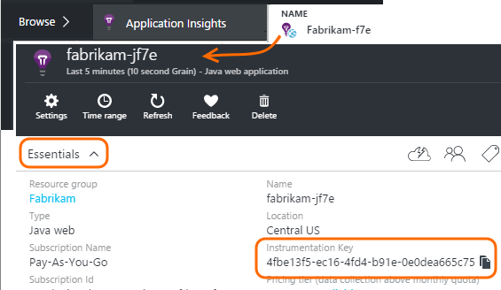

<properties 
    pageTitle="Separate Anwendung Einsichten Ressourcen für Entwickler, testen und Herstellung" 
    description="Überwachen Sie die Leistung und die Verwendung der Anwendung in verschiedenen Phasen einer Entwicklung" 
    services="application-insights" 
    documentationCenter=""
    authors="alancameronwills" 
    manager="douge"/>

<tags 
    ms.service="application-insights" 
    ms.workload="tbd" 
    ms.tgt_pltfrm="ibiza" 
    ms.devlang="na" 
    ms.topic="article" 
    ms.date="05/04/2016" 
    ms.author="awills"/>

# Extrahieren der Anwendung Einsichten Ressourcen

Sollte der werden aus verschiedenen Komponenten und Versionen einer Anwendung zu anderen Anwendung Einsichten Ressourcen gesendet, oder kombiniert werden in eine? In diesem Artikel wird auf optimale Methoden und die notwendigen Techniken.

Zunächst sehen wir uns die Frage. Die Daten, die von Ihrer Anwendung empfangen gespeichert und verarbeiteten Anwendung Einsichten in einer Microsoft Azure- *Ressourcen*. Jede Ressource wird durch einen *Schlüssel Instrumentation* (iKey) identifiziert. In Ihrer app werden die Taste die Anwendung Einsichten SDK bereitgestellt, damit sie die Daten senden kann, die sie mit der rechten Ressource sammelt. Die Taste kann Code oder im ApplicationInsights.config bereitgestellt werden. Durch Ändern des Schlüssels im SDK, können Sie Daten für unterschiedliche Ressourcen anweisen. 

In einem einfachen Fall bei der Erstellung des Codes für eine neue Anwendung, erstellen Sie auch eine neue Ressource in der Anwendung Einsichten. In Visual Studio führt dies im Dialogfeld *Neues Projekt* für Sie.

Wenn es sich um eine große Website ist, kann es auf mehr als einem Server-Instanz bereitgestellt werden.

In komplexere Szenarien müssen Sie ein System, die aus mehreren Komponenten – beispielsweise eine Website und einer Back-End-Prozessor besteht aus. 

## Verwenden von separaten iKeys

Es folgen einige allgemeinen Richtlinien:

* Mit einer Einheit unabhängig voneinander zur Bereitstellung geeignete Anwendung vor, die auf eine Reihe von Instanzen skaliert werden können, die auf/unabhängig von anderen Komponenten ab-Server ausgeführt wird, und es in der Regel, die eine einzelne Ressource - zugeordnet werden sollte d. h., haben es einen einzelnen Instrumentation Key (iKey).
* Im Gegensatz dazu gehören Gründe für die Verwendung von separaten iKeys aus:
 - Lesen Sie einfach separate Kennzahlen aus separaten Komponenten.
 - Trennen Sie geringem werden von umfangreicher, damit Einschränkung, Kontingente, und werden auf einen Stream anderen beeinflussen nicht.
 - Separate Benachrichtigungen, exportieren und Element Konfigurationen arbeiten.
 - [Grenzwerte](app-insights-pricing.md#limits-summary) verteilt, wie telemetrieprotokoll Kontingent, begrenzungsebene und Web zählen testen.
 - Code in der Entwicklung und Test sollten in einer separaten iKey als der Herstellung Stempel senden.  

Viele Anwendung Einsichten Portal Erfahrung dienen mit diesen Richtlinien berücksichtigen. Beispielsweise zeigt die Server Segmente auf Server-Instanz ausführenden ausgegangen dieser werden über eine logische Komponente von mehreren Serverinstanzen stammen.

## Einzelne iKey

Stelle, an der Sie werden über mehrere Komponenten in einer einzelnen iKey senden:

* Alle werden, die Sie zum Segment und Filtern von der Komponentenidentität ermöglicht fügen Sie eine Eigenschaft hinzu. Die Rollen-ID wird automatisch werden vom Server Rolleninstanzen, aber in anderen Fällen hinzugefügt, dass Sie eine [werden Initialisierung](app-insights-api-filtering-sampling.md#add-properties) verwenden, um die Eigenschaft hinzuzufügen.
* Aktualisieren Sie die Anwendung Einsichten SDKs in den unterschiedlichen Komponenten zur gleichen Zeit ein. Werden für eine iKey sollte mit der gleichen Version des SDK stammen.

## Separate iKeys

Wo gibt es mehrere iKeys für die verschiedenen Komponenten der Anwendung:

* Erstellen Sie ein [Dashboard](app-insights-dashboards.md) einen Überblick über die wichtigsten werden aus der logischen Anwendung, aus der verschiedenen Komponenten der Anwendung kombiniert. Dashboards können freigegeben werden, damit eine einzelne logisches Systemansicht von verschiedenen Teams verwendet werden kann.
* Organisieren von [Ressourcengruppen](app-insights-resources-roles-access-control.md) Team Ebene. Zugriffsberechtigungen von Ressourcengruppe zugewiesen sind, und dazu die Berechtigung zum Einrichten von Benachrichtigungen gehören. 
* Verwenden Sie [Azure Ressourcenmanager Vorlagen und Powershell](app-insights-powershell.md) besser verwalten Elemente wie Warnungsregeln und web Tests.

## Separate iKeys für Test-/und Herstellung

Vereinfachen Sie den Key automatisch ändern, wenn Ihre app freigegeben wird, legen Sie den iKey Code, anstatt in ApplicationInsights.config an.

### Dynamische Instrumentierung Schlüssel

Setzen Sie den Schlüssel in einer Initialisierungsmethode, z. B. global.aspx.cs in einer ASP.NET-Dienst an:

*C#*

    protected void Application_Start()
    {
      Microsoft.ApplicationInsights.Extensibility.
        TelemetryConfiguration.Active.InstrumentationKey = 
          // - for example -
          WebConfigurationManager.AppSettings["ikey"];
      ...

In diesem Beispiel werden die Ikeys für die anderen Ressourcen in unterschiedlichen Versionen von der Konfigurationsdatei platziert. Austauschen von der Konfigurationsdatei – was als Teil des Release Skripts möglich - wird die Zielressource austauschen.

### Webseiten

Der iKey dient auch in Ihrer app-Webseiten in das [Skript, das Sie aus dem Schnellstart Blade Webhostinganbieter erhalten haben](app-insights-javascript.md). Statt Codierung es Literal in das Skript, generieren sie aus der Status des Servers. Angenommen, in einer ASP.NET-app:

*JavaScript in Razor*

    <script type="text/javascript">
    // Standard Application Insights web page script:
    var appInsights = window.appInsights || function(config){ ...
    // Modify this part:
    }({instrumentationKey:  
      // Generate from server property:
      "@Microsoft.ApplicationInsights.Extensibility.
         TelemetryConfiguration.Active.InstrumentationKey"
    }) // ...

## Erstellen eine weitere Anwendung Einsichten Ressource
  
Wenn Sie sich entscheiden, werden für die verschiedenen Komponenten der Anwendung oder für verschiedene Stempel (Entwicklung/Test/Fertigung) derselben Komponente zu trennen, müssen Sie eine neue Anwendung Einsichten Ressource erstellen.

Fügen Sie in der [portal.azure.com](https://portal.azure.com)eine Anwendung Einsichten Ressource hinzu:

* **Anwendungstyp** wirkt sich auf, was Sie in der Übersicht Blade- und die verfügbaren Eigenschaften im [metrischen Explorer](app-insights-metrics-explorer.md)anzeigen. Wenn den Typ der app nicht angezeigt wird, wählen Sie eine der Web Typen für Webseiten.
* **Ressourcengruppe** ist eine Vereinfachung für die Verwaltung von Eigenschaften wie [Access-Steuerelement](app-insights-resources-roles-access-control.md). Sie könnten separaten Ressourcengruppen für Entwicklung, testen und Herstellung verwenden.
* **Abonnement** ist Ihr Zahlungskonto in Azure.
* **Speicherort** ist, in dem wir die Daten beibehalten. Zurzeit kann es nicht geändert werden. 
* **Hinzufügen zum Dashboard** verschoben Schnellzugriff Kacheln für die Ressource auf der Startseite von Azure. 

Erstellen der Ressource dauert einige Sekunden. Eine Warnung wird angezeigt, wenn nicht mehr benötigt wird.

(Sie können ein [PowerShell-Skript](app-insights-powershell-script-create-resource.md) zum automatischen erstellen eine Ressource schreiben.)

## Erste Instrumentation-Taste

Die Taste Instrumentation identifiziert die Ressource, die Sie erstellt haben. 

Sie benötigen die Instrumentation Tasten aller Ressourcen, dem die app Daten senden wird.

 
