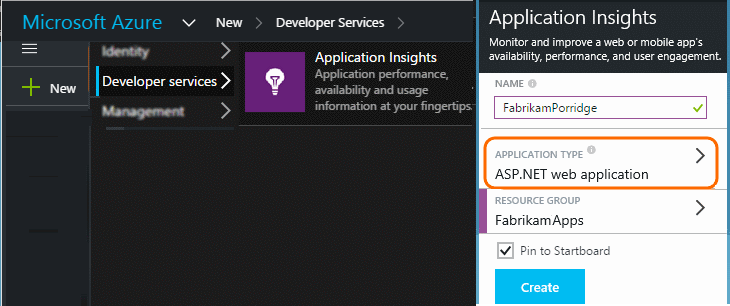
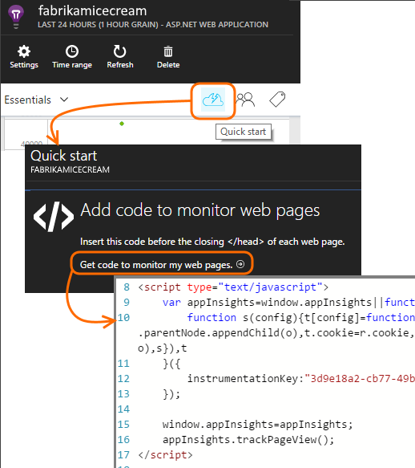
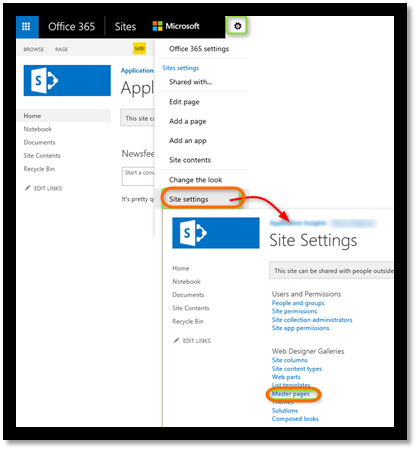
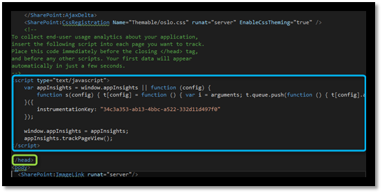
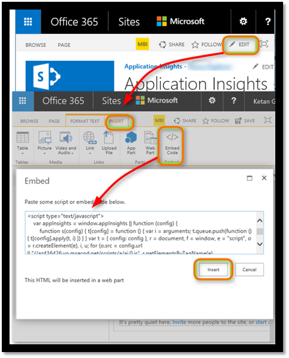
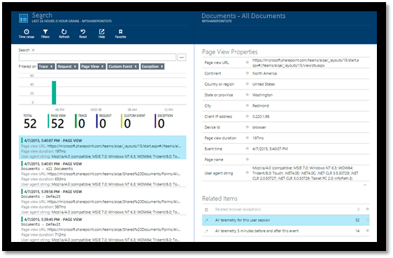
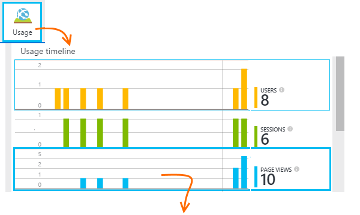
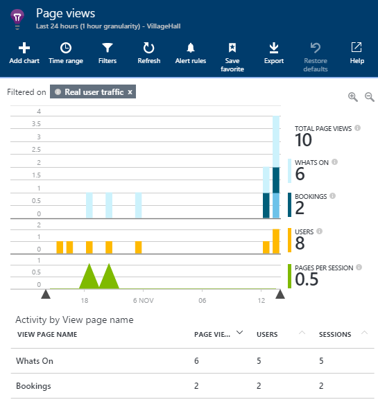
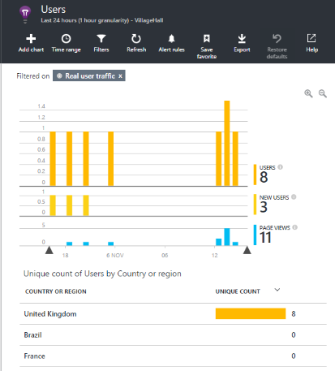
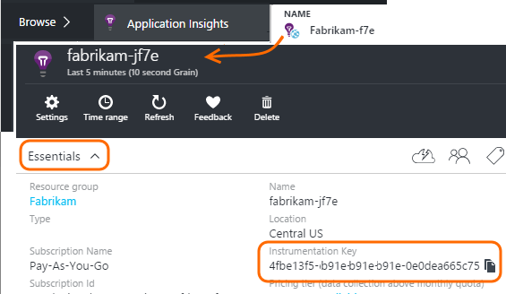

<properties 
    pageTitle="Überwachen von einer SharePoint-Website mit der Anwendung Einsichten" 
    description="Starten Sie eine neue Anwendung mit einem neuen Instrumentation Schlüssel für die Überwachung" 
    services="application-insights" 
    documentationCenter=""
    authors="alancameronwills" 
    manager="douge"/>

<tags 
    ms.service="application-insights" 
    ms.workload="tbd" 
    ms.tgt_pltfrm="ibiza" 
    ms.devlang="na" 
    ms.topic="article" 
    ms.date="03/24/2016" 
    ms.author="awills"/>

# <a name="monitor-a-sharepoint-site-with-application-insights"></a>Überwachen von einer SharePoint-Website mit der Anwendung Einsichten


Visual Studio-Anwendung Einsichten überwacht die Verfügbarkeit, die Leistung und die Verwendung Ihrer Apps. Hier erfahren Sie, wie Sie es für eine SharePoint-Website einrichten.


## <a name="create-an-application-insights-resource"></a>Erstellen Sie eine Anwendung Einsichten Ressource


Im [Portal Azure](https://portal.azure.com)erstellen Sie eine neue Anwendung Einsichten Ressource ein. Wählen Sie als den Anwendungstyp ASP.NET aus.




Das Blade, das geöffnet wird, ist den Ort, wo Sie Leistung und von Verwendungsdaten über Ihre app sehen. Um wieder es beim nächsten zu gelangen, die Sie bei Azure anmelden, sollten Sie dafür eine Kachel auf dem Startbildschirm suchen. Alternativ klicken Sie auf Durchsuchen, um danach zu suchen.
    


## <a name="add-our-script-to-your-web-pages"></a>Unser Skript zu Ihren Webseiten hinzufügen

Schnellstart erhalten Sie das Skript für Webseiten:



Das Skript unmittelbar vor dem Einfügen der &lt;/leiten&gt; Kategorie jeder Seite, die Sie nachverfolgen möchten. Wenn Ihre Website auf eine Masterseite verfügt, können Sie das Skript dort ablegen. Angenommen, in einem ASP.NET-MVC-Projekt Sie würde Ablegen in View\Shared\_Layout.cshtml

Das Skript enthält die Instrumentation-Taste, die die werden an Ihrer Anwendung Einsichten Ressource weiterleitet.

### <a name="add-the-code-to-your-site-pages"></a>Fügen Sie den Code in Ihren Websiteseiten

#### <a name="on-the-master-page"></a>Klicken Sie auf der Masterseite

Wenn Sie die Masterseite der Website bearbeiten können, bietet, die Überwachung für jede Seite in der Website.

Schauen Sie sich die Gestaltungsvorlage, und bearbeiten sie mithilfe von SharePoint Designer oder anderen Text-Editor.




Fügen Sie den Code direkt vor der </head> Kategorie. 




#### <a name="or-on-individual-pages"></a>Oder klicken Sie auf einzelne Seiten

Zum Überwachen der einer begrenzten Anzahl von Seiten, fügen Sie das Skript separat auf jeder Seite. 

Einfügen eines Webparts und den Codeausschnitt darin einbetten.





## <a name="view-data-about-your-app"></a>Anzeigen von Daten über Ihre app

Stellen Sie die app erneut bereit.

Kehren Sie zu Ihrer Anwendung-vorher in der [Azure-Portal](https://portal.azure.com)zurück.

Die erste Ereignisse erscheinen auf Suchen. 



Wenn Sie weitere Daten erwartet haben, klicken Sie auf nach ein paar Sekunden aktualisieren.

Klicken Sie aus dem Blade Übersicht auf **Nutzungsanalysen** zu Diagrammen von Benutzern, Sitzungen und Seitenansichten finden Sie unter:



Klicken Sie auf eine beliebige Diagramm, um weitere Details – beispielsweise Seitenansichten finden Sie unter:



Oder Benutzer:





## <a name="capturing-user-id"></a>Erfassen von Benutzer-Id


Der standard-Webseite Codeausschnitt nicht die Benutzer-Id aus SharePoint erfassen können, doch werden, die mit einer kleinen Änderung.


1. Kopieren Sie aus der Dropdownliste in der Anwendung Einsichten Essentials Ihrer app Instrumentation-Taste. 


    

2. Ersetzen Sie in den folgenden Codeausschnitt 'XXXX' durch die Instrumentation-Taste. 
3. Betten Sie das Skript in Ihrer SharePoint-app anstelle des Codeausschnitts, die Sie aus dem Portal erhalten.


```


<SharePoint:ScriptLink ID="ScriptLink1" name="SP.js" runat="server" localizable="false" loadafterui="true" /> 
<SharePoint:ScriptLink ID="ScriptLink2" name="SP.UserProfiles.js" runat="server" localizable="false" loadafterui="true" /> 
  
<script type="text/javascript"> 
var personProperties; 
  
// Ensure that the SP.UserProfiles.js file is loaded before the custom code runs. 
SP.SOD.executeOrDelayUntilScriptLoaded(getUserProperties, 'SP.UserProfiles.js'); 
  
function getUserProperties() { 
    // Get the current client context and PeopleManager instance. 
    var clientContext = new SP.ClientContext.get_current(); 
    var peopleManager = new SP.UserProfiles.PeopleManager(clientContext); 
     
    // Get user properties for the target user. 
    // To get the PersonProperties object for the current user, use the 
    // getMyProperties method. 
    
    personProperties = peopleManager.getMyProperties(); 
  
    // Load the PersonProperties object and send the request. 
    clientContext.load(personProperties); 
    clientContext.executeQueryAsync(onRequestSuccess, onRequestFail); 
} 
     
// This function runs if the executeQueryAsync call succeeds. 
function onRequestSuccess() { 
var appInsights=window.appInsights||function(config){
function s(config){t[config]=function(){var i=arguments;t.queue.push(function(){t[config].apply(t,i)})}}var t={config:config},r=document,f=window,e="script",o=r.createElement(e),i,u;for(o.src=config.url||"//az416426.vo.msecnd.net/scripts/a/ai.0.js",r.getElementsByTagName(e)[0].parentNode.appendChild(o),t.cookie=r.cookie,t.queue=[],i=["Event","Exception","Metric","PageView","Trace"];i.length;)s("track"+i.pop());return config.disableExceptionTracking||(i="onerror",s("_"+i),u=f[i],f[i]=function(config,r,f,e,o){var s=u&&u(config,r,f,e,o);return s!==!0&&t["_"+i](config,r,f,e,o),s}),t
    }({
        instrumentationKey:"XXXX"
    });
    window.appInsights=appInsights;
    appInsights.trackPageView(document.title,window.location.href, {User: personProperties.get_displayName()});
} 
  
// This function runs if the executeQueryAsync call fails. 
function onRequestFail(sender, args) { 
} 
</script> 


```


## <a name="next-steps"></a>Nächste Schritte

* [Webtests](app-insights-monitor-web-app-availability.md) , um die Verfügbarkeit von Ihrer Website zu überwachen.

* [Anwendung Einsichten](app-insights-overview.md) für andere Typen von app.


<!--Link references-->


 