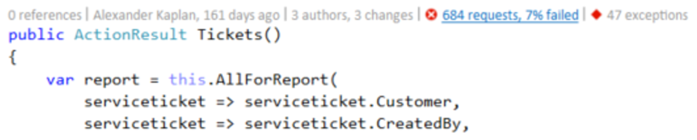
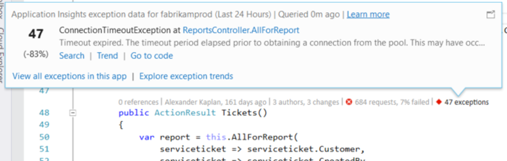
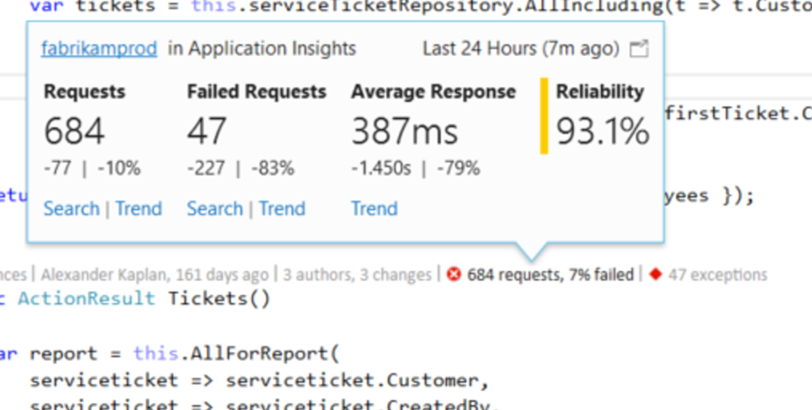
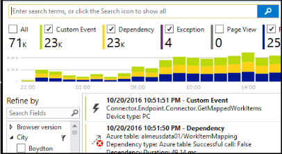

<properties 
    pageTitle="Anwendung Einsichten werden in Visual Studio CodeLens | Microsoft Azure" 
    description="Schneller Zugriff auf Ihre Anwendung Einsichten Anfrage und Ausnahme werden mit CodeLens in Visual Studio." 
    services="application-insights" 
    documentationCenter=".net"
    authors="numberbycolors" 
    manager="douge"/>

<tags 
    ms.service="application-insights" 
    ms.workload="tbd" 
    ms.tgt_pltfrm="ibiza" 
    ms.devlang="na" 
    ms.topic="get-started-article" 
    ms.date="08/30/2016" 
    ms.author="daviste"/>
    
# Anwendung Einsichten werden in Visual Studio CodeLens

Methoden im Code der Web app mit werden zur Laufzeit-Ausnahmen kommentiert werden können und Reaktionszeiten anfordern. Wenn Sie [Visual Studio-Anwendung Einsichten](app-insights-overview.md) in Ihrer Anwendung installiert haben, wird der werden in Visual Studio [CodeLens](https://msdn.microsoft.com/library/dn269218.aspx) - Notizen am oberen Rand jeder Stelle, an der Sie es gewohnt sind, zu sehen, dass nützliche Informationen wie die Anzahl die Funktion platziert verwiesen wird (Funktion) oder die letzte Person, die es bearbeitet.

> [AZURE.NOTE] Anwendung Einsichten in CodeLens ist verfügbar in Visual Studio 2015 Update 3 und höher, oder klicken Sie mit der neuesten Version von [Analytics Entwicklertools Erweiterung](https://visualstudiogallery.msdn.microsoft.com/82367b81-3f97-4de1-bbf1-eaf52ddc635a). CodeLens ist in der Enterprise und Professional-Editionen von Visual Studio verfügbar.

## Wo befinden sich Anwendung Einsichten Daten?

Suchen Sie nach der Anwendung Einsichten werden in die CodeLens Indikatoren der öffentlichen Anforderungsmethoden der Web-Anwendung. CodeLens Indikatoren werden oben Methode und andere Deklarationen in c# und Visual Basic-Code angezeigt. Wenn die Anwendung Einsichten Daten für eine Methode verfügbar ist, sehen Sie Indikatoren für Besprechungsanfragen und Ausnahmen wie z. B. "100 anfordert, Fehler 1 %" oder "10 Ausnahmen". Klicken Sie auf ein CodeLens Indikator für weitere Details. 

> [AZURE.TIP] Anfordern der Anwendung Einsichten und Ausnahme Indikatoren dauert ein paar zusätzliche Sekunden zu laden, nachdem andere CodeLens Indikatoren angezeigt werden.

## Ausnahmen in CodeLens

Der Ausnahme-CodeLens-Indikator zeigt an, die Anzahl der Ausnahmen, die in den letzten 24 Stunden von der am häufigsten auftretenden Ausnahmen in Ihrer Anwendung während dieses Zeitraums, während der Bearbeitung der Anfrage nach der Methode served 15 aufgetreten sind.

Wenn Sie weitere Details anzeigen möchten, klicken Sie auf die Ausnahmen CodeLens Indikator:

* Die prozentuale Änderung in der Anzahl von Ausnahmen von der letzten 24 Stunden relativ zu den vorherigen 24 Stunden
* Wählen Sie **Gehe zu Code** Navigieren auf den Quellcode für das Auslösen der Ausnahme (Funktion)
* Wählen Sie die **Suche** auf alle Instanzen von diese Ausnahme Abfragen, die in den letzten 24 Stunden aufgetreten sind
* Wählen Sie **Trend** zu eine Visualisierung Trend für Vorkommen dieser Ausnahme in den letzten 24 Stunden anzeigen aus.
* Wählen Sie alle Ausnahmen Abfragen, die in den letzten 24 Stunden aufgetreten sind **alle Ausnahmen in dieser Anwendung anzeigen**
* Wählen Sie **Durchsuchen Ausnahme Trends** eine Visualisierung Trend für alle Ausnahmen anzeigen möchten, die in den letzten 24 Stunden aufgetreten sind. 

> [AZURE.TIP] Wenn Sie "0 Ausnahmen" im CodeLens werden angezeigt, aber Sie wissen, dass Ausnahmen sollten, überprüfen Sie, stellen Sie sicher, dass die richtige Anwendung Einsichten Ressource in CodeLens ausgewählt ist. Klicken Sie zum Auswählen einer anderen Ressource mit der rechten Maustaste auf Ihr Projekt in der Lösung-Explorer, und wählen Sie **Anwendung Einsichten > auswählen werden Quelle**. CodeLens wird nur angezeigt, für die 15 die meisten häufig auftretende Ausnahmen in Ihrer Anwendung in den letzten 24 Stunden, also ist eine Ausnahme 16. am häufigsten oder weniger, sehen Sie "0 Ausnahmen". Ausnahmen aus ASP.NET Ansichten möglicherweise nicht auf die Controllermethoden angezeigt, die diese Ansichten generiert.

> [AZURE.TIP] Wenn Sie finden Sie unter "? Ausnahmen"in CodeLens, müssen Sie Ihr Konto Azure Visual Studio zuzuordnen oder Ihre Anmeldeinformationen Azure-Konto ist abgelaufen. Klicken Sie in beiden Fällen auf "? Ausnahmen", und wählen Sie **Konto... hinzufügen** , geben Sie Ihre Anmeldeinformationen ein.

## Besprechungsanfragen in CodeLens

Die Anforderung CodeLens Indikator zeigt die Anzahl der HTTP-Anfragen, die wurde durch eine Methode in den letzten 24 Stunden sowie den Prozentsatz der diese Anfragen, die nicht bearbeitet.

Um weitere Details anzuzeigen, klicken Sie auf die Anfragen CodeLens Indikator:

* Absolute und Prozentsatz Änderungen in Anzahl von Besprechungsanfragen, fehlgeschlagene Anfragen und Mittelwert Reaktionszeiten während der letzten 24 Stunden im Vergleich zu den vorherigen 24 Stunden
* Die Zuverlässigkeit der Methode, berechnet als Prozentsatz der Besprechungsanfragen, die nicht in den letzten 24 Stunden fehlgeschlagen ist
* Wählen Sie die **Suche** nach Besprechungsanfragen oder fehlgeschlagene Anfragen jeder (fehlgeschlagene) Anforderung Abfragen, die in den letzten 24 Stunden aufgetreten sind
* Wählen Sie **Trend** zu eine Visualisierung Trend für Besprechungsanfragen, fehlgeschlagene Anfragen oder durchschnittliche Reaktionszeiten in den letzten 24 Stunden anzeigen aus.
* Wählen Sie den Namen der Anwendung Einsichten Ressource in der oberen linken Ecke der CodeLens Detailansicht zu ändern, welche Ressource CodeLens aus der Datenquelle ist.

## Nächste Schritte

||
|---|---
|**[Arbeiten mit der Anwendung Einsichten in Visual Studio](app-insights-visual-studio.md)** Suchen Sie werden, finden Sie unter Daten in CodeLens und konfigurieren Sie Anwendung Einsichten. Alle in Visual Studio. |
|**[Fügen Sie weiterer Daten hinzu](app-insights-asp-net-more.md)** Überwachen der Verwendung, Verfügbarkeit, Abhängigkeiten, Ausnahmen. Spuren von Protokollierung Framework integriert werden soll. Schreiben Sie benutzerdefinierte werden. | 
|**[Arbeiten mit der Anwendung Einsichten-portal](app-insights-dashboards.md)** Exportieren von Dashboards, leistungsfähige Tools für Diagnose und analytischen, Benachrichtigungen, einer Karte live Abhängigkeit von Anwendung und werden. |
