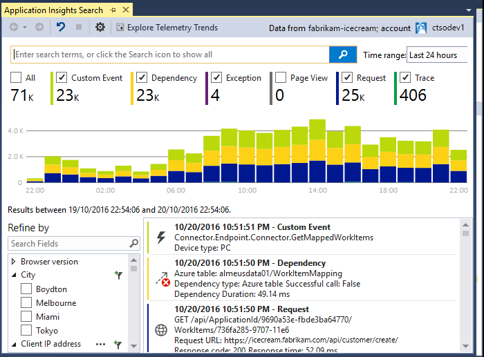
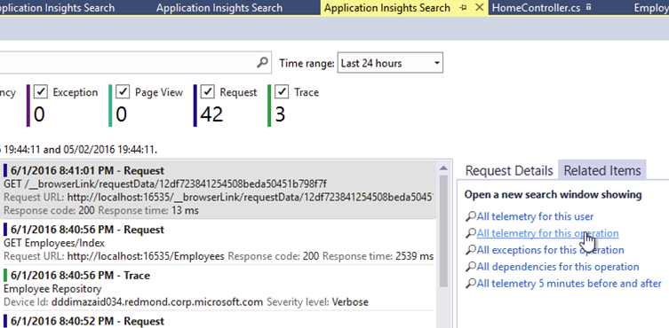
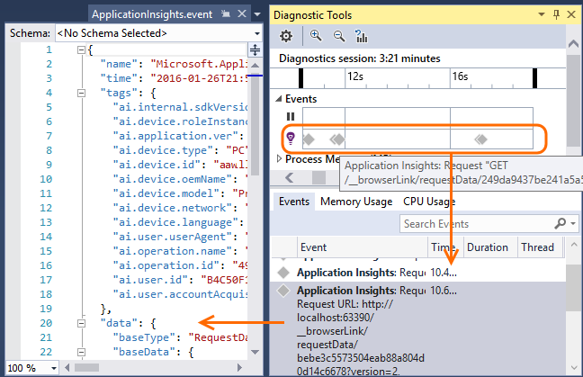
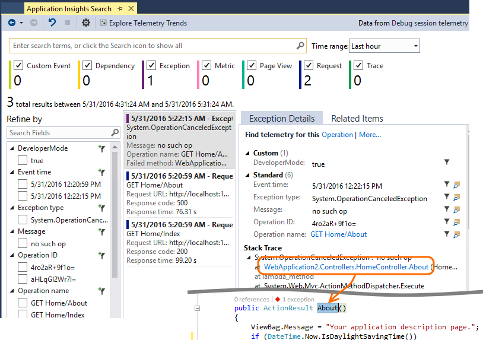
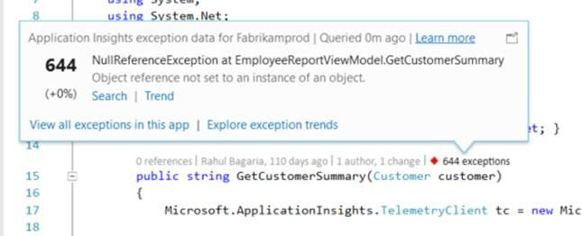
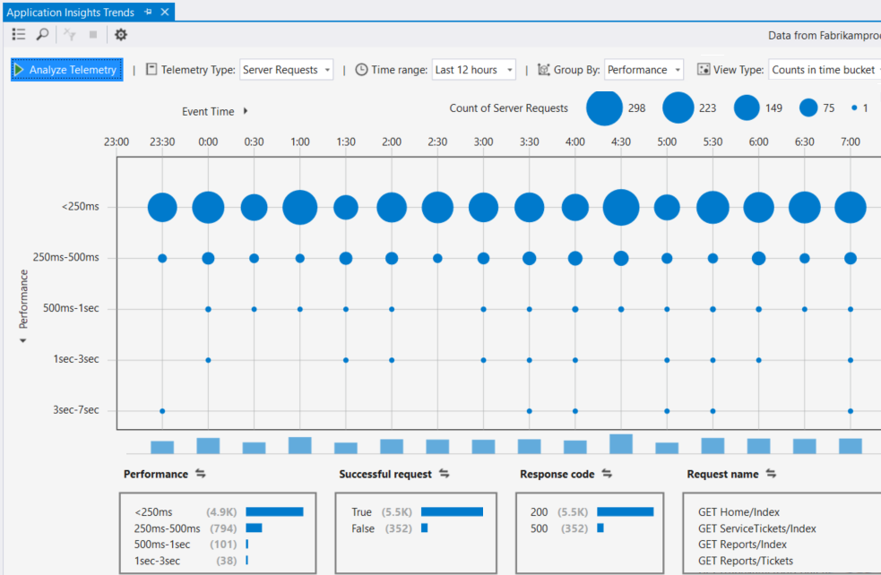

<properties 
    pageTitle="Arbeiten mit der Anwendung Sie einen Einblick in Visual Studio" 
    description="Leistungsanalyse und Diagnose beim Debuggen und Herstellung." 
    services="application-insights" 
    documentationCenter=".net"
    authors="alancameronwills" 
    manager="douge"/>

<tags 
    ms.service="application-insights" 
    ms.workload="tbd" 
    ms.tgt_pltfrm="ibiza" 
    ms.devlang="na" 
    ms.topic="get-started-article" 
    ms.date="06/21/2016" 
    ms.author="awills"/>

# Arbeiten mit der Anwendung Einsichten in Visual Studio

In Visual Studio (2015 und höher) können Sie Leistungsanalyse und diagnostizieren Probleme Debuggen und in der Herstellung, werden von [Visual Studio-Anwendung Einsichten](app-insights-overview.md)verwenden.

Wenn dies noch nicht geschehen ist [Installierten Anwendung Einsichten in Ihrer app](app-insights-asp-net.md), führen Sie das nun.

## Debuggen des Projekts

Führen Sie die Anwendung mit F5, und probieren Sie es aus: Öffnen von anderen Seiten, um einige werden generieren.

In Visual Studio sehen Sie die Anzahl der Ereignisse aus, die protokolliert wurden.

Klicken Sie auf diese Schaltfläche, um diagnostic suchen zu öffnen. 

## Diagnose suchen

Das Suchfenster zeigt Ereignisse, die protokolliert wurden. (Wenn Sie bei Azure beim Einrichten von Anwendung Einblicken angemeldet, erhalten Sie dieselben Ereignisse im Portal suchen können.)

Kostenlose Textsuche funktioniert für alle Felder in den Ereignissen. Suchen Sie beispielsweise nach einem Teil der URL einer Seite; oder den Wert einer Eigenschaft z. B. Client Ort; oder bestimmte Wörter in einem Spur Protokoll.

Klicken Sie auf ein beliebiges Ereignis, um die detaillierten Eigenschaften anzuzeigen.

Sie können auch auf die Registerkarte verwandte Elemente, um fehlgeschlagene Anfragen oder Ausnahmen diagnostizieren öffnen.

## Diagnose-hub

Der Diagnose-Hub (in Visual Studio 2015 oder höher) zeigt die Anwendung Einsichten Server werden, während sie erstellt werden. Dies funktioniert auch, wenn Sie sich, nur das SDK entschieden, ohne eine Verbindung mit einer Ressource im Azure-Portal installieren.

## Ausnahmen

Wenn Sie die [Ausnahme für die Überwachung eingerichtet](app-insights-asp-net-exceptions.md)haben, werden im Suchfenster Ausnahme Berichte angezeigt. 

Klicken Sie auf eine Ausnahme, um einen Stapel Spur zu gelangen. Wenn der Code der app in Visual Studio geöffnet ist, können Sie zu der entsprechenden Zeile des Codes bis aus den Stapel Spur klicken.

Darüber hinaus werden in der Zeile Code Lens über jede Methode Anzahl der Ausnahmen erfasst, Anwendung Einblicke in den letzten 24 Stunden angezeigt.

## Lokale Überwachung

(In Visual Studio 2015 Update 2) Wenn Sie über das SDK um werden mit dem Portal Anwendung Einsichten zu senden, (damit in ApplicationInsights.config kein Schlüssel Instrumentation ist) konfiguriert haben, wird das Diagnosefenster werden aus Ihrer spätesten Debuggen Sitzung angezeigt. 

Dies ist wünschenswert, wenn Sie bereits eine frühere Version der app veröffentlicht haben. Möchten Sie nicht die werden von der Debuggen Sitzungen können mit der werden im Portal Anwendung Einsichten aus der veröffentlichten app von gemischt werden.

Es ist auch hilfreich, wenn Sie einige [benutzerdefinierte telemetrieprotokoll](app-insights-api-custom-events-metrics.md) haben, die Sie vor dem Senden werden mit dem Portal debuggen möchten.

* *Zuerst konfiguriert ich vollständig Anwendung Einsichten um werden mit dem Portal zu senden. Aber ich möchte nun die werden nur in Visual Studio.*

 * In den Einstellungen für das Suchfenster besteht die Möglichkeit zu lokalen Diagnose suchen, auch wenn Ihre app werden mit dem Portal sendet.
 * Zum Beenden der mit dem Portal gesendet werden, kommentieren Sie die Zeile `<instrumentationkey>...` aus ApplicationInsights.config. Wenn Sie bereit sind, werden mit dem Portal erneut zu senden, entfernen Sie die Kommentarzeichen Sie auf.

## Trends

Trends ist ein Tool zum Visualisieren Verhalten die app über einen Zeitraum. 

Wählen Sie aus der Anwendung Einsichten Symbolleisten-Schaltfläche oder einer Anwendung Einsichten Suchfenster **Werden Trends untersuchen** aus. Wählen Sie eine der fünf allgemeine Abfragen Schritte aus. Sie können unterschiedlichen Datasets basierend auf werden Typen, Zeitbereiche und andere Eigenschaften analysieren. 

Um Bildschirmdarstellung auftreten in Ihren Daten zu finden, wählen Sie eine der Optionen unter der Dropdownliste "Ansichtstyp" Anomalie aus. Die Filteroptionen am unteren Rand des Fensters erleichtern eine bestimmte Teilmenge der werden weiter.

[Weitere Informationen zu Trends](app-insights-visual-studio-trends.md).

## Wie geht's weiter?

||
|---|---
|**[Fügen Sie weiterer Daten hinzu](app-insights-asp-net-more.md)** Überwachen der Verwendung, Verfügbarkeit, Abhängigkeiten, Ausnahmen. Spuren von Protokollierung Framework integriert werden soll. Schreiben Sie benutzerdefinierte werden. | 
|**[Arbeiten mit der Anwendung Einsichten-portal](app-insights-dashboards.md)** Exportieren von Dashboards, leistungsfähige Tools für Diagnose und analytischen, Benachrichtigungen, einer Karte live Abhängigkeit von Anwendung und werden. |

 
